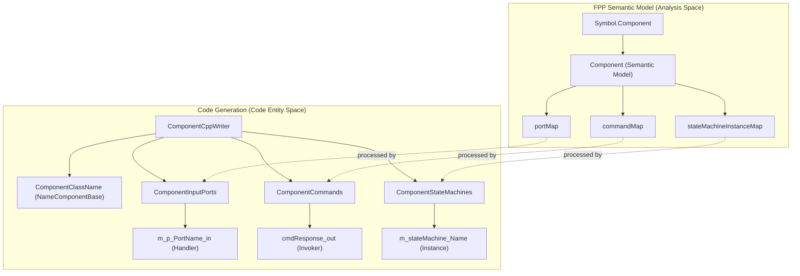
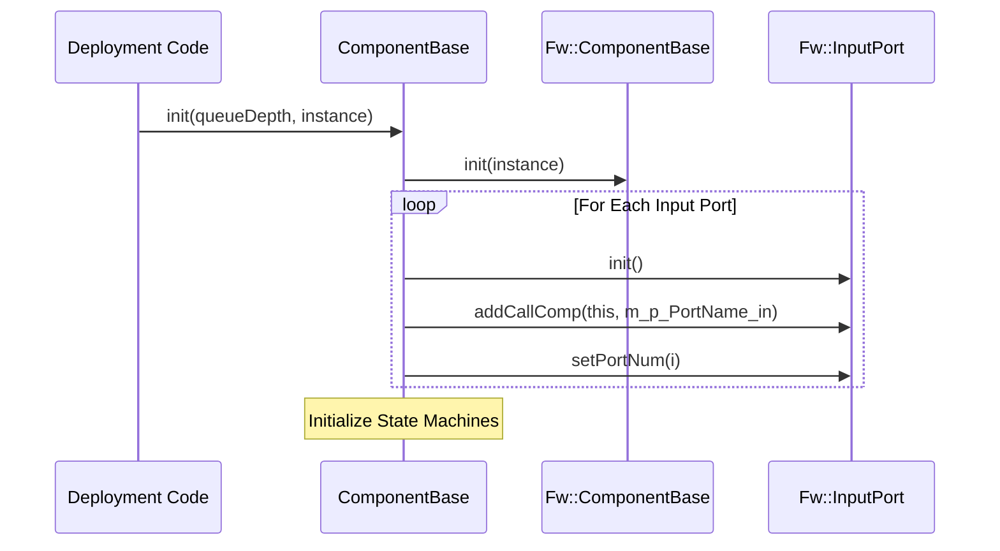

# Page: Component Base Class Generator

# Component Base Class Generator

Relevant source files

The following files were used as context for generating this wiki page:

- [compiler/lib/src/main/scala/codegen/CppWriter/ComponentCppWriter/ComponentCommands.scala](compiler/lib/src/main/scala/codegen/CppWriter/ComponentCppWriter/ComponentCommands.scala)
- [compiler/lib/src/main/scala/codegen/CppWriter/ComponentCppWriter/ComponentCppWriter.scala](compiler/lib/src/main/scala/codegen/CppWriter/ComponentCppWriter/ComponentCppWriter.scala)
- [compiler/lib/src/main/scala/codegen/CppWriter/ComponentCppWriter/ComponentCppWriterUtils.scala](compiler/lib/src/main/scala/codegen/CppWriter/ComponentCppWriter/ComponentCppWriterUtils.scala)
- [compiler/lib/src/main/scala/codegen/CppWriter/ComponentCppWriter/ComponentDataProducts.scala](compiler/lib/src/main/scala/codegen/CppWriter/ComponentCppWriter/ComponentDataProducts.scala)
- [compiler/lib/src/main/scala/codegen/CppWriter/ComponentCppWriter/ComponentEvents.scala](compiler/lib/src/main/scala/codegen/CppWriter/ComponentCppWriter/ComponentEvents.scala)
- [compiler/lib/src/main/scala/codegen/CppWriter/ComponentCppWriter/ComponentExternalStateMachines.scala](compiler/lib/src/main/scala/codegen/CppWriter/ComponentCppWriter/ComponentExternalStateMachines.scala)
- [compiler/lib/src/main/scala/codegen/CppWriter/ComponentCppWriter/ComponentImplWriter.scala](compiler/lib/src/main/scala/codegen/CppWriter/ComponentCppWriter/ComponentImplWriter.scala)
- [compiler/lib/src/main/scala/codegen/CppWriter/ComponentCppWriter/ComponentInputPorts.scala](compiler/lib/src/main/scala/codegen/CppWriter/ComponentCppWriter/ComponentInputPorts.scala)
- [compiler/lib/src/main/scala/codegen/CppWriter/ComponentCppWriter/ComponentInternalPort.scala](compiler/lib/src/main/scala/codegen/CppWriter/ComponentCppWriter/ComponentInternalPort.scala)
- [compiler/lib/src/main/scala/codegen/CppWriter/ComponentCppWriter/ComponentInternalStateMachines.scala](compiler/lib/src/main/scala/codegen/CppWriter/ComponentCppWriter/ComponentInternalStateMachines.scala)
- [compiler/lib/src/main/scala/codegen/CppWriter/ComponentCppWriter/ComponentOutputPorts.scala](compiler/lib/src/main/scala/codegen/CppWriter/ComponentCppWriter/ComponentOutputPorts.scala)
- [compiler/lib/src/main/scala/codegen/CppWriter/ComponentCppWriter/ComponentParameters.scala](compiler/lib/src/main/scala/codegen/CppWriter/ComponentCppWriter/ComponentParameters.scala)
- [compiler/lib/src/main/scala/codegen/CppWriter/ComponentCppWriter/ComponentPorts.scala](compiler/lib/src/main/scala/codegen/CppWriter/ComponentCppWriter/ComponentPorts.scala)
- [compiler/lib/src/main/scala/codegen/CppWriter/ComponentCppWriter/ComponentStateMachines.scala](compiler/lib/src/main/scala/codegen/CppWriter/ComponentCppWriter/ComponentStateMachines.scala)
- [compiler/lib/src/main/scala/codegen/CppWriter/ComponentCppWriter/ComponentTelemetry.scala](compiler/lib/src/main/scala/codegen/CppWriter/ComponentCppWriter/ComponentTelemetry.scala)
- [compiler/tools/fpp-to-cpp/test/alias/T.hpp](compiler/tools/fpp-to-cpp/test/alias/T.hpp)
- [compiler/tools/fpp-to-cpp/test/array/include/T.hpp](compiler/tools/fpp-to-cpp/test/array/include/T.hpp)
- [compiler/tools/fpp-to-cpp/test/component/active.fpp](compiler/tools/fpp-to-cpp/test/component/active.fpp)
- [compiler/tools/fpp-to-cpp/test/component/base/ActiveAsyncProductsComponentAc.ref.cpp](compiler/tools/fpp-to-cpp/test/component/base/ActiveAsyncProductsComponentAc.ref.cpp)
- [compiler/tools/fpp-to-cpp/test/component/base/ActiveCommandsComponentAc.ref.cpp](compiler/tools/fpp-to-cpp/test/component/base/ActiveCommandsComponentAc.ref.cpp)
- [compiler/tools/fpp-to-cpp/test/component/base/ActiveEventsComponentAc.ref.cpp](compiler/tools/fpp-to-cpp/test/component/base/ActiveEventsComponentAc.ref.cpp)
- [compiler/tools/fpp-to-cpp/test/component/base/ActiveExternalParamsComponentAc.ref.cpp](compiler/tools/fpp-to-cpp/test/component/base/ActiveExternalParamsComponentAc.ref.cpp)
- [compiler/tools/fpp-to-cpp/test/component/base/ActiveGetProductsComponentAc.ref.cpp](compiler/tools/fpp-to-cpp/test/component/base/ActiveGetProductsComponentAc.ref.cpp)
- [compiler/tools/fpp-to-cpp/test/component/base/ActiveGuardedProductsComponentAc.ref.cpp](compiler/tools/fpp-to-cpp/test/component/base/ActiveGuardedProductsComponentAc.ref.cpp)
- [compiler/tools/fpp-to-cpp/test/component/base/ActiveOverflowComponentAc.ref.cpp](compiler/tools/fpp-to-cpp/test/component/base/ActiveOverflowComponentAc.ref.cpp)
- [compiler/tools/fpp-to-cpp/test/component/base/ActiveOverflowComponentAc.ref.hpp](compiler/tools/fpp-to-cpp/test/component/base/ActiveOverflowComponentAc.ref.hpp)
- [compiler/tools/fpp-to-cpp/test/component/base/ActiveParamsComponentAc.ref.cpp](compiler/tools/fpp-to-cpp/test/component/base/ActiveParamsComponentAc.ref.cpp)
- [compiler/tools/fpp-to-cpp/test/component/base/ActiveSerialComponentAc.ref.cpp](compiler/tools/fpp-to-cpp/test/component/base/ActiveSerialComponentAc.ref.cpp)
- [compiler/tools/fpp-to-cpp/test/component/base/ActiveSerialComponentAc.ref.hpp](compiler/tools/fpp-to-cpp/test/component/base/ActiveSerialComponentAc.ref.hpp)
- [compiler/tools/fpp-to-cpp/test/component/base/ActiveSyncProductsComponentAc.ref.cpp](compiler/tools/fpp-to-cpp/test/component/base/ActiveSyncProductsComponentAc.ref.cpp)
- [compiler/tools/fpp-to-cpp/test/component/base/ActiveTelemetryComponentAc.ref.cpp](compiler/tools/fpp-to-cpp/test/component/base/ActiveTelemetryComponentAc.ref.cpp)
- [compiler/tools/fpp-to-cpp/test/component/base/ActiveTestComponentAc.ref.cpp](compiler/tools/fpp-to-cpp/test/component/base/ActiveTestComponentAc.ref.cpp)
- [compiler/tools/fpp-to-cpp/test/component/base/ActiveTestComponentAc.ref.hpp](compiler/tools/fpp-to-cpp/test/component/base/ActiveTestComponentAc.ref.hpp)
- [compiler/tools/fpp-to-cpp/test/component/base/PassiveCommandsComponentAc.ref.cpp](compiler/tools/fpp-to-cpp/test/component/base/PassiveCommandsComponentAc.ref.cpp)
- [compiler/tools/fpp-to-cpp/test/component/base/PassiveEventsComponentAc.ref.cpp](compiler/tools/fpp-to-cpp/test/component/base/PassiveEventsComponentAc.ref.cpp)
- [compiler/tools/fpp-to-cpp/test/component/base/PassiveExternalParamsComponentAc.ref.cpp](compiler/tools/fpp-to-cpp/test/component/base/PassiveExternalParamsComponentAc.ref.cpp)
- [compiler/tools/fpp-to-cpp/test/component/base/PassiveGetProductsComponentAc.ref.cpp](compiler/tools/fpp-to-cpp/test/component/base/PassiveGetProductsComponentAc.ref.cpp)
- [compiler/tools/fpp-to-cpp/test/component/base/PassiveGuardedProductsComponentAc.ref.cpp](compiler/tools/fpp-to-cpp/test/component/base/PassiveGuardedProductsComponentAc.ref.cpp)
- [compiler/tools/fpp-to-cpp/test/component/base/PassiveParamsComponentAc.ref.cpp](compiler/tools/fpp-to-cpp/test/component/base/PassiveParamsComponentAc.ref.cpp)
- [compiler/tools/fpp-to-cpp/test/component/base/PassiveSerialComponentAc.ref.cpp](compiler/tools/fpp-to-cpp/test/component/base/PassiveSerialComponentAc.ref.cpp)
- [compiler/tools/fpp-to-cpp/test/component/base/PassiveSerialComponentAc.ref.hpp](compiler/tools/fpp-to-cpp/test/component/base/PassiveSerialComponentAc.ref.hpp)
- [compiler/tools/fpp-to-cpp/test/component/base/PassiveSyncProductsComponentAc.ref.cpp](compiler/tools/fpp-to-cpp/test/component/base/PassiveSyncProductsComponentAc.ref.cpp)
- [compiler/tools/fpp-to-cpp/test/component/base/PassiveTelemetryComponentAc.ref.cpp](compiler/tools/fpp-to-cpp/test/component/base/PassiveTelemetryComponentAc.ref.cpp)
- [compiler/tools/fpp-to-cpp/test/component/base/PassiveTestComponentAc.ref.cpp](compiler/tools/fpp-to-cpp/test/component/base/PassiveTestComponentAc.ref.cpp)
- [compiler/tools/fpp-to-cpp/test/component/base/PassiveTestComponentAc.ref.hpp](compiler/tools/fpp-to-cpp/test/component/base/PassiveTestComponentAc.ref.hpp)
- [compiler/tools/fpp-to-cpp/test/component/base/QueuedAsyncProductsComponentAc.ref.cpp](compiler/tools/fpp-to-cpp/test/component/base/QueuedAsyncProductsComponentAc.ref.cpp)
- [compiler/tools/fpp-to-cpp/test/component/base/QueuedCommandsComponentAc.ref.cpp](compiler/tools/fpp-to-cpp/test/component/base/QueuedCommandsComponentAc.ref.cpp)
- [compiler/tools/fpp-to-cpp/test/component/base/QueuedEventsComponentAc.ref.cpp](compiler/tools/fpp-to-cpp/test/component/base/QueuedEventsComponentAc.ref.cpp)
- [compiler/tools/fpp-to-cpp/test/component/base/QueuedExternalParamsComponentAc.ref.cpp](compiler/tools/fpp-to-cpp/test/component/base/QueuedExternalParamsComponentAc.ref.cpp)
- [compiler/tools/fpp-to-cpp/test/component/base/QueuedGetProductsComponentAc.ref.cpp](compiler/tools/fpp-to-cpp/test/component/base/QueuedGetProductsComponentAc.ref.cpp)
- [compiler/tools/fpp-to-cpp/test/component/base/QueuedGuardedProductsComponentAc.ref.cpp](compiler/tools/fpp-to-cpp/test/component/base/QueuedGuardedProductsComponentAc.ref.cpp)
- [compiler/tools/fpp-to-cpp/test/component/base/QueuedOverflowComponentAc.ref.cpp](compiler/tools/fpp-to-cpp/test/component/base/QueuedOverflowComponentAc.ref.cpp)
- [compiler/tools/fpp-to-cpp/test/component/base/QueuedOverflowComponentAc.ref.hpp](compiler/tools/fpp-to-cpp/test/component/base/QueuedOverflowComponentAc.ref.hpp)
- [compiler/tools/fpp-to-cpp/test/component/base/QueuedParamsComponentAc.ref.cpp](compiler/tools/fpp-to-cpp/test/component/base/QueuedParamsComponentAc.ref.cpp)
- [compiler/tools/fpp-to-cpp/test/component/base/QueuedSerialComponentAc.ref.cpp](compiler/tools/fpp-to-cpp/test/component/base/QueuedSerialComponentAc.ref.cpp)
- [compiler/tools/fpp-to-cpp/test/component/base/QueuedSerialComponentAc.ref.hpp](compiler/tools/fpp-to-cpp/test/component/base/QueuedSerialComponentAc.ref.hpp)
- [compiler/tools/fpp-to-cpp/test/component/base/QueuedSyncProductsComponentAc.ref.cpp](compiler/tools/fpp-to-cpp/test/component/base/QueuedSyncProductsComponentAc.ref.cpp)
- [compiler/tools/fpp-to-cpp/test/component/base/QueuedTelemetryComponentAc.ref.cpp](compiler/tools/fpp-to-cpp/test/component/base/QueuedTelemetryComponentAc.ref.cpp)
- [compiler/tools/fpp-to-cpp/test/component/base/QueuedTestComponentAc.ref.cpp](compiler/tools/fpp-to-cpp/test/component/base/QueuedTestComponentAc.ref.cpp)
- [compiler/tools/fpp-to-cpp/test/component/base/QueuedTestComponentAc.ref.hpp](compiler/tools/fpp-to-cpp/test/component/base/QueuedTestComponentAc.ref.hpp)
- [compiler/tools/fpp-to-cpp/test/component/base/SmChoiceActiveComponentAc.ref.cpp](compiler/tools/fpp-to-cpp/test/component/base/SmChoiceActiveComponentAc.ref.cpp)
- [compiler/tools/fpp-to-cpp/test/component/base/SmChoiceActiveComponentAc.ref.hpp](compiler/tools/fpp-to-cpp/test/component/base/SmChoiceActiveComponentAc.ref.hpp)
- [compiler/tools/fpp-to-cpp/test/component/base/SmChoiceQueuedComponentAc.ref.cpp](compiler/tools/fpp-to-cpp/test/component/base/SmChoiceQueuedComponentAc.ref.cpp)
- [compiler/tools/fpp-to-cpp/test/component/base/SmChoiceQueuedComponentAc.ref.hpp](compiler/tools/fpp-to-cpp/test/component/base/SmChoiceQueuedComponentAc.ref.hpp)
- [compiler/tools/fpp-to-cpp/test/component/base/SmInitialActiveComponentAc.ref.cpp](compiler/tools/fpp-to-cpp/test/component/base/SmInitialActiveComponentAc.ref.cpp)
- [compiler/tools/fpp-to-cpp/test/component/base/SmInitialActiveComponentAc.ref.hpp](compiler/tools/fpp-to-cpp/test/component/base/SmInitialActiveComponentAc.ref.hpp)
- [compiler/tools/fpp-to-cpp/test/component/base/SmInitialQueuedComponentAc.ref.cpp](compiler/tools/fpp-to-cpp/test/component/base/SmInitialQueuedComponentAc.ref.cpp)
- [compiler/tools/fpp-to-cpp/test/component/base/SmInitialQueuedComponentAc.ref.hpp](compiler/tools/fpp-to-cpp/test/component/base/SmInitialQueuedComponentAc.ref.hpp)
- [compiler/tools/fpp-to-cpp/test/component/base/SmStateActiveComponentAc.ref.cpp](compiler/tools/fpp-to-cpp/test/component/base/SmStateActiveComponentAc.ref.cpp)
- [compiler/tools/fpp-to-cpp/test/component/base/SmStateActiveComponentAc.ref.hpp](compiler/tools/fpp-to-cpp/test/component/base/SmStateActiveComponentAc.ref.hpp)
- [compiler/tools/fpp-to-cpp/test/component/base/SmStateQueuedComponentAc.ref.cpp](compiler/tools/fpp-to-cpp/test/component/base/SmStateQueuedComponentAc.ref.cpp)
- [compiler/tools/fpp-to-cpp/test/component/base/SmStateQueuedComponentAc.ref.hpp](compiler/tools/fpp-to-cpp/test/component/base/SmStateQueuedComponentAc.ref.hpp)
- [compiler/tools/fpp-to-cpp/test/component/base/run.sh](compiler/tools/fpp-to-cpp/test/component/base/run.sh)
- [compiler/tools/fpp-to-cpp/test/component/base/update-ref.sh](compiler/tools/fpp-to-cpp/test/component/base/update-ref.sh)
- [compiler/tools/fpp-to-cpp/test/component/gen_deps_comma](compiler/tools/fpp-to-cpp/test/component/gen_deps_comma)
- [compiler/tools/fpp-to-cpp/test/component/impl/ActiveExternalStateMachines.template.ref.cpp](compiler/tools/fpp-to-cpp/test/component/impl/ActiveExternalStateMachines.template.ref.cpp)
- [compiler/tools/fpp-to-cpp/test/component/impl/ActiveExternalStateMachines.template.ref.hpp](compiler/tools/fpp-to-cpp/test/component/impl/ActiveExternalStateMachines.template.ref.hpp)
- [compiler/tools/fpp-to-cpp/test/component/impl/ActiveOverflow.template.ref.cpp](compiler/tools/fpp-to-cpp/test/component/impl/ActiveOverflow.template.ref.cpp)
- [compiler/tools/fpp-to-cpp/test/component/impl/ActiveOverflow.template.ref.hpp](compiler/tools/fpp-to-cpp/test/component/impl/ActiveOverflow.template.ref.hpp)
- [compiler/tools/fpp-to-cpp/test/component/impl/QueuedOverflow.template.ref.cpp](compiler/tools/fpp-to-cpp/test/component/impl/QueuedOverflow.template.ref.cpp)
- [compiler/tools/fpp-to-cpp/test/component/impl/QueuedOverflow.template.ref.hpp](compiler/tools/fpp-to-cpp/test/component/impl/QueuedOverflow.template.ref.hpp)
- [compiler/tools/fpp-to-cpp/test/component/impl/run.sh](compiler/tools/fpp-to-cpp/test/component/impl/run.sh)
- [compiler/tools/fpp-to-cpp/test/component/impl/update-ref.sh](compiler/tools/fpp-to-cpp/test/component/impl/update-ref.sh)
- [compiler/tools/fpp-to-cpp/test/component/include/sm_state.fppi](compiler/tools/fpp-to-cpp/test/component/include/sm_state.fppi)
- [compiler/tools/fpp-to-cpp/test/component/passive.fpp](compiler/tools/fpp-to-cpp/test/component/passive.fpp)
- [compiler/tools/fpp-to-cpp/test/component/queued.fpp](compiler/tools/fpp-to-cpp/test/component/queued.fpp)
- [compiler/tools/fpp-to-cpp/test/component/sm-deps-comma.txt](compiler/tools/fpp-to-cpp/test/component/sm-deps-comma.txt)
- [compiler/tools/fpp-to-cpp/test/component/sm-deps.txt](compiler/tools/fpp-to-cpp/test/component/sm-deps.txt)
- [compiler/tools/fpp-to-cpp/test/component/sm_initial.fpp](compiler/tools/fpp-to-cpp/test/component/sm_initial.fpp)
- [compiler/tools/fpp-to-cpp/test/component/sm_state.fpp](compiler/tools/fpp-to-cpp/test/component/sm_state.fpp)
- [compiler/tools/fpp-to-cpp/test/component/types.fpp](compiler/tools/fpp-to-cpp/test/component/types.fpp)
- [compiler/tools/fpp-to-cpp/test/fprime/Fw/Buffer/Buffer.fpp](compiler/tools/fpp-to-cpp/test/fprime/Fw/Buffer/Buffer.fpp)
- [compiler/tools/fpp-to-cpp/test/fprime/Fw/Dp/Dp.fpp](compiler/tools/fpp-to-cpp/test/fprime/Fw/Dp/Dp.fpp)
- [compiler/tools/fpp-to-cpp/test/fprime/Fw/Dp/DpContainer.cpp](compiler/tools/fpp-to-cpp/test/fprime/Fw/Dp/DpContainer.cpp)
- [compiler/tools/fpp-to-cpp/test/fprime/Fw/Dp/DpContainer.hpp](compiler/tools/fpp-to-cpp/test/fprime/Fw/Dp/DpContainer.hpp)
- [compiler/tools/fpp-to-cpp/test/fprime/Fw/Types/Types.fpp](compiler/tools/fpp-to-cpp/test/fprime/Fw/Types/Types.fpp)
- [compiler/tools/fpp-to-cpp/test/port/include/T.hpp](compiler/tools/fpp-to-cpp/test/port/include/T.hpp)
- [compiler/tools/fpp-to-cpp/test/state-machine/harness/TestAbsType.hpp](compiler/tools/fpp-to-cpp/test/state-machine/harness/TestAbsType.hpp)
- [compiler/tools/fpp-to-cpp/test/state-machine/state/Basic.fpp](compiler/tools/fpp-to-cpp/test/state-machine/state/Basic.fpp)
- [compiler/tools/fpp-to-cpp/test/state-machine/state/BasicU32.fpp](compiler/tools/fpp-to-cpp/test/state-machine/state/BasicU32.fpp)
- [compiler/tools/fpp-to-cpp/test/state-machine/state/Internal.fpp](compiler/tools/fpp-to-cpp/test/state-machine/state/Internal.fpp)
- [compiler/tools/fpp-to-cpp/test/state-machine/state/Polymorphism.fpp](compiler/tools/fpp-to-cpp/test/state-machine/state/Polymorphism.fpp)
- [compiler/tools/fpp-to-cpp/test/state-machine/state/include/Basic.fppi](compiler/tools/fpp-to-cpp/test/state-machine/state/include/Basic.fppi)
- [compiler/tools/fpp-to-cpp/test/struct/include/T.hpp](compiler/tools/fpp-to-cpp/test/struct/include/T.hpp)

The Component Base Class Generator is a sophisticated sub-system of the FPP C++ backend responsible for generating the `*ComponentBase` C++ classes. These classes provide the architectural "glue" for F Prime components, implementing port dispatching, command registration, telemetry handling, and state machine integration.

## Architecture Overview

The generation is centered around `ComponentCppWriter`, which orchestrates several specialized sub-writers. Each sub-writer is responsible for a specific FPP functional area (e.g., Commands, Events, Telemetry).

### Core Writer Hierarchy
*   **ComponentCppWriter**: The entry point that defines the class structure, includes, and lifecycle methods (init, dispatch) [compiler/lib/src/main/scala/codegen/CppWriter/ComponentCppWriter/ComponentCppWriter.scala:9-32]().
*   **ComponentCppWriterUtils**: A shared base class providing common lookups for ports, commands, and state machines from the semantic analysis [compiler/lib/src/main/scala/codegen/CppWriter/ComponentCppWriter/ComponentCppWriterUtils.scala:8-11]().
*   **Sub-Writers**: Specialized classes like `ComponentCommands`, `ComponentEvents`, and `ComponentDataProducts` that populate specific sections of the base class [compiler/lib/src/main/scala/codegen/CppWriter/ComponentCppWriter/ComponentCppWriter.scala:16-32]().

### Data Flow: Analysis to C++ Entity
The following diagram bridges the semantic model (Analysis) to the generated C++ code entities.

**Mapping Semantic Model to Code Entities**

Sources: [compiler/lib/src/main/scala/codegen/CppWriter/ComponentCppWriter/ComponentCppWriterUtils.scala:13-25](), [compiler/lib/src/main/scala/codegen/CppWriter/ComponentCppWriter/ComponentCppWriter.scala:18-32]()

## IPC and Message Buffering

For **Active** and **Queued** components, the generator creates internal structures to handle asynchronous message passing.

### MsgTypeEnum and BuffUnion
The generator creates an anonymous namespace in the `.cpp` file containing:
1.  **MsgTypeEnum**: An enumeration of all asynchronous inputs (async ports, commands, internal ports) [compiler/tools/fpp-to-cpp/test/component/base/ActiveTestComponentAc.ref.cpp:17-37]().
2.  **BuffUnion**: A C++ `union` of all possible asynchronous argument structures. This ensures the message buffer is exactly large enough to hold the largest possible input [compiler/tools/fpp-to-cpp/test/component/base/ActiveTestComponentAc.ref.cpp:41-72]().

### ComponentIpcSerializableBuffer
This is a generated inner class inheriting from `Fw::LinearBufferBase`. It uses the size calculated by `BuffUnion` to define the component's mailbox capacity [compiler/tools/fpp-to-cpp/test/component/base/ActiveTestComponentAc.ref.cpp:74-107]().

## The Init Lifecycle

The `init` function is the primary entry point for component setup. It performs the following sequence:
1.  **Base Class Init**: Calls `Fw::ActiveComponentBase::init` or equivalent [compiler/tools/fpp-to-cpp/test/component/base/QueuedSerialComponentAc.ref.cpp:122]().
2.  **Port Initialization**: Iterates through all input ports, calling `init()` and `addCallComp()` to register the component's handler function [compiler/tools/fpp-to-cpp/test/component/base/QueuedSerialComponentAc.ref.cpp:124-146]().
3.  **State Machine Init**: If the component has internal state machines, they are initialized and their initial transitions are triggered [compiler/lib/src/main/scala/codegen/CppWriter/ComponentCppWriter/ComponentInternalStateMachines.scala:91-101]().

**Component Initialization Logic**

Sources: [compiler/tools/fpp-to-cpp/test/component/base/QueuedSerialComponentAc.ref.cpp:114-146](), [compiler/lib/src/main/scala/codegen/CppWriter/ComponentCppWriter/ComponentInternalStateMachines.scala:91-101]()

## Sub-Writer Implementation Details

### ComponentCommands
Handles command registration and dispatch. It generates `cmdResponse_out` invokers and pure virtual handlers (e.g., `CommandName_handler`) that the user must implement in the `Impl` class [compiler/lib/src/main/scala/codegen/CppWriter/ComponentCppWriter/ComponentImplWriter.scala:81-98]().

### ComponentDataProducts
Generates the `DpContainer` inner class and specialized functions for Data Products (DP).
*   **ContainerId/RecordId**: Enums for identifying DPs [compiler/lib/src/main/scala/codegen/CppWriter/ComponentCppWriter/ComponentDataProducts.scala:33-43]().
*   **dpGet/dpSend**: Functions to request and commit DP buffers [compiler/lib/src/main/scala/codegen/CppWriter/ComponentCppWriter/ComponentDataProducts.scala:56-144]().
*   **Record Serialization**: Generates `serializeRecord_*` methods that handle type-safe data insertion into DP containers [compiler/tools/fpp-to-cpp/test/component/base/ActiveTestComponentAc.ref.cpp:134-186]().

### ComponentStateMachines
FPP supports both **Internal** and **External** state machines.
*   **Internal**: The state machine logic is generated as part of the component. The generator provides `smDispatch` to route signals from the component queue to the state machine [compiler/lib/src/main/scala/codegen/CppWriter/ComponentCppWriter/ComponentInternalStateMachines.scala:91-101]().
*   **External**: The component holds an instance of a state machine defined elsewhere. The generator implements the interface required to receive signals and actions from that instance [compiler/lib/src/main/scala/codegen/CppWriter/ComponentCppWriter/ComponentExternalStateMachines.scala:30-32]().

### ComponentParameters
Manages component configuration parameters.
*   **loadParameters**: Generated function that fetches all parameters from the `PrmGet` port [compiler/lib/src/main/scala/codegen/CppWriter/ComponentCppWriter/ComponentParameters.scala:121-135]().
*   **Parameter Validity**: Tracks `Fw::ParamValid` state for every parameter [compiler/lib/src/main/scala/codegen/CppWriter/ComponentCppWriter/ComponentParameters.scala:56-76]().
*   **External Parameters**: Supports `Fw::ParamExternalDelegate` for parameters stored outside the component's memory space [compiler/lib/src/main/scala/codegen/CppWriter/ComponentCppWriter/ComponentParameters.scala:100-118]().

## Queue Full Handling
For asynchronous inputs (Ports, Commands, Signals), FPP allows specifying behavior when the queue is full. If `hook` is specified, the generator produces a virtual function `input_PortName_FullHook` [compiler/lib/src/main/scala/codegen/CppWriter/ComponentCppWriter/ComponentInternalStateMachines.scala:106-137]().

Sources:
- [compiler/lib/src/main/scala/codegen/CppWriter/ComponentCppWriter/ComponentCppWriter.scala:9-220]()
- [compiler/lib/src/main/scala/codegen/CppWriter/ComponentCppWriter/ComponentCppWriterUtils.scala:8-184]()
- [compiler/lib/src/main/scala/codegen/CppWriter/ComponentCppWriter/ComponentDataProducts.scala:1-195]()
- [compiler/lib/src/main/scala/codegen/CppWriter/ComponentCppWriter/ComponentParameters.scala:1-202]()
- [compiler/lib/src/main/scala/codegen/CppWriter/ComponentCppWriter/ComponentInternalStateMachines.scala:1-210]()
- [compiler/tools/fpp-to-cpp/test/component/base/ActiveTestComponentAc.ref.cpp:17-186]()
- [compiler/tools/fpp-to-cpp/test/component/base/QueuedSerialComponentAc.ref.cpp:114-170]()
