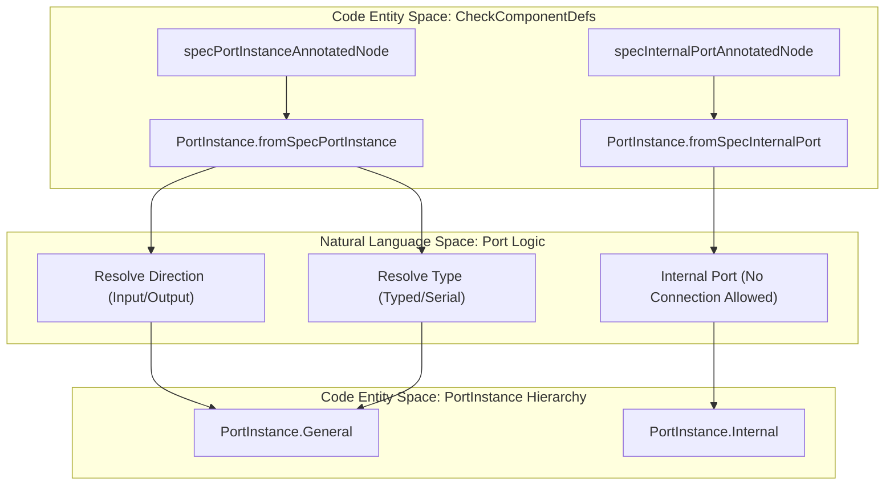
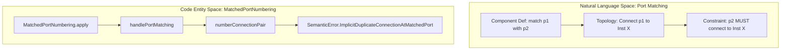

# Page: Component Semantic Model

# Component Semantic Model

Relevant source files

The following files were used as context for generating this wiki page:

- [compiler/lib/src/main/scala/analysis/Analysis.scala](compiler/lib/src/main/scala/analysis/Analysis.scala)
- [compiler/lib/src/main/scala/analysis/Analyzers/BasicUseAnalyzer.scala](compiler/lib/src/main/scala/analysis/Analyzers/BasicUseAnalyzer.scala)
- [compiler/lib/src/main/scala/analysis/CheckSemantics/CheckComponentDefs.scala](compiler/lib/src/main/scala/analysis/CheckSemantics/CheckComponentDefs.scala)
- [compiler/lib/src/main/scala/analysis/CheckSemantics/CheckComponentInstanceDefs.scala](compiler/lib/src/main/scala/analysis/CheckSemantics/CheckComponentInstanceDefs.scala)
- [compiler/lib/src/main/scala/analysis/CheckSemantics/CheckSemantics.scala](compiler/lib/src/main/scala/analysis/CheckSemantics/CheckSemantics.scala)
- [compiler/lib/src/main/scala/analysis/CheckSemantics/CheckTopologyDefs.scala](compiler/lib/src/main/scala/analysis/CheckSemantics/CheckTopologyDefs.scala)
- [compiler/lib/src/main/scala/analysis/CheckSemantics/CheckUses.scala](compiler/lib/src/main/scala/analysis/CheckSemantics/CheckUses.scala)
- [compiler/lib/src/main/scala/analysis/CheckSemantics/ConstructImpliedUseMap.scala](compiler/lib/src/main/scala/analysis/CheckSemantics/ConstructImpliedUseMap.scala)
- [compiler/lib/src/main/scala/analysis/Semantics/Command.scala](compiler/lib/src/main/scala/analysis/Semantics/Command.scala)
- [compiler/lib/src/main/scala/analysis/Semantics/Component.scala](compiler/lib/src/main/scala/analysis/Semantics/Component.scala)
- [compiler/lib/src/main/scala/analysis/Semantics/ComponentInstance.scala](compiler/lib/src/main/scala/analysis/Semantics/ComponentInstance.scala)
- [compiler/lib/src/main/scala/analysis/Semantics/Connection.scala](compiler/lib/src/main/scala/analysis/Semantics/Connection.scala)
- [compiler/lib/src/main/scala/analysis/Semantics/Event.scala](compiler/lib/src/main/scala/analysis/Semantics/Event.scala)
- [compiler/lib/src/main/scala/analysis/Semantics/ImpliedUse.scala](compiler/lib/src/main/scala/analysis/Semantics/ImpliedUse.scala)
- [compiler/lib/src/main/scala/analysis/Semantics/InitSpecifier.scala](compiler/lib/src/main/scala/analysis/Semantics/InitSpecifier.scala)
- [compiler/lib/src/main/scala/analysis/Semantics/Param.scala](compiler/lib/src/main/scala/analysis/Semantics/Param.scala)
- [compiler/lib/src/main/scala/analysis/Semantics/PortInstance.scala](compiler/lib/src/main/scala/analysis/Semantics/PortInstance.scala)
- [compiler/lib/src/main/scala/analysis/Semantics/PortInstanceIdentifier.scala](compiler/lib/src/main/scala/analysis/Semantics/PortInstanceIdentifier.scala)
- [compiler/lib/src/main/scala/analysis/Semantics/PortInterface.scala](compiler/lib/src/main/scala/analysis/Semantics/PortInterface.scala)
- [compiler/lib/src/main/scala/analysis/Semantics/ResolveTopology/GeneralPortNumbering.scala](compiler/lib/src/main/scala/analysis/Semantics/ResolveTopology/GeneralPortNumbering.scala)
- [compiler/lib/src/main/scala/analysis/Semantics/ResolveTopology/MatchedPortNumbering.scala](compiler/lib/src/main/scala/analysis/Semantics/ResolveTopology/MatchedPortNumbering.scala)
- [compiler/lib/src/main/scala/analysis/Semantics/ResolveTopology/PatternResolver.scala](compiler/lib/src/main/scala/analysis/Semantics/ResolveTopology/PatternResolver.scala)
- [compiler/lib/src/main/scala/analysis/Semantics/ResolveTopology/PortNumberingState.scala](compiler/lib/src/main/scala/analysis/Semantics/ResolveTopology/PortNumberingState.scala)
- [compiler/lib/src/main/scala/analysis/Semantics/ResolveTopology/ResolvePortNumbers.scala](compiler/lib/src/main/scala/analysis/Semantics/ResolveTopology/ResolvePortNumbers.scala)
- [compiler/lib/src/main/scala/analysis/Semantics/ResolveTopology/ResolveTopology.scala](compiler/lib/src/main/scala/analysis/Semantics/ResolveTopology/ResolveTopology.scala)
- [compiler/lib/src/main/scala/analysis/Semantics/TlmChannel.scala](compiler/lib/src/main/scala/analysis/Semantics/TlmChannel.scala)
- [compiler/lib/src/main/scala/analysis/Semantics/Topology.scala](compiler/lib/src/main/scala/analysis/Semantics/Topology.scala)
- [compiler/lib/src/main/scala/codegen/XmlFppWriter/TopologyXmlFppWriter.scala](compiler/lib/src/main/scala/codegen/XmlFppWriter/TopologyXmlFppWriter.scala)
- [compiler/lib/src/main/scala/util/Error.scala](compiler/lib/src/main/scala/util/Error.scala)
- [compiler/tools/fpp-check/test/command/not_displayable.fpp](compiler/tools/fpp-check/test/command/not_displayable.fpp)
- [compiler/tools/fpp-check/test/command/not_displayable.ref.txt](compiler/tools/fpp-check/test/command/not_displayable.ref.txt)
- [compiler/tools/fpp-check/test/component/ok.fpp](compiler/tools/fpp-check/test/component/ok.fpp)
- [compiler/tools/fpp-check/test/component_instance_def/active_no_priority.fpp](compiler/tools/fpp-check/test/component_instance_def/active_no_priority.fpp)
- [compiler/tools/fpp-check/test/component_instance_def/active_no_priority.ref.txt](compiler/tools/fpp-check/test/component_instance_def/active_no_priority.ref.txt)
- [compiler/tools/fpp-check/test/component_instance_def/active_no_queue_size.fpp](compiler/tools/fpp-check/test/component_instance_def/active_no_queue_size.fpp)
- [compiler/tools/fpp-check/test/component_instance_def/active_no_queue_size.ref.txt](compiler/tools/fpp-check/test/component_instance_def/active_no_queue_size.ref.txt)
- [compiler/tools/fpp-check/test/component_instance_def/active_no_stack_size.fpp](compiler/tools/fpp-check/test/component_instance_def/active_no_stack_size.fpp)
- [compiler/tools/fpp-check/test/component_instance_def/active_no_stack_size.ref.txt](compiler/tools/fpp-check/test/component_instance_def/active_no_stack_size.ref.txt)
- [compiler/tools/fpp-check/test/component_instance_def/clean](compiler/tools/fpp-check/test/component_instance_def/clean)
- [compiler/tools/fpp-check/test/component_instance_def/conflicting_ids.fpp](compiler/tools/fpp-check/test/component_instance_def/conflicting_ids.fpp)
- [compiler/tools/fpp-check/test/component_instance_def/conflicting_ids.ref.txt](compiler/tools/fpp-check/test/component_instance_def/conflicting_ids.ref.txt)
- [compiler/tools/fpp-check/test/component_instance_def/conflicting_ids_empty_range_first.fpp](compiler/tools/fpp-check/test/component_instance_def/conflicting_ids_empty_range_first.fpp)
- [compiler/tools/fpp-check/test/component_instance_def/conflicting_ids_empty_range_first.ref.txt](compiler/tools/fpp-check/test/component_instance_def/conflicting_ids_empty_range_first.ref.txt)
- [compiler/tools/fpp-check/test/component_instance_def/conflicting_ids_empty_range_second.fpp](compiler/tools/fpp-check/test/component_instance_def/conflicting_ids_empty_range_second.fpp)
- [compiler/tools/fpp-check/test/component_instance_def/conflicting_ids_empty_range_second.ref.txt](compiler/tools/fpp-check/test/component_instance_def/conflicting_ids_empty_range_second.ref.txt)
- [compiler/tools/fpp-check/test/component_instance_def/invalid_negative_int.fpp](compiler/tools/fpp-check/test/component_instance_def/invalid_negative_int.fpp)
- [compiler/tools/fpp-check/test/component_instance_def/invalid_negative_int.ref.txt](compiler/tools/fpp-check/test/component_instance_def/invalid_negative_int.ref.txt)
- [compiler/tools/fpp-check/test/component_instance_def/ok.fpp](compiler/tools/fpp-check/test/component_instance_def/ok.fpp)
- [compiler/tools/fpp-check/test/component_instance_def/ok.ref.txt](compiler/tools/fpp-check/test/component_instance_def/ok.ref.txt)
- [compiler/tools/fpp-check/test/component_instance_def/passive_cpu.fpp](compiler/tools/fpp-check/test/component_instance_def/passive_cpu.fpp)
- [compiler/tools/fpp-check/test/component_instance_def/passive_cpu.ref.txt](compiler/tools/fpp-check/test/component_instance_def/passive_cpu.ref.txt)
- [compiler/tools/fpp-check/test/component_instance_def/passive_priority.fpp](compiler/tools/fpp-check/test/component_instance_def/passive_priority.fpp)
- [compiler/tools/fpp-check/test/component_instance_def/passive_priority.ref.txt](compiler/tools/fpp-check/test/component_instance_def/passive_priority.ref.txt)
- [compiler/tools/fpp-check/test/component_instance_def/queued_cpu.fpp](compiler/tools/fpp-check/test/component_instance_def/queued_cpu.fpp)
- [compiler/tools/fpp-check/test/component_instance_def/queued_cpu.ref.txt](compiler/tools/fpp-check/test/component_instance_def/queued_cpu.ref.txt)
- [compiler/tools/fpp-check/test/component_instance_def/queued_no_queue_size.ref.txt](compiler/tools/fpp-check/test/component_instance_def/queued_no_queue_size.ref.txt)
- [compiler/tools/fpp-check/test/component_instance_def/tests.sh](compiler/tools/fpp-check/test/component_instance_def/tests.sh)
- [compiler/tools/fpp-check/test/component_instance_def/two_empty_ranges.fpp](compiler/tools/fpp-check/test/component_instance_def/two_empty_ranges.fpp)
- [compiler/tools/fpp-check/test/component_instance_def/two_empty_ranges.ref.txt](compiler/tools/fpp-check/test/component_instance_def/two_empty_ranges.ref.txt)
- [compiler/tools/fpp-check/test/event/bad_id.ref.txt](compiler/tools/fpp-check/test/event/bad_id.ref.txt)
- [compiler/tools/fpp-check/test/event/bad_throttle.fpp](compiler/tools/fpp-check/test/event/bad_throttle.fpp)
- [compiler/tools/fpp-check/test/event/bad_throttle.ref.txt](compiler/tools/fpp-check/test/event/bad_throttle.ref.txt)
- [compiler/tools/fpp-check/test/event/duplicate_name.fpp](compiler/tools/fpp-check/test/event/duplicate_name.fpp)
- [compiler/tools/fpp-check/test/event/duplicate_name.ref.txt](compiler/tools/fpp-check/test/event/duplicate_name.ref.txt)
- [compiler/tools/fpp-check/test/event/not_displayable.fpp](compiler/tools/fpp-check/test/event/not_displayable.fpp)
- [compiler/tools/fpp-check/test/event/not_displayable.ref.txt](compiler/tools/fpp-check/test/event/not_displayable.ref.txt)
- [compiler/tools/fpp-check/test/event/ok.fpp](compiler/tools/fpp-check/test/event/ok.fpp)
- [compiler/tools/fpp-check/test/event/tests.sh](compiler/tools/fpp-check/test/event/tests.sh)
- [compiler/tools/fpp-check/test/event/zero_throttle_count.fpp](compiler/tools/fpp-check/test/event/zero_throttle_count.fpp)
- [compiler/tools/fpp-check/test/event/zero_throttle_count.ref.txt](compiler/tools/fpp-check/test/event/zero_throttle_count.ref.txt)
- [compiler/tools/fpp-check/test/param/bad_default.fpp](compiler/tools/fpp-check/test/param/bad_default.fpp)
- [compiler/tools/fpp-check/test/param/bad_default.ref.txt](compiler/tools/fpp-check/test/param/bad_default.ref.txt)
- [compiler/tools/fpp-check/test/param/missing_ports.fpp](compiler/tools/fpp-check/test/param/missing_ports.fpp)
- [compiler/tools/fpp-check/test/param/missing_ports.ref.txt](compiler/tools/fpp-check/test/param/missing_ports.ref.txt)
- [compiler/tools/fpp-check/test/param/not_displayable.fpp](compiler/tools/fpp-check/test/param/not_displayable.fpp)
- [compiler/tools/fpp-check/test/param/not_displayable.ref.txt](compiler/tools/fpp-check/test/param/not_displayable.ref.txt)
- [compiler/tools/fpp-check/test/param/ok.fpp](compiler/tools/fpp-check/test/param/ok.fpp)
- [compiler/tools/fpp-check/test/param/tests.sh](compiler/tools/fpp-check/test/param/tests.sh)
- [compiler/tools/fpp-check/test/port_instance/async_input_active.fpp](compiler/tools/fpp-check/test/port_instance/async_input_active.fpp)
- [compiler/tools/fpp-check/test/port_instance/async_input_active.ref.txt](compiler/tools/fpp-check/test/port_instance/async_input_active.ref.txt)
- [compiler/tools/fpp-check/test/port_instance/async_product_recv_active.fpp](compiler/tools/fpp-check/test/port_instance/async_product_recv_active.fpp)
- [compiler/tools/fpp-check/test/port_instance/async_product_recv_active.ref.txt](compiler/tools/fpp-check/test/port_instance/async_product_recv_active.ref.txt)
- [compiler/tools/fpp-check/test/port_instance/async_product_recv_passive.fpp](compiler/tools/fpp-check/test/port_instance/async_product_recv_passive.fpp)
- [compiler/tools/fpp-check/test/port_instance/async_product_recv_passive.ref.txt](compiler/tools/fpp-check/test/port_instance/async_product_recv_passive.ref.txt)
- [compiler/tools/fpp-check/test/port_instance/bad_priority_product_recv.fpp](compiler/tools/fpp-check/test/port_instance/bad_priority_product_recv.fpp)
- [compiler/tools/fpp-check/test/port_instance/bad_priority_product_recv.ref.txt](compiler/tools/fpp-check/test/port_instance/bad_priority_product_recv.ref.txt)
- [compiler/tools/fpp-check/test/port_instance/ok.fpp](compiler/tools/fpp-check/test/port_instance/ok.fpp)
- [compiler/tools/fpp-check/test/port_instance/shadowed_time_get.fpp](compiler/tools/fpp-check/test/port_instance/shadowed_time_get.fpp)
- [compiler/tools/fpp-check/test/port_instance/shadowed_time_get.ref.txt](compiler/tools/fpp-check/test/port_instance/shadowed_time_get.ref.txt)
- [compiler/tools/fpp-check/test/port_instance/special_input_kind_command.fpp](compiler/tools/fpp-check/test/port_instance/special_input_kind_command.fpp)
- [compiler/tools/fpp-check/test/port_instance/special_input_kind_command.ref.txt](compiler/tools/fpp-check/test/port_instance/special_input_kind_command.ref.txt)
- [compiler/tools/fpp-check/test/port_instance/special_input_kind_missing_product_recv.fpp](compiler/tools/fpp-check/test/port_instance/special_input_kind_missing_product_recv.fpp)
- [compiler/tools/fpp-check/test/port_instance/special_input_kind_missing_product_recv.ref.txt](compiler/tools/fpp-check/test/port_instance/special_input_kind_missing_product_recv.ref.txt)
- [compiler/tools/fpp-check/test/port_instance/sync_product_recv_priority.fpp](compiler/tools/fpp-check/test/port_instance/sync_product_recv_priority.fpp)
- [compiler/tools/fpp-check/test/port_instance/sync_product_recv_priority.ref.txt](compiler/tools/fpp-check/test/port_instance/sync_product_recv_priority.ref.txt)
- [compiler/tools/fpp-check/test/port_instance/sync_product_recv_queue_full.fpp](compiler/tools/fpp-check/test/port_instance/sync_product_recv_queue_full.fpp)
- [compiler/tools/fpp-check/test/port_instance/sync_product_recv_queue_full.ref.txt](compiler/tools/fpp-check/test/port_instance/sync_product_recv_queue_full.ref.txt)
- [compiler/tools/fpp-check/test/port_instance/tests.sh](compiler/tools/fpp-check/test/port_instance/tests.sh)
- [compiler/tools/fpp-check/test/tlm_channel/clean](compiler/tools/fpp-check/test/tlm_channel/clean)
- [compiler/tools/fpp-check/test/tlm_channel/format_not_numeric.fpp](compiler/tools/fpp-check/test/tlm_channel/format_not_numeric.fpp)
- [compiler/tools/fpp-check/test/tlm_channel/format_not_numeric.ref.txt](compiler/tools/fpp-check/test/tlm_channel/format_not_numeric.ref.txt)
- [compiler/tools/fpp-check/test/tlm_channel/missing_ports.fpp](compiler/tools/fpp-check/test/tlm_channel/missing_ports.fpp)
- [compiler/tools/fpp-check/test/tlm_channel/missing_ports.ref.txt](compiler/tools/fpp-check/test/tlm_channel/missing_ports.ref.txt)
- [compiler/tools/fpp-check/test/tlm_channel/not_displayable.fpp](compiler/tools/fpp-check/test/tlm_channel/not_displayable.fpp)
- [compiler/tools/fpp-check/test/tlm_channel/not_displayable.ref.txt](compiler/tools/fpp-check/test/tlm_channel/not_displayable.ref.txt)
- [compiler/tools/fpp-check/test/tlm_channel/ok.fpp](compiler/tools/fpp-check/test/tlm_channel/ok.fpp)
- [compiler/tools/fpp-check/test/tlm_channel/ok.ref.txt](compiler/tools/fpp-check/test/tlm_channel/ok.ref.txt)
- [compiler/tools/fpp-check/test/tlm_channel/run](compiler/tools/fpp-check/test/tlm_channel/run)
- [compiler/tools/fpp-check/test/tlm_channel/tests.sh](compiler/tools/fpp-check/test/tlm_channel/tests.sh)
- [compiler/tools/fpp-check/test/tlm_channel/update-ref](compiler/tools/fpp-check/test/tlm_channel/update-ref)

The Component Semantic Model represents the fully resolved state of an FPP component after semantic analysis. This model transitions from the raw AST to a structured data object (`Component`) that aggregates commands, telemetry, events, parameters, and port instances into optimized lookup maps.

## Overview of Component Resolution

Component resolution is primarily handled by `CheckComponentDefs` [compiler/lib/src/main/scala/analysis/CheckSemantics/CheckComponentDefs.scala:7-11](), which iterates through the AST and populates a `Component` case class. This class serves as the central repository for all semantic information related to a component definition.

### Data Flow: AST to Semantic Component

The transformation involves several key steps:
1.  **Initialization**: A new `Component` object is created when `defComponentAnnotatedNode` is encountered [compiler/lib/src/main/scala/analysis/CheckSemantics/CheckComponentDefs.scala:13-17]().
2.  **Member Processing**: Specific visitors (e.g., `specCommandAnnotatedNode`, `specTlmChannelAnnotatedNode`) parse individual specifiers and add them to the component's internal maps [compiler/lib/src/main/scala/analysis/CheckSemantics/CheckComponentDefs.scala:28-168]().
3.  **Completion**: Once all members are visited, the `complete` method (invoked via `CheckComponentDefs`) finalizes the structure and stores it in the `Analysis` state's `componentMap` [compiler/lib/src/main/scala/analysis/CheckSemantics/CheckComponentDefs.scala:19-25]().

### Component Structure Mapping
The `Component` class [compiler/lib/src/main/scala/analysis/Semantics/Component.scala:9-46]() maintains several critical maps:

| Map Name | Key Type | Value Type | Description |
| :--- | :--- | :--- | :--- |
| `commandMap` | `Command.Opcode` | `Command` | Map of all commands indexed by opcode. |
| `tlmChannelMap` | `TlmChannel.Id` | `TlmChannel` | Map of telemetry channels by ID. |
| `eventMap` | `Event.Id` | `Event` | Map of events by ID. |
| `paramMap` | `Param.Id` | `Param` | Map of parameters by ID. |
| `portInterface` | N/A | `PortInterface` | Manages the set of port instances (Input, Output, Special, Internal). |
| `stateMachineInstanceMap`| `Name.Unqualified`| `StateMachineInstance`| State machine instances within the component. |

**Sources:** [compiler/lib/src/main/scala/analysis/Semantics/Component.scala:9-46](), [compiler/lib/src/main/scala/analysis/CheckSemantics/CheckComponentDefs.scala:7-171]()

---

## Port Instances and Interfaces

FPP distinguishes between several types of port instances within a component. These are managed via the `PortInstance` sealed trait hierarchy [compiler/lib/src/main/scala/analysis/Semantics/PortInstance.scala:25-64]().

### Port Instance Types
*   **General**: Standard input/output ports with a specific kind (Async, Guarded, Sync) and array size [compiler/lib/src/main/scala/analysis/Semantics/PortInstance.scala:133-160]().
*   **Special**: Framework-reserved ports such as `Cmd`, `Tlm`, `Log`, and `Time` [compiler/lib/src/main/scala/analysis/Semantics/PortInstance.scala:185-215]().
*   **Internal**: Ports used for internal component signaling, which cannot be connected in a topology [compiler/lib/src/main/scala/analysis/Semantics/PortInstance.scala:217-237]().

### Port Semantic Resolution Logic

**Sources:** [compiler/lib/src/main/scala/analysis/Semantics/PortInstance.scala:116-237](), [compiler/lib/src/main/scala/analysis/CheckSemantics/CheckComponentDefs.scala:67-105]()

---

## Implied Use Mechanism

The implied-use mechanism ensures that certain framework definitions (like `Fw::Cmd` or `Fw::Tlm`) are present in the model when a component uses special ports or specific types.

### Constructing the Implied Use Map
The `ConstructImpliedUseMap` analyzer [compiler/lib/src/main/scala/analysis/CheckSemantics/ConstructImpliedUseMap.scala:7-8]() populates the `impliedUseMap` in the `Analysis` state [compiler/lib/src/main/scala/analysis/Analysis.scala:89-90]().

*   **Special Ports**: If a component defines a `command recv` port, an implied use of `Fw.Cmd` is generated [compiler/lib/src/main/scala/analysis/CheckSemantics/ConstructImpliedUseMap.scala:18-36]().
*   **Topology/Dictionary**: Dictionary generation triggers implied uses for standard types like `FwOpcodeType` and `FwChanIdType` [compiler/lib/src/main/scala/analysis/Semantics/ImpliedUse.scala:52-69]().

### Validation of Implied Uses
During the `CheckUses` phase [compiler/lib/src/main/scala/analysis/CheckSemantics/CheckUses.scala:9](), the compiler verifies that the symbol actually resolved at a location matches the name required by the implied use. If a local definition shadows a framework-required name, a `SemanticError.InvalidSymbol` is raised [compiler/lib/src/main/scala/analysis/CheckSemantics/CheckUses.scala:83-106]().

**Sources:** [compiler/lib/src/main/scala/analysis/CheckSemantics/ConstructImpliedUseMap.scala:9-41](), [compiler/lib/src/main/scala/analysis/Semantics/ImpliedUse.scala:1-101](), [compiler/lib/src/main/scala/analysis/CheckSemantics/CheckUses.scala:83-106]()

---

## Port Matching and Validation

Port matching allows components to enforce that two port instances are connected to the same remote component instance. This is often used for request/response patterns.

### Component-Level Matching
Components define `specPortMatchingList` [compiler/lib/src/main/scala/analysis/Semantics/Component.scala:31](). During topology resolution, these are converted into `portMatchingList` constraints [compiler/lib/src/main/scala/analysis/Semantics/Component.scala:35]().

### Topology-Level Enforcement
The `MatchedPortNumbering` logic [compiler/lib/src/main/scala/analysis/Semantics/ResolveTopology/MatchedPortNumbering.scala:7]() enforces these constraints:
1.  **Connection Pairing**: It finds connections for both ports in a matching pair [compiler/lib/src/main/scala/analysis/Semantics/ResolveTopology/MatchedPortNumbering.scala:204-211]().
2.  **Index Synchronization**: It ensures that if port `A[n]` is connected to instance `X`, then port `B[n]` must also be connected to instance `X` [compiler/lib/src/main/scala/analysis/Semantics/ResolveTopology/MatchedPortNumbering.scala:64-157]().
3.  **Port Number Assignment**: It assigns the same port number to both connections if they are not explicitly numbered [compiler/lib/src/main/scala/analysis/Semantics/ResolveTopology/MatchedPortNumbering.scala:137-156]().

**Sources:** [compiler/lib/src/main/scala/analysis/Semantics/ResolveTopology/MatchedPortNumbering.scala:7-212](), [compiler/lib/src/main/scala/analysis/Semantics/Component.scala:30-35]()

---

## Validation Rules (CheckComponentDefs)

The `CheckComponentDefs` analyzer enforces several semantic rules during construction:

1.  **Unique Opcodes/IDs**: Commands, telemetry, events, and parameters must have unique identifiers within the component scope. If not explicitly provided, FPP auto-increments from the last value [compiler/lib/src/main/scala/analysis/Semantics/Component.scala:103-202]().
2.  **Port Kind Compatibility**: Ensures that special ports (like `Telemetry`) are only assigned to valid framework port types [compiler/lib/src/main/scala/analysis/Semantics/PortInstance.scala:185-215]().
3.  **Parameter Commands**: For every parameter defined, FPP implicitly adds `Set` and `Save` commands to the component's `commandMap` [compiler/lib/src/main/scala/analysis/Semantics/Component.scala:196-200]().
4.  **Non-negative Values**: Opcodes and IDs must be non-negative BigInt values [compiler/lib/src/main/scala/analysis/CheckSemantics/CheckComponentDefs.scala:34-162]().

**Sources:** [compiler/lib/src/main/scala/analysis/CheckSemantics/CheckComponentDefs.scala:7-171](), [compiler/lib/src/main/scala/analysis/Semantics/Component.scala:103-202]()
