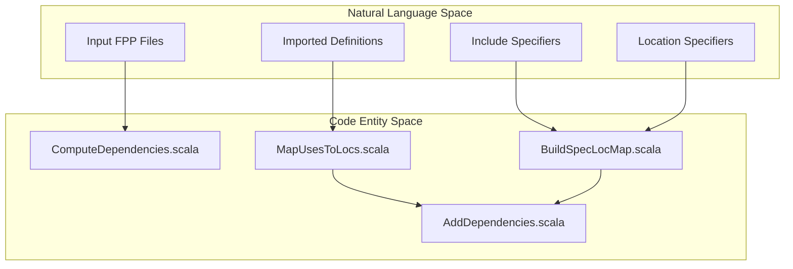
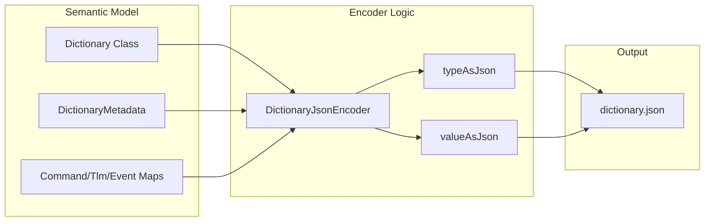

# Page: Dictionary and Dependency Analysis

# Dictionary and Dependency Analysis

Relevant source files

The following files were used as context for generating this wiki page:

- [compiler/lib/src/main/scala/analysis/Analyzers/UseAnalyzer.scala](compiler/lib/src/main/scala/analysis/Analyzers/UseAnalyzer.scala)
- [compiler/lib/src/main/scala/analysis/CheckSemantics/CheckFrameworkDefs.scala](compiler/lib/src/main/scala/analysis/CheckSemantics/CheckFrameworkDefs.scala)
- [compiler/lib/src/main/scala/analysis/CheckSemantics/CheckSpecLocs.scala](compiler/lib/src/main/scala/analysis/CheckSemantics/CheckSpecLocs.scala)
- [compiler/lib/src/main/scala/analysis/CheckSemantics/ConstructDictionaryMap.scala](compiler/lib/src/main/scala/analysis/CheckSemantics/ConstructDictionaryMap.scala)
- [compiler/lib/src/main/scala/analysis/ComputeDependencies/AddDependencies.scala](compiler/lib/src/main/scala/analysis/ComputeDependencies/AddDependencies.scala)
- [compiler/lib/src/main/scala/analysis/ComputeDependencies/BuildSpecLocMap.scala](compiler/lib/src/main/scala/analysis/ComputeDependencies/BuildSpecLocMap.scala)
- [compiler/lib/src/main/scala/analysis/ComputeDependencies/ComputeDependencies.scala](compiler/lib/src/main/scala/analysis/ComputeDependencies/ComputeDependencies.scala)
- [compiler/lib/src/main/scala/analysis/Semantics/ConstructDictionary/DictionaryEntries.scala](compiler/lib/src/main/scala/analysis/Semantics/ConstructDictionary/DictionaryEntries.scala)
- [compiler/lib/src/main/scala/analysis/Semantics/ConstructDictionary/DictionaryUsedSymbols.scala](compiler/lib/src/main/scala/analysis/Semantics/ConstructDictionary/DictionaryUsedSymbols.scala)
- [compiler/lib/src/main/scala/analysis/Semantics/Dictionary.scala](compiler/lib/src/main/scala/analysis/Semantics/Dictionary.scala)
- [compiler/lib/src/main/scala/analysis/Semantics/Name.scala](compiler/lib/src/main/scala/analysis/Semantics/Name.scala)
- [compiler/lib/src/main/scala/analysis/Semantics/TlmChannelIdentifier.scala](compiler/lib/src/main/scala/analysis/Semantics/TlmChannelIdentifier.scala)
- [compiler/lib/src/main/scala/analysis/Semantics/TlmPacket.scala](compiler/lib/src/main/scala/analysis/Semantics/TlmPacket.scala)
- [compiler/lib/src/main/scala/codegen/DictionaryJsonWriter/DictionaryJsonEncoder.scala](compiler/lib/src/main/scala/codegen/DictionaryJsonWriter/DictionaryJsonEncoder.scala)
- [compiler/tools/fpp-check/test/framework_defs/dp_state_not_enum.fpp](compiler/tools/fpp-check/test/framework_defs/dp_state_not_enum.fpp)
- [compiler/tools/fpp-check/test/framework_defs/dp_state_not_enum.ref.txt](compiler/tools/fpp-check/test/framework_defs/dp_state_not_enum.ref.txt)
- [compiler/tools/fpp-check/test/framework_defs/fw_event_id_type_not_alias_type.fpp](compiler/tools/fpp-check/test/framework_defs/fw_event_id_type_not_alias_type.fpp)
- [compiler/tools/fpp-check/test/framework_defs/fw_event_id_type_not_alias_type.ref.txt](compiler/tools/fpp-check/test/framework_defs/fw_event_id_type_not_alias_type.ref.txt)
- [compiler/tools/fpp-check/test/framework_defs/user_data_size_not_integer.fpp](compiler/tools/fpp-check/test/framework_defs/user_data_size_not_integer.fpp)
- [compiler/tools/fpp-check/test/framework_defs/user_data_size_not_integer.ref.txt](compiler/tools/fpp-check/test/framework_defs/user_data_size_not_integer.ref.txt)
- [compiler/tools/fpp-check/test/spec_loc/abs_type_dictionary_error.fpp](compiler/tools/fpp-check/test/spec_loc/abs_type_dictionary_error.fpp)
- [compiler/tools/fpp-check/test/spec_loc/abs_type_dictionary_error.ref.txt](compiler/tools/fpp-check/test/spec_loc/abs_type_dictionary_error.ref.txt)
- [compiler/tools/fpp-check/test/spec_loc/abs_type_path_error.fpp](compiler/tools/fpp-check/test/spec_loc/abs_type_path_error.fpp)
- [compiler/tools/fpp-check/test/spec_loc/abs_type_path_error.ref.txt](compiler/tools/fpp-check/test/spec_loc/abs_type_path_error.ref.txt)
- [compiler/tools/fpp-check/test/spec_loc/alias_type_dictionary_error.ref.txt](compiler/tools/fpp-check/test/spec_loc/alias_type_dictionary_error.ref.txt)
- [compiler/tools/fpp-check/test/spec_loc/alias_type_path_error.fpp](compiler/tools/fpp-check/test/spec_loc/alias_type_path_error.fpp)
- [compiler/tools/fpp-check/test/spec_loc/alias_type_path_error.ref.txt](compiler/tools/fpp-check/test/spec_loc/alias_type_path_error.ref.txt)
- [compiler/tools/fpp-check/test/spec_loc/array_path_error.fpp](compiler/tools/fpp-check/test/spec_loc/array_path_error.fpp)
- [compiler/tools/fpp-check/test/spec_loc/array_path_error.ref.txt](compiler/tools/fpp-check/test/spec_loc/array_path_error.ref.txt)
- [compiler/tools/fpp-check/test/spec_loc/state_machine_ok.fpp](compiler/tools/fpp-check/test/spec_loc/state_machine_ok.fpp)
- [compiler/tools/fpp-check/test/spec_loc/state_machine_ok.ref.txt](compiler/tools/fpp-check/test/spec_loc/state_machine_ok.ref.txt)
- [compiler/tools/fpp-check/test/spec_loc/state_machine_path_error.fpp](compiler/tools/fpp-check/test/spec_loc/state_machine_path_error.fpp)
- [compiler/tools/fpp-check/test/spec_loc/state_machine_path_error.ref.txt](compiler/tools/fpp-check/test/spec_loc/state_machine_path_error.ref.txt)
- [compiler/tools/fpp-check/test/spec_loc/tests.sh](compiler/tools/fpp-check/test/spec_loc/tests.sh)
- [compiler/tools/fpp-check/test/tlm_packets/channel_neither_used_nor_omitted.fpp](compiler/tools/fpp-check/test/tlm_packets/channel_neither_used_nor_omitted.fpp)
- [compiler/tools/fpp-check/test/tlm_packets/channel_used_and_omitted.fpp](compiler/tools/fpp-check/test/tlm_packets/channel_used_and_omitted.fpp)
- [compiler/tools/fpp-depend/test/clean](compiler/tools/fpp-depend/test/clean)
- [compiler/tools/fpp-depend/test/def_alias.fpp](compiler/tools/fpp-depend/test/def_alias.fpp)
- [compiler/tools/fpp-depend/test/def_alias.ref.txt](compiler/tools/fpp-depend/test/def_alias.ref.txt)
- [compiler/tools/fpp-depend/test/def_array.fpp](compiler/tools/fpp-depend/test/def_array.fpp)
- [compiler/tools/fpp-depend/test/def_array.ref.txt](compiler/tools/fpp-depend/test/def_array.ref.txt)
- [compiler/tools/fpp-depend/test/def_constant.fpp](compiler/tools/fpp-depend/test/def_constant.fpp)
- [compiler/tools/fpp-depend/test/def_constant.ref.txt](compiler/tools/fpp-depend/test/def_constant.ref.txt)
- [compiler/tools/fpp-depend/test/def_enum.fpp](compiler/tools/fpp-depend/test/def_enum.fpp)
- [compiler/tools/fpp-depend/test/def_enum.ref.txt](compiler/tools/fpp-depend/test/def_enum.ref.txt)
- [compiler/tools/fpp-depend/test/def_port.fpp](compiler/tools/fpp-depend/test/def_port.fpp)
- [compiler/tools/fpp-depend/test/def_state_machine.fpp](compiler/tools/fpp-depend/test/def_state_machine.fpp)
- [compiler/tools/fpp-depend/test/def_state_machine.ref.txt](compiler/tools/fpp-depend/test/def_state_machine.ref.txt)
- [compiler/tools/fpp-depend/test/def_struct.fpp](compiler/tools/fpp-depend/test/def_struct.fpp)
- [compiler/tools/fpp-depend/test/def_struct.ref.txt](compiler/tools/fpp-depend/test/def_struct.ref.txt)
- [compiler/tools/fpp-depend/test/dictionary.fpp](compiler/tools/fpp-depend/test/dictionary.fpp)
- [compiler/tools/fpp-depend/test/dictionary.ref.txt](compiler/tools/fpp-depend/test/dictionary.ref.txt)
- [compiler/tools/fpp-depend/test/dictionary_T2.fpp](compiler/tools/fpp-depend/test/dictionary_T2.fpp)
- [compiler/tools/fpp-depend/test/dictionary_no_top.fpp](compiler/tools/fpp-depend/test/dictionary_no_top.fpp)
- [compiler/tools/fpp-depend/test/dictionary_no_top.ref.txt](compiler/tools/fpp-depend/test/dictionary_no_top.ref.txt)
- [compiler/tools/fpp-depend/test/enum_constant.ref.txt](compiler/tools/fpp-depend/test/enum_constant.ref.txt)
- [compiler/tools/fpp-depend/test/filenames_include_ut_output.ref.txt](compiler/tools/fpp-depend/test/filenames_include_ut_output.ref.txt)
- [compiler/tools/fpp-depend/test/filenames_ut_output.ref.txt](compiler/tools/fpp-depend/test/filenames_ut_output.ref.txt)
- [compiler/tools/fpp-depend/test/locate_constant_modules_1.fpp](compiler/tools/fpp-depend/test/locate_constant_modules_1.fpp)
- [compiler/tools/fpp-depend/test/locate_constant_modules_1.ref.txt](compiler/tools/fpp-depend/test/locate_constant_modules_1.ref.txt)
- [compiler/tools/fpp-depend/test/locate_constant_modules_2.fpp](compiler/tools/fpp-depend/test/locate_constant_modules_2.fpp)
- [compiler/tools/fpp-depend/test/locate_constant_modules_2.ref.txt](compiler/tools/fpp-depend/test/locate_constant_modules_2.ref.txt)
- [compiler/tools/fpp-depend/test/run](compiler/tools/fpp-depend/test/run)
- [compiler/tools/fpp-depend/test/spec_command.fpp](compiler/tools/fpp-depend/test/spec_command.fpp)
- [compiler/tools/fpp-depend/test/spec_command.ref.txt](compiler/tools/fpp-depend/test/spec_command.ref.txt)
- [compiler/tools/fpp-depend/test/spec_connection_graph_direct.fpp](compiler/tools/fpp-depend/test/spec_connection_graph_direct.fpp)
- [compiler/tools/fpp-depend/test/spec_connection_graph_direct.ref.txt](compiler/tools/fpp-depend/test/spec_connection_graph_direct.ref.txt)
- [compiler/tools/fpp-depend/test/spec_state_machine_instance.fpp](compiler/tools/fpp-depend/test/spec_state_machine_instance.fpp)
- [compiler/tools/fpp-depend/test/spec_state_machine_instance.ref.txt](compiler/tools/fpp-depend/test/spec_state_machine_instance.ref.txt)
- [compiler/tools/fpp-depend/test/tests.sh](compiler/tools/fpp-depend/test/tests.sh)
- [compiler/tools/fpp-depend/test/update-ref](compiler/tools/fpp-depend/test/update-ref)
- [compiler/tools/fpp-to-dict/test/dictionary.schema.json](compiler/tools/fpp-to-dict/test/dictionary.schema.json)
- [compiler/tools/fpp-to-dict/test/top/BasicDpTopologyDictionary.ref.json](compiler/tools/fpp-to-dict/test/top/BasicDpTopologyDictionary.ref.json)
- [compiler/tools/fpp-to-dict/test/top/BasicTopologyDictionary.ref.json](compiler/tools/fpp-to-dict/test/top/BasicTopologyDictionary.ref.json)
- [compiler/tools/fpp-to-dict/test/top/DictionaryDefsTopologyDictionary.ref.json](compiler/tools/fpp-to-dict/test/top/DictionaryDefsTopologyDictionary.ref.json)
- [compiler/tools/fpp-to-dict/test/top/FirstTopTopologyDictionary.ref.json](compiler/tools/fpp-to-dict/test/top/FirstTopTopologyDictionary.ref.json)
- [compiler/tools/fpp-to-dict/test/top/QualifiedCompInstTopologyDictionary.ref.json](compiler/tools/fpp-to-dict/test/top/QualifiedCompInstTopologyDictionary.ref.json)
- [compiler/tools/fpp-to-dict/test/top/SecondTopTopologyDictionary.ref.json](compiler/tools/fpp-to-dict/test/top/SecondTopTopologyDictionary.ref.json)
- [compiler/tools/fpp-to-dict/test/top/UnqualifiedCompInstTopologyDictionary.ref.json](compiler/tools/fpp-to-dict/test/top/UnqualifiedCompInstTopologyDictionary.ref.json)
- [compiler/tools/fpp-to-dict/test/top/config.fpp](compiler/tools/fpp-to-dict/test/top/config.fpp)
- [compiler/tools/fpp-to-dict/test/top/dataProducts.fpp](compiler/tools/fpp-to-dict/test/top/dataProducts.fpp)
- [compiler/tools/fpp-to-dict/test/top/dictionaryDefs.fpp](compiler/tools/fpp-to-dict/test/top/dictionaryDefs.fpp)
- [compiler/tools/fpp-to-dict/test/top/multipleTops.fpp](compiler/tools/fpp-to-dict/test/top/multipleTops.fpp)
- [compiler/tools/fpp-to-dict/test/top/run.sh](compiler/tools/fpp-to-dict/test/top/run.sh)
- [compiler/tools/fpp-to-dict/test/top/tests.sh](compiler/tools/fpp-to-dict/test/top/tests.sh)
- [compiler/tools/fpp-to-dict/test/top/update-ref.sh](compiler/tools/fpp-to-dict/test/top/update-ref.sh)
- [compiler/tools/fpp-to-json/test/frameworkDefs.ref.txt](compiler/tools/fpp-to-json/test/frameworkDefs.ref.txt)
- [docs/users-guide/Dictionary-Definitions.adoc](docs/users-guide/Dictionary-Definitions.adoc)
- [docs/users-guide/Specifying-Models-as-Files.adoc](docs/users-guide/Specifying-Models-as-Files.adoc)

This section covers the semantic structures used to represent F Prime dictionaries and the mechanisms for analyzing file-level and symbol-level dependencies within an FPP model.

## 1. Dictionary Data Structure

The `Dictionary` class is the central semantic model for telemetry and command metadata associated with a topology. It aggregates all command opcodes, telemetry IDs, event IDs, and parameter IDs across all component instances defined in a topology.

### Dictionary Components
The dictionary is composed of several entry maps, where each entry associates a component instance with a specific functional definition (e.g., a `Command` or `TlmChannel`).

*   **Command Map**: Maps `Command.Opcode` to `Dictionary.CommandEntry` [compiler/lib/src/main/scala/analysis/Semantics/Dictionary.scala:10-10]().
*   **Telemetry Map**: Maps `TlmChannel.Id` to `Dictionary.TlmChannelEntry` [compiler/lib/src/main/scala/analysis/Semantics/Dictionary.scala:12-12]().
*   **Event Map**: Maps `Event.Id` to `Dictionary.EventEntry` [compiler/lib/src/main/scala/analysis/Semantics/Dictionary.scala:16-16]().
*   **Parameter Map**: Maps `Param.Id` to `Dictionary.ParamEntry` [compiler/lib/src/main/scala/analysis/Semantics/Dictionary.scala:18-18]().
*   **Data Product Maps**: Includes maps for `RecordEntry` and `ContainerEntry` used in F Prime Data Products [compiler/lib/src/main/scala/analysis/Semantics/Dictionary.scala:20-22]().

### Dictionary Construction Pipeline
The construction of a dictionary is triggered during the analysis of a topology definition in `ConstructDictionaryMap` [compiler/lib/src/main/scala/analysis/CheckSemantics/ConstructDictionaryMap.scala:14-17]().

| Phase | Class/Function | Responsibility |
| :--- | :--- | :--- |
| **Symbol Collection** | `DictionaryUsedSymbols` | Identifies all types and constants required by the dictionary entries [compiler/lib/src/main/scala/analysis/Semantics/ConstructDictionary/DictionaryUsedSymbols.scala:6-6](). |
| **Entry Mapping** | `DictionaryEntries` | Iterates through component instances and populates the opcode/ID maps [compiler/lib/src/main/scala/analysis/CheckSemantics/ConstructDictionaryMap.scala:23-23](). |
| **Packet Resolution** | `TlmPacketSet` | Processes `spec tlm packets` to group telemetry channels into packets [compiler/lib/src/main/scala/analysis/CheckSemantics/ConstructDictionaryMap.scala:37-40](). |

**Sources:** [compiler/lib/src/main/scala/analysis/Semantics/Dictionary.scala:1-108](), [compiler/lib/src/main/scala/analysis/CheckSemantics/ConstructDictionaryMap.scala:1-74](), [compiler/lib/src/main/scala/analysis/Semantics/ConstructDictionary/DictionaryUsedSymbols.scala:1-75]()

## 2. Telemetry Packets

FPP allows grouping telemetry channels into packets for efficient downlink. This is managed via `TlmPacketSet`, `TlmPacket`, and `TlmPacketGroup`.

*   **TlmPacketSet**: A named collection of packets defined within a topology [compiler/lib/src/main/scala/analysis/Semantics/Dictionary.scala:24-24]().
*   **TlmPacket**: Represents a single packet containing a set of telemetry channels. It is constructed from `Ast.SpecTlmPacket` [compiler/lib/src/main/scala/analysis/CheckSemantics/ConstructDictionaryMap.scala:63-68]().
*   **Validation**: The compiler ensures that packet sets do not have duplicate names [compiler/lib/src/main/scala/analysis/Semantics/Dictionary.scala:53-66]() and that channels included in packets actually exist in the topology [compiler/lib/src/main/scala/analysis/Semantics/Dictionary.scala:37-50]().

**Sources:** [compiler/lib/src/main/scala/analysis/Semantics/Dictionary.scala:36-66](), [compiler/lib/src/main/scala/analysis/CheckSemantics/ConstructDictionaryMap.scala:37-72]()

## 3. Dependency Computation

Dependency analysis determines the relationship between FPP source files based on symbol usage. This is critical for build systems to determine which files must be parsed together.

### The Pipeline
The dependency computation is handled by `ComputeDependencies` and associated utilities.

#### Natural Language to Code Entity Mapping: Dependency Flow
Title: Dependency Resolution Mapping

**Sources:** [compiler/lib/src/main/scala/analysis/ComputeDependencies/ComputeDependencies.scala:1-20](), [compiler/lib/src/main/scala/analysis/ComputeDependencies/BuildSpecLocMap.scala:1-15]()

### Key Components

1.  **BuildSpecLocMap**: This component builds a mapping between symbols and their specified locations. It processes `locate` specifiers which explicitly tell the compiler where a definition should be found [compiler/lib/src/main/scala/analysis/CheckSemantics/CheckSpecLocs.scala:7-10]().
2.  **MapUsesToLocs**: Analyzes the `useDefMap` generated during semantic analysis to find the file location of every definition associated with a symbol use [compiler/lib/src/main/scala/analysis/Analyzers/UseAnalyzer.scala:12-12]().
3.  **ComputeDependencies**: The entry point that orchestrates the analysis of input files to produce a list of direct and transitive dependencies [compiler/lib/src/main/scala/analysis/ComputeDependencies/ComputeDependencies.scala:1-10]().

### Dependency Types
*   **Direct Dependencies**: Files that contain definitions directly used by the input files.
*   **Include Dependencies**: Files pulled in via the `include` keyword [docs/users-guide/Specifying-Models-as-Files.adoc:68-72]().
*   **Framework Dependencies**: Special dependencies on F Prime framework types (e.g., `FwOpcodeType`, `FwChanIdType`) which are validated in `CheckFrameworkDefs` [compiler/lib/src/main/scala/analysis/CheckSemantics/CheckFrameworkDefs.scala:71-93]().

**Sources:** [compiler/lib/src/main/scala/analysis/CheckSemantics/CheckSpecLocs.scala:1-132](), [compiler/lib/src/main/scala/analysis/CheckSemantics/CheckFrameworkDefs.scala:1-107](), [docs/users-guide/Specifying-Models-as-Files.adoc:197-217]()

## 4. Dictionary JSON Encoding

The `DictionaryJsonEncoder` transforms the semantic `Dictionary` object into a JSON format compatible with F Prime ground system tools.

Title: Dictionary Serialization Flow

### Metadata and Types
The encoder captures deployment metadata such as project version and framework version [compiler/lib/src/main/scala/codegen/DictionaryJsonWriter/DictionaryJsonEncoder.scala:14-20](). It recursively encodes FPP types (Primitive, String, Array, Struct, Enum) into their JSON representations [compiler/lib/src/main/scala/codegen/DictionaryJsonWriter/DictionaryJsonEncoder.scala:107-158]().

**Sources:** [compiler/lib/src/main/scala/codegen/DictionaryJsonWriter/DictionaryJsonEncoder.scala:11-105](), [compiler/tools/fpp-to-dict/test/top/FirstTopTopologyDictionary.ref.json:1-11]()
