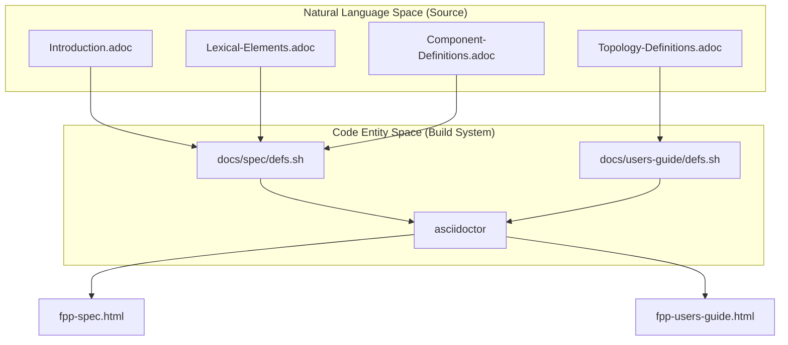
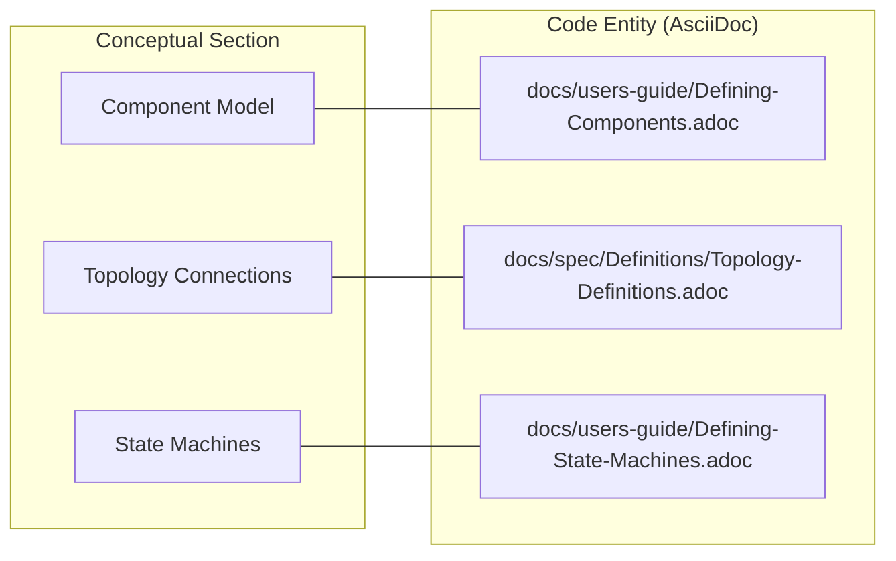

# Page: Editor Support and Documentation

# Editor Support and Documentation

Relevant source files

The following files were used as context for generating this wiki page:

- [docs/code-prettify/run_prettify.js](docs/code-prettify/run_prettify.js)
- [docs/fpp-spec.html](docs/fpp-spec.html)
- [docs/fpp-users-guide.html](docs/fpp-users-guide.html)
- [docs/index.html](docs/index.html)
- [docs/spec/Analysis-and-Translation.adoc](docs/spec/Analysis-and-Translation.adoc)
- [docs/spec/Definitions/Component-Definitions.adoc](docs/spec/Definitions/Component-Definitions.adoc)
- [docs/spec/Definitions/Component-Instance-Definitions.adoc](docs/spec/Definitions/Component-Instance-Definitions.adoc)
- [docs/spec/Definitions/Module-Definitions.adoc](docs/spec/Definitions/Module-Definitions.adoc)
- [docs/spec/Definitions/State-Machine-Definitions.adoc](docs/spec/Definitions/State-Machine-Definitions.adoc)
- [docs/spec/Definitions/Topology-Definitions.adoc](docs/spec/Definitions/Topology-Definitions.adoc)
- [docs/spec/Definitions/defs.sh](docs/spec/Definitions/defs.sh)
- [docs/spec/Instance-Member-Identifiers.adoc](docs/spec/Instance-Member-Identifiers.adoc)
- [docs/spec/Introduction.adoc](docs/spec/Introduction.adoc)
- [docs/spec/Lexical-Elements.adoc](docs/spec/Lexical-Elements.adoc)
- [docs/spec/Ports.adoc](docs/spec/Ports.adoc)
- [docs/spec/Specifiers/Command-Specifiers.adoc](docs/spec/Specifiers/Command-Specifiers.adoc)
- [docs/spec/Specifiers/Connection-Graph-Specifiers.adoc](docs/spec/Specifiers/Connection-Graph-Specifiers.adoc)
- [docs/spec/Specifiers/Event-Specifiers.adoc](docs/spec/Specifiers/Event-Specifiers.adoc)
- [docs/spec/Specifiers/Parameter-Specifiers.adoc](docs/spec/Specifiers/Parameter-Specifiers.adoc)
- [docs/spec/Specifiers/Port-Interface-Instance-Specifiers.adoc](docs/spec/Specifiers/Port-Interface-Instance-Specifiers.adoc)
- [docs/spec/Specifiers/Telemetry-Channel-Specifiers.adoc](docs/spec/Specifiers/Telemetry-Channel-Specifiers.adoc)
- [docs/spec/Specifiers/Telemetry-Packet-Set-Specifiers.adoc](docs/spec/Specifiers/Telemetry-Packet-Set-Specifiers.adoc)
- [docs/spec/Specifiers/Topology-Port-Instance-Specifiers.adoc](docs/spec/Specifiers/Topology-Port-Instance-Specifiers.adoc)
- [docs/spec/Specifiers/defs.sh](docs/spec/Specifiers/defs.sh)
- [docs/spec/State-Machine-Behavior-Elements/Action-Definitions.adoc](docs/spec/State-Machine-Behavior-Elements/Action-Definitions.adoc)
- [docs/spec/State-Machine-Behavior-Elements/Do-Expressions.adoc](docs/spec/State-Machine-Behavior-Elements/Do-Expressions.adoc)
- [docs/spec/State-Machine-Behavior-Elements/Guard-Definitions.adoc](docs/spec/State-Machine-Behavior-Elements/Guard-Definitions.adoc)
- [docs/spec/State-Machine-Behavior-Elements/Initial-Transition-Specifiers.adoc](docs/spec/State-Machine-Behavior-Elements/Initial-Transition-Specifiers.adoc)
- [docs/spec/State-Machine-Behavior-Elements/State-Definitions.adoc](docs/spec/State-Machine-Behavior-Elements/State-Definitions.adoc)
- [docs/spec/State-Machine-Behavior-Elements/State-Entry-Specifiers.adoc](docs/spec/State-Machine-Behavior-Elements/State-Entry-Specifiers.adoc)
- [docs/spec/State-Machine-Behavior-Elements/State-Exit-Specifiers.adoc](docs/spec/State-Machine-Behavior-Elements/State-Exit-Specifiers.adoc)
- [docs/spec/State-Machine-Behavior-Elements/State-Transition-Specifiers.adoc](docs/spec/State-Machine-Behavior-Elements/State-Transition-Specifiers.adoc)
- [docs/spec/State-Machine-Behavior-Elements/Transition-Expressions.adoc](docs/spec/State-Machine-Behavior-Elements/Transition-Expressions.adoc)
- [docs/spec/State-Machine-Behavior-Elements/defs.sh](docs/spec/State-Machine-Behavior-Elements/defs.sh)
- [docs/spec/defs.sh](docs/spec/defs.sh)
- [docs/users-guide/Analyzing-and-Translating-Models.adoc](docs/users-guide/Analyzing-and-Translating-Models.adoc)
- [docs/users-guide/Defining-Component-Instances.adoc](docs/users-guide/Defining-Component-Instances.adoc)
- [docs/users-guide/Defining-Components.adoc](docs/users-guide/Defining-Components.adoc)
- [docs/users-guide/Defining-Constants.adoc](docs/users-guide/Defining-Constants.adoc)
- [docs/users-guide/Defining-Enums.adoc](docs/users-guide/Defining-Enums.adoc)
- [docs/users-guide/Defining-Modules.adoc](docs/users-guide/Defining-Modules.adoc)
- [docs/users-guide/Defining-State-Machines.adoc](docs/users-guide/Defining-State-Machines.adoc)
- [docs/users-guide/Defining-Topologies.adoc](docs/users-guide/Defining-Topologies.adoc)
- [docs/users-guide/Defining-Types.adoc](docs/users-guide/Defining-Types.adoc)
- [docs/users-guide/Defining-and-Using-Port-Interfaces.adoc](docs/users-guide/Defining-and-Using-Port-Interfaces.adoc)
- [docs/users-guide/Installing-FPP.adoc](docs/users-guide/Installing-FPP.adoc)
- [docs/users-guide/Introduction.adoc](docs/users-guide/Introduction.adoc)
- [docs/users-guide/Writing-C-Plus-Plus-Implementations.adoc](docs/users-guide/Writing-C-Plus-Plus-Implementations.adoc)
- [docs/users-guide/Writing-Comments-and-Annotations.adoc](docs/users-guide/Writing-Comments-and-Annotations.adoc)
- [docs/users-guide/built-in.fpp](docs/users-guide/built-in.fpp)
- [docs/users-guide/defs.sh](docs/users-guide/defs.sh)
- [docs/users-guide/diagrams/state-machine/README.adoc](docs/users-guide/diagrams/state-machine/README.adoc)
- [editors/emacs/fpp-mode.el](editors/emacs/fpp-mode.el)
- [editors/vim/fpp.vim](editors/vim/fpp.vim)

This section covers the external tools and internal systems used to support FPP development and maintain its technical documentation. This includes editor integrations for syntax highlighting and the AsciiDoc-based build system used to generate the formal language specification and user guide.

## Editor Integrations

FPP provides official support for Vim and Emacs to facilitate model development with syntax highlighting and indentation rules.

### Vim Support
The Vim integration is provided via `fpp.vim`. It defines syntax groups for FPP keywords (e.g., `active`, `component`, `topology`), constants, and comments to provide a standard development experience.
*   **File**: [editors/vim/fpp.vim:1-100]()

### Emacs Support
The Emacs integration is implemented in `fpp-mode.el`. It defines a major mode `fpp-mode` that handles syntax highlighting through `font-lock-defaults` and provides basic indentation support for FPP's curly-brace and element-sequence structures.
*   **File**: [editors/emacs/fpp-mode.el:1-50]()

## Documentation Build System

The FPP documentation is authored in **AsciiDoc** and transformed into HTML using `asciidoctor`. The system is modularized into several directories under `docs/`, using shell scripts to manage the assembly of various specification fragments.

### Build Scripts and defs.sh
The build process relies on `defs.sh` scripts located in various subdirectories. These scripts define the order and inclusion of AsciiDoc files (`.adoc`) to ensure that the final generated HTML maintains a logical flow of concepts.

| Script Location | Purpose |
|---|---|
| `docs/spec/defs.sh` | Orchestrates the formal Language Specification build. |
| `docs/users-guide/defs.sh` | Orchestrates the User's Guide build. |
| `docs/spec/Definitions/defs.sh` | Manages definitions like Modules, Components, and Topologies. |

*   **Sources**: [docs/spec/defs.sh:1-10](), [docs/users-guide/defs.sh:1-10](), [docs/spec/Definitions/defs.sh:1-10]()

### Documentation Architecture
The following diagram illustrates how the source `.adoc` files are aggregated through the script-driven build system into the final technical manuals.

**Documentation Assembly Pipeline**

*   **Sources**: [docs/spec/defs.sh:1-20](), [docs/users-guide/defs.sh:1-20](), [docs/fpp-spec.html:1-10](), [docs/fpp-users-guide.html:1-10]()

## Language Specification and User Guide

The documentation is split into two primary tracks: one for formal rigor and one for practical application.

### FPP Language Specification
The Specification provides the formal definition of FPP. It covers the lexical grammar, type-checking rules, and the formal semantics of definitions (e.g., how a `topology` is resolved into a partially numbered topology).

For details, see [FPP Language Specification](#7.1).
*   **Sources**: [docs/spec/Introduction.adoc:1-30](), [docs/spec/Definitions/Topology-Definitions.adoc:1-70]()

### FPP User's Guide
The User's Guide is a tutorial-style manual for developers. It explains how to install the tools, define components, and use the `fpp-check` and `fpp-to-cpp` tools to generate F* code. It also documents the `built-in.fpp` framework definitions required for standard F* types.

For details, see [FPP User's Guide](#7.2).
*   **Sources**: [docs/users-guide/Installing-FPP.adoc:1-50](), [docs/users-guide/Analyzing-and-Translating-Models.adoc:1-100](), [docs/users-guide/built-in.fpp:1-20]()

### System Documentation Mapping
This diagram bridges the conceptual documentation sections to the physical files that define them in the repository.

**Documentation Mapping**

*   **Sources**: [docs/users-guide/Defining-Components.adoc:1-20](), [docs/spec/Definitions/Topology-Definitions.adoc:1-10](), [docs/users-guide/Defining-State-Machines.adoc:1-30]()
