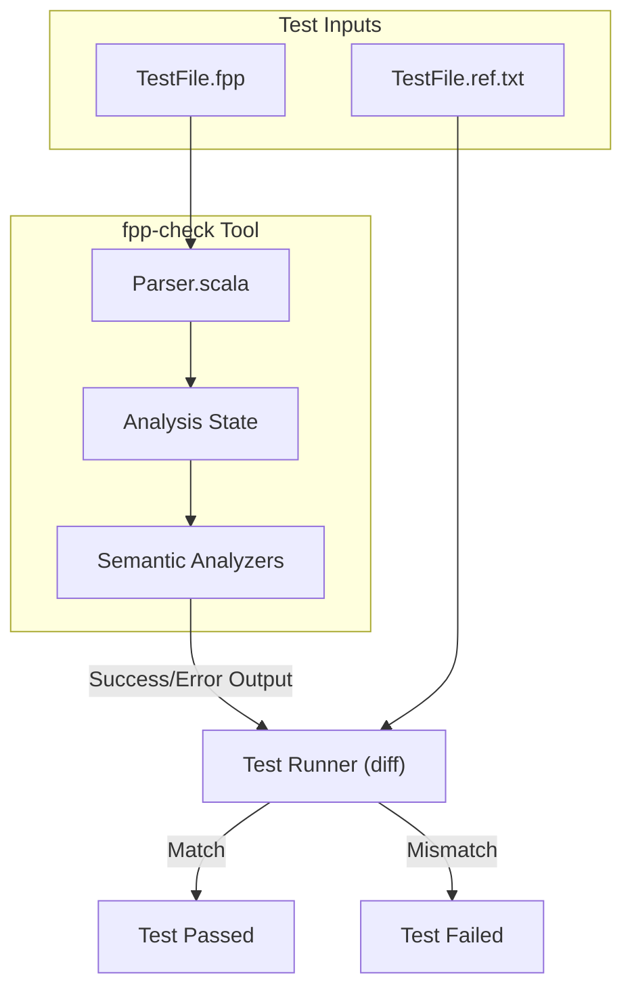
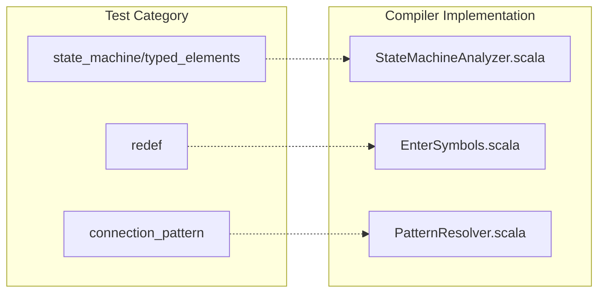

# Page: fpp-check Test Suite

# fpp-check Test Suite

Relevant source files

The following files were used as context for generating this wiki page:

- [compiler/lib/src/main/scala/analysis/Analyzers/StateMachineAnalyzer.scala](compiler/lib/src/main/scala/analysis/Analyzers/StateMachineAnalyzer.scala)
- [compiler/tools/fpp-check/test/array/default_error.ref.txt](compiler/tools/fpp-check/test/array/default_error.ref.txt)
- [compiler/tools/fpp-check/test/array/no_default_ok.ref.txt](compiler/tools/fpp-check/test/array/no_default_ok.ref.txt)
- [compiler/tools/fpp-check/test/array/tests.sh](compiler/tools/fpp-check/test/array/tests.sh)
- [compiler/tools/fpp-check/test/component/ok.fpp](compiler/tools/fpp-check/test/component/ok.fpp)
- [compiler/tools/fpp-check/test/connection_direct/ok.fpp](compiler/tools/fpp-check/test/connection_direct/ok.fpp)
- [compiler/tools/fpp-check/test/connection_pattern/clean](compiler/tools/fpp-check/test/connection_pattern/clean)
- [compiler/tools/fpp-check/test/connection_pattern/command_ok.fpp](compiler/tools/fpp-check/test/connection_pattern/command_ok.fpp)
- [compiler/tools/fpp-check/test/connection_pattern/command_ok.ref.txt](compiler/tools/fpp-check/test/connection_pattern/command_ok.ref.txt)
- [compiler/tools/fpp-check/test/connection_pattern/health_ok.fpp](compiler/tools/fpp-check/test/connection_pattern/health_ok.fpp)
- [compiler/tools/fpp-check/test/connection_pattern/health_ok.ref.txt](compiler/tools/fpp-check/test/connection_pattern/health_ok.ref.txt)
- [compiler/tools/fpp-check/test/connection_pattern/param_ok.fpp](compiler/tools/fpp-check/test/connection_pattern/param_ok.fpp)
- [compiler/tools/fpp-check/test/connection_pattern/param_ok.ref.txt](compiler/tools/fpp-check/test/connection_pattern/param_ok.ref.txt)
- [compiler/tools/fpp-check/test/connection_pattern/run](compiler/tools/fpp-check/test/connection_pattern/run)
- [compiler/tools/fpp-check/test/connection_pattern/tests.sh](compiler/tools/fpp-check/test/connection_pattern/tests.sh)
- [compiler/tools/fpp-check/test/connection_pattern/time_no_time_get_port.fpp](compiler/tools/fpp-check/test/connection_pattern/time_no_time_get_port.fpp)
- [compiler/tools/fpp-check/test/connection_pattern/time_ok.fpp](compiler/tools/fpp-check/test/connection_pattern/time_ok.fpp)
- [compiler/tools/fpp-check/test/connection_pattern/time_ok.ref.txt](compiler/tools/fpp-check/test/connection_pattern/time_ok.ref.txt)
- [compiler/tools/fpp-check/test/connection_pattern/update-ref](compiler/tools/fpp-check/test/connection_pattern/update-ref)
- [compiler/tools/fpp-check/test/invalid_symbols/tests.sh](compiler/tools/fpp-check/test/invalid_symbols/tests.sh)
- [compiler/tools/fpp-check/test/invalid_symbols/topology_as_qualifier.fpp](compiler/tools/fpp-check/test/invalid_symbols/topology_as_qualifier.fpp)
- [compiler/tools/fpp-check/test/invalid_symbols/topology_as_qualifier.ref.txt](compiler/tools/fpp-check/test/invalid_symbols/topology_as_qualifier.ref.txt)
- [compiler/tools/fpp-check/test/port_instance/async_input_active.fpp](compiler/tools/fpp-check/test/port_instance/async_input_active.fpp)
- [compiler/tools/fpp-check/test/port_instance/async_input_active.ref.txt](compiler/tools/fpp-check/test/port_instance/async_input_active.ref.txt)
- [compiler/tools/fpp-check/test/port_instance/async_product_recv_active.fpp](compiler/tools/fpp-check/test/port_instance/async_product_recv_active.fpp)
- [compiler/tools/fpp-check/test/port_instance/async_product_recv_active.ref.txt](compiler/tools/fpp-check/test/port_instance/async_product_recv_active.ref.txt)
- [compiler/tools/fpp-check/test/port_instance/async_product_recv_passive.fpp](compiler/tools/fpp-check/test/port_instance/async_product_recv_passive.fpp)
- [compiler/tools/fpp-check/test/port_instance/async_product_recv_passive.ref.txt](compiler/tools/fpp-check/test/port_instance/async_product_recv_passive.ref.txt)
- [compiler/tools/fpp-check/test/port_instance/bad_priority_product_recv.fpp](compiler/tools/fpp-check/test/port_instance/bad_priority_product_recv.fpp)
- [compiler/tools/fpp-check/test/port_instance/bad_priority_product_recv.ref.txt](compiler/tools/fpp-check/test/port_instance/bad_priority_product_recv.ref.txt)
- [compiler/tools/fpp-check/test/port_instance/ok.fpp](compiler/tools/fpp-check/test/port_instance/ok.fpp)
- [compiler/tools/fpp-check/test/port_instance/shadowed_time_get.fpp](compiler/tools/fpp-check/test/port_instance/shadowed_time_get.fpp)
- [compiler/tools/fpp-check/test/port_instance/shadowed_time_get.ref.txt](compiler/tools/fpp-check/test/port_instance/shadowed_time_get.ref.txt)
- [compiler/tools/fpp-check/test/port_instance/special_input_kind_command.fpp](compiler/tools/fpp-check/test/port_instance/special_input_kind_command.fpp)
- [compiler/tools/fpp-check/test/port_instance/special_input_kind_command.ref.txt](compiler/tools/fpp-check/test/port_instance/special_input_kind_command.ref.txt)
- [compiler/tools/fpp-check/test/port_instance/special_input_kind_missing_product_recv.fpp](compiler/tools/fpp-check/test/port_instance/special_input_kind_missing_product_recv.fpp)
- [compiler/tools/fpp-check/test/port_instance/special_input_kind_missing_product_recv.ref.txt](compiler/tools/fpp-check/test/port_instance/special_input_kind_missing_product_recv.ref.txt)
- [compiler/tools/fpp-check/test/port_instance/sync_product_recv_priority.fpp](compiler/tools/fpp-check/test/port_instance/sync_product_recv_priority.fpp)
- [compiler/tools/fpp-check/test/port_instance/sync_product_recv_priority.ref.txt](compiler/tools/fpp-check/test/port_instance/sync_product_recv_priority.ref.txt)
- [compiler/tools/fpp-check/test/port_instance/sync_product_recv_queue_full.fpp](compiler/tools/fpp-check/test/port_instance/sync_product_recv_queue_full.fpp)
- [compiler/tools/fpp-check/test/port_instance/sync_product_recv_queue_full.ref.txt](compiler/tools/fpp-check/test/port_instance/sync_product_recv_queue_full.ref.txt)
- [compiler/tools/fpp-check/test/port_instance/tests.sh](compiler/tools/fpp-check/test/port_instance/tests.sh)
- [compiler/tools/fpp-check/test/port_numbering/duplicate_connection_at_matched_port.fpp](compiler/tools/fpp-check/test/port_numbering/duplicate_connection_at_matched_port.fpp)
- [compiler/tools/fpp-check/test/port_numbering/duplicate_connection_at_matched_port.ref.txt](compiler/tools/fpp-check/test/port_numbering/duplicate_connection_at_matched_port.ref.txt)
- [compiler/tools/fpp-check/test/port_numbering/duplicate_matched_connection.fpp](compiler/tools/fpp-check/test/port_numbering/duplicate_matched_connection.fpp)
- [compiler/tools/fpp-check/test/port_numbering/duplicate_matched_connection.ref.txt](compiler/tools/fpp-check/test/port_numbering/duplicate_matched_connection.ref.txt)
- [compiler/tools/fpp-check/test/port_numbering/implicit_duplicate_connection_at_matched_input_port.fpp](compiler/tools/fpp-check/test/port_numbering/implicit_duplicate_connection_at_matched_input_port.fpp)
- [compiler/tools/fpp-check/test/port_numbering/implicit_duplicate_connection_at_matched_input_port.ref.txt](compiler/tools/fpp-check/test/port_numbering/implicit_duplicate_connection_at_matched_input_port.ref.txt)
- [compiler/tools/fpp-check/test/port_numbering/implicit_duplicate_connection_at_matched_output_port.fpp](compiler/tools/fpp-check/test/port_numbering/implicit_duplicate_connection_at_matched_output_port.fpp)
- [compiler/tools/fpp-check/test/port_numbering/implicit_duplicate_connection_at_matched_output_port.ref.txt](compiler/tools/fpp-check/test/port_numbering/implicit_duplicate_connection_at_matched_output_port.ref.txt)
- [compiler/tools/fpp-check/test/port_numbering/no_port_available_for_matched_numbering.fpp](compiler/tools/fpp-check/test/port_numbering/no_port_available_for_matched_numbering.fpp)
- [compiler/tools/fpp-check/test/port_numbering/no_port_available_for_matched_numbering.ref.txt](compiler/tools/fpp-check/test/port_numbering/no_port_available_for_matched_numbering.ref.txt)
- [compiler/tools/fpp-check/test/port_numbering/tests.sh](compiler/tools/fpp-check/test/port_numbering/tests.sh)
- [compiler/tools/fpp-check/test/redef/component_state_machine.fpp](compiler/tools/fpp-check/test/redef/component_state_machine.fpp)
- [compiler/tools/fpp-check/test/redef/component_state_machine.ref.txt](compiler/tools/fpp-check/test/redef/component_state_machine.ref.txt)
- [compiler/tools/fpp-check/test/redef/constant_state_machine.fpp](compiler/tools/fpp-check/test/redef/constant_state_machine.fpp)
- [compiler/tools/fpp-check/test/redef/constant_state_machine.ref.txt](compiler/tools/fpp-check/test/redef/constant_state_machine.ref.txt)
- [compiler/tools/fpp-check/test/redef/module_state_machine.fpp](compiler/tools/fpp-check/test/redef/module_state_machine.fpp)
- [compiler/tools/fpp-check/test/redef/module_state_machine.ref.txt](compiler/tools/fpp-check/test/redef/module_state_machine.ref.txt)
- [compiler/tools/fpp-check/test/redef/state_machine.fpp](compiler/tools/fpp-check/test/redef/state_machine.fpp)
- [compiler/tools/fpp-check/test/redef/state_machine.ref.txt](compiler/tools/fpp-check/test/redef/state_machine.ref.txt)
- [compiler/tools/fpp-check/test/redef/tests.sh](compiler/tools/fpp-check/test/redef/tests.sh)
- [compiler/tools/fpp-check/test/state_machine/transition_graph/tests.sh](compiler/tools/fpp-check/test/state_machine/transition_graph/tests.sh)
- [compiler/tools/fpp-check/test/state_machine/typed_elements/state_external_transition_bad_action_type.fpp](compiler/tools/fpp-check/test/state_machine/typed_elements/state_external_transition_bad_action_type.fpp)
- [compiler/tools/fpp-check/test/state_machine/typed_elements/state_external_transition_bad_action_type.ref.txt](compiler/tools/fpp-check/test/state_machine/typed_elements/state_external_transition_bad_action_type.ref.txt)
- [compiler/tools/fpp-check/test/state_machine/typed_elements/state_self_transition_bad_action_type.fpp](compiler/tools/fpp-check/test/state_machine/typed_elements/state_self_transition_bad_action_type.fpp)
- [compiler/tools/fpp-check/test/state_machine/typed_elements/state_self_transition_bad_action_type.ref.txt](compiler/tools/fpp-check/test/state_machine/typed_elements/state_self_transition_bad_action_type.ref.txt)
- [compiler/tools/fpp-check/test/state_machine/typed_elements/tests.sh](compiler/tools/fpp-check/test/state_machine/typed_elements/tests.sh)
- [compiler/tools/fpp-check/test/update-ref](compiler/tools/fpp-check/test/update-ref)
- [compiler/tools/fpp-to-cpp/test/struct/AArrayAc.ref.hpp](compiler/tools/fpp-to-cpp/test/struct/AArrayAc.ref.hpp)
- [compiler/tools/fpp-to-cpp/test/struct/array.fpp](compiler/tools/fpp-to-cpp/test/struct/array.fpp)
- [compiler/tools/fpp-to-cpp/test/struct/array.ref.txt](compiler/tools/fpp-to-cpp/test/struct/array.ref.txt)
- [compiler/tools/fpp-to-dict/test/.gitignore](compiler/tools/fpp-to-dict/test/.gitignore)

The `fpp-check` test suite is a collection of integration tests designed to verify the semantic analysis phase of the FPP compiler. Unlike unit tests that target individual Scala classes, these tests execute the `fpp-check` command-line tool against FPP source files to ensure that valid models pass and invalid models produce the expected error messages.

## Test Structure and Methodology

The suite follows a standardized pattern across all categories. Each test case consists of an FPP source file and a corresponding reference text file that captures the expected output (standard out and standard error) of the `fpp-check` tool.

### File Pattern
*   **`.fpp` file**: The input source code being tested.
*   **`.ref.txt` file**: The "golden" output. If the test is expected to fail, this file contains the specific error message and line number generated by the compiler [compiler/tools/fpp-check/test/redef/constant_state_machine.ref.txt:1-10]().

### Reference Update Workflow
The suite includes a utility script `update-ref` used to update the reference files when intentional changes are made to the compiler's error reporting or output format [compiler/tools/fpp-check/test/update-ref:1-1]().

## Test Categories

The integration tests are organized into directories based on the semantic feature or FPP construct being validated.

### Port and Component Validation
These tests verify the internal consistency of component definitions and port instances.

*   **port_instance**: Validates port properties such as priority, queue full behavior, and return types. It ensures that async ports are only used in active components and that special ports (command, telemetry, etc.) are correctly typed [compiler/tools/fpp-check/test/port_instance/tests.sh:1-34]().
*   **component**: Checks general component semantics, including the inclusion of constants, types, and state machine instances within a component scope [compiler/tools/fpp-check/test/component/ok.fpp:1-46]().

### Topology and Connections
These tests focus on the resolution of connection graphs and the rules governing port-to-port links.

*   **connection_direct**: Validates explicit connections (using `->`) between component instances, including matched and unmatched port numbering [compiler/tools/fpp-check/test/connection_direct/ok.fpp:1-58]().
*   **connection_pattern**: Verifies pattern-based connections (command, event, health, param, telemetry, time). It checks for missing source/target ports and ensures patterns aren't duplicated [compiler/tools/fpp-check/test/connection_pattern/tests.sh:1-32]().
*   **port_numbering**: Specifically tests the logic for assigning and validating port indices, catching errors like negative indices or duplicate connections at a single port index [compiler/tools/fpp-check/test/port_numbering/tests.sh:1-12]().

### State Machine Analysis
The state machine tests are divided into structural and type-based checks.

*   **transition_graph**: Validates the reachability of states and choices, and detects cycles in choice paths [compiler/tools/fpp-check/test/state_machine/transition_graph/tests.sh:1-7]().
*   **typed_elements**: Ensures that actions and guards use types compatible with the signals or transitions they are associated with (e.g., checking `f32` vs `f64` compatibility) [compiler/tools/fpp-check/test/state_machine/typed_elements/tests.sh:1-23]().

### General Semantics
*   **redef**: A comprehensive suite checking that symbols (arrays, components, constants, enums, etc.) cannot be redefined within the same scope [compiler/tools/fpp-check/test/redef/tests.sh:1-33]().
*   **invalid_symbols**: Checks that symbols are used in the correct context (e.g., preventing a module from being used as a type or a constant as a qualifier) [compiler/tools/fpp-check/test/invalid_symbols/tests.sh:1-15]().
*   **array**: Validates array definitions, including size limits, default value compatibility, and format string syntax [compiler/tools/fpp-check/test/array/tests.sh:1-29]().

## Data Flow and Execution

The following diagram illustrates how the `fpp-check` tool processes a test case and compares it against the reference.

**fpp-check Test Execution Flow**

**Sources:** [compiler/tools/fpp-check/test/redef/constant_state_machine.ref.txt:1-10](), [compiler/tools/fpp-check/test/update-ref:1-1]()

## Implementation Mapping

The test categories map directly to the semantic analyzer classes in the `compiler/lib` directory.

**Semantic Analysis Mapping**

**Sources:** [compiler/lib/src/main/scala/analysis/Analyzers/StateMachineAnalyzer.scala:1-1](), [compiler/tools/fpp-check/test/state_machine/typed_elements/tests.sh:1-23](), [compiler/tools/fpp-check/test/redef/tests.sh:1-33]()

### Running Tests
Tests are typically invoked via a `tests.sh` script within each sub-directory. These scripts define a list of test names [compiler/tools/fpp-check/test/port_instance/tests.sh:1-1]() which the global test runner iterates through, executing `fpp-check` and performing a `diff` against the `.ref.txt` file.

**Sources:**
- [compiler/tools/fpp-check/test/state_machine/typed_elements/tests.sh:1-23]()
- [compiler/tools/fpp-check/test/connection_pattern/tests.sh:1-32]()
- [compiler/tools/fpp-check/test/port_instance/tests.sh:1-34]()
- [compiler/tools/fpp-check/test/redef/tests.sh:1-33]()
- [compiler/tools/fpp-check/test/port_numbering/tests.sh:1-12]()
- [compiler/tools/fpp-check/test/invalid_symbols/tests.sh:1-15]()
- [compiler/tools/fpp-check/test/array/tests.sh:1-29]()
- [compiler/tools/fpp-check/test/redef/constant_state_machine.ref.txt:1-10]()
- [compiler/tools/fpp-check/test/update-ref:1-1]()
