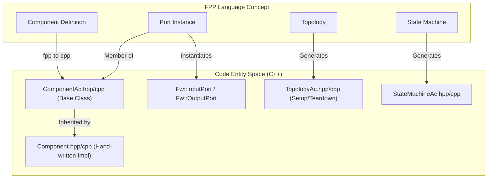
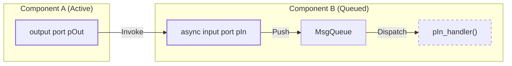

# Page: FPP Language Concepts

# FPP Language Concepts

Relevant source files

The following files were used as context for generating this wiki page:

- [compiler/lib/src/main/scala/analysis/Analyzers/InterfaceAnalyzer.scala](compiler/lib/src/main/scala/analysis/Analyzers/InterfaceAnalyzer.scala)
- [compiler/lib/src/main/scala/analysis/CheckSemantics/CheckFrameworkConstantValues.scala](compiler/lib/src/main/scala/analysis/CheckSemantics/CheckFrameworkConstantValues.scala)
- [compiler/lib/src/main/scala/analysis/ComputeDependencies/AddDependencies.scala](compiler/lib/src/main/scala/analysis/ComputeDependencies/AddDependencies.scala)
- [compiler/lib/src/main/scala/analysis/Semantics/Container.scala](compiler/lib/src/main/scala/analysis/Semantics/Container.scala)
- [compiler/lib/src/main/scala/analysis/Semantics/Record.scala](compiler/lib/src/main/scala/analysis/Semantics/Record.scala)
- [compiler/tools/fpp-check/test/container/clean](compiler/tools/fpp-check/test/container/clean)
- [compiler/tools/fpp-check/test/container/ok.fpp](compiler/tools/fpp-check/test/container/ok.fpp)
- [compiler/tools/fpp-check/test/container/ok.ref.txt](compiler/tools/fpp-check/test/container/ok.ref.txt)
- [compiler/tools/fpp-check/test/container/run](compiler/tools/fpp-check/test/container/run)
- [compiler/tools/fpp-check/test/container/update-ref](compiler/tools/fpp-check/test/container/update-ref)
- [compiler/tools/fpp-check/test/framework_defs/fw_opcode_type_not_alias_type.fpp](compiler/tools/fpp-check/test/framework_defs/fw_opcode_type_not_alias_type.fpp)
- [compiler/tools/fpp-check/test/framework_defs/fw_opcode_type_not_alias_type.ref.txt](compiler/tools/fpp-check/test/framework_defs/fw_opcode_type_not_alias_type.ref.txt)
- [compiler/tools/fpp-check/test/framework_defs/invalid_nonnegative_integer_constant.fpp](compiler/tools/fpp-check/test/framework_defs/invalid_nonnegative_integer_constant.fpp)
- [compiler/tools/fpp-check/test/framework_defs/invalid_nonnegative_integer_constant.ref](compiler/tools/fpp-check/test/framework_defs/invalid_nonnegative_integer_constant.ref)
- [compiler/tools/fpp-check/test/framework_defs/invalid_nonnegative_integer_constant.ref.txt](compiler/tools/fpp-check/test/framework_defs/invalid_nonnegative_integer_constant.ref.txt)
- [compiler/tools/fpp-check/test/framework_defs/invalid_positive_integer_constant.fpp](compiler/tools/fpp-check/test/framework_defs/invalid_positive_integer_constant.fpp)
- [compiler/tools/fpp-check/test/framework_defs/invalid_positive_integer_constant.ref.txt](compiler/tools/fpp-check/test/framework_defs/invalid_positive_integer_constant.ref.txt)
- [compiler/tools/fpp-check/test/framework_defs/invalid_string_size.fpp](compiler/tools/fpp-check/test/framework_defs/invalid_string_size.fpp)
- [compiler/tools/fpp-check/test/framework_defs/invalid_string_size.ref.txt](compiler/tools/fpp-check/test/framework_defs/invalid_string_size.ref.txt)
- [compiler/tools/fpp-check/test/framework_defs/tests.sh](compiler/tools/fpp-check/test/framework_defs/tests.sh)
- [compiler/tools/fpp-check/test/record/clean](compiler/tools/fpp-check/test/record/clean)
- [compiler/tools/fpp-check/test/record/duplicate_id_explicit.fpp](compiler/tools/fpp-check/test/record/duplicate_id_explicit.fpp)
- [compiler/tools/fpp-check/test/record/duplicate_id_implicit.fpp](compiler/tools/fpp-check/test/record/duplicate_id_implicit.fpp)
- [compiler/tools/fpp-check/test/record/duplicate_name.fpp](compiler/tools/fpp-check/test/record/duplicate_name.fpp)
- [compiler/tools/fpp-check/test/record/id_negative.fpp](compiler/tools/fpp-check/test/record/id_negative.fpp)
- [compiler/tools/fpp-check/test/record/id_not_numeric.fpp](compiler/tools/fpp-check/test/record/id_not_numeric.fpp)
- [compiler/tools/fpp-check/test/record/missing_ports.fpp](compiler/tools/fpp-check/test/record/missing_ports.fpp)
- [compiler/tools/fpp-check/test/record/not_displayable.fpp](compiler/tools/fpp-check/test/record/not_displayable.fpp)
- [compiler/tools/fpp-check/test/record/not_displayable.ref.txt](compiler/tools/fpp-check/test/record/not_displayable.ref.txt)
- [compiler/tools/fpp-check/test/record/ok.fpp](compiler/tools/fpp-check/test/record/ok.fpp)
- [compiler/tools/fpp-check/test/record/tests.sh](compiler/tools/fpp-check/test/record/tests.sh)
- [compiler/tools/fpp-depend/test/def_alias.fpp](compiler/tools/fpp-depend/test/def_alias.fpp)
- [compiler/tools/fpp-depend/test/def_alias.ref.txt](compiler/tools/fpp-depend/test/def_alias.ref.txt)
- [compiler/tools/fpp-depend/test/def_array.fpp](compiler/tools/fpp-depend/test/def_array.fpp)
- [compiler/tools/fpp-depend/test/def_array.ref.txt](compiler/tools/fpp-depend/test/def_array.ref.txt)
- [compiler/tools/fpp-depend/test/def_constant.fpp](compiler/tools/fpp-depend/test/def_constant.fpp)
- [compiler/tools/fpp-depend/test/def_constant.ref.txt](compiler/tools/fpp-depend/test/def_constant.ref.txt)
- [compiler/tools/fpp-depend/test/def_enum.fpp](compiler/tools/fpp-depend/test/def_enum.fpp)
- [compiler/tools/fpp-depend/test/def_enum.ref.txt](compiler/tools/fpp-depend/test/def_enum.ref.txt)
- [compiler/tools/fpp-depend/test/def_struct.ref.txt](compiler/tools/fpp-depend/test/def_struct.ref.txt)
- [compiler/tools/fpp-depend/test/dictionary.fpp](compiler/tools/fpp-depend/test/dictionary.fpp)
- [compiler/tools/fpp-depend/test/dictionary.ref.txt](compiler/tools/fpp-depend/test/dictionary.ref.txt)
- [compiler/tools/fpp-depend/test/dictionary_T2.fpp](compiler/tools/fpp-depend/test/dictionary_T2.fpp)
- [compiler/tools/fpp-depend/test/dictionary_no_top.fpp](compiler/tools/fpp-depend/test/dictionary_no_top.fpp)
- [compiler/tools/fpp-depend/test/dictionary_no_top.ref.txt](compiler/tools/fpp-depend/test/dictionary_no_top.ref.txt)
- [compiler/tools/fpp-depend/test/enum_constant.ref.txt](compiler/tools/fpp-depend/test/enum_constant.ref.txt)
- [compiler/tools/fpp-depend/test/locate_constant_modules_1.fpp](compiler/tools/fpp-depend/test/locate_constant_modules_1.fpp)
- [compiler/tools/fpp-depend/test/locate_constant_modules_1.ref.txt](compiler/tools/fpp-depend/test/locate_constant_modules_1.ref.txt)
- [compiler/tools/fpp-depend/test/locate_constant_modules_2.fpp](compiler/tools/fpp-depend/test/locate_constant_modules_2.fpp)
- [compiler/tools/fpp-depend/test/locate_constant_modules_2.ref.txt](compiler/tools/fpp-depend/test/locate_constant_modules_2.ref.txt)
- [docs/code-prettify/run_prettify.js](docs/code-prettify/run_prettify.js)
- [docs/code-prettify/run_prettify.original.js](docs/code-prettify/run_prettify.original.js)
- [docs/fpp-spec.html](docs/fpp-spec.html)
- [docs/fpp-users-guide.html](docs/fpp-users-guide.html)
- [docs/index.html](docs/index.html)
- [docs/spec/Analysis-and-Translation.adoc](docs/spec/Analysis-and-Translation.adoc)
- [docs/spec/Definitions-and-Uses.adoc](docs/spec/Definitions-and-Uses.adoc)
- [docs/spec/Definitions/Abstract-Type-Definitions.adoc](docs/spec/Definitions/Abstract-Type-Definitions.adoc)
- [docs/spec/Definitions/Alias-Type-Definitions.adoc](docs/spec/Definitions/Alias-Type-Definitions.adoc)
- [docs/spec/Definitions/Array-Definitions.adoc](docs/spec/Definitions/Array-Definitions.adoc)
- [docs/spec/Definitions/Component-Definitions.adoc](docs/spec/Definitions/Component-Definitions.adoc)
- [docs/spec/Definitions/Component-Instance-Definitions.adoc](docs/spec/Definitions/Component-Instance-Definitions.adoc)
- [docs/spec/Definitions/Constant-Definitions.adoc](docs/spec/Definitions/Constant-Definitions.adoc)
- [docs/spec/Definitions/Dictionary-Definitions.adoc](docs/spec/Definitions/Dictionary-Definitions.adoc)
- [docs/spec/Definitions/Enum-Definitions.adoc](docs/spec/Definitions/Enum-Definitions.adoc)
- [docs/spec/Definitions/Enumerated-Constant-Definitions.adoc](docs/spec/Definitions/Enumerated-Constant-Definitions.adoc)
- [docs/spec/Definitions/Framework-Definitions.adoc](docs/spec/Definitions/Framework-Definitions.adoc)
- [docs/spec/Definitions/Module-Definitions.adoc](docs/spec/Definitions/Module-Definitions.adoc)
- [docs/spec/Definitions/Port-Interface-Definitions.adoc](docs/spec/Definitions/Port-Interface-Definitions.adoc)
- [docs/spec/Definitions/State-Machine-Definitions.adoc](docs/spec/Definitions/State-Machine-Definitions.adoc)
- [docs/spec/Definitions/Struct-Definitions.adoc](docs/spec/Definitions/Struct-Definitions.adoc)
- [docs/spec/Definitions/Topology-Definitions.adoc](docs/spec/Definitions/Topology-Definitions.adoc)
- [docs/spec/Definitions/defs.sh](docs/spec/Definitions/defs.sh)
- [docs/spec/Element-Sequences.adoc](docs/spec/Element-Sequences.adoc)
- [docs/spec/Evaluation.adoc](docs/spec/Evaluation.adoc)
- [docs/spec/Instance-Member-Identifiers.adoc](docs/spec/Instance-Member-Identifiers.adoc)
- [docs/spec/Introduction.adoc](docs/spec/Introduction.adoc)
- [docs/spec/Lexical-Elements.adoc](docs/spec/Lexical-Elements.adoc)
- [docs/spec/Ports.adoc](docs/spec/Ports.adoc)
- [docs/spec/Scoping-of-Names.adoc](docs/spec/Scoping-of-Names.adoc)
- [docs/spec/Specifiers/Command-Specifiers.adoc](docs/spec/Specifiers/Command-Specifiers.adoc)
- [docs/spec/Specifiers/Connection-Graph-Specifiers.adoc](docs/spec/Specifiers/Connection-Graph-Specifiers.adoc)
- [docs/spec/Specifiers/Container-Specifiers.adoc](docs/spec/Specifiers/Container-Specifiers.adoc)
- [docs/spec/Specifiers/Event-Specifiers.adoc](docs/spec/Specifiers/Event-Specifiers.adoc)
- [docs/spec/Specifiers/Include-Specifiers.adoc](docs/spec/Specifiers/Include-Specifiers.adoc)
- [docs/spec/Specifiers/Interface-Import-Specifiers.adoc](docs/spec/Specifiers/Interface-Import-Specifiers.adoc)
- [docs/spec/Specifiers/Location-Specifiers.adoc](docs/spec/Specifiers/Location-Specifiers.adoc)
- [docs/spec/Specifiers/Parameter-Specifiers.adoc](docs/spec/Specifiers/Parameter-Specifiers.adoc)
- [docs/spec/Specifiers/Port-Instance-Specifiers.adoc](docs/spec/Specifiers/Port-Instance-Specifiers.adoc)
- [docs/spec/Specifiers/Port-Interface-Instance-Specifiers.adoc](docs/spec/Specifiers/Port-Interface-Instance-Specifiers.adoc)
- [docs/spec/Specifiers/Record-Specifiers.adoc](docs/spec/Specifiers/Record-Specifiers.adoc)
- [docs/spec/Specifiers/Telemetry-Channel-Specifiers.adoc](docs/spec/Specifiers/Telemetry-Channel-Specifiers.adoc)
- [docs/spec/Specifiers/Telemetry-Packet-Set-Specifiers.adoc](docs/spec/Specifiers/Telemetry-Packet-Set-Specifiers.adoc)
- [docs/spec/Specifiers/Telemetry-Packet-Specifiers.adoc](docs/spec/Specifiers/Telemetry-Packet-Specifiers.adoc)
- [docs/spec/Specifiers/Topology-Port-Instance-Specifiers.adoc](docs/spec/Specifiers/Topology-Port-Instance-Specifiers.adoc)
- [docs/spec/Specifiers/defs.sh](docs/spec/Specifiers/defs.sh)
- [docs/spec/State-Machine-Behavior-Elements/Action-Definitions.adoc](docs/spec/State-Machine-Behavior-Elements/Action-Definitions.adoc)
- [docs/spec/State-Machine-Behavior-Elements/Do-Expressions.adoc](docs/spec/State-Machine-Behavior-Elements/Do-Expressions.adoc)
- [docs/spec/State-Machine-Behavior-Elements/Guard-Definitions.adoc](docs/spec/State-Machine-Behavior-Elements/Guard-Definitions.adoc)
- [docs/spec/State-Machine-Behavior-Elements/Initial-Transition-Specifiers.adoc](docs/spec/State-Machine-Behavior-Elements/Initial-Transition-Specifiers.adoc)
- [docs/spec/State-Machine-Behavior-Elements/State-Definitions.adoc](docs/spec/State-Machine-Behavior-Elements/State-Definitions.adoc)
- [docs/spec/State-Machine-Behavior-Elements/State-Entry-Specifiers.adoc](docs/spec/State-Machine-Behavior-Elements/State-Entry-Specifiers.adoc)
- [docs/spec/State-Machine-Behavior-Elements/State-Exit-Specifiers.adoc](docs/spec/State-Machine-Behavior-Elements/State-Exit-Specifiers.adoc)
- [docs/spec/State-Machine-Behavior-Elements/State-Transition-Specifiers.adoc](docs/spec/State-Machine-Behavior-Elements/State-Transition-Specifiers.adoc)
- [docs/spec/State-Machine-Behavior-Elements/Transition-Expressions.adoc](docs/spec/State-Machine-Behavior-Elements/Transition-Expressions.adoc)
- [docs/spec/State-Machine-Behavior-Elements/defs.sh](docs/spec/State-Machine-Behavior-Elements/defs.sh)
- [docs/spec/Translation-Units-and-Models.adoc](docs/spec/Translation-Units-and-Models.adoc)
- [docs/spec/clean.do](docs/spec/clean.do)
- [docs/spec/code-prettify.do](docs/spec/code-prettify.do)
- [docs/spec/defs.sh](docs/spec/defs.sh)
- [docs/spec/fpp-spec.html.do](docs/spec/fpp-spec.html.do)
- [docs/users-guide/Analyzing-and-Translating-Models.adoc](docs/users-guide/Analyzing-and-Translating-Models.adoc)
- [docs/users-guide/Defining-Component-Instances.adoc](docs/users-guide/Defining-Component-Instances.adoc)
- [docs/users-guide/Defining-Components.adoc](docs/users-guide/Defining-Components.adoc)
- [docs/users-guide/Defining-Constants.adoc](docs/users-guide/Defining-Constants.adoc)
- [docs/users-guide/Defining-Enums.adoc](docs/users-guide/Defining-Enums.adoc)
- [docs/users-guide/Defining-Modules.adoc](docs/users-guide/Defining-Modules.adoc)
- [docs/users-guide/Defining-State-Machines.adoc](docs/users-guide/Defining-State-Machines.adoc)
- [docs/users-guide/Defining-Topologies.adoc](docs/users-guide/Defining-Topologies.adoc)
- [docs/users-guide/Defining-Types.adoc](docs/users-guide/Defining-Types.adoc)
- [docs/users-guide/Defining-and-Using-Port-Interfaces.adoc](docs/users-guide/Defining-and-Using-Port-Interfaces.adoc)
- [docs/users-guide/Dictionary-Definitions.adoc](docs/users-guide/Dictionary-Definitions.adoc)
- [docs/users-guide/Installing-FPP.adoc](docs/users-guide/Installing-FPP.adoc)
- [docs/users-guide/Introduction.adoc](docs/users-guide/Introduction.adoc)
- [docs/users-guide/Specifying-Models-as-Files.adoc](docs/users-guide/Specifying-Models-as-Files.adoc)
- [docs/users-guide/Writing-C-Plus-Plus-Implementations.adoc](docs/users-guide/Writing-C-Plus-Plus-Implementations.adoc)
- [docs/users-guide/Writing-Comments-and-Annotations.adoc](docs/users-guide/Writing-Comments-and-Annotations.adoc)
- [docs/users-guide/built-in.fpp](docs/users-guide/built-in.fpp)
- [docs/users-guide/defs.sh](docs/users-guide/defs.sh)
- [docs/users-guide/diagrams/state-machine/README.adoc](docs/users-guide/diagrams/state-machine/README.adoc)
- [editors/emacs/fpp-mode.el](editors/emacs/fpp-mode.el)
- [editors/vim/fpp.vim](editors/vim/fpp.vim)

The F Prime Prime (FPP) modeling language is a domain-specific language designed to model the architecture of F Prime flight software. It provides a textual representation for defining types, components, and topologies, which the FPP toolchain then translates into C++ autocode for integration with the F Prime framework [docs/index.html:1-8]().

## Core Modeling Entities

FPP models are built from several fundamental building blocks that map directly to F Prime software constructs.

### Modules and Scoping
Modules provide a mechanism for namespacing and organizing model elements. They are analogous to C++ namespaces and can be nested [docs/spec/Definitions/Module-Definitions.adoc:1-10]().
*   **Qualified Identifiers**: Elements within modules are accessed using dot notation (e.g., `M.A`).
*   **Shadowing**: FPP follows standard scoping rules where inner definitions can shadow outer ones [docs/spec/Scoping-of-Names.adoc:5-15]().

### Components
Components are the basic units of functional logic. They are classified into three kinds based on their execution model [docs/users-guide/Defining-Components.adoc:11-19]():
1.  **Active**: Has its own thread and a message queue.
2.  **Queued**: Has a message queue but relies on an external thread (e.g., a Rate Group) for execution.
3.  **Passive**: No thread or queue; executes in the caller's thread context (like a function library).

### Ports and Interfaces
Ports are the endpoints of communication between components. A **Port Definition** (or Interface) defines the signature (arguments and return type), while a **Port Instance** inside a component defines how that component uses the interface [docs/users-guide/Defining-Components.adoc:55-68]().

| Port Kind | Behavior |
| :--- | :--- |
| `sync input` | Immediate function call on caller's thread [docs/users-guide/Defining-Components.adoc:78-79](). |
| `async input` | Message is pushed to a queue for later dispatch [docs/users-guide/Defining-Components.adoc:74-76](). |
| `guarded input` | Synchronous call protected by a mutex [docs/users-guide/Defining-Components.adoc:81-82](). |
| `output` | Invocations sent to connected input ports [docs/users-guide/Defining-Components.adoc:84-84](). |

**Sources:** [docs/users-guide/Defining-Components.adoc:1-110](), [docs/spec/Definitions/Component-Definitions.adoc:1-30]()

## Type System and Constants

FPP features a strongly-typed system that supports both primitive and aggregate types.

### Primitive and String Types
FPP supports standard machine types: `U8`, `I8`, `U16`, `I16`, `U32`, `I32`, `U64`, `I64`, `F32`, `F64`, and `bool` [docs/users-guide/Defining-Types.adoc:65-76]().
Strings can be defined with a fixed size: `string size 40` [docs/users-guide/Defining-Types.adoc:103-113]().

### Aggregate Types
*   **Arrays**: Fixed-size collections of a single type. They support default values and format strings for telemetry display [docs/users-guide/Defining-Types.adoc:21-46]().
*   **Structs**: Collections of named members of different types (Serializables) [docs/spec/Definitions/Struct-Definitions.adoc:1-10]().
*   **Enums**: Named integer constants [docs/users-guide/Defining-Enums.adoc:1-10]().

### Constants and Expressions
Constants associate a name with a value calculated at compile-time. FPP supports arithmetic expressions, boolean logic, and array/struct literals [docs/users-guide/Defining-Constants.adoc:20-36]().

**Sources:** [docs/users-guide/Defining-Types.adoc:1-120](), [docs/users-guide/Defining-Constants.adoc:1-160]()

## Topologies and Connectivity

A topology defines the "system-level" view: which component instances exist and how they are wired together [docs/users-guide/Defining-Topologies.adoc:1-9]().

### Connection Graphs
Connections are organized into named graphs (e.g., `Command`, `Telemetry`). FPP supports two ways to define connections:
1.  **Direct Connections**: Explicitly linking one output port to an input port: `sender.portOut -> receiver.portIn` [docs/users-guide/Defining-Topologies.adoc:137-150]().
2.  **Pattern Connections**: Using keywords like `command connections` or `telemetry connections` to automatically wire standard ports based on component dictionary definitions [docs/users-guide/Defining-Topologies.adoc:130-135]().

### Port Numbering
FPP handles the assignment of indices for port arrays. If not specified manually, the compiler automatically assigns port numbers to ensure unique routing [docs/spec/Definitions/Topology-Definitions.adoc:194-205]().

**Sources:** [docs/users-guide/Defining-Topologies.adoc:1-150](), [docs/spec/Definitions/Topology-Definitions.adoc:1-100]()

## State Machines

FPP supports Hierarchical State Machines (HSM). These can be **Internal** (behavior defined in FPP) or **External** (behavior defined in C++ or another tool like STARS) [docs/users-guide/Defining-State-Machines.adoc:18-35]().

### State Machine Components
*   **Signals**: Events that trigger transitions [docs/users-guide/Defining-State-Machines.adoc:115-118]().
*   **States**: Can contain entry/exit actions and nested sub-states [docs/users-guide/Defining-State-Machines.adoc:109-111]().
*   **Transitions**: Move the machine from a source state to a target state when a signal is received, optionally guarded by a boolean condition [docs/users-guide/Defining-State-Machines.adoc:119-121]().

**Sources:** [docs/users-guide/Defining-State-Machines.adoc:1-155](), [docs/spec/Definitions/State-Machine-Definitions.adoc:1-20]()

## Data Flow and Implementation Mapping

The following diagram illustrates how FPP language concepts map to generated C++ code entities within the F Prime framework.

### Conceptual to Code Mapping
"Natural Language Space" to "Code Entity Space"

**Sources:** [docs/users-guide/Analyzing-and-Translating-Models.adoc:143-183](), [docs/users-guide/Writing-C-Plus-Plus-Implementations.adoc:1-30]()

### Component Interaction Diagram
Mapping Port Definitions to C++ Call Flows

**Sources:** [docs/users-guide/Defining-Components.adoc:72-85](), [docs/users-guide/Writing-C-Plus-Plus-Implementations.adoc:23-26]()

## Further Reading
*   **FPP Language Specification**: Formal grammar and semantic rules [docs/spec.html]().
*   **FPP User's Guide**: Practical examples and tool usage [docs/fpp-users-guide.html]().
*   **F Prime Framework**: The runtime environment for FPP autocode [docs/index.html]().
