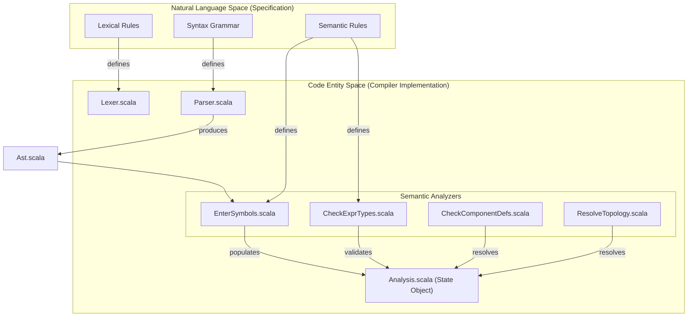
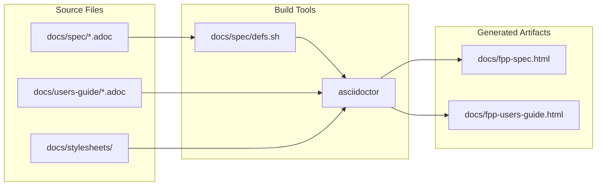

# Page: FPP Language Specification

# FPP Language Specification

Relevant source files

The following files were used as context for generating this wiki page:

- [compiler/lib/src/main/scala/analysis/Analyzers/InterfaceAnalyzer.scala](compiler/lib/src/main/scala/analysis/Analyzers/InterfaceAnalyzer.scala)
- [compiler/lib/src/main/scala/analysis/CheckSemantics/CheckFrameworkConstantValues.scala](compiler/lib/src/main/scala/analysis/CheckSemantics/CheckFrameworkConstantValues.scala)
- [compiler/tools/fpp-check/test/framework_defs/fw_opcode_type_not_alias_type.fpp](compiler/tools/fpp-check/test/framework_defs/fw_opcode_type_not_alias_type.fpp)
- [compiler/tools/fpp-check/test/framework_defs/fw_opcode_type_not_alias_type.ref.txt](compiler/tools/fpp-check/test/framework_defs/fw_opcode_type_not_alias_type.ref.txt)
- [compiler/tools/fpp-check/test/framework_defs/invalid_nonnegative_integer_constant.fpp](compiler/tools/fpp-check/test/framework_defs/invalid_nonnegative_integer_constant.fpp)
- [compiler/tools/fpp-check/test/framework_defs/invalid_nonnegative_integer_constant.ref](compiler/tools/fpp-check/test/framework_defs/invalid_nonnegative_integer_constant.ref)
- [compiler/tools/fpp-check/test/framework_defs/invalid_nonnegative_integer_constant.ref.txt](compiler/tools/fpp-check/test/framework_defs/invalid_nonnegative_integer_constant.ref.txt)
- [compiler/tools/fpp-check/test/framework_defs/invalid_positive_integer_constant.fpp](compiler/tools/fpp-check/test/framework_defs/invalid_positive_integer_constant.fpp)
- [compiler/tools/fpp-check/test/framework_defs/invalid_positive_integer_constant.ref.txt](compiler/tools/fpp-check/test/framework_defs/invalid_positive_integer_constant.ref.txt)
- [compiler/tools/fpp-check/test/framework_defs/invalid_string_size.fpp](compiler/tools/fpp-check/test/framework_defs/invalid_string_size.fpp)
- [compiler/tools/fpp-check/test/framework_defs/invalid_string_size.ref.txt](compiler/tools/fpp-check/test/framework_defs/invalid_string_size.ref.txt)
- [compiler/tools/fpp-check/test/framework_defs/tests.sh](compiler/tools/fpp-check/test/framework_defs/tests.sh)
- [docs/code-prettify/run_prettify.js](docs/code-prettify/run_prettify.js)
- [docs/code-prettify/run_prettify.original.js](docs/code-prettify/run_prettify.original.js)
- [docs/fpp-spec.html](docs/fpp-spec.html)
- [docs/fpp-users-guide.html](docs/fpp-users-guide.html)
- [docs/index.html](docs/index.html)
- [docs/spec/Analysis-and-Translation.adoc](docs/spec/Analysis-and-Translation.adoc)
- [docs/spec/Definitions-and-Uses.adoc](docs/spec/Definitions-and-Uses.adoc)
- [docs/spec/Definitions/Abstract-Type-Definitions.adoc](docs/spec/Definitions/Abstract-Type-Definitions.adoc)
- [docs/spec/Definitions/Alias-Type-Definitions.adoc](docs/spec/Definitions/Alias-Type-Definitions.adoc)
- [docs/spec/Definitions/Array-Definitions.adoc](docs/spec/Definitions/Array-Definitions.adoc)
- [docs/spec/Definitions/Component-Definitions.adoc](docs/spec/Definitions/Component-Definitions.adoc)
- [docs/spec/Definitions/Component-Instance-Definitions.adoc](docs/spec/Definitions/Component-Instance-Definitions.adoc)
- [docs/spec/Definitions/Constant-Definitions.adoc](docs/spec/Definitions/Constant-Definitions.adoc)
- [docs/spec/Definitions/Dictionary-Definitions.adoc](docs/spec/Definitions/Dictionary-Definitions.adoc)
- [docs/spec/Definitions/Enum-Definitions.adoc](docs/spec/Definitions/Enum-Definitions.adoc)
- [docs/spec/Definitions/Enumerated-Constant-Definitions.adoc](docs/spec/Definitions/Enumerated-Constant-Definitions.adoc)
- [docs/spec/Definitions/Framework-Definitions.adoc](docs/spec/Definitions/Framework-Definitions.adoc)
- [docs/spec/Definitions/Module-Definitions.adoc](docs/spec/Definitions/Module-Definitions.adoc)
- [docs/spec/Definitions/Port-Interface-Definitions.adoc](docs/spec/Definitions/Port-Interface-Definitions.adoc)
- [docs/spec/Definitions/State-Machine-Definitions.adoc](docs/spec/Definitions/State-Machine-Definitions.adoc)
- [docs/spec/Definitions/Struct-Definitions.adoc](docs/spec/Definitions/Struct-Definitions.adoc)
- [docs/spec/Definitions/Topology-Definitions.adoc](docs/spec/Definitions/Topology-Definitions.adoc)
- [docs/spec/Definitions/defs.sh](docs/spec/Definitions/defs.sh)
- [docs/spec/Element-Sequences.adoc](docs/spec/Element-Sequences.adoc)
- [docs/spec/Evaluation.adoc](docs/spec/Evaluation.adoc)
- [docs/spec/Instance-Member-Identifiers.adoc](docs/spec/Instance-Member-Identifiers.adoc)
- [docs/spec/Introduction.adoc](docs/spec/Introduction.adoc)
- [docs/spec/Lexical-Elements.adoc](docs/spec/Lexical-Elements.adoc)
- [docs/spec/Ports.adoc](docs/spec/Ports.adoc)
- [docs/spec/Scoping-of-Names.adoc](docs/spec/Scoping-of-Names.adoc)
- [docs/spec/Specifiers/Command-Specifiers.adoc](docs/spec/Specifiers/Command-Specifiers.adoc)
- [docs/spec/Specifiers/Connection-Graph-Specifiers.adoc](docs/spec/Specifiers/Connection-Graph-Specifiers.adoc)
- [docs/spec/Specifiers/Event-Specifiers.adoc](docs/spec/Specifiers/Event-Specifiers.adoc)
- [docs/spec/Specifiers/Include-Specifiers.adoc](docs/spec/Specifiers/Include-Specifiers.adoc)
- [docs/spec/Specifiers/Interface-Import-Specifiers.adoc](docs/spec/Specifiers/Interface-Import-Specifiers.adoc)
- [docs/spec/Specifiers/Location-Specifiers.adoc](docs/spec/Specifiers/Location-Specifiers.adoc)
- [docs/spec/Specifiers/Parameter-Specifiers.adoc](docs/spec/Specifiers/Parameter-Specifiers.adoc)
- [docs/spec/Specifiers/Port-Instance-Specifiers.adoc](docs/spec/Specifiers/Port-Instance-Specifiers.adoc)
- [docs/spec/Specifiers/Port-Interface-Instance-Specifiers.adoc](docs/spec/Specifiers/Port-Interface-Instance-Specifiers.adoc)
- [docs/spec/Specifiers/Telemetry-Channel-Specifiers.adoc](docs/spec/Specifiers/Telemetry-Channel-Specifiers.adoc)
- [docs/spec/Specifiers/Telemetry-Packet-Set-Specifiers.adoc](docs/spec/Specifiers/Telemetry-Packet-Set-Specifiers.adoc)
- [docs/spec/Specifiers/Telemetry-Packet-Specifiers.adoc](docs/spec/Specifiers/Telemetry-Packet-Specifiers.adoc)
- [docs/spec/Specifiers/Topology-Port-Instance-Specifiers.adoc](docs/spec/Specifiers/Topology-Port-Instance-Specifiers.adoc)
- [docs/spec/Specifiers/defs.sh](docs/spec/Specifiers/defs.sh)
- [docs/spec/State-Machine-Behavior-Elements/Action-Definitions.adoc](docs/spec/State-Machine-Behavior-Elements/Action-Definitions.adoc)
- [docs/spec/State-Machine-Behavior-Elements/Do-Expressions.adoc](docs/spec/State-Machine-Behavior-Elements/Do-Expressions.adoc)
- [docs/spec/State-Machine-Behavior-Elements/Guard-Definitions.adoc](docs/spec/State-Machine-Behavior-Elements/Guard-Definitions.adoc)
- [docs/spec/State-Machine-Behavior-Elements/Initial-Transition-Specifiers.adoc](docs/spec/State-Machine-Behavior-Elements/Initial-Transition-Specifiers.adoc)
- [docs/spec/State-Machine-Behavior-Elements/State-Definitions.adoc](docs/spec/State-Machine-Behavior-Elements/State-Definitions.adoc)
- [docs/spec/State-Machine-Behavior-Elements/State-Entry-Specifiers.adoc](docs/spec/State-Machine-Behavior-Elements/State-Entry-Specifiers.adoc)
- [docs/spec/State-Machine-Behavior-Elements/State-Exit-Specifiers.adoc](docs/spec/State-Machine-Behavior-Elements/State-Exit-Specifiers.adoc)
- [docs/spec/State-Machine-Behavior-Elements/State-Transition-Specifiers.adoc](docs/spec/State-Machine-Behavior-Elements/State-Transition-Specifiers.adoc)
- [docs/spec/State-Machine-Behavior-Elements/Transition-Expressions.adoc](docs/spec/State-Machine-Behavior-Elements/Transition-Expressions.adoc)
- [docs/spec/State-Machine-Behavior-Elements/defs.sh](docs/spec/State-Machine-Behavior-Elements/defs.sh)
- [docs/spec/Translation-Units-and-Models.adoc](docs/spec/Translation-Units-and-Models.adoc)
- [docs/spec/clean.do](docs/spec/clean.do)
- [docs/spec/code-prettify.do](docs/spec/code-prettify.do)
- [docs/spec/defs.sh](docs/spec/defs.sh)
- [docs/spec/fpp-spec.html.do](docs/spec/fpp-spec.html.do)
- [docs/users-guide/Analyzing-and-Translating-Models.adoc](docs/users-guide/Analyzing-and-Translating-Models.adoc)
- [docs/users-guide/Defining-Component-Instances.adoc](docs/users-guide/Defining-Component-Instances.adoc)
- [docs/users-guide/Defining-Components.adoc](docs/users-guide/Defining-Components.adoc)
- [docs/users-guide/Defining-Constants.adoc](docs/users-guide/Defining-Constants.adoc)
- [docs/users-guide/Defining-Enums.adoc](docs/users-guide/Defining-Enums.adoc)
- [docs/users-guide/Defining-Modules.adoc](docs/users-guide/Defining-Modules.adoc)
- [docs/users-guide/Defining-State-Machines.adoc](docs/users-guide/Defining-State-Machines.adoc)
- [docs/users-guide/Defining-Topologies.adoc](docs/users-guide/Defining-Topologies.adoc)
- [docs/users-guide/Defining-Types.adoc](docs/users-guide/Defining-Types.adoc)
- [docs/users-guide/Defining-and-Using-Port-Interfaces.adoc](docs/users-guide/Defining-and-Using-Port-Interfaces.adoc)
- [docs/users-guide/Installing-FPP.adoc](docs/users-guide/Installing-FPP.adoc)
- [docs/users-guide/Introduction.adoc](docs/users-guide/Introduction.adoc)
- [docs/users-guide/Writing-C-Plus-Plus-Implementations.adoc](docs/users-guide/Writing-C-Plus-Plus-Implementations.adoc)
- [docs/users-guide/Writing-Comments-and-Annotations.adoc](docs/users-guide/Writing-Comments-and-Annotations.adoc)
- [docs/users-guide/built-in.fpp](docs/users-guide/built-in.fpp)
- [docs/users-guide/defs.sh](docs/users-guide/defs.sh)
- [docs/users-guide/diagrams/state-machine/README.adoc](docs/users-guide/diagrams/state-machine/README.adoc)
- [editors/emacs/fpp-mode.el](editors/emacs/fpp-mode.el)
- [editors/vim/fpp.vim](editors/vim/fpp.vim)

The FPP Language Specification is the formal definition of the F Prime Prime (FPP) modeling language. It provides the rigorous syntax and semantics required for both users of the language and developers of the FPP compiler toolchain. While the User's Guide focuses on practical application, the Specification (located in `docs/spec/`) defines the ground truth for lexical elements, type checking, and translation rules.

## Specification Structure and Key Sections

The specification is organized into modular AsciiDoc files, which are later compiled into a single comprehensive HTML document. The structure follows the logical progression of language processing, from raw text to semantic analysis.

### 1. Lexical Elements
This section defines the basic building blocks of the language: identifiers, reserved words, literals (integer, floating-point, boolean, string), and comments/annotations. It establishes the rules for how the lexer [compiler/lib/src/main/scala/syntax/Lexer.scala:1-20]() identifies tokens.
*   **Identifiers:** Rules for valid names and the use of the `$` prefix to escape reserved words [docs/users-guide/Defining-Constants.adoc:72-117]().
*   **Sources:** `docs/spec/Lexical-Elements.adoc`, `compiler/lib/src/main/scala/syntax/Lexer.scala`.

### 2. Types and Type-Checking
FPP features a strong static type system. The specification defines primitive types (e.g., `U32`, `F64`, `bool`, `string`), aggregate types (Arrays, Structs), and specialized F Prime types (Ports, Components).
*   **Type Conversion:** Rules for implicit and explicit conversion between types [docs/spec/Definitions/Topology-Definitions.adoc:86-88]().
*   **Finalization:** The process of resolving named types to their underlying definitions.
*   **Sources:** `docs/users-guide/Defining-Types.adoc`, `docs/spec/Definitions/Array-Definitions.adoc`, `docs/spec/Definitions/Struct-Definitions.adoc`.

### 3. Expressions
Defines the syntax and evaluation rules for constant expressions, including arithmetic, logical operations, and literal values. This section is critical for the constant folding phase of the compiler.
*   **Sources:** `docs/users-guide/Defining-Constants.adoc:144-237]().

### 4. Definitions and Specifiers
The core of the language consists of definitions (Modules, Components, Topologies, Ports, State Machines) and specifiers (Commands, Events, Telemetry, Connections).
*   **Component Definitions:** Define the kind (`active`, `passive`, `queued`) and members [docs/spec/Definitions/Component-Definitions.adoc:1-21]().
*   **Topology Definitions:** Define the instances and connection graphs [docs/spec/Definitions/Topology-Definitions.adoc:1-25]().
*   **Sources:** `docs/spec/Definitions/`, `docs/spec/Specifiers/`.

### 5. State Machine Behavior Elements
Detailed semantics for hierarchical state machines, including states, signals, transitions, guards, and actions.
*   **Sources:** `docs/users-guide/Defining-State-Machines.adoc`, `docs/spec/State-Machine-Behavior-Elements/`.

## Data Flow: From Spec to Semantic Model

The following diagram illustrates how the formal rules defined in the Specification are implemented within the FPP compiler's semantic analysis phase.

**Diagram: Specification to Semantic Analysis Mapping**

**Sources:** [docs/spec/Introduction.adoc:1-10](), [compiler/lib/src/main/scala/analysis/Analysis.scala:1-50]().

## Building the HTML Specification

The specification is authored in AsciiDoc and converted to HTML using `asciidoctor`. The build process is managed by shell scripts located within the `docs/` directory.

### Build Steps
1.  **Environment Setup:** Ensure `asciidoctor` is installed in the system path.
2.  **Execution:** Run the `defs.sh` script within `docs/spec/` to generate local definitions, then run the main documentation build script.
3.  **Output:** The primary output is `docs/fpp-spec.html`.

**Diagram: Documentation Build Pipeline**

**Sources:** [docs/spec/defs.sh:1-10](), [docs/users-guide/defs.sh:1-10](), [docs/fpp-spec.html:1-10]().

## Analysis and Translation Rules

A key part of the specification is defining how FPP constructs map to target code (primarily C++).

| FPP Construct | Translation Rule | Target Artifact |
| :--- | :--- | :--- |
| `component` | Resolves ports, commands, and telemetry into a base class | `*ComponentAc.hpp/cpp` |
| `topology` | Flattens connections and assigns port numbers [docs/spec/Definitions/Topology-Definitions.adoc:3-12]() | `*TopologyAc.hpp/cpp` |
| `constant` | Evaluates expressions and folds values | `FppConstantsAc.hpp` |
| `state machine` | Translates hierarchy into a state pattern [docs/users-guide/Defining-State-Machines.adoc:72-92]() | `*StateMachineAc.hpp/cpp` |

**Sources:** [docs/spec/Definitions/Topology-Definitions.adoc:1-20](), [docs/users-guide/Analyzing-and-Translating-Models.adoc:190-215]().
