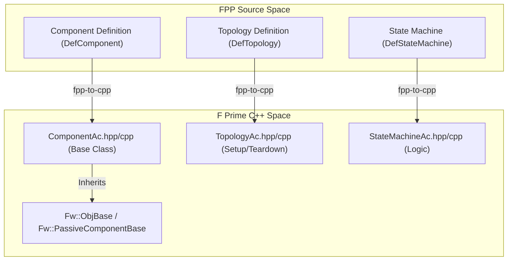
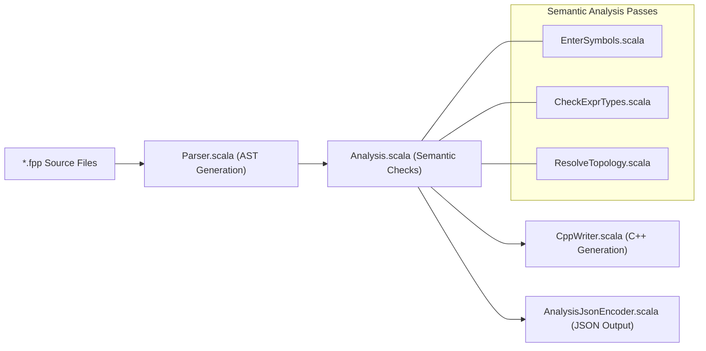

# Page: FPP Overview

# FPP Overview

Relevant source files

The following files were used as context for generating this wiki page:

- [.github/actions/build-native-images/action.yml](.github/actions/build-native-images/action.yml)
- [.github/actions/build-native-images/native-images](.github/actions/build-native-images/native-images)
- [.github/actions/native-tools-setup/action.yml](.github/actions/native-tools-setup/action.yml)
- [.github/actions/native-tools-setup/env-setup](.github/actions/native-tools-setup/env-setup)
- [.github/workflows/build-native.yml](.github/workflows/build-native.yml)
- [.github/workflows/build-test.yml](.github/workflows/build-test.yml)
- [.github/workflows/native-build.yml](.github/workflows/native-build.yml)
- [.github/workflows/publish](.github/workflows/publish)
- [README.adoc](README.adoc)
- [compiler/.jvmopts](compiler/.jvmopts)
- [compiler/README.adoc](compiler/README.adoc)
- [compiler/build.sbt](compiler/build.sbt)
- [compiler/fpp-sbt](compiler/fpp-sbt)
- [compiler/install](compiler/install)
- [compiler/install-trace](compiler/install-trace)
- [compiler/lib/src/main/resources/META-INF/native-image/jni-config.json](compiler/lib/src/main/resources/META-INF/native-image/jni-config.json)
- [compiler/lib/src/main/resources/META-INF/native-image/predefined-classes-config.json](compiler/lib/src/main/resources/META-INF/native-image/predefined-classes-config.json)
- [compiler/lib/src/main/resources/META-INF/native-image/proxy-config.json](compiler/lib/src/main/resources/META-INF/native-image/proxy-config.json)
- [compiler/lib/src/main/resources/META-INF/native-image/reflect-config.json](compiler/lib/src/main/resources/META-INF/native-image/reflect-config.json)
- [compiler/lib/src/main/resources/META-INF/native-image/resource-config.json](compiler/lib/src/main/resources/META-INF/native-image/resource-config.json)
- [compiler/lib/src/main/resources/META-INF/native-image/serialization-config.json](compiler/lib/src/main/resources/META-INF/native-image/serialization-config.json)
- [compiler/lib/src/main/scala/analysis/Semantics/ResolveTopology/ResolvePartiallyNumbered.scala](compiler/lib/src/main/scala/analysis/Semantics/ResolveTopology/ResolvePartiallyNumbered.scala)
- [compiler/lib/src/main/scala/analysis/Semantics/ResolveTopology/ResolveTopologyPortInterface.scala](compiler/lib/src/main/scala/analysis/Semantics/ResolveTopology/ResolveTopologyPortInterface.scala)
- [compiler/lib/src/main/scala/analysis/Semantics/TlmPacketSet.scala](compiler/lib/src/main/scala/analysis/Semantics/TlmPacketSet.scala)
- [compiler/lib/src/main/scala/analysis/Semantics/TopologyPort.scala](compiler/lib/src/main/scala/analysis/Semantics/TopologyPort.scala)
- [compiler/release](compiler/release)
- [compiler/tools.txt](compiler/tools.txt)
- [compiler/tools/fpp-check/test/top_ports/interface_instance_not_member.fpp](compiler/tools/fpp-check/test/top_ports/interface_instance_not_member.fpp)
- [compiler/tools/fpp-check/test/top_ports/interface_instance_not_member.ref.txt](compiler/tools/fpp-check/test/top_ports/interface_instance_not_member.ref.txt)
- [compiler/tools/fpp-check/test/top_ports/tests.sh](compiler/tools/fpp-check/test/top_ports/tests.sh)
- [compiler/trace-fprime](compiler/trace-fprime)
- [defs.sh](defs.sh)
- [docs/code-prettify/run_prettify.js](docs/code-prettify/run_prettify.js)
- [docs/fpp-spec.html](docs/fpp-spec.html)
- [docs/fpp-users-guide.html](docs/fpp-users-guide.html)
- [docs/index.html](docs/index.html)
- [docs/index/defs.sh](docs/index/defs.sh)
- [docs/index/index.adoc](docs/index/index.adoc)
- [docs/spec/Analysis-and-Translation.adoc](docs/spec/Analysis-and-Translation.adoc)
- [docs/spec/Definitions/Component-Definitions.adoc](docs/spec/Definitions/Component-Definitions.adoc)
- [docs/spec/Definitions/Component-Instance-Definitions.adoc](docs/spec/Definitions/Component-Instance-Definitions.adoc)
- [docs/spec/Definitions/Module-Definitions.adoc](docs/spec/Definitions/Module-Definitions.adoc)
- [docs/spec/Definitions/Topology-Definitions.adoc](docs/spec/Definitions/Topology-Definitions.adoc)
- [docs/spec/Definitions/defs.sh](docs/spec/Definitions/defs.sh)
- [docs/spec/Instance-Member-Identifiers.adoc](docs/spec/Instance-Member-Identifiers.adoc)
- [docs/spec/Introduction.adoc](docs/spec/Introduction.adoc)
- [docs/spec/Lexical-Elements.adoc](docs/spec/Lexical-Elements.adoc)
- [docs/spec/Ports.adoc](docs/spec/Ports.adoc)
- [docs/spec/Specifiers/Command-Specifiers.adoc](docs/spec/Specifiers/Command-Specifiers.adoc)
- [docs/spec/Specifiers/Connection-Graph-Specifiers.adoc](docs/spec/Specifiers/Connection-Graph-Specifiers.adoc)
- [docs/spec/Specifiers/Event-Specifiers.adoc](docs/spec/Specifiers/Event-Specifiers.adoc)
- [docs/spec/Specifiers/Parameter-Specifiers.adoc](docs/spec/Specifiers/Parameter-Specifiers.adoc)
- [docs/spec/Specifiers/Port-Interface-Instance-Specifiers.adoc](docs/spec/Specifiers/Port-Interface-Instance-Specifiers.adoc)
- [docs/spec/Specifiers/Telemetry-Channel-Specifiers.adoc](docs/spec/Specifiers/Telemetry-Channel-Specifiers.adoc)
- [docs/spec/Specifiers/Telemetry-Packet-Set-Specifiers.adoc](docs/spec/Specifiers/Telemetry-Packet-Set-Specifiers.adoc)
- [docs/spec/Specifiers/Topology-Port-Instance-Specifiers.adoc](docs/spec/Specifiers/Topology-Port-Instance-Specifiers.adoc)
- [docs/spec/Specifiers/defs.sh](docs/spec/Specifiers/defs.sh)
- [docs/spec/defs.sh](docs/spec/defs.sh)
- [docs/users-guide/Analyzing-and-Translating-Models.adoc](docs/users-guide/Analyzing-and-Translating-Models.adoc)
- [docs/users-guide/Defining-Component-Instances.adoc](docs/users-guide/Defining-Component-Instances.adoc)
- [docs/users-guide/Defining-Components.adoc](docs/users-guide/Defining-Components.adoc)
- [docs/users-guide/Defining-Constants.adoc](docs/users-guide/Defining-Constants.adoc)
- [docs/users-guide/Defining-Enums.adoc](docs/users-guide/Defining-Enums.adoc)
- [docs/users-guide/Defining-Modules.adoc](docs/users-guide/Defining-Modules.adoc)
- [docs/users-guide/Defining-Ports.adoc](docs/users-guide/Defining-Ports.adoc)
- [docs/users-guide/Defining-State-Machines.adoc](docs/users-guide/Defining-State-Machines.adoc)
- [docs/users-guide/Defining-Topologies.adoc](docs/users-guide/Defining-Topologies.adoc)
- [docs/users-guide/Defining-Types.adoc](docs/users-guide/Defining-Types.adoc)
- [docs/users-guide/Defining-and-Using-Port-Interfaces.adoc](docs/users-guide/Defining-and-Using-Port-Interfaces.adoc)
- [docs/users-guide/Installing-FPP.adoc](docs/users-guide/Installing-FPP.adoc)
- [docs/users-guide/Introduction.adoc](docs/users-guide/Introduction.adoc)
- [docs/users-guide/Writing-C-Plus-Plus-Implementations.adoc](docs/users-guide/Writing-C-Plus-Plus-Implementations.adoc)
- [docs/users-guide/Writing-Comments-and-Annotations.adoc](docs/users-guide/Writing-Comments-and-Annotations.adoc)
- [docs/users-guide/built-in.fpp](docs/users-guide/built-in.fpp)
- [docs/users-guide/defs.sh](docs/users-guide/defs.sh)
- [docs/users-guide/diagrams/state-machine/README.adoc](docs/users-guide/diagrams/state-machine/README.adoc)
- [editors/emacs/fpp-mode.el](editors/emacs/fpp-mode.el)
- [editors/vim/fpp.vim](editors/vim/fpp.vim)
- [pyproject.toml](pyproject.toml)
- [python/fprime_fpp/__init__.py](python/fprime_fpp/__init__.py)
- [python/fprime_fpp/__main__.py](python/fprime_fpp/__main__.py)
- [version.sh](version.sh)

F Prime Prime (FPP) is a modeling language and toolchain for the F Prime flight software framework. It provides a concise, high-level syntax for defining flight software architectures, including components, ports, topologies, and state machines, which are then translated into C++ code and other artifacts used by the F Prime ecosystem [docs/index.html:1-8]().

The FPP toolchain automates the generation of boilerplate code, allowing developers to focus on the functional logic of their components while ensuring architectural consistency across a deployment.

### System Context

FPP acts as a bridge between high-level architectural design and the low-level F Prime C++ implementation. It replaces or supplements the legacy XML-based modeling in F Prime with a more human-readable and maintainable textual representation.

The following diagram illustrates how FPP entities relate to the generated C++ code and the F Prime framework.

**FPP to C++ Mapping**

Sources: [docs/users-guide/Defining-Components.adoc:23-29](), [docs/users-guide/Defining-Topologies.adoc:3-13](), [docs/users-guide/Analyzing-and-Translating-Models.adoc:143-160]()

---

### Core Subsystems

The FPP project is divided into several major areas, ranging from the language specification to the compiler implementation and build infrastructure.

#### 1. Installation and Toolchain
The FPP toolchain can be installed either as a JVM-based application or as native binaries built via GraalVM. The primary installation entry point is the `install` script located in the `compiler/` directory. For developers using Python, FPP is also distributed as a wheel.
* For details, see [Getting Started: Installation and Toolchain Setup](#1.1).

Sources: [compiler/README.adoc:30-35](), [compiler/README.adoc:124-131]()

#### 2. Language Concepts
FPP models are built using several core constructs:
* **Components**: The basic units of FSW function (Active, Queued, Passive) [docs/users-guide/Defining-Components.adoc:11-19]().
* **Ports**: Interfaces for communication between components [docs/users-guide/Defining-Ports.adoc:3-9]().
* **Topologies**: The highest level of architecture, defining instances and their connections [docs/users-guide/Defining-Topologies.adoc:3-9]().
* **State Machines**: Hierarchical logic for managing system behavior [docs/users-guide/Defining-State-Machines.adoc:3-17]().
* **Constants and Types**: Primitive and aggregate data structures (Arrays, Structs, Enums) [docs/users-guide/Defining-Constants.adoc:3-10]().
* For details, see [FPP Language Concepts](#1.2).

#### 3. Command-Line Tools
The toolchain consists of several specialized utilities:
* `fpp-check`: Performs semantic analysis and validation [docs/users-guide/Analyzing-and-Translating-Models.adoc:15-21]().
* `fpp-to-cpp`: Generates F Prime C++ implementation files [docs/users-guide/Analyzing-and-Translating-Models.adoc:143-145]().
* `fpp-depend`: Computes dependencies between FPP files [docs/users-guide/Analyzing-and-Translating-Models.adoc:150-153]().
* `fpp-to-dict`: Generates JSON dictionaries for ground systems [compiler/README.adoc:59-59]().
* For details, see [Command-Line Tools Reference](#1.3).

---

### Compiler Pipeline

The FPP compiler follows a standard pipeline to transform source text into analyzed models and generated code. This pipeline is implemented in Scala and utilizes GraalVM for native image generation.

**Compiler Data Flow**

Sources: [compiler/lib/src/main/resources/META-INF/native-image/reflect-config.json:26-32](), [docs/users-guide/Analyzing-and-Translating-Models.adoc:49-61](), [docs/spec/Definitions/Topology-Definitions.adoc:52-70]()

### Build and CI/CD
The project uses `sbt` (Simple Build Tool) for its Scala codebase [compiler/README.adoc:7-9](). Native binaries are produced using the `release` script, which invokes GraalVM's `native-image` tool [compiler/README.adoc:125-131](). Continuous Integration is handled via GitHub Actions, which automates the building of native images for multiple platforms (macOS, Linux) and the packaging of Python wheels [.github/workflows/build-native.yml:1-22]().

Sources: [compiler/README.adoc:101-107](), [.github/workflows/build-native.yml:11-21]()
