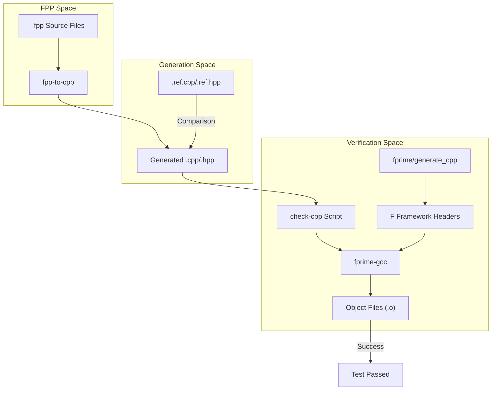
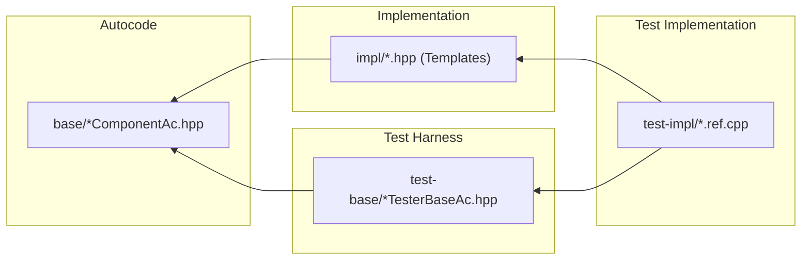

# Page: fpp-to-cpp Test Suite

# fpp-to-cpp Test Suite

Relevant source files

The following files were used as context for generating this wiki page:

- [compiler/lib/src/main/scala/codegen/CppWriter/TopologyCppWriter/TopTlmPacketIncludes.scala](compiler/lib/src/main/scala/codegen/CppWriter/TopologyCppWriter/TopTlmPacketIncludes.scala)
- [compiler/tools/fpp-to-cpp/test/.gitignore](compiler/tools/fpp-to-cpp/test/.gitignore)
- [compiler/tools/fpp-to-cpp/test/alias/AbsSerializableAc.ref.hpp](compiler/tools/fpp-to-cpp/test/alias/AbsSerializableAc.ref.hpp)
- [compiler/tools/fpp-to-cpp/test/alias/BasicSerializableAc.ref.hpp](compiler/tools/fpp-to-cpp/test/alias/BasicSerializableAc.ref.hpp)
- [compiler/tools/fpp-to-cpp/test/alias/NamespaceSerializableAc.ref.hpp](compiler/tools/fpp-to-cpp/test/alias/NamespaceSerializableAc.ref.hpp)
- [compiler/tools/fpp-to-cpp/test/array/SDefaultSerializableAc.ref.cpp](compiler/tools/fpp-to-cpp/test/array/SDefaultSerializableAc.ref.cpp)
- [compiler/tools/fpp-to-cpp/test/array/SDefaultSerializableAc.ref.hpp](compiler/tools/fpp-to-cpp/test/array/SDefaultSerializableAc.ref.hpp)
- [compiler/tools/fpp-to-cpp/test/array/SWrapperSerializableAc.ref.cpp](compiler/tools/fpp-to-cpp/test/array/SWrapperSerializableAc.ref.cpp)
- [compiler/tools/fpp-to-cpp/test/array/SWrapperSerializableAc.ref.hpp](compiler/tools/fpp-to-cpp/test/array/SWrapperSerializableAc.ref.hpp)
- [compiler/tools/fpp-to-cpp/test/array/Struct4ArrayAc.ref.cpp](compiler/tools/fpp-to-cpp/test/array/Struct4ArrayAc.ref.cpp)
- [compiler/tools/fpp-to-cpp/test/array/Struct4ArrayAc.ref.hpp](compiler/tools/fpp-to-cpp/test/array/Struct4ArrayAc.ref.hpp)
- [compiler/tools/fpp-to-cpp/test/array/check-cpp](compiler/tools/fpp-to-cpp/test/array/check-cpp)
- [compiler/tools/fpp-to-cpp/test/array/run.sh](compiler/tools/fpp-to-cpp/test/array/run.sh)
- [compiler/tools/fpp-to-cpp/test/array/struct.fpp](compiler/tools/fpp-to-cpp/test/array/struct.fpp)
- [compiler/tools/fpp-to-cpp/test/array/tests.sh](compiler/tools/fpp-to-cpp/test/array/tests.sh)
- [compiler/tools/fpp-to-cpp/test/array/update-ref.sh](compiler/tools/fpp-to-cpp/test/array/update-ref.sh)
- [compiler/tools/fpp-to-cpp/test/component/active.fpp](compiler/tools/fpp-to-cpp/test/component/active.fpp)
- [compiler/tools/fpp-to-cpp/test/component/base/StructWithAliasSerializableAc.ref.hpp](compiler/tools/fpp-to-cpp/test/component/base/StructWithAliasSerializableAc.ref.hpp)
- [compiler/tools/fpp-to-cpp/test/component/base/check-cpp](compiler/tools/fpp-to-cpp/test/component/base/check-cpp)
- [compiler/tools/fpp-to-cpp/test/component/base/run.sh](compiler/tools/fpp-to-cpp/test/component/base/run.sh)
- [compiler/tools/fpp-to-cpp/test/component/base/update-ref.sh](compiler/tools/fpp-to-cpp/test/component/base/update-ref.sh)
- [compiler/tools/fpp-to-cpp/test/component/clean](compiler/tools/fpp-to-cpp/test/component/clean)
- [compiler/tools/fpp-to-cpp/test/component/compile_base_cpp](compiler/tools/fpp-to-cpp/test/component/compile_base_cpp)
- [compiler/tools/fpp-to-cpp/test/component/gen_ref_headers](compiler/tools/fpp-to-cpp/test/component/gen_ref_headers)
- [compiler/tools/fpp-to-cpp/test/component/impl/ActiveExternalStateMachines.template.ref.cpp](compiler/tools/fpp-to-cpp/test/component/impl/ActiveExternalStateMachines.template.ref.cpp)
- [compiler/tools/fpp-to-cpp/test/component/impl/ActiveExternalStateMachines.template.ref.hpp](compiler/tools/fpp-to-cpp/test/component/impl/ActiveExternalStateMachines.template.ref.hpp)
- [compiler/tools/fpp-to-cpp/test/component/impl/check-cpp](compiler/tools/fpp-to-cpp/test/component/impl/check-cpp)
- [compiler/tools/fpp-to-cpp/test/component/impl/run.sh](compiler/tools/fpp-to-cpp/test/component/impl/run.sh)
- [compiler/tools/fpp-to-cpp/test/component/impl/update-ref.sh](compiler/tools/fpp-to-cpp/test/component/impl/update-ref.sh)
- [compiler/tools/fpp-to-cpp/test/component/passive.fpp](compiler/tools/fpp-to-cpp/test/component/passive.fpp)
- [compiler/tools/fpp-to-cpp/test/component/queued.fpp](compiler/tools/fpp-to-cpp/test/component/queued.fpp)
- [compiler/tools/fpp-to-cpp/test/component/test-base/.gitignore](compiler/tools/fpp-to-cpp/test/component/test-base/.gitignore)
- [compiler/tools/fpp-to-cpp/test/component/test-base/EmptyTesterHelpers.ref.cpp](compiler/tools/fpp-to-cpp/test/component/test-base/EmptyTesterHelpers.ref.cpp)
- [compiler/tools/fpp-to-cpp/test/component/test-base/check-cpp](compiler/tools/fpp-to-cpp/test/component/test-base/check-cpp)
- [compiler/tools/fpp-to-cpp/test/component/test-base/clean](compiler/tools/fpp-to-cpp/test/component/test-base/clean)
- [compiler/tools/fpp-to-cpp/test/component/test-impl/check-cpp](compiler/tools/fpp-to-cpp/test/component/test-impl/check-cpp)
- [compiler/tools/fpp-to-cpp/test/component/types.fpp](compiler/tools/fpp-to-cpp/test/component/types.fpp)
- [compiler/tools/fpp-to-cpp/test/constants/check-cpp](compiler/tools/fpp-to-cpp/test/constants/check-cpp)
- [compiler/tools/fpp-to-cpp/test/enum/check-cpp](compiler/tools/fpp-to-cpp/test/enum/check-cpp)
- [compiler/tools/fpp-to-cpp/test/fprime/Fw/Cmd/Cmd.fpp](compiler/tools/fpp-to-cpp/test/fprime/Fw/Cmd/Cmd.fpp)
- [compiler/tools/fpp-to-cpp/test/fprime/Fw/Log/Log.fpp](compiler/tools/fpp-to-cpp/test/fprime/Fw/Log/Log.fpp)
- [compiler/tools/fpp-to-cpp/test/fprime/Fw/Prm/Prm.fpp](compiler/tools/fpp-to-cpp/test/fprime/Fw/Prm/Prm.fpp)
- [compiler/tools/fpp-to-cpp/test/fprime/Fw/Time/Time.fpp](compiler/tools/fpp-to-cpp/test/fprime/Fw/Time/Time.fpp)
- [compiler/tools/fpp-to-cpp/test/fprime/Platform/PlatformTypes.fpp](compiler/tools/fpp-to-cpp/test/fprime/Platform/PlatformTypes.fpp)
- [compiler/tools/fpp-to-cpp/test/fprime/Platform/PlatformTypes.h](compiler/tools/fpp-to-cpp/test/fprime/Platform/PlatformTypes.h)
- [compiler/tools/fpp-to-cpp/test/fprime/config/FpConfig.fpp](compiler/tools/fpp-to-cpp/test/fprime/config/FpConfig.fpp)
- [compiler/tools/fpp-to-cpp/test/fprime/generate_cpp](compiler/tools/fpp-to-cpp/test/fprime/generate_cpp)
- [compiler/tools/fpp-to-cpp/test/port/check-cpp](compiler/tools/fpp-to-cpp/test/port/check-cpp)
- [compiler/tools/fpp-to-cpp/test/struct/AArrayAc.ref.cpp](compiler/tools/fpp-to-cpp/test/struct/AArrayAc.ref.cpp)
- [compiler/tools/fpp-to-cpp/test/struct/AliasTypeSerializableAc.ref.cpp](compiler/tools/fpp-to-cpp/test/struct/AliasTypeSerializableAc.ref.cpp)
- [compiler/tools/fpp-to-cpp/test/struct/AliasTypeSerializableAc.ref.hpp](compiler/tools/fpp-to-cpp/test/struct/AliasTypeSerializableAc.ref.hpp)
- [compiler/tools/fpp-to-cpp/test/struct/SAliasAliasAc.ref.hpp](compiler/tools/fpp-to-cpp/test/struct/SAliasAliasAc.ref.hpp)
- [compiler/tools/fpp-to-cpp/test/struct/SM_SSerializableAc.ref.cpp](compiler/tools/fpp-to-cpp/test/struct/SM_SSerializableAc.ref.cpp)
- [compiler/tools/fpp-to-cpp/test/struct/alias_type.fpp](compiler/tools/fpp-to-cpp/test/struct/alias_type.fpp)
- [compiler/tools/fpp-to-cpp/test/struct/check-cpp](compiler/tools/fpp-to-cpp/test/struct/check-cpp)
- [compiler/tools/fpp-to-cpp/test/struct/include.fpp](compiler/tools/fpp-to-cpp/test/struct/include.fpp)
- [compiler/tools/fpp-to-cpp/test/struct/include.ref.txt](compiler/tools/fpp-to-cpp/test/struct/include.ref.txt)
- [compiler/tools/fpp-to-cpp/test/struct/include/included.fppi](compiler/tools/fpp-to-cpp/test/struct/include/included.fppi)
- [compiler/tools/fpp-to-cpp/test/struct/modules.fpp](compiler/tools/fpp-to-cpp/test/struct/modules.fpp)
- [compiler/tools/fpp-to-cpp/test/struct/run.sh](compiler/tools/fpp-to-cpp/test/struct/run.sh)
- [compiler/tools/fpp-to-cpp/test/struct/state_machine.fpp](compiler/tools/fpp-to-cpp/test/struct/state_machine.fpp)
- [compiler/tools/fpp-to-cpp/test/struct/state_machine.ref.txt](compiler/tools/fpp-to-cpp/test/struct/state_machine.ref.txt)
- [compiler/tools/fpp-to-cpp/test/struct/tests.sh](compiler/tools/fpp-to-cpp/test/struct/tests.sh)
- [compiler/tools/fpp-to-cpp/test/struct/update-ref.sh](compiler/tools/fpp-to-cpp/test/struct/update-ref.sh)
- [compiler/tools/fpp-to-cpp/test/top/ports/components.fpp](compiler/tools/fpp-to-cpp/test/top/ports/components.fpp)
- [compiler/tools/fpp-to-cpp/test/top/ports/names.ref.txt](compiler/tools/fpp-to-cpp/test/top/ports/names.ref.txt)
- [compiler/tools/fpp-to-cpp/test/top/ports/topology.fpp](compiler/tools/fpp-to-cpp/test/top/ports/topology.fpp)
- [compiler/tools/fpp-to-cpp/test/top/ports/topology.ref.txt](compiler/tools/fpp-to-cpp/test/top/ports/topology.ref.txt)
- [compiler/tools/fpp-to-cpp/test/top/run.sh](compiler/tools/fpp-to-cpp/test/top/run.sh)
- [compiler/tools/fpp-to-cpp/test/top/tests.sh](compiler/tools/fpp-to-cpp/test/top/tests.sh)
- [compiler/tools/fpp-to-cpp/test/top/tlm_packets/NoInstances_P1TlmPacketsAc.ref.cpp](compiler/tools/fpp-to-cpp/test/top/tlm_packets/NoInstances_P1TlmPacketsAc.ref.cpp)
- [compiler/tools/fpp-to-cpp/test/top/tlm_packets/NoInstances_P2TlmPacketsAc.ref.cpp](compiler/tools/fpp-to-cpp/test/top/tlm_packets/NoInstances_P2TlmPacketsAc.ref.cpp)
- [compiler/tools/fpp-to-cpp/test/top/tlm_packets/OneInstance_P1TlmPacketsAc.ref.cpp](compiler/tools/fpp-to-cpp/test/top/tlm_packets/OneInstance_P1TlmPacketsAc.ref.cpp)
- [compiler/tools/fpp-to-cpp/test/top/tlm_packets/OneInstance_P2TlmPacketsAc.ref.cpp](compiler/tools/fpp-to-cpp/test/top/tlm_packets/OneInstance_P2TlmPacketsAc.ref.cpp)
- [compiler/tools/fpp-to-cpp/test/top/tlm_packets/OneInstance_P3TlmPacketsAc.ref.cpp](compiler/tools/fpp-to-cpp/test/top/tlm_packets/OneInstance_P3TlmPacketsAc.ref.cpp)
- [compiler/tools/fpp-to-cpp/test/top/tlm_packets/TwoInstances_P1TlmPacketsAc.ref.cpp](compiler/tools/fpp-to-cpp/test/top/tlm_packets/TwoInstances_P1TlmPacketsAc.ref.cpp)
- [compiler/tools/fpp-to-cpp/test/top/update-ref.sh](compiler/tools/fpp-to-cpp/test/top/update-ref.sh)
- [compiler/tools/fpp-to-cpp/test/update-ref](compiler/tools/fpp-to-cpp/test/update-ref)

The `fpp-to-cpp` test suite is a comprehensive integration testing framework designed to verify the correctness of C++ code generation. Unlike simple syntax or semantic checks, this suite validates that the generated C++ code is not only syntactically correct but also compiles against the F Prime framework and matches expected reference implementations.

## Overview and Purpose

The test suite ensures that every FPP construct—including components (active, passive, queued), topologies, state machines, and data types—translates into functional C++ that adheres to the F Prime component model. The suite uses a "reference comparison" pattern where generated files are compared against `.ref.cpp` and `.ref.hpp` files, followed by a compilation step to ensure framework compatibility.

### Test Categories
The suite is organized into directories corresponding to FPP features:
*   **Component**: Subdivided into `base` (base classes), `impl` (implementation templates), `test-base` (unit test harnesses), and `test-impl` (test implementation templates).
*   **Topology**: Verifies topology setup, connection patterns, and telemetry packet generation.
*   **Types**: Individual directories for `array`, `struct`, `enum`, and `port`.
*   **Behavioral**: Directories for `state-machine` and `constants`.

Sources: [compiler/tools/fpp-to-cpp/test/component/base/run.sh:1-114](), [compiler/tools/fpp-to-cpp/test/top/run.sh:1-151]()

## Compilation Verification Framework

A critical part of the suite is the `check-cpp` script found in most test directories. This script automates the verification of the generated C++ code by attempting to compile it using a cross-platform GCC wrapper.

### Key Helper Scripts
*   **`fprime-gcc`**: A script used to invoke the C++ compiler with standardized flags for the F Prime environment [compiler/tools/fpp-to-cpp/test/component/impl/check-cpp:5]().
*   **`compile_base_cpp`**: A shared helper that handles the heavy lifting of compiling component base classes with various F Prime guard configurations (e.g., `FW_SERIALIZABLE_TO_STRING`) [compiler/tools/fpp-to-cpp/test/component/base/check-cpp:16]().
*   **`generate_cpp`**: Located in the `fprime` directory, this script generates the core F Prime framework C++ files required as dependencies for the generated autocode [compiler/tools/fpp-to-cpp/test/fprime/generate_cpp:1-20]().

### The Compilation Workflow
The following diagram illustrates how the test suite moves from FPP source to verified C++ binaries.

**Figure 1: C++ Compilation Verification Flow**

Sources: [compiler/tools/fpp-to-cpp/test/component/impl/check-cpp:1-34](), [compiler/tools/fpp-to-cpp/test/component/test-base/check-cpp:1-47]()

## Component Integration Tests

The component tests are the most complex, covering the full lifecycle of F Prime components. They are split into distinct functional areas:

### 1. Component Base (`base`)
Tests the generation of `ComponentAc.hpp/cpp`. It covers various component configurations such as `ActiveTest` (active), `PassiveSerial` (passive with serial ports), and components with overflow behaviors [compiler/tools/fpp-to-cpp/test/component/active.fpp:4-51]().

### 2. Implementation Templates (`impl`)
Verifies the `-t` flag of `fpp-to-cpp`, which generates user implementation templates. The `check-cpp` script in this directory copies generated base class headers to ensure the templates can compile [compiler/tools/fpp-to-cpp/test/component/impl/check-cpp:18-20]().

### 3. Unit Test Harnesses (`test-base` and `test-impl`)
Verifies the generation of GTest-based harnesses. The `check-cpp` script for `test-impl` is particularly rigorous, as it must coordinate headers from `base`, `impl`, and `test-base` to create a valid compilation unit [compiler/tools/fpp-to-cpp/test/component/test-impl/check-cpp:24-38]().

**Figure 2: Component Test Dependency Graph**

Sources: [compiler/tools/fpp-to-cpp/test/component/test-impl/check-cpp:11-19](), [compiler/tools/fpp-to-cpp/test/component/test-base/check-cpp:33-43]()

## Topology and Type Tests

### Topology Tests
Topology tests verify the `TopologyAc.cpp` generation, including port connections and telemetry packet groups. The `run.sh` script in the `top` directory executes tests for various scenarios:
*   **Basic**: Standard component instances and connections [compiler/tools/fpp-to-cpp/test/top/run.sh:1-10]().
*   **Telemetry Packets**: Verifies `TlmPacketsAc.cpp` generation for different instance counts [compiler/tools/fpp-to-cpp/test/top/run.sh:104-120]().
*   **Nested Namespaces**: Ensures topology setup functions are correctly scoped [compiler/tools/fpp-to-cpp/test/top/run.sh:52-60]().

### Type Tests (Array, Struct, Enum)
These tests ensure that FPP types are correctly translated into C++ classes inheriting from `Fw::Serializable`.
For example, the `struct` tests verify:
*   Standard member serialization [compiler/tools/fpp-to-cpp/test/struct/AliasTypeSerializableAc.ref.cpp:137-161]().
*   External string buffer management within structs [compiler/tools/fpp-to-cpp/test/struct/AliasTypeSerializableAc.ref.cpp:20-25]().
*   Alias type support (e.g., `U16Alias`, `TAlias`) [compiler/tools/fpp-to-cpp/test/struct/AliasTypeSerializableAc.ref.cpp:28-36]().

Sources: [compiler/tools/fpp-to-cpp/test/struct/AliasTypeSerializableAc.ref.cpp:1-278](), [compiler/tools/fpp-to-cpp/test/top/update-ref.sh:1-123]()

## Reference Update Workflow

When the code generator is updated, the reference files must be updated. This is handled by `update-ref.sh` scripts in each directory.

1.  **Run `fpp-to-cpp`**: Generates new C++ files.
2.  **Move to Reference**: Uses helper functions like `move_cpp` or `move_template` to rename the output to `.ref.cpp` [compiler/tools/fpp-to-cpp/test/component/base/update-ref.sh:11-30]().
3.  **Validate**: The developer then runs `check-cpp` to ensure the new references are valid.

Sources: [compiler/tools/fpp-to-cpp/test/component/base/update-ref.sh:1-114](), [compiler/tools/fpp-to-cpp/test/component/impl/update-ref.sh:1-87]()
