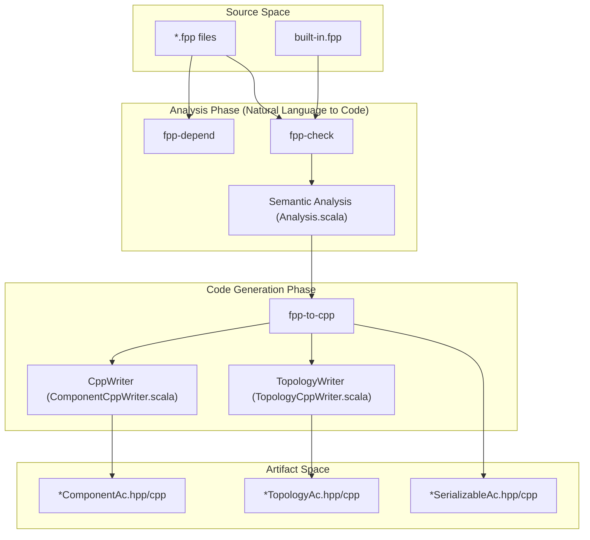
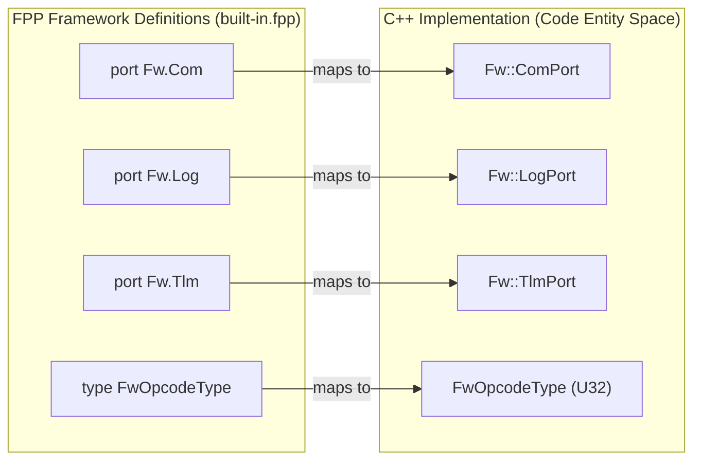

# Page: FPP User's Guide

# FPP User's Guide

Relevant source files

The following files were used as context for generating this wiki page:

- [compiler/lib/src/main/scala/analysis/ComputeDependencies/AddDependencies.scala](compiler/lib/src/main/scala/analysis/ComputeDependencies/AddDependencies.scala)
- [compiler/lib/src/main/scala/analysis/Semantics/Container.scala](compiler/lib/src/main/scala/analysis/Semantics/Container.scala)
- [compiler/lib/src/main/scala/analysis/Semantics/Record.scala](compiler/lib/src/main/scala/analysis/Semantics/Record.scala)
- [compiler/tools/fpp-check/test/container/clean](compiler/tools/fpp-check/test/container/clean)
- [compiler/tools/fpp-check/test/container/ok.fpp](compiler/tools/fpp-check/test/container/ok.fpp)
- [compiler/tools/fpp-check/test/container/ok.ref.txt](compiler/tools/fpp-check/test/container/ok.ref.txt)
- [compiler/tools/fpp-check/test/container/run](compiler/tools/fpp-check/test/container/run)
- [compiler/tools/fpp-check/test/container/update-ref](compiler/tools/fpp-check/test/container/update-ref)
- [compiler/tools/fpp-check/test/record/clean](compiler/tools/fpp-check/test/record/clean)
- [compiler/tools/fpp-check/test/record/duplicate_id_explicit.fpp](compiler/tools/fpp-check/test/record/duplicate_id_explicit.fpp)
- [compiler/tools/fpp-check/test/record/duplicate_id_implicit.fpp](compiler/tools/fpp-check/test/record/duplicate_id_implicit.fpp)
- [compiler/tools/fpp-check/test/record/duplicate_name.fpp](compiler/tools/fpp-check/test/record/duplicate_name.fpp)
- [compiler/tools/fpp-check/test/record/id_negative.fpp](compiler/tools/fpp-check/test/record/id_negative.fpp)
- [compiler/tools/fpp-check/test/record/id_not_numeric.fpp](compiler/tools/fpp-check/test/record/id_not_numeric.fpp)
- [compiler/tools/fpp-check/test/record/missing_ports.fpp](compiler/tools/fpp-check/test/record/missing_ports.fpp)
- [compiler/tools/fpp-check/test/record/not_displayable.fpp](compiler/tools/fpp-check/test/record/not_displayable.fpp)
- [compiler/tools/fpp-check/test/record/not_displayable.ref.txt](compiler/tools/fpp-check/test/record/not_displayable.ref.txt)
- [compiler/tools/fpp-check/test/record/ok.fpp](compiler/tools/fpp-check/test/record/ok.fpp)
- [compiler/tools/fpp-check/test/record/tests.sh](compiler/tools/fpp-check/test/record/tests.sh)
- [compiler/tools/fpp-depend/test/def_alias.fpp](compiler/tools/fpp-depend/test/def_alias.fpp)
- [compiler/tools/fpp-depend/test/def_alias.ref.txt](compiler/tools/fpp-depend/test/def_alias.ref.txt)
- [compiler/tools/fpp-depend/test/def_array.fpp](compiler/tools/fpp-depend/test/def_array.fpp)
- [compiler/tools/fpp-depend/test/def_array.ref.txt](compiler/tools/fpp-depend/test/def_array.ref.txt)
- [compiler/tools/fpp-depend/test/def_constant.fpp](compiler/tools/fpp-depend/test/def_constant.fpp)
- [compiler/tools/fpp-depend/test/def_constant.ref.txt](compiler/tools/fpp-depend/test/def_constant.ref.txt)
- [compiler/tools/fpp-depend/test/def_enum.fpp](compiler/tools/fpp-depend/test/def_enum.fpp)
- [compiler/tools/fpp-depend/test/def_enum.ref.txt](compiler/tools/fpp-depend/test/def_enum.ref.txt)
- [compiler/tools/fpp-depend/test/def_struct.ref.txt](compiler/tools/fpp-depend/test/def_struct.ref.txt)
- [compiler/tools/fpp-depend/test/dictionary.fpp](compiler/tools/fpp-depend/test/dictionary.fpp)
- [compiler/tools/fpp-depend/test/dictionary.ref.txt](compiler/tools/fpp-depend/test/dictionary.ref.txt)
- [compiler/tools/fpp-depend/test/dictionary_T2.fpp](compiler/tools/fpp-depend/test/dictionary_T2.fpp)
- [compiler/tools/fpp-depend/test/dictionary_no_top.fpp](compiler/tools/fpp-depend/test/dictionary_no_top.fpp)
- [compiler/tools/fpp-depend/test/dictionary_no_top.ref.txt](compiler/tools/fpp-depend/test/dictionary_no_top.ref.txt)
- [compiler/tools/fpp-depend/test/enum_constant.ref.txt](compiler/tools/fpp-depend/test/enum_constant.ref.txt)
- [compiler/tools/fpp-depend/test/locate_constant_modules_1.fpp](compiler/tools/fpp-depend/test/locate_constant_modules_1.fpp)
- [compiler/tools/fpp-depend/test/locate_constant_modules_1.ref.txt](compiler/tools/fpp-depend/test/locate_constant_modules_1.ref.txt)
- [compiler/tools/fpp-depend/test/locate_constant_modules_2.fpp](compiler/tools/fpp-depend/test/locate_constant_modules_2.fpp)
- [compiler/tools/fpp-depend/test/locate_constant_modules_2.ref.txt](compiler/tools/fpp-depend/test/locate_constant_modules_2.ref.txt)
- [docs/code-prettify/run_prettify.js](docs/code-prettify/run_prettify.js)
- [docs/fpp-spec.html](docs/fpp-spec.html)
- [docs/fpp-users-guide.html](docs/fpp-users-guide.html)
- [docs/index.html](docs/index.html)
- [docs/spec/Analysis-and-Translation.adoc](docs/spec/Analysis-and-Translation.adoc)
- [docs/spec/Definitions/Component-Definitions.adoc](docs/spec/Definitions/Component-Definitions.adoc)
- [docs/spec/Definitions/Component-Instance-Definitions.adoc](docs/spec/Definitions/Component-Instance-Definitions.adoc)
- [docs/spec/Definitions/Module-Definitions.adoc](docs/spec/Definitions/Module-Definitions.adoc)
- [docs/spec/Definitions/Topology-Definitions.adoc](docs/spec/Definitions/Topology-Definitions.adoc)
- [docs/spec/Definitions/defs.sh](docs/spec/Definitions/defs.sh)
- [docs/spec/Instance-Member-Identifiers.adoc](docs/spec/Instance-Member-Identifiers.adoc)
- [docs/spec/Introduction.adoc](docs/spec/Introduction.adoc)
- [docs/spec/Lexical-Elements.adoc](docs/spec/Lexical-Elements.adoc)
- [docs/spec/Ports.adoc](docs/spec/Ports.adoc)
- [docs/spec/Specifiers/Command-Specifiers.adoc](docs/spec/Specifiers/Command-Specifiers.adoc)
- [docs/spec/Specifiers/Connection-Graph-Specifiers.adoc](docs/spec/Specifiers/Connection-Graph-Specifiers.adoc)
- [docs/spec/Specifiers/Container-Specifiers.adoc](docs/spec/Specifiers/Container-Specifiers.adoc)
- [docs/spec/Specifiers/Event-Specifiers.adoc](docs/spec/Specifiers/Event-Specifiers.adoc)
- [docs/spec/Specifiers/Parameter-Specifiers.adoc](docs/spec/Specifiers/Parameter-Specifiers.adoc)
- [docs/spec/Specifiers/Port-Interface-Instance-Specifiers.adoc](docs/spec/Specifiers/Port-Interface-Instance-Specifiers.adoc)
- [docs/spec/Specifiers/Record-Specifiers.adoc](docs/spec/Specifiers/Record-Specifiers.adoc)
- [docs/spec/Specifiers/Telemetry-Channel-Specifiers.adoc](docs/spec/Specifiers/Telemetry-Channel-Specifiers.adoc)
- [docs/spec/Specifiers/Telemetry-Packet-Set-Specifiers.adoc](docs/spec/Specifiers/Telemetry-Packet-Set-Specifiers.adoc)
- [docs/spec/Specifiers/Topology-Port-Instance-Specifiers.adoc](docs/spec/Specifiers/Topology-Port-Instance-Specifiers.adoc)
- [docs/spec/Specifiers/defs.sh](docs/spec/Specifiers/defs.sh)
- [docs/spec/defs.sh](docs/spec/defs.sh)
- [docs/users-guide/Analyzing-and-Translating-Models.adoc](docs/users-guide/Analyzing-and-Translating-Models.adoc)
- [docs/users-guide/Defining-Component-Instances.adoc](docs/users-guide/Defining-Component-Instances.adoc)
- [docs/users-guide/Defining-Components.adoc](docs/users-guide/Defining-Components.adoc)
- [docs/users-guide/Defining-Constants.adoc](docs/users-guide/Defining-Constants.adoc)
- [docs/users-guide/Defining-Enums.adoc](docs/users-guide/Defining-Enums.adoc)
- [docs/users-guide/Defining-Modules.adoc](docs/users-guide/Defining-Modules.adoc)
- [docs/users-guide/Defining-State-Machines.adoc](docs/users-guide/Defining-State-Machines.adoc)
- [docs/users-guide/Defining-Topologies.adoc](docs/users-guide/Defining-Topologies.adoc)
- [docs/users-guide/Defining-Types.adoc](docs/users-guide/Defining-Types.adoc)
- [docs/users-guide/Defining-and-Using-Port-Interfaces.adoc](docs/users-guide/Defining-and-Using-Port-Interfaces.adoc)
- [docs/users-guide/Dictionary-Definitions.adoc](docs/users-guide/Dictionary-Definitions.adoc)
- [docs/users-guide/Installing-FPP.adoc](docs/users-guide/Installing-FPP.adoc)
- [docs/users-guide/Introduction.adoc](docs/users-guide/Introduction.adoc)
- [docs/users-guide/Specifying-Models-as-Files.adoc](docs/users-guide/Specifying-Models-as-Files.adoc)
- [docs/users-guide/Writing-C-Plus-Plus-Implementations.adoc](docs/users-guide/Writing-C-Plus-Plus-Implementations.adoc)
- [docs/users-guide/Writing-Comments-and-Annotations.adoc](docs/users-guide/Writing-Comments-and-Annotations.adoc)
- [docs/users-guide/built-in.fpp](docs/users-guide/built-in.fpp)
- [docs/users-guide/defs.sh](docs/users-guide/defs.sh)
- [docs/users-guide/diagrams/state-machine/README.adoc](docs/users-guide/diagrams/state-machine/README.adoc)
- [editors/emacs/fpp-mode.el](editors/emacs/fpp-mode.el)
- [editors/vim/fpp.vim](editors/vim/fpp.vim)

The FPP User's Guide provides a comprehensive manual for using the F Prime Prime (FPP) modeling language and its associated toolchain. It bridges the gap between the formal language specification and practical flight software (FSW) development within the F Prime ecosystem.

## 1. Documentation Structure and Scope

The user-facing documentation is organized into chapters that guide a developer from installation to C++ implementation.

| Chapter | Purpose |
| --- | --- |
| **Installing FPP** | Setup via JVM, native binaries, or Python wheels. |
| **Defining Types** | Syntax for Arrays, Enums, Structs, and Constants. |
| **Defining Ports/Components** | Modeling the functional units and communication interfaces. |
| **Defining Topologies** | Connecting component instances into a system. |
| **State Machines** | Modeling complex behavior with hierarchical state machines. |
| **Analyzing and Translating** | Using tools like `fpp-check` and `fpp-to-cpp`. |
| **Writing C++ Implementations** | Manual coding requirements for generated base classes. |

Sources: [docs/fpp-users-guide.html:1-100](), [docs/users-guide/Introduction.adoc:1-20]()

## 2. Core Modeling Concepts

### 2.1 Component Definitions
In FPP, the component is the basic unit of FSW function, analogous to a class in object-oriented programming [docs/users-guide/Defining-Components.adoc:3-4](). Components are categorized into three kinds:
*   **Active**: Has its own thread and message queue [docs/users-guide/Defining-Components.adoc:13-14]().
*   **Queued**: Has a message queue but relies on an external thread for execution [docs/users-guide/Defining-Components.adoc:15-17]().
*   **Passive**: No thread or queue; executes in the caller's context [docs/users-guide/Defining-Components.adoc:18-19]().

### 2.2 Ports and Topologies
Components communicate via **Ports**. A **Topology** defines the set of component instances and the connections between their ports [docs/users-guide/Defining-Topologies.adoc:3-9]().

### 2.3 State Machines
FPP supports both **Internal** state machines (behavior specified in FPP for code generation) and **External** state machines (only the interface is defined in FPP) [docs/users-guide/Defining-State-Machines.adoc:20-32]().

## 3. Toolchain Data Flow

The following diagram illustrates the flow from FPP source files to generated C++ artifacts, mapping natural language concepts to the specific tools and code entities involved.

**FPP Translation Pipeline**

Sources: [docs/users-guide/Analyzing-and-Translating-Models.adoc:11-160](), [docs/fpp-users-guide.html:150-250]()

## 4. Analysis and Translation

### 4.1 Model Checking (`fpp-check`)
The `fpp-check` tool performs semantic validation. It ensures that all symbols are defined, types match, and connections in topologies are valid [docs/users-guide/Analyzing-and-Translating-Models.adoc:11-30](). It can also identify unconnected ports using the `-u` flag [docs/users-guide/Analyzing-and-Translating-Models.adoc:81-85]().

### 4.2 C++ Generation (`fpp-to-cpp`)
`fpp-to-cpp` translates FPP definitions into F Prime C++ framework classes.

| FPP Definition | Generated C++ Entity | File Pattern |
| --- | --- | --- |
| `component` | `Fw::PassiveComponentBase` (or Active/Queued) | `*ComponentAc.hpp` |
| `port` | `Fw::PortBase` | `*PortAc.hpp` |
| `struct` | `Fw::Serializable` | `*SerializableAc.hpp` |
| `topology` | Topology Setup Functions | `*TopologyAc.hpp` |

Sources: [docs/users-guide/Analyzing-and-Translating-Models.adoc:139-215](), [docs/spec/Definitions/Component-Definitions.adoc:1-50]()

## 5. The Framework Built-ins (`built-in.fpp`)

The FPP compiler relies on a set of predefined types and ports located in `built-in.fpp`. These definitions provide the standard interface for the F Prime framework services.

**Framework Entity Mapping**

Sources: [docs/users-guide/built-in.fpp:1-50](), [docs/spec/Definitions/Component-Definitions.adoc:113-137]()

## 6. Implementation Requirements

When FPP generates code, it creates "Autocode" (Ac) base classes. The user is responsible for:
1.  **Component Implementation**: Inheriting from the generated base class and implementing virtual handlers [docs/users-guide/Writing-C-Plus-Plus-Implementations.adoc:23-26]().
2.  **Abstract Types**: Providing header files (e.g., `T.hpp`) for types declared as `type T` in FPP [docs/users-guide/Writing-C-Plus-Plus-Implementations.adoc:34-43]().
3.  **Deployment**: Writing the `main.cpp` that instantiates the topology and starts active component threads [docs/users-guide/Writing-C-Plus-Plus-Implementations.adoc:198-210]().

Sources: [docs/users-guide/Writing-C-Plus-Plus-Implementations.adoc:1-33](), [docs/users-guide/Defining-Components.adoc:143-148]()
