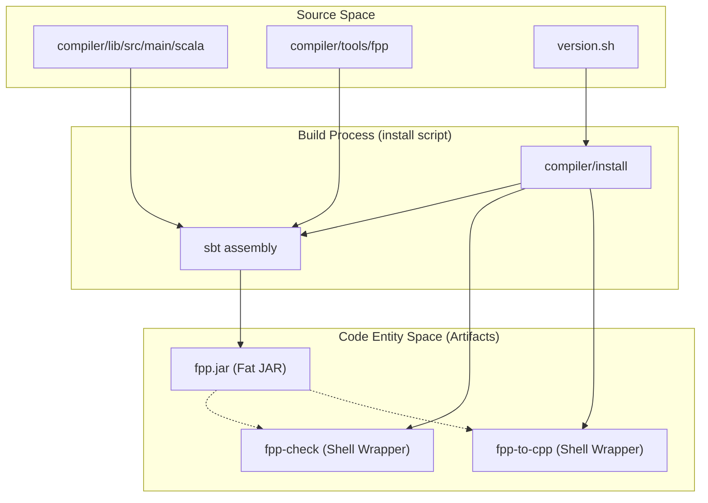
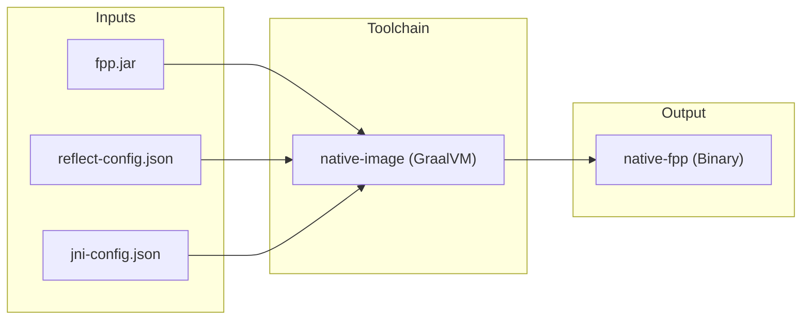

# Page: Getting Started: Installation and Toolchain Setup

# Getting Started: Installation and Toolchain Setup

Relevant source files

The following files were used as context for generating this wiki page:

- [.github/actions/build-native-images/action.yml](.github/actions/build-native-images/action.yml)
- [.github/actions/build-native-images/native-images](.github/actions/build-native-images/native-images)
- [.github/actions/native-tools-setup/action.yml](.github/actions/native-tools-setup/action.yml)
- [.github/actions/native-tools-setup/env-setup](.github/actions/native-tools-setup/env-setup)
- [.github/workflows/build-native.yml](.github/workflows/build-native.yml)
- [.github/workflows/build-test.yml](.github/workflows/build-test.yml)
- [.github/workflows/native-build.yml](.github/workflows/native-build.yml)
- [.github/workflows/publish](.github/workflows/publish)
- [README.adoc](README.adoc)
- [compiler/.jvmopts](compiler/.jvmopts)
- [compiler/README.adoc](compiler/README.adoc)
- [compiler/build.sbt](compiler/build.sbt)
- [compiler/fpp-sbt](compiler/fpp-sbt)
- [compiler/install](compiler/install)
- [compiler/install-trace](compiler/install-trace)
- [compiler/lib/src/main/resources/META-INF/native-image/jni-config.json](compiler/lib/src/main/resources/META-INF/native-image/jni-config.json)
- [compiler/lib/src/main/resources/META-INF/native-image/predefined-classes-config.json](compiler/lib/src/main/resources/META-INF/native-image/predefined-classes-config.json)
- [compiler/lib/src/main/resources/META-INF/native-image/proxy-config.json](compiler/lib/src/main/resources/META-INF/native-image/proxy-config.json)
- [compiler/lib/src/main/resources/META-INF/native-image/reflect-config.json](compiler/lib/src/main/resources/META-INF/native-image/reflect-config.json)
- [compiler/lib/src/main/resources/META-INF/native-image/resource-config.json](compiler/lib/src/main/resources/META-INF/native-image/resource-config.json)
- [compiler/lib/src/main/resources/META-INF/native-image/serialization-config.json](compiler/lib/src/main/resources/META-INF/native-image/serialization-config.json)
- [compiler/lib/src/main/scala/analysis/Semantics/ResolveTopology/ResolvePartiallyNumbered.scala](compiler/lib/src/main/scala/analysis/Semantics/ResolveTopology/ResolvePartiallyNumbered.scala)
- [compiler/lib/src/main/scala/analysis/Semantics/ResolveTopology/ResolveTopologyPortInterface.scala](compiler/lib/src/main/scala/analysis/Semantics/ResolveTopology/ResolveTopologyPortInterface.scala)
- [compiler/lib/src/main/scala/analysis/Semantics/TlmPacketSet.scala](compiler/lib/src/main/scala/analysis/Semantics/TlmPacketSet.scala)
- [compiler/lib/src/main/scala/analysis/Semantics/TopologyPort.scala](compiler/lib/src/main/scala/analysis/Semantics/TopologyPort.scala)
- [compiler/lib/src/main/scala/syntax/ParserState.scala](compiler/lib/src/main/scala/syntax/ParserState.scala)
- [compiler/lib/src/main/scala/util/File.scala](compiler/lib/src/main/scala/util/File.scala)
- [compiler/lib/src/main/scala/util/Location.scala](compiler/lib/src/main/scala/util/Location.scala)
- [compiler/lib/src/main/scala/util/Result.scala](compiler/lib/src/main/scala/util/Result.scala)
- [compiler/release](compiler/release)
- [compiler/tools.txt](compiler/tools.txt)
- [compiler/tools/fpp-check/test/top_ports/interface_instance_not_member.fpp](compiler/tools/fpp-check/test/top_ports/interface_instance_not_member.fpp)
- [compiler/tools/fpp-check/test/top_ports/interface_instance_not_member.ref.txt](compiler/tools/fpp-check/test/top_ports/interface_instance_not_member.ref.txt)
- [compiler/tools/fpp-check/test/top_ports/tests.sh](compiler/tools/fpp-check/test/top_ports/tests.sh)
- [compiler/tools/fpp-to-dict/test/scripts/run.sh](compiler/tools/fpp-to-dict/test/scripts/run.sh)
- [compiler/tools/fpp-to-dict/test/scripts/update-ref.sh](compiler/tools/fpp-to-dict/test/scripts/update-ref.sh)
- [compiler/tools/fpp-to-dict/test/top/dataProducts.ref.txt](compiler/tools/fpp-to-dict/test/top/dataProducts.ref.txt)
- [compiler/tools/fpp-to-dict/test/top/duplicate.fpp](compiler/tools/fpp-to-dict/test/top/duplicate.fpp)
- [compiler/tools/fpp-to-dict/test/top/duplicate.ref.txt](compiler/tools/fpp-to-dict/test/top/duplicate.ref.txt)
- [compiler/tools/fpp-to-dict/test/top/multipleTops.ref.txt](compiler/tools/fpp-to-dict/test/top/multipleTops.ref.txt)
- [compiler/tools/fpp-to-dict/test/top/unqualifiedComponentInstances.ref.txt](compiler/tools/fpp-to-dict/test/top/unqualifiedComponentInstances.ref.txt)
- [compiler/trace-fprime](compiler/trace-fprime)
- [defs.sh](defs.sh)
- [docs/index/defs.sh](docs/index/defs.sh)
- [docs/index/index.adoc](docs/index/index.adoc)
- [docs/users-guide/Defining-Ports.adoc](docs/users-guide/Defining-Ports.adoc)
- [pyproject.toml](pyproject.toml)
- [python/fprime_fpp/__init__.py](python/fprime_fpp/__init__.py)
- [python/fprime_fpp/__main__.py](python/fprime_fpp/__main__.py)
- [version.sh](version.sh)

This page provides a technical guide for installing and configuring the FPP (F Prime Prime) toolchain. It covers two primary installation paths: the **JVM-based installation** (using Scala/SBT) for development and the **Native Binary installation** (using GraalVM) for high-performance execution and CI/CD environments. It also describes the Python-based distribution used within the F Prime ecosystem.

## 1. Prerequisites and Environment

FPP requires a Unix-like environment (Linux, macOS, or WSL) and specific Java dependencies for source-based builds.

*   **JDK 11**: The toolchain is optimized for Java Development Kit version 11 [compiler/README.adoc:9-9]().
*   **SBT**: The Simple Build Tool is required to compile the Scala source code [compiler/README.adoc:7-7]().
*   **Environment Variables**:
    *   `FPP_JAVA_HOME`: Points to the JDK 11 installation directory if it is not the system default [compiler/README.adoc:21-22]().
    *   `FPP_SBT_FLAGS`: Optional flags for the SBT build process (e.g., `--batch` for Docker) [compiler/README.adoc:70-71]().
    *   `FPP_INSTALL_DIR`: The destination directory for the compiled tools [compiler/README.adoc:42-43]().

**Sources:** [compiler/README.adoc:3-29](), [compiler/README.adoc:64-77]()

---

## 2. JVM Installation Path (Source Build)

The JVM installation compiles the Scala source code into a fat JAR (`fpp.jar`) and generates shell script wrappers for each tool.

### 2.1. Implementation of the Install Process
The `compiler/install` script orchestrates the build. It performs the following steps:
1.  **Version Injection**: Reads version info from `version.sh` and updates `fpp.compiler.util.Version.scala` [compiler/install:39-73]().
2.  **Assembly**: Invokes `sbt assembly` to create a single executable JAR file [compiler/install:75-78]().
3.  **Wrapper Generation**: Creates shell scripts (e.g., `fpp-check`, `fpp-to-cpp`) that execute `java -jar fpp.jar <tool-name> "$@"` [compiler/install:90-100]().

### Data Flow: Source to JVM Executable
The following diagram maps the installation script logic to the resulting filesystem entities.

**Diagram: JVM Installation Logic**

**Sources:** [compiler/install:1-101](), [compiler/build.sbt:28-42](), [version.sh:5-5]()

---

## 3. Native Binary Path (GraalVM)

For environments where a JVM is unavailable or where startup latency is critical, FPP can be compiled into native binaries using GraalVM's `native-image`.

### 3.1. The Release Pipeline
The `compiler/release` script automates the creation of native binaries. Unlike the JVM path, this produces a single native executable named `fpp` that contains the logic for all sub-tools [compiler/release:92-97]().

### 3.2. GraalVM Tracing Agent
Because Scala uses reflection and dynamic class loading (especially via the `circe` JSON library), a tracing agent is used to generate configuration files for the native image compiler.
*   **Config Location**: `compiler/lib/src/main/resources/META-INF/native-image/` [compiler/release:59-59]().
*   **Reflect Config**: `reflect-config.json` contains the list of classes and methods that must be accessible via reflection at runtime [compiler/lib/src/main/resources/META-INF/native-image/reflect-config.json:1-127]().
*   **Tracing Workflow**: Developers run `./install-trace` followed by `./test` to exercise the JVM tools; the agent captures these calls and populates the JSON configs [compiler/README.adoc:184-194]().

**Diagram: Native Image Compilation Flow**

**Sources:** [compiler/release:87-118](), [compiler/README.adoc:124-158](), [compiler/lib/src/main/resources/META-INF/native-image/reflect-config.json:1-127]()

---

## 4. Python Wheel Distribution

FPP is also distributed as a Python package (`fprime-fpp`). This package acts as a cross-platform manager for the native binaries.

### 4.1. Package Structure
The Python package includes:
*   **Native Binaries**: Platform-specific binaries for Linux (x86_64, aarch64) and macOS (Intel, Apple Silicon) [ .github/workflows/native-build.yml:92-113]().
*   **Dispatch Logic**: The `python/fprime_fpp/__main__.py` script detects the host architecture and executes the appropriate embedded native binary.

### 4.2. CI/CD Matrix
GitHub Actions builds these wheels across a matrix of runners:
*   `macos-14` (arm64)
*   `macos-15-intel` (x86_64)
*   `ubuntu-22.04` (manylinux_2_28_x86_64)
*   `ubuntu-22.04-arm` (manylinux_2_28_aarch64)

**Sources:** [.github/workflows/native-build.yml:80-119](), [.github/workflows/native-build.yml:171-201]()

---

## 5. Verification and Tool Access

After installation, the following tools should be available in the `PATH`. All tools are entry points into the `fpp.compiler` Scala package.

| Tool Name | Purpose | Implementation Class (Entry Point) |
| :--- | :--- | :--- |
| `fpp-check` | Semantic analysis and validation | `fpp.compiler.tools.FppCheck` |
| `fpp-to-cpp` | C++ code generation | `fpp.compiler.tools.FppToCpp` |
| `fpp-depend` | Dependency analysis | `fpp.compiler.tools.FppDepend` |
| `fpp-to-json` | AST/Analysis export to JSON | `fpp.compiler.tools.FppToJson` |
| `fpp-format` | Source code formatting | `fpp.compiler.tools.FppFormat` |

### Verification Steps
1.  Run `fpp-check --help` to verify the installation path and binary execution [compiler/release:104-104]().
2.  Run the integration test suite: `cd compiler && ./test` [compiler/README.adoc:91-93]().

**Sources:** [compiler/README.adoc:48-61](), [compiler/tools.txt:1-11](), [compiler/install:95-100]()
