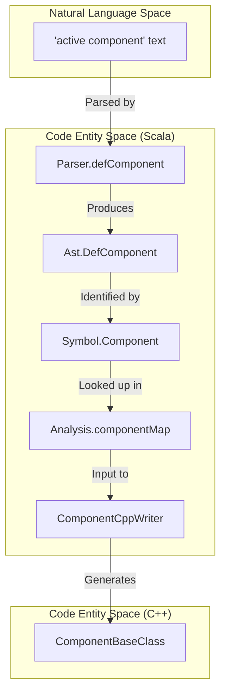
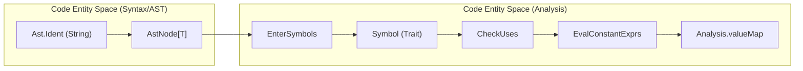

# Page: Glossary

# Glossary

Relevant source files

The following files were used as context for generating this wiki page:

- [.github/actions/build-native-images/action.yml](.github/actions/build-native-images/action.yml)
- [.github/actions/build-native-images/native-images](.github/actions/build-native-images/native-images)
- [.github/actions/native-tools-setup/action.yml](.github/actions/native-tools-setup/action.yml)
- [.github/actions/native-tools-setup/env-setup](.github/actions/native-tools-setup/env-setup)
- [.github/workflows/build-native.yml](.github/workflows/build-native.yml)
- [.github/workflows/build-test.yml](.github/workflows/build-test.yml)
- [.github/workflows/native-build.yml](.github/workflows/native-build.yml)
- [.github/workflows/publish](.github/workflows/publish)
- [README.adoc](README.adoc)
- [compiler/.jvmopts](compiler/.jvmopts)
- [compiler/README.adoc](compiler/README.adoc)
- [compiler/fpp-sbt](compiler/fpp-sbt)
- [compiler/install-trace](compiler/install-trace)
- [compiler/lib/src/main/resources/META-INF/native-image/jni-config.json](compiler/lib/src/main/resources/META-INF/native-image/jni-config.json)
- [compiler/lib/src/main/resources/META-INF/native-image/predefined-classes-config.json](compiler/lib/src/main/resources/META-INF/native-image/predefined-classes-config.json)
- [compiler/lib/src/main/resources/META-INF/native-image/proxy-config.json](compiler/lib/src/main/resources/META-INF/native-image/proxy-config.json)
- [compiler/lib/src/main/resources/META-INF/native-image/reflect-config.json](compiler/lib/src/main/resources/META-INF/native-image/reflect-config.json)
- [compiler/lib/src/main/resources/META-INF/native-image/resource-config.json](compiler/lib/src/main/resources/META-INF/native-image/resource-config.json)
- [compiler/lib/src/main/resources/META-INF/native-image/serialization-config.json](compiler/lib/src/main/resources/META-INF/native-image/serialization-config.json)
- [compiler/lib/src/main/scala/analysis/Analysis.scala](compiler/lib/src/main/scala/analysis/Analysis.scala)
- [compiler/lib/src/main/scala/analysis/Analyzers/BasicUseAnalyzer.scala](compiler/lib/src/main/scala/analysis/Analyzers/BasicUseAnalyzer.scala)
- [compiler/lib/src/main/scala/analysis/Analyzers/TypeExpressionAnalyzer.scala](compiler/lib/src/main/scala/analysis/Analyzers/TypeExpressionAnalyzer.scala)
- [compiler/lib/src/main/scala/analysis/CheckSemantics/CheckExprTypes.scala](compiler/lib/src/main/scala/analysis/CheckSemantics/CheckExprTypes.scala)
- [compiler/lib/src/main/scala/analysis/CheckSemantics/CheckSemantics.scala](compiler/lib/src/main/scala/analysis/CheckSemantics/CheckSemantics.scala)
- [compiler/lib/src/main/scala/analysis/CheckSemantics/CheckTopologyDefs.scala](compiler/lib/src/main/scala/analysis/CheckSemantics/CheckTopologyDefs.scala)
- [compiler/lib/src/main/scala/analysis/CheckSemantics/CheckTypeUses.scala](compiler/lib/src/main/scala/analysis/CheckSemantics/CheckTypeUses.scala)
- [compiler/lib/src/main/scala/analysis/CheckSemantics/CheckUses.scala](compiler/lib/src/main/scala/analysis/CheckSemantics/CheckUses.scala)
- [compiler/lib/src/main/scala/analysis/CheckSemantics/ConstructDictionaryMap.scala](compiler/lib/src/main/scala/analysis/CheckSemantics/ConstructDictionaryMap.scala)
- [compiler/lib/src/main/scala/analysis/CheckSemantics/ConstructImpliedUseMap.scala](compiler/lib/src/main/scala/analysis/CheckSemantics/ConstructImpliedUseMap.scala)
- [compiler/lib/src/main/scala/analysis/CheckSemantics/EvalConstantExprs.scala](compiler/lib/src/main/scala/analysis/CheckSemantics/EvalConstantExprs.scala)
- [compiler/lib/src/main/scala/analysis/CheckSemantics/FinalizeTypeDefs.scala](compiler/lib/src/main/scala/analysis/CheckSemantics/FinalizeTypeDefs.scala)
- [compiler/lib/src/main/scala/analysis/Semantics/Connection.scala](compiler/lib/src/main/scala/analysis/Semantics/Connection.scala)
- [compiler/lib/src/main/scala/analysis/Semantics/ConstructDictionary/DictionaryEntries.scala](compiler/lib/src/main/scala/analysis/Semantics/ConstructDictionary/DictionaryEntries.scala)
- [compiler/lib/src/main/scala/analysis/Semantics/ConstructDictionary/DictionaryUsedSymbols.scala](compiler/lib/src/main/scala/analysis/Semantics/ConstructDictionary/DictionaryUsedSymbols.scala)
- [compiler/lib/src/main/scala/analysis/Semantics/Dictionary.scala](compiler/lib/src/main/scala/analysis/Semantics/Dictionary.scala)
- [compiler/lib/src/main/scala/analysis/Semantics/ImpliedUse.scala](compiler/lib/src/main/scala/analysis/Semantics/ImpliedUse.scala)
- [compiler/lib/src/main/scala/analysis/Semantics/InitSpecifier.scala](compiler/lib/src/main/scala/analysis/Semantics/InitSpecifier.scala)
- [compiler/lib/src/main/scala/analysis/Semantics/PortInstance.scala](compiler/lib/src/main/scala/analysis/Semantics/PortInstance.scala)
- [compiler/lib/src/main/scala/analysis/Semantics/PortInstanceIdentifier.scala](compiler/lib/src/main/scala/analysis/Semantics/PortInstanceIdentifier.scala)
- [compiler/lib/src/main/scala/analysis/Semantics/PortInterface.scala](compiler/lib/src/main/scala/analysis/Semantics/PortInterface.scala)
- [compiler/lib/src/main/scala/analysis/Semantics/ResolveTopology/GeneralPortNumbering.scala](compiler/lib/src/main/scala/analysis/Semantics/ResolveTopology/GeneralPortNumbering.scala)
- [compiler/lib/src/main/scala/analysis/Semantics/ResolveTopology/MatchedPortNumbering.scala](compiler/lib/src/main/scala/analysis/Semantics/ResolveTopology/MatchedPortNumbering.scala)
- [compiler/lib/src/main/scala/analysis/Semantics/ResolveTopology/PatternResolver.scala](compiler/lib/src/main/scala/analysis/Semantics/ResolveTopology/PatternResolver.scala)
- [compiler/lib/src/main/scala/analysis/Semantics/ResolveTopology/PortNumberingState.scala](compiler/lib/src/main/scala/analysis/Semantics/ResolveTopology/PortNumberingState.scala)
- [compiler/lib/src/main/scala/analysis/Semantics/ResolveTopology/ResolvePartiallyNumbered.scala](compiler/lib/src/main/scala/analysis/Semantics/ResolveTopology/ResolvePartiallyNumbered.scala)
- [compiler/lib/src/main/scala/analysis/Semantics/ResolveTopology/ResolvePortNumbers.scala](compiler/lib/src/main/scala/analysis/Semantics/ResolveTopology/ResolvePortNumbers.scala)
- [compiler/lib/src/main/scala/analysis/Semantics/ResolveTopology/ResolveTopology.scala](compiler/lib/src/main/scala/analysis/Semantics/ResolveTopology/ResolveTopology.scala)
- [compiler/lib/src/main/scala/analysis/Semantics/ResolveTopology/ResolveTopologyPortInterface.scala](compiler/lib/src/main/scala/analysis/Semantics/ResolveTopology/ResolveTopologyPortInterface.scala)
- [compiler/lib/src/main/scala/analysis/Semantics/ResolveTopology/ResolveUnconnectedPorts.scala](compiler/lib/src/main/scala/analysis/Semantics/ResolveTopology/ResolveUnconnectedPorts.scala)
- [compiler/lib/src/main/scala/analysis/Semantics/TlmChannelIdentifier.scala](compiler/lib/src/main/scala/analysis/Semantics/TlmChannelIdentifier.scala)
- [compiler/lib/src/main/scala/analysis/Semantics/TlmPacket.scala](compiler/lib/src/main/scala/analysis/Semantics/TlmPacket.scala)
- [compiler/lib/src/main/scala/analysis/Semantics/TlmPacketSet.scala](compiler/lib/src/main/scala/analysis/Semantics/TlmPacketSet.scala)
- [compiler/lib/src/main/scala/analysis/Semantics/Topology.scala](compiler/lib/src/main/scala/analysis/Semantics/Topology.scala)
- [compiler/lib/src/main/scala/analysis/Semantics/TopologyPort.scala](compiler/lib/src/main/scala/analysis/Semantics/TopologyPort.scala)
- [compiler/lib/src/main/scala/analysis/Semantics/Type.scala](compiler/lib/src/main/scala/analysis/Semantics/Type.scala)
- [compiler/lib/src/main/scala/analysis/Semantics/TypeVisitor.scala](compiler/lib/src/main/scala/analysis/Semantics/TypeVisitor.scala)
- [compiler/lib/src/main/scala/analysis/Semantics/Value.scala](compiler/lib/src/main/scala/analysis/Semantics/Value.scala)
- [compiler/lib/src/main/scala/analysis/Semantics/ValueVisitor.scala](compiler/lib/src/main/scala/analysis/Semantics/ValueVisitor.scala)
- [compiler/lib/src/main/scala/ast/Ast.scala](compiler/lib/src/main/scala/ast/Ast.scala)
- [compiler/lib/src/main/scala/ast/AstTransformer.scala](compiler/lib/src/main/scala/ast/AstTransformer.scala)
- [compiler/lib/src/main/scala/ast/AstVisitor.scala](compiler/lib/src/main/scala/ast/AstVisitor.scala)
- [compiler/lib/src/main/scala/codegen/AstWriter.scala](compiler/lib/src/main/scala/codegen/AstWriter.scala)
- [compiler/lib/src/main/scala/codegen/ComputeGeneratedFiles.scala](compiler/lib/src/main/scala/codegen/ComputeGeneratedFiles.scala)
- [compiler/lib/src/main/scala/codegen/CppWriter/ArrayCppWriter.scala](compiler/lib/src/main/scala/codegen/CppWriter/ArrayCppWriter.scala)
- [compiler/lib/src/main/scala/codegen/CppWriter/ComponentCppWriter/ComponentCommands.scala](compiler/lib/src/main/scala/codegen/CppWriter/ComponentCppWriter/ComponentCommands.scala)
- [compiler/lib/src/main/scala/codegen/CppWriter/ComponentCppWriter/ComponentCppWriter.scala](compiler/lib/src/main/scala/codegen/CppWriter/ComponentCppWriter/ComponentCppWriter.scala)
- [compiler/lib/src/main/scala/codegen/CppWriter/ComponentCppWriter/ComponentCppWriterUtils.scala](compiler/lib/src/main/scala/codegen/CppWriter/ComponentCppWriter/ComponentCppWriterUtils.scala)
- [compiler/lib/src/main/scala/codegen/CppWriter/ComponentCppWriter/ComponentEvents.scala](compiler/lib/src/main/scala/codegen/CppWriter/ComponentCppWriter/ComponentEvents.scala)
- [compiler/lib/src/main/scala/codegen/CppWriter/ComponentCppWriter/ComponentExternalStateMachines.scala](compiler/lib/src/main/scala/codegen/CppWriter/ComponentCppWriter/ComponentExternalStateMachines.scala)
- [compiler/lib/src/main/scala/codegen/CppWriter/ComponentCppWriter/ComponentImplWriter.scala](compiler/lib/src/main/scala/codegen/CppWriter/ComponentCppWriter/ComponentImplWriter.scala)
- [compiler/lib/src/main/scala/codegen/CppWriter/ComponentCppWriter/ComponentInputPorts.scala](compiler/lib/src/main/scala/codegen/CppWriter/ComponentCppWriter/ComponentInputPorts.scala)
- [compiler/lib/src/main/scala/codegen/CppWriter/ComponentCppWriter/ComponentInternalPort.scala](compiler/lib/src/main/scala/codegen/CppWriter/ComponentCppWriter/ComponentInternalPort.scala)
- [compiler/lib/src/main/scala/codegen/CppWriter/ComponentCppWriter/ComponentInternalStateMachines.scala](compiler/lib/src/main/scala/codegen/CppWriter/ComponentCppWriter/ComponentInternalStateMachines.scala)
- [compiler/lib/src/main/scala/codegen/CppWriter/ComponentCppWriter/ComponentOutputPorts.scala](compiler/lib/src/main/scala/codegen/CppWriter/ComponentCppWriter/ComponentOutputPorts.scala)
- [compiler/lib/src/main/scala/codegen/CppWriter/ComponentCppWriter/ComponentPorts.scala](compiler/lib/src/main/scala/codegen/CppWriter/ComponentCppWriter/ComponentPorts.scala)
- [compiler/lib/src/main/scala/codegen/CppWriter/ComponentCppWriter/ComponentStateMachines.scala](compiler/lib/src/main/scala/codegen/CppWriter/ComponentCppWriter/ComponentStateMachines.scala)
- [compiler/lib/src/main/scala/codegen/CppWriter/ComponentCppWriter/ComponentTelemetry.scala](compiler/lib/src/main/scala/codegen/CppWriter/ComponentCppWriter/ComponentTelemetry.scala)
- [compiler/lib/src/main/scala/codegen/CppWriter/ComponentCppWriter/TestWriter/ComponentTesterBaseWriter.scala](compiler/lib/src/main/scala/codegen/CppWriter/ComponentCppWriter/TestWriter/ComponentTesterBaseWriter.scala)
- [compiler/lib/src/main/scala/codegen/CppWriter/ComputeCppFiles.scala](compiler/lib/src/main/scala/codegen/CppWriter/ComputeCppFiles.scala)
- [compiler/lib/src/main/scala/codegen/CppWriter/ComputeImplCppFiles.scala](compiler/lib/src/main/scala/codegen/CppWriter/ComputeImplCppFiles.scala)
- [compiler/lib/src/main/scala/codegen/CppWriter/ComputeTestCppFiles.scala](compiler/lib/src/main/scala/codegen/CppWriter/ComputeTestCppFiles.scala)
- [compiler/lib/src/main/scala/codegen/CppWriter/ComputeTestImplCppFiles.scala](compiler/lib/src/main/scala/codegen/CppWriter/ComputeTestImplCppFiles.scala)
- [compiler/lib/src/main/scala/codegen/CppWriter/ConstantCppWriter.scala](compiler/lib/src/main/scala/codegen/CppWriter/ConstantCppWriter.scala)
- [compiler/lib/src/main/scala/codegen/CppWriter/CppDoc.scala](compiler/lib/src/main/scala/codegen/CppWriter/CppDoc.scala)
- [compiler/lib/src/main/scala/codegen/CppWriter/CppDocCppWriter.scala](compiler/lib/src/main/scala/codegen/CppWriter/CppDocCppWriter.scala)
- [compiler/lib/src/main/scala/codegen/CppWriter/CppDocHppWriter.scala](compiler/lib/src/main/scala/codegen/CppWriter/CppDocHppWriter.scala)
- [compiler/lib/src/main/scala/codegen/CppWriter/CppDocVisitor.scala](compiler/lib/src/main/scala/codegen/CppWriter/CppDocVisitor.scala)
- [compiler/lib/src/main/scala/codegen/CppWriter/CppDocWriter.scala](compiler/lib/src/main/scala/codegen/CppWriter/CppDocWriter.scala)
- [compiler/lib/src/main/scala/codegen/CppWriter/CppWriter.scala](compiler/lib/src/main/scala/codegen/CppWriter/CppWriter.scala)
- [compiler/lib/src/main/scala/codegen/CppWriter/CppWriterState.scala](compiler/lib/src/main/scala/codegen/CppWriter/CppWriterState.scala)
- [compiler/lib/src/main/scala/codegen/CppWriter/CppWriterUtils.scala](compiler/lib/src/main/scala/codegen/CppWriter/CppWriterUtils.scala)
- [compiler/lib/src/main/scala/codegen/CppWriter/EnumCppWriter.scala](compiler/lib/src/main/scala/codegen/CppWriter/EnumCppWriter.scala)
- [compiler/lib/src/main/scala/codegen/CppWriter/FormatCppWriter.scala](compiler/lib/src/main/scala/codegen/CppWriter/FormatCppWriter.scala)
- [compiler/lib/src/main/scala/codegen/CppWriter/ImplCppWriter.scala](compiler/lib/src/main/scala/codegen/CppWriter/ImplCppWriter.scala)
- [compiler/lib/src/main/scala/codegen/CppWriter/PortCppWriter.scala](compiler/lib/src/main/scala/codegen/CppWriter/PortCppWriter.scala)
- [compiler/lib/src/main/scala/codegen/CppWriter/StructCppWriter.scala](compiler/lib/src/main/scala/codegen/CppWriter/StructCppWriter.scala)
- [compiler/lib/src/main/scala/codegen/CppWriter/TestCppWriter.scala](compiler/lib/src/main/scala/codegen/CppWriter/TestCppWriter.scala)
- [compiler/lib/src/main/scala/codegen/CppWriter/TestImplCppWriter.scala](compiler/lib/src/main/scala/codegen/CppWriter/TestImplCppWriter.scala)
- [compiler/lib/src/main/scala/codegen/FppWriter.scala](compiler/lib/src/main/scala/codegen/FppWriter.scala)
- [compiler/lib/src/main/scala/codegen/Indentation.scala](compiler/lib/src/main/scala/codegen/Indentation.scala)
- [compiler/lib/src/main/scala/codegen/Line.scala](compiler/lib/src/main/scala/codegen/Line.scala)
- [compiler/lib/src/main/scala/codegen/LineUtils.scala](compiler/lib/src/main/scala/codegen/LineUtils.scala)
- [compiler/lib/src/main/scala/codegen/LocateDefsFppWriter.scala](compiler/lib/src/main/scala/codegen/LocateDefsFppWriter.scala)
- [compiler/lib/src/main/scala/codegen/XmlFppWriter/TopologyXmlFppWriter.scala](compiler/lib/src/main/scala/codegen/XmlFppWriter/TopologyXmlFppWriter.scala)
- [compiler/lib/src/main/scala/syntax/Lexer.scala](compiler/lib/src/main/scala/syntax/Lexer.scala)
- [compiler/lib/src/main/scala/syntax/Parser.scala](compiler/lib/src/main/scala/syntax/Parser.scala)
- [compiler/lib/src/main/scala/syntax/Token.scala](compiler/lib/src/main/scala/syntax/Token.scala)
- [compiler/lib/src/main/scala/util/Error.scala](compiler/lib/src/main/scala/util/Error.scala)
- [compiler/lib/src/main/scala/util/Tool.scala](compiler/lib/src/main/scala/util/Tool.scala)
- [compiler/lib/src/main/scala/util/Version.scala](compiler/lib/src/main/scala/util/Version.scala)
- [compiler/lib/src/test/scala/semantics/TypeSpec.scala](compiler/lib/src/test/scala/semantics/TypeSpec.scala)
- [compiler/lib/src/test/scala/semantics/Types.scala](compiler/lib/src/test/scala/semantics/Types.scala)
- [compiler/lib/src/test/scala/semantics/ValueSpec.scala](compiler/lib/src/test/scala/semantics/ValueSpec.scala)
- [compiler/lib/src/test/scala/semantics/Values.scala](compiler/lib/src/test/scala/semantics/Values.scala)
- [compiler/lib/src/test/scala/syntax/Parser.scala](compiler/lib/src/test/scala/syntax/Parser.scala)
- [compiler/release](compiler/release)
- [compiler/tools.txt](compiler/tools.txt)
- [compiler/tools/fpp-check/test/expr/sizeof_ok.fpp](compiler/tools/fpp-check/test/expr/sizeof_ok.fpp)
- [compiler/tools/fpp-check/test/expr/sizeof_string_fw_store_type_not_defined.fpp](compiler/tools/fpp-check/test/expr/sizeof_string_fw_store_type_not_defined.fpp)
- [compiler/tools/fpp-check/test/expr/sizeof_string_fw_store_type_not_defined.ref.txt](compiler/tools/fpp-check/test/expr/sizeof_string_fw_store_type_not_defined.ref.txt)
- [compiler/tools/fpp-check/test/expr/tests.sh](compiler/tools/fpp-check/test/expr/tests.sh)
- [compiler/tools/fpp-check/test/framework_defs/dp_state_not_enum.fpp](compiler/tools/fpp-check/test/framework_defs/dp_state_not_enum.fpp)
- [compiler/tools/fpp-check/test/framework_defs/dp_state_not_enum.ref.txt](compiler/tools/fpp-check/test/framework_defs/dp_state_not_enum.ref.txt)
- [compiler/tools/fpp-check/test/framework_defs/fw_event_id_type_not_alias_type.fpp](compiler/tools/fpp-check/test/framework_defs/fw_event_id_type_not_alias_type.fpp)
- [compiler/tools/fpp-check/test/framework_defs/fw_event_id_type_not_alias_type.ref.txt](compiler/tools/fpp-check/test/framework_defs/fw_event_id_type_not_alias_type.ref.txt)
- [compiler/tools/fpp-check/test/framework_defs/user_data_size_not_integer.fpp](compiler/tools/fpp-check/test/framework_defs/user_data_size_not_integer.fpp)
- [compiler/tools/fpp-check/test/framework_defs/user_data_size_not_integer.ref.txt](compiler/tools/fpp-check/test/framework_defs/user_data_size_not_integer.ref.txt)
- [compiler/tools/fpp-check/test/tlm_packets/channel_neither_used_nor_omitted.fpp](compiler/tools/fpp-check/test/tlm_packets/channel_neither_used_nor_omitted.fpp)
- [compiler/tools/fpp-check/test/tlm_packets/channel_used_and_omitted.fpp](compiler/tools/fpp-check/test/tlm_packets/channel_used_and_omitted.fpp)
- [compiler/tools/fpp-check/test/top_ports/interface_instance_not_member.fpp](compiler/tools/fpp-check/test/top_ports/interface_instance_not_member.fpp)
- [compiler/tools/fpp-check/test/top_ports/interface_instance_not_member.ref.txt](compiler/tools/fpp-check/test/top_ports/interface_instance_not_member.ref.txt)
- [compiler/tools/fpp-check/test/top_ports/tests.sh](compiler/tools/fpp-check/test/top_ports/tests.sh)
- [compiler/tools/fpp-filenames/test/include_test_auto_helpers.ref.txt](compiler/tools/fpp-filenames/test/include_test_auto_helpers.ref.txt)
- [compiler/tools/fpp-filenames/test/include_test_template_auto_helpers.ref.txt](compiler/tools/fpp-filenames/test/include_test_template_auto_helpers.ref.txt)
- [compiler/tools/fpp-filenames/test/ok_test_auto_helpers.ref.txt](compiler/tools/fpp-filenames/test/ok_test_auto_helpers.ref.txt)
- [compiler/tools/fpp-format/test/expressions.fpp](compiler/tools/fpp-format/test/expressions.fpp)
- [compiler/tools/fpp-format/test/expressions.ref.txt](compiler/tools/fpp-format/test/expressions.ref.txt)
- [compiler/tools/fpp-format/test/include.ref.txt](compiler/tools/fpp-format/test/include.ref.txt)
- [compiler/tools/fpp-format/test/no_include.ref.txt](compiler/tools/fpp-format/test/no_include.ref.txt)
- [compiler/tools/fpp-format/test/state_machine.ref.txt](compiler/tools/fpp-format/test/state_machine.ref.txt)
- [compiler/tools/fpp-locate-defs/test/defs.ref.txt](compiler/tools/fpp-locate-defs/test/defs.ref.txt)
- [compiler/tools/fpp-locate-defs/test/defs/defs-1.fpp](compiler/tools/fpp-locate-defs/test/defs/defs-1.fpp)
- [compiler/tools/fpp-locate-defs/test/defs/defs-2.fpp](compiler/tools/fpp-locate-defs/test/defs/defs-2.fpp)
- [compiler/tools/fpp-locate-defs/test/defs_dir.ref.txt](compiler/tools/fpp-locate-defs/test/defs_dir.ref.txt)
- [compiler/tools/fpp-syntax/test/state-machine.fpp](compiler/tools/fpp-syntax/test/state-machine.fpp)
- [compiler/tools/fpp-syntax/test/state-machine.ref.txt](compiler/tools/fpp-syntax/test/state-machine.ref.txt)
- [compiler/tools/fpp-syntax/test/syntax-ast.ref.txt](compiler/tools/fpp-syntax/test/syntax-ast.ref.txt)
- [compiler/tools/fpp-syntax/test/syntax-include-ast.ref.txt](compiler/tools/fpp-syntax/test/syntax-include-ast.ref.txt)
- [compiler/tools/fpp-syntax/test/syntax-stdin.ref.txt](compiler/tools/fpp-syntax/test/syntax-stdin.ref.txt)
- [compiler/tools/fpp-syntax/test/syntax.fpp](compiler/tools/fpp-syntax/test/syntax.fpp)
- [compiler/tools/fpp-to-cpp/test/component/base/AArrayAc.ref.cpp](compiler/tools/fpp-to-cpp/test/component/base/AArrayAc.ref.cpp)
- [compiler/tools/fpp-to-cpp/test/component/base/AArrayAc.ref.hpp](compiler/tools/fpp-to-cpp/test/component/base/AArrayAc.ref.hpp)
- [compiler/tools/fpp-to-cpp/test/component/base/ActiveOverflowComponentAc.ref.cpp](compiler/tools/fpp-to-cpp/test/component/base/ActiveOverflowComponentAc.ref.cpp)
- [compiler/tools/fpp-to-cpp/test/component/base/ActiveOverflowComponentAc.ref.hpp](compiler/tools/fpp-to-cpp/test/component/base/ActiveOverflowComponentAc.ref.hpp)
- [compiler/tools/fpp-to-cpp/test/component/base/ArrayAliasArrayArrayAc.ref.cpp](compiler/tools/fpp-to-cpp/test/component/base/ArrayAliasArrayArrayAc.ref.cpp)
- [compiler/tools/fpp-to-cpp/test/component/base/EEnumAc.ref.cpp](compiler/tools/fpp-to-cpp/test/component/base/EEnumAc.ref.cpp)
- [compiler/tools/fpp-to-cpp/test/component/base/QueuedOverflowComponentAc.ref.cpp](compiler/tools/fpp-to-cpp/test/component/base/QueuedOverflowComponentAc.ref.cpp)
- [compiler/tools/fpp-to-cpp/test/component/base/QueuedOverflowComponentAc.ref.hpp](compiler/tools/fpp-to-cpp/test/component/base/QueuedOverflowComponentAc.ref.hpp)
- [compiler/tools/fpp-to-cpp/test/component/impl/ActiveOverflow.template.ref.cpp](compiler/tools/fpp-to-cpp/test/component/impl/ActiveOverflow.template.ref.cpp)
- [compiler/tools/fpp-to-cpp/test/component/impl/ActiveOverflow.template.ref.hpp](compiler/tools/fpp-to-cpp/test/component/impl/ActiveOverflow.template.ref.hpp)
- [compiler/tools/fpp-to-cpp/test/component/impl/QueuedOverflow.template.ref.cpp](compiler/tools/fpp-to-cpp/test/component/impl/QueuedOverflow.template.ref.cpp)
- [compiler/tools/fpp-to-cpp/test/component/impl/QueuedOverflow.template.ref.hpp](compiler/tools/fpp-to-cpp/test/component/impl/QueuedOverflow.template.ref.hpp)
- [compiler/tools/fpp-to-cpp/test/component/test-base/ActiveEventsTesterBase.ref.cpp](compiler/tools/fpp-to-cpp/test/component/test-base/ActiveEventsTesterBase.ref.cpp)
- [compiler/tools/fpp-to-cpp/test/component/test-base/ActiveParamsTesterBase.ref.cpp](compiler/tools/fpp-to-cpp/test/component/test-base/ActiveParamsTesterBase.ref.cpp)
- [compiler/tools/fpp-to-cpp/test/component/test-base/ActiveParamsTesterBase.ref.hpp](compiler/tools/fpp-to-cpp/test/component/test-base/ActiveParamsTesterBase.ref.hpp)
- [compiler/tools/fpp-to-cpp/test/component/test-base/ActiveSerialTesterBase.ref.cpp](compiler/tools/fpp-to-cpp/test/component/test-base/ActiveSerialTesterBase.ref.cpp)
- [compiler/tools/fpp-to-cpp/test/component/test-base/ActiveSerialTesterBase.ref.hpp](compiler/tools/fpp-to-cpp/test/component/test-base/ActiveSerialTesterBase.ref.hpp)
- [compiler/tools/fpp-to-cpp/test/component/test-base/ActiveTelemetryTesterBase.ref.cpp](compiler/tools/fpp-to-cpp/test/component/test-base/ActiveTelemetryTesterBase.ref.cpp)
- [compiler/tools/fpp-to-cpp/test/component/test-base/ActiveTestTesterBase.ref.cpp](compiler/tools/fpp-to-cpp/test/component/test-base/ActiveTestTesterBase.ref.cpp)
- [compiler/tools/fpp-to-cpp/test/component/test-base/ActiveTestTesterBase.ref.hpp](compiler/tools/fpp-to-cpp/test/component/test-base/ActiveTestTesterBase.ref.hpp)
- [compiler/tools/fpp-to-cpp/test/component/test-base/PassiveEventsTesterBase.ref.cpp](compiler/tools/fpp-to-cpp/test/component/test-base/PassiveEventsTesterBase.ref.cpp)
- [compiler/tools/fpp-to-cpp/test/component/test-base/PassiveParamsTesterBase.ref.cpp](compiler/tools/fpp-to-cpp/test/component/test-base/PassiveParamsTesterBase.ref.cpp)
- [compiler/tools/fpp-to-cpp/test/component/test-base/PassiveParamsTesterBase.ref.hpp](compiler/tools/fpp-to-cpp/test/component/test-base/PassiveParamsTesterBase.ref.hpp)
- [compiler/tools/fpp-to-cpp/test/component/test-base/PassiveSerialTesterBase.ref.cpp](compiler/tools/fpp-to-cpp/test/component/test-base/PassiveSerialTesterBase.ref.cpp)
- [compiler/tools/fpp-to-cpp/test/component/test-base/PassiveSerialTesterBase.ref.hpp](compiler/tools/fpp-to-cpp/test/component/test-base/PassiveSerialTesterBase.ref.hpp)
- [compiler/tools/fpp-to-cpp/test/component/test-base/PassiveTelemetryTesterBase.ref.cpp](compiler/tools/fpp-to-cpp/test/component/test-base/PassiveTelemetryTesterBase.ref.cpp)
- [compiler/tools/fpp-to-cpp/test/component/test-base/PassiveTestTesterBase.ref.cpp](compiler/tools/fpp-to-cpp/test/component/test-base/PassiveTestTesterBase.ref.cpp)
- [compiler/tools/fpp-to-cpp/test/component/test-base/PassiveTestTesterBase.ref.hpp](compiler/tools/fpp-to-cpp/test/component/test-base/PassiveTestTesterBase.ref.hpp)
- [compiler/tools/fpp-to-cpp/test/component/test-base/QueuedEventsTesterBase.ref.cpp](compiler/tools/fpp-to-cpp/test/component/test-base/QueuedEventsTesterBase.ref.cpp)
- [compiler/tools/fpp-to-cpp/test/component/test-base/QueuedParamsTesterBase.ref.cpp](compiler/tools/fpp-to-cpp/test/component/test-base/QueuedParamsTesterBase.ref.cpp)
- [compiler/tools/fpp-to-cpp/test/component/test-base/QueuedParamsTesterBase.ref.hpp](compiler/tools/fpp-to-cpp/test/component/test-base/QueuedParamsTesterBase.ref.hpp)
- [compiler/tools/fpp-to-cpp/test/component/test-base/QueuedSerialTesterBase.ref.cpp](compiler/tools/fpp-to-cpp/test/component/test-base/QueuedSerialTesterBase.ref.cpp)
- [compiler/tools/fpp-to-cpp/test/component/test-base/QueuedSerialTesterBase.ref.hpp](compiler/tools/fpp-to-cpp/test/component/test-base/QueuedSerialTesterBase.ref.hpp)
- [compiler/tools/fpp-to-cpp/test/component/test-base/QueuedTelemetryTesterBase.ref.cpp](compiler/tools/fpp-to-cpp/test/component/test-base/QueuedTelemetryTesterBase.ref.cpp)
- [compiler/tools/fpp-to-cpp/test/component/test-base/QueuedTestTesterBase.ref.cpp](compiler/tools/fpp-to-cpp/test/component/test-base/QueuedTestTesterBase.ref.cpp)
- [compiler/tools/fpp-to-cpp/test/component/test-base/QueuedTestTesterBase.ref.hpp](compiler/tools/fpp-to-cpp/test/component/test-base/QueuedTestTesterBase.ref.hpp)
- [compiler/tools/fpp-to-cpp/test/fprime/Fw/Types/Types.fpp](compiler/tools/fpp-to-cpp/test/fprime/Fw/Types/Types.fpp)
- [compiler/tools/fpp-to-cpp/test/struct/EmptySerializableAc.ref.cpp](compiler/tools/fpp-to-cpp/test/struct/EmptySerializableAc.ref.cpp)
- [compiler/tools/fpp-to-cpp/test/struct/EmptySerializableAc.ref.hpp](compiler/tools/fpp-to-cpp/test/struct/EmptySerializableAc.ref.hpp)
- [compiler/trace-fprime](compiler/trace-fprime)
- [docs/code-prettify/run_prettify.js](docs/code-prettify/run_prettify.js)
- [docs/fpp-spec.html](docs/fpp-spec.html)
- [docs/fpp-users-guide.html](docs/fpp-users-guide.html)
- [docs/index.html](docs/index.html)
- [docs/index/defs.sh](docs/index/defs.sh)
- [docs/index/index.adoc](docs/index/index.adoc)
- [docs/spec/Analysis-and-Translation.adoc](docs/spec/Analysis-and-Translation.adoc)
- [docs/spec/Definitions/Component-Definitions.adoc](docs/spec/Definitions/Component-Definitions.adoc)
- [docs/spec/Definitions/Component-Instance-Definitions.adoc](docs/spec/Definitions/Component-Instance-Definitions.adoc)
- [docs/spec/Definitions/Module-Definitions.adoc](docs/spec/Definitions/Module-Definitions.adoc)
- [docs/spec/Definitions/Topology-Definitions.adoc](docs/spec/Definitions/Topology-Definitions.adoc)
- [docs/spec/Definitions/defs.sh](docs/spec/Definitions/defs.sh)
- [docs/spec/Expressions/Array-Subscript-Expressions.adoc](docs/spec/Expressions/Array-Subscript-Expressions.adoc)
- [docs/spec/Expressions/Dot-Expressions.adoc](docs/spec/Expressions/Dot-Expressions.adoc)
- [docs/spec/Expressions/Sizeof-Expressions.adoc](docs/spec/Expressions/Sizeof-Expressions.adoc)
- [docs/spec/Expressions/defs.sh](docs/spec/Expressions/defs.sh)
- [docs/spec/Instance-Member-Identifiers.adoc](docs/spec/Instance-Member-Identifiers.adoc)
- [docs/spec/Introduction.adoc](docs/spec/Introduction.adoc)
- [docs/spec/Lexical-Elements.adoc](docs/spec/Lexical-Elements.adoc)
- [docs/spec/Ports.adoc](docs/spec/Ports.adoc)
- [docs/spec/Specifiers/Command-Specifiers.adoc](docs/spec/Specifiers/Command-Specifiers.adoc)
- [docs/spec/Specifiers/Connection-Graph-Specifiers.adoc](docs/spec/Specifiers/Connection-Graph-Specifiers.adoc)
- [docs/spec/Specifiers/Event-Specifiers.adoc](docs/spec/Specifiers/Event-Specifiers.adoc)
- [docs/spec/Specifiers/Parameter-Specifiers.adoc](docs/spec/Specifiers/Parameter-Specifiers.adoc)
- [docs/spec/Specifiers/Port-Interface-Instance-Specifiers.adoc](docs/spec/Specifiers/Port-Interface-Instance-Specifiers.adoc)
- [docs/spec/Specifiers/Telemetry-Channel-Specifiers.adoc](docs/spec/Specifiers/Telemetry-Channel-Specifiers.adoc)
- [docs/spec/Specifiers/Telemetry-Packet-Set-Specifiers.adoc](docs/spec/Specifiers/Telemetry-Packet-Set-Specifiers.adoc)
- [docs/spec/Specifiers/Topology-Port-Instance-Specifiers.adoc](docs/spec/Specifiers/Topology-Port-Instance-Specifiers.adoc)
- [docs/spec/Specifiers/defs.sh](docs/spec/Specifiers/defs.sh)
- [docs/spec/Type-Checking.adoc](docs/spec/Type-Checking.adoc)
- [docs/spec/Type-Names.adoc](docs/spec/Type-Names.adoc)
- [docs/spec/Types.adoc](docs/spec/Types.adoc)
- [docs/spec/Values.adoc](docs/spec/Values.adoc)
- [docs/spec/defs.sh](docs/spec/defs.sh)
- [docs/users-guide/Analyzing-and-Translating-Models.adoc](docs/users-guide/Analyzing-and-Translating-Models.adoc)
- [docs/users-guide/Defining-Component-Instances.adoc](docs/users-guide/Defining-Component-Instances.adoc)
- [docs/users-guide/Defining-Components.adoc](docs/users-guide/Defining-Components.adoc)
- [docs/users-guide/Defining-Constants.adoc](docs/users-guide/Defining-Constants.adoc)
- [docs/users-guide/Defining-Enums.adoc](docs/users-guide/Defining-Enums.adoc)
- [docs/users-guide/Defining-Modules.adoc](docs/users-guide/Defining-Modules.adoc)
- [docs/users-guide/Defining-State-Machines.adoc](docs/users-guide/Defining-State-Machines.adoc)
- [docs/users-guide/Defining-Topologies.adoc](docs/users-guide/Defining-Topologies.adoc)
- [docs/users-guide/Defining-Types.adoc](docs/users-guide/Defining-Types.adoc)
- [docs/users-guide/Defining-and-Using-Port-Interfaces.adoc](docs/users-guide/Defining-and-Using-Port-Interfaces.adoc)
- [docs/users-guide/Installing-FPP.adoc](docs/users-guide/Installing-FPP.adoc)
- [docs/users-guide/Introduction.adoc](docs/users-guide/Introduction.adoc)
- [docs/users-guide/Writing-C-Plus-Plus-Implementations.adoc](docs/users-guide/Writing-C-Plus-Plus-Implementations.adoc)
- [docs/users-guide/Writing-Comments-and-Annotations.adoc](docs/users-guide/Writing-Comments-and-Annotations.adoc)
- [docs/users-guide/built-in.fpp](docs/users-guide/built-in.fpp)
- [docs/users-guide/defs.sh](docs/users-guide/defs.sh)
- [docs/users-guide/diagrams/state-machine/README.adoc](docs/users-guide/diagrams/state-machine/README.adoc)
- [editors/emacs/fpp-mode.el](editors/emacs/fpp-mode.el)
- [editors/vim/fpp.vim](editors/vim/fpp.vim)
- [pyproject.toml](pyproject.toml)
- [python/fprime_fpp/__init__.py](python/fprime_fpp/__init__.py)
- [python/fprime_fpp/__main__.py](python/fprime_fpp/__main__.py)

This page defines codebase-specific terms, jargon, and domain concepts used within the FPP compiler and language ecosystem. It serves as a technical reference for engineers to map conceptual terminology to specific implementation entities.

## Core Language Concepts

### Component
The basic unit of F Prime software function, similar to a class in object-oriented programming [docs/users-guide/Defining-Components.adoc:3-6](). Components can be **Active** (has its own thread and queue), **Queued** (has a queue but no thread), or **Passive** (no thread or queue) [docs/users-guide/Defining-Components.adoc:11-19]().
*   **Implementation:** Represented in the AST as `Ast.DefComponent` [compiler/lib/src/main/scala/ast/Ast.scala:96-100]() and in the semantic model as `fpp.compiler.analysis.Component`.
*   **C++ Generation:** Handled by `ComponentCppWriter`, which generates a base class (e.g., `MyComponentBase`) [compiler/lib/src/main/scala/codegen/CppWriter/ComponentCppWriter/ComponentCppWriter.scala:9-12]().

### Port Instance
A component member that specifies a connection point for communication [docs/users-guide/Defining-Components.adoc:57-60](). Port instances are typed by a Port Definition and have a direction (input/output) and a dispatch kind (sync, async, guarded) [docs/users-guide/Defining-Components.adoc:71-84]().
*   **Implementation:** `Ast.SpecPortInstance` [compiler/lib/src/main/scala/ast/Ast.scala:67]() and resolved in `PortInstance` classes within the analysis package.

### Topology
A definition that specifies a set of component instances and the connections between their port instances [docs/users-guide/Analyzing-and-Translating-Models.adoc:103-117]().
*   **Implementation:** `Ast.DefTopology` [compiler/lib/src/main/scala/ast/Ast.scala:160]() and analyzed via `fpp.compiler.analysis.Topology`.

---

## Compiler Architecture Terms

### Annotated AST
FPP supports "annotations" (comments starting with `@` or `!!`). In the codebase, an `Annotated[T]` is a tuple containing the pre-comments, the AST node itself, and the post-comments [compiler/lib/src/main/scala/ast/Ast.scala:8]().
*   **Code Pointer:** `type Annotated[T] = (List[String], T, List[String])` [compiler/lib/src/main/scala/ast/Ast.scala:8]().

### AstNode
A wrapper for AST data that attaches a `Location` (file, line, column) to the data structure.
*   **Implementation:** `AstNode[T]` is used throughout `Ast.scala` to ensure every language construct can be traced back to source text for error reporting [compiler/lib/src/main/scala/ast/Ast.scala:54-72]().

### Analysis State
The global state object produced and transformed during semantic analysis. It contains maps of resolved symbols, types, and component/topology models.
*   **Implementation:** `fpp.compiler.analysis.Analysis`.

---

## C++ Codegen Jargon

### Autocode (AC)
The generated C++ code that implements the structural parts of the F Prime framework (base classes, serializables). FPP tools often append `Ac` to generated filenames (e.g., `ComponentAc.hpp`) [docs/users-guide/Analyzing-and-Translating-Models.adoc:198-210]().

### CppDoc
An intermediate representation (IR) used by the compiler to describe C++ code structure (classes, functions, namespaces, includes) before it is serialized to text.
*   **Implementation:** `fpp.compiler.codegen.CppDoc`.
*   **Writer:** `CppWriter` transforms `CppDoc` into source files [compiler/lib/src/main/scala/codegen/CppWriter/CppWriter.scala:8-10]().

### Component Base Class
The generated C++ class that contains the port dispatch logic, command registration, and telemetry/event helper methods. User code inherits from this base [compiler/lib/src/main/scala/codegen/CppWriter/ComponentCppWriter/ComponentCppWriterUtils.scala:25-28]().

---

## Mapping: Natural Language to Code Entities

The following diagrams bridge high-level FPP concepts to their specific identifiers and data structures within the Scala codebase.

### Component Definition Flow
This diagram shows how a "Component" in an `.fpp` file becomes a C++ Base Class.

**Sources:** [compiler/lib/src/main/scala/syntax/Parser.scala:114-118](), [compiler/lib/src/main/scala/ast/Ast.scala:96-100](), [compiler/lib/src/main/scala/codegen/CppWriter/ComponentCppWriter/ComponentCppWriterUtils.scala:17-21]().

### Semantic Analysis Pipeline
This diagram tracks how a symbol (like a Type or Constant) is processed from a raw string to a resolved value.

**Sources:** [compiler/lib/src/main/scala/ast/Ast.scala:14](), [compiler/lib/src/main/scala/analysis/CheckSemantics/CheckUses.scala:1-10](), [compiler/lib/src/main/scala/analysis/CheckSemantics/EvalConstantExprs.scala:1-10]().

---

## Technical Terminology Table

| Term | Implementation Class / File | Description |
| :--- | :--- | :--- |
| **Translation Unit** | `Ast.TransUnit` [compiler/lib/src/main/scala/ast/Ast.scala:17]() | A single source file after parsing. |
| **Qualified Identifier** | `Ast.QualIdent` [compiler/lib/src/main/scala/ast/Ast.scala:105]() | A name that may include namespaces (e.g., `M.C`). |
| **Internal Port** | `PortInstance.Internal` [compiler/lib/src/main/scala/codegen/CppWriter/ComponentCppWriter/ComponentCppWriterUtils.scala:139-142]() | A port used for internal component messaging (async). |
| **Dictionary Def** | `isDictionaryDef` [compiler/lib/src/main/scala/ast/Ast.scala:82]() | A flag on types/constants indicating they should appear in the command/telemetry dictionary. |
| **Include Guard** | `includeGuardFromQualifiedName` [compiler/lib/src/main/scala/codegen/CppWriter/ComponentCppWriter/ComponentCppWriter.scala:50]() | Logic to generate unique C++ `#ifndef` macros based on FPP modules. |
| **Formal Param** | `Ast.FormalParam` [compiler/lib/src/main/scala/ast/Ast.scala:11]() | A parameter definition for a port or command. |

**Sources:** [compiler/lib/src/main/scala/ast/Ast.scala:1-170](), [compiler/lib/src/main/scala/codegen/CppWriter/ComponentCppWriter/ComponentCppWriterUtils.scala:1-150](), [compiler/lib/src/main/scala/codegen/CppWriter/ComponentCppWriter/ComponentCppWriter.scala:1-60]().