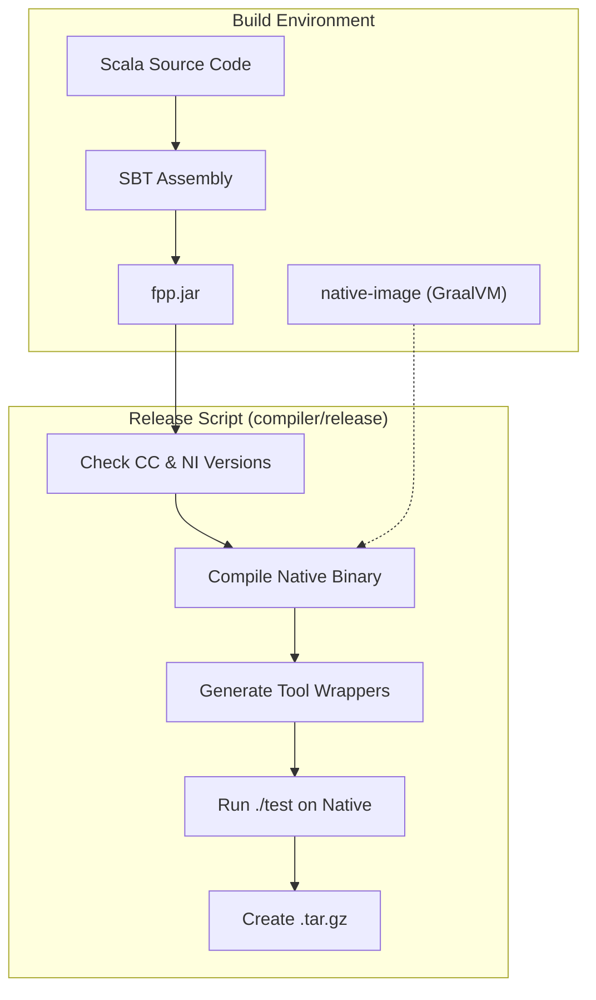
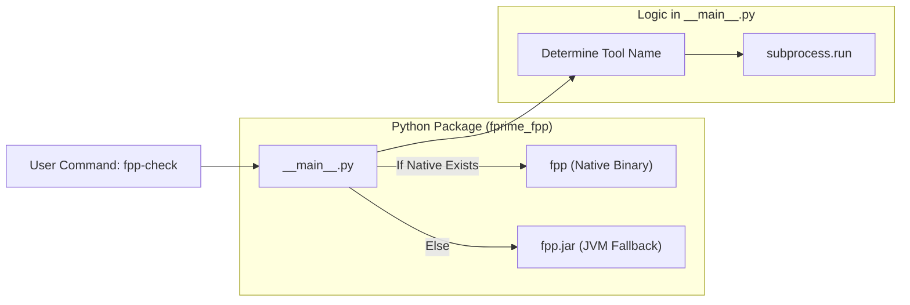

# Page: GraalVM Native Image and Python Distribution

# GraalVM Native Image and Python Distribution

Relevant source files

The following files were used as context for generating this wiki page:

- [.github/actions/build-native-images/action.yml](.github/actions/build-native-images/action.yml)
- [.github/actions/build-native-images/native-images](.github/actions/build-native-images/native-images)
- [.github/actions/native-tools-setup/action.yml](.github/actions/native-tools-setup/action.yml)
- [.github/actions/native-tools-setup/env-setup](.github/actions/native-tools-setup/env-setup)
- [.github/workflows/build-native.yml](.github/workflows/build-native.yml)
- [.github/workflows/build-test.yml](.github/workflows/build-test.yml)
- [.github/workflows/native-build.yml](.github/workflows/native-build.yml)
- [.github/workflows/publish](.github/workflows/publish)
- [README.adoc](README.adoc)
- [compiler/.jvmopts](compiler/.jvmopts)
- [compiler/README.adoc](compiler/README.adoc)
- [compiler/fpp-sbt](compiler/fpp-sbt)
- [compiler/install-trace](compiler/install-trace)
- [compiler/lib/src/main/resources/META-INF/native-image/jni-config.json](compiler/lib/src/main/resources/META-INF/native-image/jni-config.json)
- [compiler/lib/src/main/resources/META-INF/native-image/predefined-classes-config.json](compiler/lib/src/main/resources/META-INF/native-image/predefined-classes-config.json)
- [compiler/lib/src/main/resources/META-INF/native-image/proxy-config.json](compiler/lib/src/main/resources/META-INF/native-image/proxy-config.json)
- [compiler/lib/src/main/resources/META-INF/native-image/reflect-config.json](compiler/lib/src/main/resources/META-INF/native-image/reflect-config.json)
- [compiler/lib/src/main/resources/META-INF/native-image/resource-config.json](compiler/lib/src/main/resources/META-INF/native-image/resource-config.json)
- [compiler/lib/src/main/resources/META-INF/native-image/serialization-config.json](compiler/lib/src/main/resources/META-INF/native-image/serialization-config.json)
- [compiler/lib/src/main/scala/analysis/Semantics/ResolveTopology/ResolvePartiallyNumbered.scala](compiler/lib/src/main/scala/analysis/Semantics/ResolveTopology/ResolvePartiallyNumbered.scala)
- [compiler/lib/src/main/scala/analysis/Semantics/ResolveTopology/ResolveTopologyPortInterface.scala](compiler/lib/src/main/scala/analysis/Semantics/ResolveTopology/ResolveTopologyPortInterface.scala)
- [compiler/lib/src/main/scala/analysis/Semantics/TlmPacketSet.scala](compiler/lib/src/main/scala/analysis/Semantics/TlmPacketSet.scala)
- [compiler/lib/src/main/scala/analysis/Semantics/TopologyPort.scala](compiler/lib/src/main/scala/analysis/Semantics/TopologyPort.scala)
- [compiler/release](compiler/release)
- [compiler/tools.txt](compiler/tools.txt)
- [compiler/tools/fpp-check/test/top_ports/interface_instance_not_member.fpp](compiler/tools/fpp-check/test/top_ports/interface_instance_not_member.fpp)
- [compiler/tools/fpp-check/test/top_ports/interface_instance_not_member.ref.txt](compiler/tools/fpp-check/test/top_ports/interface_instance_not_member.ref.txt)
- [compiler/tools/fpp-check/test/top_ports/tests.sh](compiler/tools/fpp-check/test/top_ports/tests.sh)
- [compiler/trace-fprime](compiler/trace-fprime)
- [docs/index/defs.sh](docs/index/defs.sh)
- [docs/index/index.adoc](docs/index/index.adoc)
- [pyproject.toml](pyproject.toml)
- [python/fprime_fpp/__init__.py](python/fprime_fpp/__init__.py)
- [python/fprime_fpp/__main__.py](python/fprime_fpp/__main__.py)

The FPP toolchain is distributed as both JVM-based JAR files and standalone native binaries. To achieve high performance and ease of deployment without requiring a Java Runtime Environment (JRE) on the user's machine, FPP utilizes GraalVM's `native-image` technology. This page details the configuration, tracing workflow, and automated pipeline for building and distributing these native binaries via GitHub Actions and Python wheels.

## GraalVM Native Image Configuration

GraalVM's `native-image` tool performs ahead-of-time (AOT) compilation. Because Scala and Java use dynamic features like reflection and dynamic proxy generation, FPP must provide explicit configuration files to the GraalVM compiler.

### Tracing Agent and Metadata
FPP maintains a set of configuration files in `compiler/lib/src/main/resources/META-INF/native-image/` [compiler/release:59-59](). These files inform the AOT compiler about elements that cannot be discovered through static analysis:

*   **`reflect-config.json`**: Lists classes, methods, and fields accessed via reflection. This is particularly critical for the Circe JSON library used in `AnalysisJsonEncoder` [compiler/lib/src/main/resources/META-INF/native-image/reflect-config.json:26-127]().
*   **`jni-config.json`**: Configures Java Native Interface (JNI) access, including the main entry point `fpp.compiler.tools.FPP` [compiler/lib/src/main/resources/META-INF/native-image/jni-config.json:3-5]().
*   **`resource-config.json`**: Identifies resources (like property files) to be bundled into the binary.
*   **`serialization-config.json`**: Defines classes allowed to be serialized.

### The Tracing Workflow
When new FPP features are added that use reflection, the configuration files must be updated. This is done using the GraalVM Tracing Agent [compiler/README.adoc:176-180]().

1.  **Initialize**: Clear existing configs by setting them to `[]` [compiler/README.adoc:187-190]().
2.  **Instrument**: Run `./install-trace`, which sets `FPP_JAVA_FLAGS` to include the `-agentlib:native-image-agent` [compiler/install-trace:17-18]().
3.  **Execute**: Run the full test suite via `./test` [compiler/README.adoc:192-193](). The agent observes all reflective calls during the tests and writes them to the JSON files.
4.  **Integration**: Run `./trace-fprime` to capture behavior specific to large-scale F Prime projects [compiler/README.adoc:205-206]().

**Sources:** [compiler/README.adoc:176-216](), [compiler/install-trace:1-21](), [compiler/lib/src/main/resources/META-INF/native-image/reflect-config.json:1-127]()

## Native Build Process

The native build is orchestrated by the `release` script, which transforms the monolithic `fpp.jar` into a single native executable.

### The `release` Script Logic
The script performs the following steps:
1.  **Environment Check**: Verifies `GRAALVM_JAVA_HOME` is set [compiler/release:47-51]().
2.  **JAR Assembly**: Runs `./install` to generate the standard JVM `fpp.jar` [compiler/release:85-85]().
3.  **Binary Compilation**: Calls `native-image` with flags like `--no-fallback` (ensuring a truly native binary) and `--install-exit-handlers` [compiler/release:95-97]().
4.  **Dispatch Wrapper Generation**: Since FPP consists of multiple tools (e.g., `fpp-check`, `fpp-to-cpp`), but GraalVM produces one binary, the script generates shell wrappers. These wrappers call the main `fpp` binary with the tool name as the first argument [compiler/release:111-116]().

### Build Data Flow
The following diagram illustrates how the `release` script transforms the Scala source code into a platform-specific native distribution.

**Native Release Pipeline**

**Sources:** [compiler/release:1-161](), [compiler/README.adoc:124-159]()

## GitHub Actions CI/CD Matrix

FPP uses a cross-platform matrix in GitHub Actions to build binaries for multiple architectures and operating systems.

### Multi-Platform Matrix
The `native-build.yml` workflow defines a Python-based matrix generator [.github/workflows/native-build.yml:86-91]() that targets:
*   **macOS ARM64**: `macos-14` runner [.github/workflows/native-build.yml:95-96]().
*   **macOS x86_64**: `macos-15-intel` runner [.github/workflows/native-build.yml:99-100]().
*   **Linux x86_64**: `ubuntu-22.04` using `manylinux_2_28` container for glibc compatibility [.github/workflows/native-build.yml:103-105]().
*   **Linux aarch64**: `ubuntu-22.04-arm` using `manylinux_2_28` container [.github/workflows/native-build.yml:108-110]().

### Workflow Steps
1.  **`build-jars`**: Builds the platform-independent JAR file [.github/workflows/native-build.yml:41-44]().
2.  **`build-native-images`**: Downloads the JAR and runs the `build-native-images` action on each matrix node [.github/workflows/native-build.yml:120-146]().
3.  **Verification**: Every native image built in CI is verified by running the complete command-line unit test suite (`./test`) on the target architecture [.github/workflows/native-build.yml:157-170]().

**Sources:** [.github/workflows/native-build.yml:41-171](), [.github/workflows/build-native.yml:1-22]()

## Python Distribution (`fprime-fpp`)

The FPP toolchain is packaged as a Python wheel to allow installation via `pip`. This package acts as a distribution layer for the native binaries.

### Package Structure and Dispatch
The `fprime_fpp` package contains the native `fpp` binary and the `fpp.jar` as a fallback. The entry point is defined in `python/fprime_fpp/__main__.py`.

**Code Entity Association: Python Dispatcher**

### Wheel Building
The `build-wheels` job in CI [.github/workflows/native-build.yml:171-172]() performs the following:
1.  Copies the appropriate native binary for the matrix `tag` (e.g., `manylinux_2_28_x86_64`) into the `python/fprime_fpp/` directory [.github/workflows/native-build.yml:196-201]().
2.  Sets the `--plat-name` during the `pip build` process to ensure the resulting wheel is marked with the correct platform architecture [.github/workflows/native-build.yml:200-200]().
3.  Includes `fpp.jar` in all wheels to provide a functional (though slower) fallback if the native binary fails to execute [.github/workflows/native-build.yml:196-196]().

**Sources:** [.github/workflows/native-build.yml:171-210](), [python/fprime_fpp/__main__.py:1-10]()
