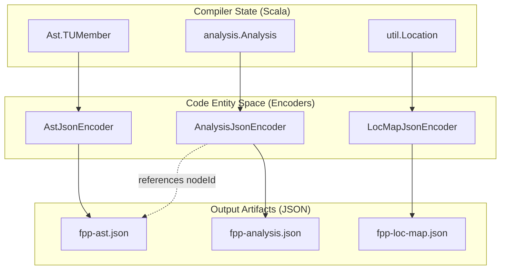

# Page: JSON and XML Output Generators

# JSON and XML Output Generators

<details>
<summary>Relevant source files</summary>

The following files were used as context for generating this wiki page:

- [compiler/lib/src/main/scala/analysis/CheckSemantics/CheckFrameworkDefs.scala](compiler/lib/src/main/scala/analysis/CheckSemantics/CheckFrameworkDefs.scala)
- [compiler/lib/src/main/scala/ast/Locations.scala](compiler/lib/src/main/scala/ast/Locations.scala)
- [compiler/lib/src/main/scala/codegen/CppWriter/FormalParamsCppWriter.scala](compiler/lib/src/main/scala/codegen/CppWriter/FormalParamsCppWriter.scala)
- [compiler/lib/src/main/scala/codegen/CppWriter/TypeCppWriter.scala](compiler/lib/src/main/scala/codegen/CppWriter/TypeCppWriter.scala)
- [compiler/lib/src/main/scala/codegen/DictionaryJsonWriter/ComputeDictionaryFiles.scala](compiler/lib/src/main/scala/codegen/DictionaryJsonWriter/ComputeDictionaryFiles.scala)
- [compiler/lib/src/main/scala/codegen/DictionaryJsonWriter/DictionaryJsonEncoder.scala](compiler/lib/src/main/scala/codegen/DictionaryJsonWriter/DictionaryJsonEncoder.scala)
- [compiler/lib/src/main/scala/codegen/DictionaryJsonWriter/DictionaryJsonEncoderState.scala](compiler/lib/src/main/scala/codegen/DictionaryJsonWriter/DictionaryJsonEncoderState.scala)
- [compiler/lib/src/main/scala/codegen/DictionaryJsonWriter/DictionaryJsonWriter.scala](compiler/lib/src/main/scala/codegen/DictionaryJsonWriter/DictionaryJsonWriter.scala)
- [compiler/lib/src/main/scala/codegen/JsonEncoder/AnalysisJsonEncoder.scala](compiler/lib/src/main/scala/codegen/JsonEncoder/AnalysisJsonEncoder.scala)
- [compiler/lib/src/main/scala/codegen/JsonEncoder/AstJsonEncoder.scala](compiler/lib/src/main/scala/codegen/JsonEncoder/AstJsonEncoder.scala)
- [compiler/lib/src/main/scala/codegen/JsonEncoder/JsonEncoder.scala](compiler/lib/src/main/scala/codegen/JsonEncoder/JsonEncoder.scala)
- [compiler/lib/src/main/scala/codegen/JsonEncoder/LocMapJsonEncoder.scala](compiler/lib/src/main/scala/codegen/JsonEncoder/LocMapJsonEncoder.scala)
- [compiler/lib/src/main/scala/codegen/XmlFppWriter/ArrayXmlFppWriter.scala](compiler/lib/src/main/scala/codegen/XmlFppWriter/ArrayXmlFppWriter.scala)
- [compiler/lib/src/main/scala/codegen/XmlFppWriter/ComponentXmlFppWriter.scala](compiler/lib/src/main/scala/codegen/XmlFppWriter/ComponentXmlFppWriter.scala)
- [compiler/lib/src/main/scala/codegen/XmlFppWriter/EnumXmlFppWriter.scala](compiler/lib/src/main/scala/codegen/XmlFppWriter/EnumXmlFppWriter.scala)
- [compiler/lib/src/main/scala/codegen/XmlFppWriter/FormalParamsXmlFppWriter.scala](compiler/lib/src/main/scala/codegen/XmlFppWriter/FormalParamsXmlFppWriter.scala)
- [compiler/lib/src/main/scala/codegen/XmlFppWriter/PortXmlFppWriter.scala](compiler/lib/src/main/scala/codegen/XmlFppWriter/PortXmlFppWriter.scala)
- [compiler/lib/src/main/scala/codegen/XmlFppWriter/StructXmlFppWriter.scala](compiler/lib/src/main/scala/codegen/XmlFppWriter/StructXmlFppWriter.scala)
- [compiler/lib/src/main/scala/codegen/XmlFppWriter/TlmPacketSetXmlWriter.scala](compiler/lib/src/main/scala/codegen/XmlFppWriter/TlmPacketSetXmlWriter.scala)
- [compiler/lib/src/main/scala/codegen/XmlFppWriter/XmlFppWriter.scala](compiler/lib/src/main/scala/codegen/XmlFppWriter/XmlFppWriter.scala)
- [compiler/lib/src/main/scala/util/Options.scala](compiler/lib/src/main/scala/util/Options.scala)
- [compiler/tools/fpp-from-xml/test/check-fpp](compiler/tools/fpp-from-xml/test/check-fpp)
- [compiler/tools/fpp-from-xml/test/clean](compiler/tools/fpp-from-xml/test/clean)
- [compiler/tools/fpp-from-xml/test/component/check-fpp](compiler/tools/fpp-from-xml/test/component/check-fpp)
- [compiler/tools/fpp-from-xml/test/component/events.ref.txt](compiler/tools/fpp-from-xml/test/component/events.ref.txt)
- [compiler/tools/fpp-from-xml/test/component/events.xml](compiler/tools/fpp-from-xml/test/component/events.xml)
- [compiler/tools/fpp-from-xml/test/component/import_dictionary.ref.txt](compiler/tools/fpp-from-xml/test/component/import_dictionary.ref.txt)
- [compiler/tools/fpp-from-xml/test/component/import_dictionary.xml](compiler/tools/fpp-from-xml/test/component/import_dictionary.xml)
- [compiler/tools/fpp-from-xml/test/component/parameters.ref.txt](compiler/tools/fpp-from-xml/test/component/parameters.ref.txt)
- [compiler/tools/fpp-from-xml/test/component/parameters.xml](compiler/tools/fpp-from-xml/test/component/parameters.xml)
- [compiler/tools/fpp-from-xml/test/component/telemetry.ref.txt](compiler/tools/fpp-from-xml/test/component/telemetry.ref.txt)
- [compiler/tools/fpp-from-xml/test/component/telemetry.xml](compiler/tools/fpp-from-xml/test/component/telemetry.xml)
- [compiler/tools/fpp-from-xml/test/component/telemetry_bad_limit.ref.txt](compiler/tools/fpp-from-xml/test/component/telemetry_bad_limit.ref.txt)
- [compiler/tools/fpp-from-xml/test/component/telemetry_bad_limit.xml](compiler/tools/fpp-from-xml/test/component/telemetry_bad_limit.xml)
- [compiler/tools/fpp-from-xml/test/component/tests.sh](compiler/tools/fpp-from-xml/test/component/tests.sh)
- [compiler/tools/fpp-to-dict/test/README.adoc](compiler/tools/fpp-to-dict/test/README.adoc)
- [compiler/tools/fpp-to-dict/test/clean](compiler/tools/fpp-to-dict/test/clean)
- [compiler/tools/fpp-to-dict/test/dictionary.schema.json](compiler/tools/fpp-to-dict/test/dictionary.schema.json)
- [compiler/tools/fpp-to-dict/test/test](compiler/tools/fpp-to-dict/test/test)
- [compiler/tools/fpp-to-dict/test/top/BasicDpTopologyDictionary.ref.json](compiler/tools/fpp-to-dict/test/top/BasicDpTopologyDictionary.ref.json)
- [compiler/tools/fpp-to-dict/test/top/BasicTopologyDictionary.ref.json](compiler/tools/fpp-to-dict/test/top/BasicTopologyDictionary.ref.json)
- [compiler/tools/fpp-to-dict/test/top/DictionaryDefsTopologyDictionary.ref.json](compiler/tools/fpp-to-dict/test/top/DictionaryDefsTopologyDictionary.ref.json)
- [compiler/tools/fpp-to-dict/test/top/FirstTopTopologyDictionary.ref.json](compiler/tools/fpp-to-dict/test/top/FirstTopTopologyDictionary.ref.json)
- [compiler/tools/fpp-to-dict/test/top/QualifiedCompInstTopologyDictionary.ref.json](compiler/tools/fpp-to-dict/test/top/QualifiedCompInstTopologyDictionary.ref.json)
- [compiler/tools/fpp-to-dict/test/top/SecondTopTopologyDictionary.ref.json](compiler/tools/fpp-to-dict/test/top/SecondTopTopologyDictionary.ref.json)
- [compiler/tools/fpp-to-dict/test/top/UnqualifiedCompInstTopologyDictionary.ref.json](compiler/tools/fpp-to-dict/test/top/UnqualifiedCompInstTopologyDictionary.ref.json)
- [compiler/tools/fpp-to-dict/test/top/clean](compiler/tools/fpp-to-dict/test/top/clean)
- [compiler/tools/fpp-to-dict/test/top/config.fpp](compiler/tools/fpp-to-dict/test/top/config.fpp)
- [compiler/tools/fpp-to-dict/test/top/dataProducts.fpp](compiler/tools/fpp-to-dict/test/top/dataProducts.fpp)
- [compiler/tools/fpp-to-dict/test/top/dictionaryDefs.fpp](compiler/tools/fpp-to-dict/test/top/dictionaryDefs.fpp)
- [compiler/tools/fpp-to-dict/test/top/multipleTops.fpp](compiler/tools/fpp-to-dict/test/top/multipleTops.fpp)
- [compiler/tools/fpp-to-dict/test/top/run.sh](compiler/tools/fpp-to-dict/test/top/run.sh)
- [compiler/tools/fpp-to-dict/test/top/tests.sh](compiler/tools/fpp-to-dict/test/top/tests.sh)
- [compiler/tools/fpp-to-dict/test/top/update-ref.sh](compiler/tools/fpp-to-dict/test/top/update-ref.sh)
- [compiler/tools/fpp-to-dict/test/update-ref](compiler/tools/fpp-to-dict/test/update-ref)
- [compiler/tools/fpp-to-json/test/activeComponents.ref.txt](compiler/tools/fpp-to-json/test/activeComponents.ref.txt)
- [compiler/tools/fpp-to-json/test/commands.ref.txt](compiler/tools/fpp-to-json/test/commands.ref.txt)
- [compiler/tools/fpp-to-json/test/constTypesComponents.ref.txt](compiler/tools/fpp-to-json/test/constTypesComponents.ref.txt)
- [compiler/tools/fpp-to-json/test/constants.fpp](compiler/tools/fpp-to-json/test/constants.fpp)
- [compiler/tools/fpp-to-json/test/constants.ref.txt](compiler/tools/fpp-to-json/test/constants.ref.txt)
- [compiler/tools/fpp-to-json/test/enums.ref.txt](compiler/tools/fpp-to-json/test/enums.ref.txt)
- [compiler/tools/fpp-to-json/test/events.ref.txt](compiler/tools/fpp-to-json/test/events.ref.txt)
- [compiler/tools/fpp-to-json/test/fprime/defs.fpp](compiler/tools/fpp-to-json/test/fprime/defs.fpp)
- [compiler/tools/fpp-to-json/test/frameworkDefs.ref.txt](compiler/tools/fpp-to-json/test/frameworkDefs.ref.txt)
- [compiler/tools/fpp-to-json/test/importedTopologies.ref.txt](compiler/tools/fpp-to-json/test/importedTopologies.ref.txt)
- [compiler/tools/fpp-to-json/test/internalPorts.ref.txt](compiler/tools/fpp-to-json/test/internalPorts.ref.txt)
- [compiler/tools/fpp-to-json/test/matchedPorts.ref.txt](compiler/tools/fpp-to-json/test/matchedPorts.ref.txt)
- [compiler/tools/fpp-to-json/test/parameters.ref.txt](compiler/tools/fpp-to-json/test/parameters.ref.txt)
- [compiler/tools/fpp-to-json/test/passiveComponent.ref.txt](compiler/tools/fpp-to-json/test/passiveComponent.ref.txt)
- [compiler/tools/fpp-to-json/test/patternedConnections.ref.txt](compiler/tools/fpp-to-json/test/patternedConnections.ref.txt)
- [compiler/tools/fpp-to-json/test/ports.ref.txt](compiler/tools/fpp-to-json/test/ports.ref.txt)
- [compiler/tools/fpp-to-json/test/project/build.properties](compiler/tools/fpp-to-json/test/project/build.properties)
- [compiler/tools/fpp-to-json/test/python/locationMapValidator.py](compiler/tools/fpp-to-json/test/python/locationMapValidator.py)
- [compiler/tools/fpp-to-json/test/run](compiler/tools/fpp-to-json/test/run)
- [compiler/tools/fpp-to-json/test/simpleComponents.ref.txt](compiler/tools/fpp-to-json/test/simpleComponents.ref.txt)
- [compiler/tools/fpp-to-json/test/simpleTopology.ref.txt](compiler/tools/fpp-to-json/test/simpleTopology.ref.txt)
- [compiler/tools/fpp-to-json/test/specialPorts.ref.txt](compiler/tools/fpp-to-json/test/specialPorts.ref.txt)
- [compiler/tools/fpp-to-json/test/stateMachine.ref.txt](compiler/tools/fpp-to-json/test/stateMachine.ref.txt)
- [compiler/tools/fpp-to-json/test/syntaxOnly.fpp](compiler/tools/fpp-to-json/test/syntaxOnly.fpp)
- [compiler/tools/fpp-to-json/test/syntaxOnly.ref.txt](compiler/tools/fpp-to-json/test/syntaxOnly.ref.txt)
- [compiler/tools/fpp-to-json/test/telemetry.ref.txt](compiler/tools/fpp-to-json/test/telemetry.ref.txt)
- [compiler/tools/fpp-to-json/test/telemetryPackets.fpp](compiler/tools/fpp-to-json/test/telemetryPackets.fpp)
- [compiler/tools/fpp-to-json/test/telemetryPackets.ref.txt](compiler/tools/fpp-to-json/test/telemetryPackets.ref.txt)
- [compiler/tools/fpp-to-json/test/types.ref.txt](compiler/tools/fpp-to-json/test/types.ref.txt)
- [compiler/tools/fpp-to-json/test/update-ref](compiler/tools/fpp-to-json/test/update-ref)
- [compiler/tools/fpp/src/main/scala/fpp-from-xml.scala](compiler/tools/fpp/src/main/scala/fpp-from-xml.scala)
- [compiler/tools/fpp/src/main/scala/fpp.scala](compiler/tools/fpp/src/main/scala/fpp.scala)

</details>


The FPP toolchain provides several generators for non-C++ formats. These tools enable integration with ground systems, web-based analysis tools, and legacy F Prime XML-based workflows. This page covers the internal implementation of JSON encoding (for AST and semantic analysis), dictionary generation, and the bidirectional XML/FPP translation.

## 1. JSON Output Generation (`fpp-to-json`)

The `fpp-to-json` tool translates FPP source into a JSON representation. It can output the raw Abstract Syntax Tree (AST), the source locations (mapping AST IDs to files/lines), and the fully resolved semantic analysis.

### Implementation and Data Flow

The generator uses the **Circe** library for JSON encoding. It is organized into three primary encoders:

1.  **`AstJsonEncoder`**: Encodes the AST structures defined in `Ast.scala`. Every `AstNode` is assigned a unique ID, which is preserved in the JSON output to allow cross-referencing between the AST and the location map [compiler/lib/src/main/scala/codegen/JsonEncoder/AnalysisJsonEncoder.scala:21-28]().
2.  **`LocMapJsonEncoder`**: Encodes the mapping between `AstNode.Id` and `Location` objects (file, line, column).
3.  **`AnalysisJsonEncoder`**: Encodes the `Analysis` state object. To keep the output concise, it often replaces complex AST structures with their `nodeId`, allowing tools to look up the full definition in the separate AST JSON file [compiler/lib/src/main/scala/codegen/JsonEncoder/AnalysisJsonEncoder.scala:41-47]().

### Analysis Encoding Logic
The `AnalysisJsonEncoder` must handle recursive semantic types (like `Type` and `Value`) and maps where keys are not strings. It uses custom Circe encoders to transform internal compiler symbols into JSON objects containing kind information and unqualified names [compiler/lib/src/main/scala/codegen/JsonEncoder/AnalysisJsonEncoder.scala:39-47]().

### JSON Generation Architecture
The following diagram shows how the internal compiler state is serialized into JSON artifacts.

**Title: FPP to JSON Entity Mapping**

Sources: [compiler/lib/src/main/scala/codegen/JsonEncoder/AnalysisJsonEncoder.scala:15-114](), [compiler/tools/fpp-to-json/test/run:20-25]()

---

## 2. Dictionary Generation (`fpp-to-dict`)

The `fpp-to-dict` tool generates F Prime Command and Telemetry dictionaries in JSON format. Unlike the general JSON encoder, this tool produces a schema-validated dictionary used by ground stations.

### Key Classes and Implementation
*   **`DictionaryJsonEncoder`**: The core logic for converting a `Dictionary` semantic object into JSON. It handles the translation of FPP types (Integer, Float, Boolean, String, Array, Struct, Enum) into Ground System compatible JSON [compiler/lib/src/main/scala/codegen/DictionaryJsonWriter/DictionaryJsonEncoder.scala:107-160]().
*   **`DictionaryMetadata`**: A case class that captures deployment-specific info like `projectVersion`, `frameworkVersion`, and `libraryVersions` [compiler/lib/src/main/scala/codegen/DictionaryJsonWriter/DictionaryJsonEncoder.scala:14-20]().
*   **Type Mapping**: FPP primitive types are mapped to JSON objects describing their size and signedness. For example, `Type.PrimitiveInt` is decomposed into `size` and `signed` fields [compiler/lib/src/main/scala/codegen/DictionaryJsonWriter/DictionaryJsonEncoder.scala:109-118]().

### Dictionary Data Flow
The encoder iterates through the entry maps for Commands, Parameters, Events, Channels, Records, and Containers, sorting them by opcode or ID before serialization to ensure deterministic output [compiler/lib/src/main/scala/codegen/DictionaryJsonWriter/DictionaryJsonEncoder.scala:71-99]().

Sources: [compiler/lib/src/main/scala/codegen/DictionaryJsonWriter/DictionaryJsonEncoder.scala:1-100](), [compiler/tools/fpp-to-dict/test/dictionary.schema.json:1-50]()

---

## 3. XML Generation (`fpp-to-xml`)

FPP supports generating legacy F Prime XML files for compatibility with older tools. This is handled by a family of `XmlWriter` classes.

### XmlWriter Family
The generator uses Scala's built-in XML support (`scala.xml.Elem`) to construct the output. Each FPP construct has a corresponding writer:
*   **`ComponentXmlWriter`**: Generates `<component>` XML, including ports, commands, events, and telemetry.
*   **`PortXmlWriter`**: Generates `<interface>` XML for port definitions.
*   **`TopologyXmlWriter`**: Generates `<assembly>` XML for topologies.
*   **`StructXmlWriter` / `ArrayXmlWriter` / `EnumXmlWriter`**: Generate `<serializable>`, `<array>`, and `<enum>` XML respectively.

---

## 4. Legacy XML Import (`fpp-from-xml`)

The `fpp-from-xml` tool performs the inverse operation: it reads F Prime XML files and generates FPP source code. This is essential for migrating legacy projects to FPP.

### `XmlFppWriter` Implementation
The tool is built around the `XmlFppWriter` object, which acts as a dispatcher based on the root element of the XML file [compiler/lib/src/main/scala/codegen/XmlFppWriter/XmlFppWriter.scala:138-159]().

| XML Root Element | FPP Writer Target | Description |
| :--- | :--- | :--- |
| `component` | `ComponentXmlFppWriter` | Translates components and their internal members [compiler/lib/src/main/scala/codegen/XmlFppWriter/XmlFppWriter.scala:145](). |
| `interface` | `PortXmlFppWriter` | Translates port definitions [compiler/lib/src/main/scala/codegen/XmlFppWriter/XmlFppWriter.scala:148](). |
| `serializable` | `StructXmlFppWriter` | Translates F Prime serializables to FPP structs [compiler/lib/src/main/scala/codegen/XmlFppWriter/XmlFppWriter.scala:153](). |
| `array` | `ArrayXmlFppWriter` | Translates XML arrays to FPP arrays [compiler/lib/src/main/scala/codegen/XmlFppWriter/XmlFppWriter.scala:142](). |
| `assembly` | `TopologyXmlFppWriter` | Translates assembly XML to FPP topologies [compiler/lib/src/main/scala/codegen/XmlFppWriter/XmlFppWriter.scala:143](). |

### Translation Logic: `ArrayXmlFppWriter`
The `ArrayXmlFppWriter` extracts attributes like `name`, `size`, and `format` from the XML. It uses `XmlFppWriter.FppBuilder.translateValue` to convert the string-based default values in XML into FPP expression nodes [compiler/lib/src/main/scala/codegen/XmlFppWriter/ArrayXmlFppWriter.scala:41-66]().

### Translation Logic: `ComponentXmlFppWriter`
This writer handles the complex task of converting port instances, commands, and telemetry. It uses a `MemberGenerator` trait to process different sections of the component XML [compiler/lib/src/main/scala/codegen/XmlFppWriter/ComponentXmlFppWriter.scala:57-79](). For example, it maps XML port kinds (e.g., `async_input`) to FPP `Ast.SpecPortInstance` kinds [compiler/lib/src/main/scala/codegen/XmlFppWriter/ComponentXmlFppWriter.scala:150-158]().

**Title: XML to FPP Translation Flow**
```mermaid
graph LR
    subgraph "Input Space (XML)"
        XF["XML File"]
        XE["xml.Elem"]
    end

    subgraph "Processing Space (XmlFppWriter)"
        XW["XmlFppWriter.File"]
        CWF["ComponentXmlFppWriter"]
        SWF["StructXmlFppWriter"]
        AWF["ArrayXmlFppWriter"]
    end

    subgraph "Output Space (FPP)"
        TU["Ast.TUMember"]
        FW["FppWriter"]
        FS["FPP Source"]
    end

    XF --> XE
    XE --> XW
    XW -->|label="component"| CWF
    XW -->|label="serializable"| SWF
    XW -->|label="array"| AWF
    
    CWF --> TU
    SWF --> TU
    AWF --> TU
    
    TU --> FW
    FW --> FS
```
Sources: [compiler/lib/src/main/scala/codegen/XmlFppWriter/XmlFppWriter.scala:138-161](), [compiler/lib/src/main/scala/codegen/XmlFppWriter/ComponentXmlFppWriter.scala:12-21](), [compiler/lib/src/main/scala/codegen/XmlFppWriter/ArrayXmlFppWriter.scala:12-14]()

Sources: [compiler/lib/src/main/scala/codegen/XmlFppWriter/XmlFppWriter.scala:1-161](), [compiler/lib/src/main/scala/codegen/XmlFppWriter/ComponentXmlFppWriter.scala:1-165](), [compiler/lib/src/main/scala/codegen/XmlFppWriter/ArrayXmlFppWriter.scala:1-80](), [compiler/lib/src/main/scala/codegen/XmlFppWriter/StructXmlFppWriter.scala:1-106]()
