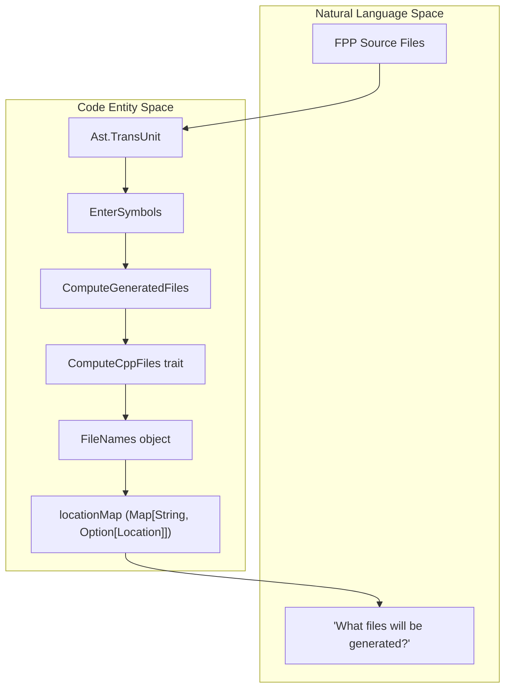
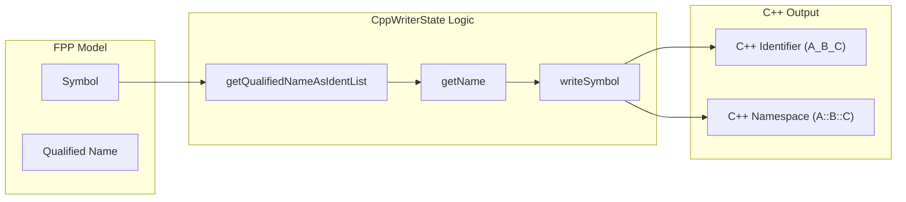

# Page: Layout and Filename Utilities

# Layout and Filename Utilities

Relevant source files

The following files were used as context for generating this wiki page:

- [compiler/lib/src/main/scala/analysis/Semantics/ResolveTopology/ResolveUnconnectedPorts.scala](compiler/lib/src/main/scala/analysis/Semantics/ResolveTopology/ResolveUnconnectedPorts.scala)
- [compiler/lib/src/main/scala/codegen/ComputeGeneratedFiles.scala](compiler/lib/src/main/scala/codegen/ComputeGeneratedFiles.scala)
- [compiler/lib/src/main/scala/codegen/CppWriter/ComputeAutocodeCppFiles.scala](compiler/lib/src/main/scala/codegen/CppWriter/ComputeAutocodeCppFiles.scala)
- [compiler/lib/src/main/scala/codegen/CppWriter/ComputeCppFiles.scala](compiler/lib/src/main/scala/codegen/CppWriter/ComputeCppFiles.scala)
- [compiler/lib/src/main/scala/codegen/CppWriter/ComputeImplCppFiles.scala](compiler/lib/src/main/scala/codegen/CppWriter/ComputeImplCppFiles.scala)
- [compiler/lib/src/main/scala/codegen/CppWriter/ComputeTestCppFiles.scala](compiler/lib/src/main/scala/codegen/CppWriter/ComputeTestCppFiles.scala)
- [compiler/lib/src/main/scala/codegen/CppWriter/ComputeTestImplCppFiles.scala](compiler/lib/src/main/scala/codegen/CppWriter/ComputeTestImplCppFiles.scala)
- [compiler/lib/src/main/scala/codegen/CppWriter/ConstantCppWriter.scala](compiler/lib/src/main/scala/codegen/CppWriter/ConstantCppWriter.scala)
- [compiler/lib/src/main/scala/codegen/CppWriter/CppWriter.scala](compiler/lib/src/main/scala/codegen/CppWriter/CppWriter.scala)
- [compiler/lib/src/main/scala/codegen/CppWriter/CppWriterState.scala](compiler/lib/src/main/scala/codegen/CppWriter/CppWriterState.scala)
- [compiler/lib/src/main/scala/codegen/CppWriter/ImplCppWriter.scala](compiler/lib/src/main/scala/codegen/CppWriter/ImplCppWriter.scala)
- [compiler/lib/src/main/scala/codegen/CppWriter/TestCppWriter.scala](compiler/lib/src/main/scala/codegen/CppWriter/TestCppWriter.scala)
- [compiler/lib/src/main/scala/codegen/CppWriter/TestImplCppWriter.scala](compiler/lib/src/main/scala/codegen/CppWriter/TestImplCppWriter.scala)
- [compiler/lib/src/main/scala/codegen/LocateDefsFppWriter.scala](compiler/lib/src/main/scala/codegen/LocateDefsFppWriter.scala)
- [compiler/lib/src/main/scala/util/Tool.scala](compiler/lib/src/main/scala/util/Tool.scala)
- [compiler/tools/fpp-depend/test/filenames_auto_generated_output.ref.txt](compiler/tools/fpp-depend/test/filenames_auto_generated_output.ref.txt)
- [compiler/tools/fpp-depend/test/filenames_generated_output.ref.txt](compiler/tools/fpp-depend/test/filenames_generated_output.ref.txt)
- [compiler/tools/fpp-depend/test/filenames_include_auto_generated_output.ref.txt](compiler/tools/fpp-depend/test/filenames_include_auto_generated_output.ref.txt)
- [compiler/tools/fpp-depend/test/filenames_include_generated_output.ref.txt](compiler/tools/fpp-depend/test/filenames_include_generated_output.ref.txt)
- [compiler/tools/fpp-filenames/test/include.ref.txt](compiler/tools/fpp-filenames/test/include.ref.txt)
- [compiler/tools/fpp-filenames/test/include_test_auto_helpers.ref.txt](compiler/tools/fpp-filenames/test/include_test_auto_helpers.ref.txt)
- [compiler/tools/fpp-filenames/test/include_test_template_auto_helpers.ref.txt](compiler/tools/fpp-filenames/test/include_test_template_auto_helpers.ref.txt)
- [compiler/tools/fpp-filenames/test/ok.fpp](compiler/tools/fpp-filenames/test/ok.fpp)
- [compiler/tools/fpp-filenames/test/ok.ref.txt](compiler/tools/fpp-filenames/test/ok.ref.txt)
- [compiler/tools/fpp-filenames/test/ok_test_auto_helpers.ref.txt](compiler/tools/fpp-filenames/test/ok_test_auto_helpers.ref.txt)
- [compiler/tools/fpp-locate-defs/test/defs.ref.txt](compiler/tools/fpp-locate-defs/test/defs.ref.txt)
- [compiler/tools/fpp-locate-defs/test/defs/defs-1.fpp](compiler/tools/fpp-locate-defs/test/defs/defs-1.fpp)
- [compiler/tools/fpp-locate-defs/test/defs/defs-2.fpp](compiler/tools/fpp-locate-defs/test/defs/defs-2.fpp)
- [compiler/tools/fpp-locate-defs/test/defs_dir.ref.txt](compiler/tools/fpp-locate-defs/test/defs_dir.ref.txt)
- [compiler/tools/fpp-to-cpp/test/component/test-base/tests.sh](compiler/tools/fpp-to-cpp/test/component/test-base/tests.sh)
- [compiler/tools/fpp-to-cpp/test/constants/run](compiler/tools/fpp-to-cpp/test/constants/run)
- [compiler/tools/fpp-to-cpp/test/constants/run.sh](compiler/tools/fpp-to-cpp/test/constants/run.sh)
- [compiler/tools/fpp-to-cpp/test/constants/tests.sh](compiler/tools/fpp-to-cpp/test/constants/tests.sh)
- [compiler/tools/fpp-to-cpp/test/constants/update-ref](compiler/tools/fpp-to-cpp/test/constants/update-ref)
- [compiler/tools/fpp-to-cpp/test/constants/update-ref.sh](compiler/tools/fpp-to-cpp/test/constants/update-ref.sh)
- [compiler/tools/fpp-to-cpp/test/scripts/run.sh](compiler/tools/fpp-to-cpp/test/scripts/run.sh)
- [compiler/tools/fpp-to-cpp/test/scripts/update-ref.sh](compiler/tools/fpp-to-cpp/test/scripts/update-ref.sh)

This section documents the utilities used for generating visual topology layouts and managing filename computations for build system integration. These tools bridge the gap between the semantic model and the physical file structure or visual representation of the system.

## 1. Filename Computation

The `fpp-filenames` tool and its underlying logic are responsible for predicting the names of all files that the FPP compiler will generate. This is critical for build systems (like CMake or GNU Make) to establish dependencies before the actual generation occurs.

### 1.1. FileNames Registry
The `ComputeCppFiles.FileNames` object serves as the central authority for C++ naming conventions in FPP [compiler/lib/src/main/scala/codegen/CppWriter/ComputeCppFiles.scala:70-71](). It defines the suffixes and prefixes used for different FPP constructs.

| Construct Type | Filename Pattern | Code Reference |
| :--- | :--- | :--- |
| **Constants** | `FppConstantsAc` | [73]() |
| **Array** | `${baseName}ArrayAc` | [83]() |
| **Component** | `${baseName}ComponentAc` | [86]() |
| **Enum** | `${baseName}EnumAc` | [92]() |
| **Port** | `${baseName}PortAc` | [95]() |
| **Topology** | `${baseName}TopologyAc` | [111]() |
| **Tester Base** | `${baseName}TesterBase` | [117]() |

### 1.2. ComputeGeneratedFiles
The `ComputeGeneratedFiles` object provides high-level APIs to calculate file lists based on the generation mode [compiler/lib/src/main/scala/codegen/ComputeGeneratedFiles.scala:8-11]().

*   **Autocode Files**: Computes XML, C++, and JSON Dictionary filenames [11-17]().
*   **Implementation Files**: Computes filenames for component implementation templates [20-25]().
*   **Test Files**: Computes filenames for unit test harness base classes and GTest helpers [28-36]().

### 1.3. Data Flow: Filename Calculation
The following diagram shows how `fpp-filenames` uses the AST and `CppWriterState` to produce a list of expected files.

**Filename Calculation Logic**

**Sources:** [compiler/lib/src/main/scala/codegen/ComputeGeneratedFiles.scala:49-61](), [compiler/lib/src/main/scala/codegen/CppWriter/ComputeCppFiles.scala:11-16]()

---

## 2. Layout Generation

The `fpp-to-layout` tool generates layout information for topologies. It uses the `LayoutWriter` and `LayoutWriterState` to produce JSON or text-based representations of how component instances are connected within a topology.

### 2.1. LayoutWriterState
Similar to `CppWriterState`, the `LayoutWriterState` maintains the context for layout generation, including the results of semantic analysis and the target topology being processed.

### 2.2. Connection Graph Processing
The layout utility iterates through the `Connection` objects resolved during [Topology Resolution](3.4.-Topology-Resolution). It extracts:
1.  **Source Instance**: The component instance initiating the connection.
2.  **Source Port**: The specific port on the source instance.
3.  **Target Instance**: The component instance receiving the connection.
4.  **Target Port**: The specific port on the target instance.

---

## 3. C++ Writer State Management

The `CppWriterState` class is a foundational utility used by both `fpp-to-cpp` and the filename calculators to manage pathing and symbol-to-C++ mapping [compiler/lib/src/main/scala/codegen/CppWriter/CppWriterState.scala:8-21]().

### 3.1. Path and Include Management
The state object handles the transformation of FPP symbols into C++ include paths and guards:
*   **Prefix Removal**: `removeLongestPathPrefix` strips build-system specific paths to create clean `#include` directives [24-25]().
*   **Include Guards**: `includeGuardFromQualifiedName` generates unique C++ preprocessor guards based on the FPP module nesting [48-58]().
*   **Namespace Mapping**: `getNamespace` converts FPP modules into C++ nested namespaces (e.g., `M1::M2`) [61-65]().

### 3.2. Symbol Naming Logic
`CppWriterState` implements the logic for "flattening" FPP names when they are defined inside components or state machines.

**Symbol to Identifier Mapping**

**Sources:** [compiler/lib/src/main/scala/codegen/CppWriter/CppWriterState.scala:76-83](), [compiler/lib/src/main/scala/codegen/CppWriter/CppWriterState.scala:104-111]()

---

## 4. Constant C++ Generation

The `ConstantCppWriter` is a specialized utility that generates a single set of files (`FppConstantsAc.hpp/cpp`) containing all constant definitions across a translation unit [compiler/lib/src/main/scala/codegen/CppWriter/ConstantCppWriter.scala:9-12]().

### 4.1. Supported Types
It translates FPP primitive values into C++ constants:
*   **Booleans**: `extern const bool` [122-126]().
*   **Integers**: C++ `enum` anonymous pattern for compile-time integer constants [128-138]().
*   **Floats**: `extern const F64` [140-144]().
*   **Strings**: `extern const char *const` [146-154]().

### 4.2. Implementation Detail
The writer uses an internal `Visitor` that extends `AstVisitor` to collect constant definitions from modules, components, and state machines [40-46](). It filters out complex types like structs or arrays, which are handled by their respective type generators.

**Sources:** [compiler/lib/src/main/scala/codegen/CppWriter/ConstantCppWriter.scala:48-64](), [compiler/lib/src/main/scala/codegen/CppWriter/ConstantCppWriter.scala:86-98]()
