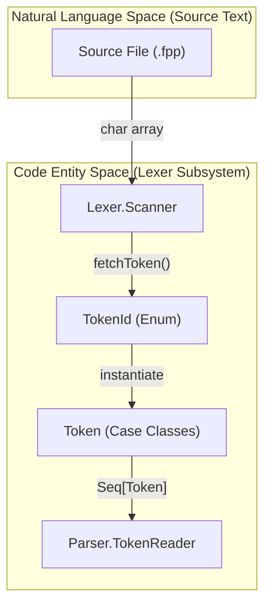
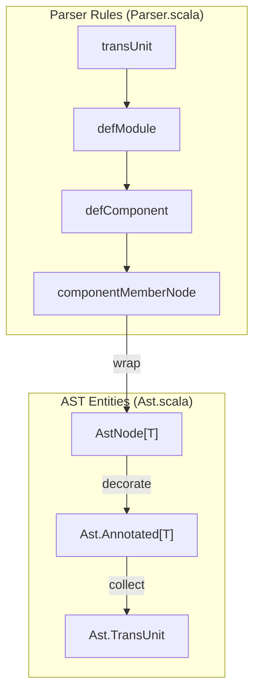

# Page: Lexer and Parser (Frontend)

# Lexer and Parser (Frontend)

Relevant source files

The following files were used as context for generating this wiki page:

- [compiler/lib/src/main/scala/ast/Ast.scala](compiler/lib/src/main/scala/ast/Ast.scala)
- [compiler/lib/src/main/scala/ast/AstTransformer.scala](compiler/lib/src/main/scala/ast/AstTransformer.scala)
- [compiler/lib/src/main/scala/ast/AstVisitor.scala](compiler/lib/src/main/scala/ast/AstVisitor.scala)
- [compiler/lib/src/main/scala/codegen/AstWriter.scala](compiler/lib/src/main/scala/codegen/AstWriter.scala)
- [compiler/lib/src/main/scala/codegen/FppWriter.scala](compiler/lib/src/main/scala/codegen/FppWriter.scala)
- [compiler/lib/src/main/scala/syntax/Lexer.scala](compiler/lib/src/main/scala/syntax/Lexer.scala)
- [compiler/lib/src/main/scala/syntax/Parser.scala](compiler/lib/src/main/scala/syntax/Parser.scala)
- [compiler/lib/src/main/scala/syntax/Token.scala](compiler/lib/src/main/scala/syntax/Token.scala)
- [compiler/lib/src/main/scala/util/Version.scala](compiler/lib/src/main/scala/util/Version.scala)
- [compiler/lib/src/test/input/syntax/lexer/error/newline-in-string.fpp](compiler/lib/src/test/input/syntax/lexer/error/newline-in-string.fpp)
- [compiler/lib/src/test/scala/syntax/Lexer.scala](compiler/lib/src/test/scala/syntax/Lexer.scala)
- [compiler/lib/src/test/scala/syntax/Parser.scala](compiler/lib/src/test/scala/syntax/Parser.scala)
- [compiler/tools/fpp-check/test/state_machine_instance/bad_priority.fpp](compiler/tools/fpp-check/test/state_machine_instance/bad_priority.fpp)
- [compiler/tools/fpp-check/test/state_machine_instance/bad_priority.ref.txt](compiler/tools/fpp-check/test/state_machine_instance/bad_priority.ref.txt)
- [compiler/tools/fpp-check/test/state_machine_instance/tests.sh](compiler/tools/fpp-check/test/state_machine_instance/tests.sh)
- [compiler/tools/fpp-format/test/component.fpp](compiler/tools/fpp-format/test/component.fpp)
- [compiler/tools/fpp-format/test/component.ref.txt](compiler/tools/fpp-format/test/component.ref.txt)
- [compiler/tools/fpp-format/test/escaped_strings.fpp](compiler/tools/fpp-format/test/escaped_strings.fpp)
- [compiler/tools/fpp-format/test/escaped_strings.ref.txt](compiler/tools/fpp-format/test/escaped_strings.ref.txt)
- [compiler/tools/fpp-format/test/include.ref.txt](compiler/tools/fpp-format/test/include.ref.txt)
- [compiler/tools/fpp-format/test/kwd_names.fpp](compiler/tools/fpp-format/test/kwd_names.fpp)
- [compiler/tools/fpp-format/test/kwd_names.ref.txt](compiler/tools/fpp-format/test/kwd_names.ref.txt)
- [compiler/tools/fpp-format/test/no_include.ref.txt](compiler/tools/fpp-format/test/no_include.ref.txt)
- [compiler/tools/fpp-format/test/run](compiler/tools/fpp-format/test/run)
- [compiler/tools/fpp-format/test/state_machine.ref.txt](compiler/tools/fpp-format/test/state_machine.ref.txt)
- [compiler/tools/fpp-format/test/tests.sh](compiler/tools/fpp-format/test/tests.sh)
- [compiler/tools/fpp-format/test/update-ref](compiler/tools/fpp-format/test/update-ref)
- [compiler/tools/fpp-syntax/test/escaped-strings.fpp](compiler/tools/fpp-syntax/test/escaped-strings.fpp)
- [compiler/tools/fpp-syntax/test/escaped-strings.ref.txt](compiler/tools/fpp-syntax/test/escaped-strings.ref.txt)
- [compiler/tools/fpp-syntax/test/run](compiler/tools/fpp-syntax/test/run)
- [compiler/tools/fpp-syntax/test/state-machine.fpp](compiler/tools/fpp-syntax/test/state-machine.fpp)
- [compiler/tools/fpp-syntax/test/state-machine.ref.txt](compiler/tools/fpp-syntax/test/state-machine.ref.txt)
- [compiler/tools/fpp-syntax/test/syntax-ast.ref.txt](compiler/tools/fpp-syntax/test/syntax-ast.ref.txt)
- [compiler/tools/fpp-syntax/test/syntax-include-ast.ref.txt](compiler/tools/fpp-syntax/test/syntax-include-ast.ref.txt)
- [compiler/tools/fpp-syntax/test/syntax-stdin.ref.txt](compiler/tools/fpp-syntax/test/syntax-stdin.ref.txt)
- [compiler/tools/fpp-syntax/test/syntax.fpp](compiler/tools/fpp-syntax/test/syntax.fpp)
- [compiler/tools/fpp-syntax/test/update-ref](compiler/tools/fpp-syntax/test/update-ref)
- [docs/spec/Definitions/Port-Definitions.adoc](docs/spec/Definitions/Port-Definitions.adoc)
- [docs/spec/Expressions/String-Literals.adoc](docs/spec/Expressions/String-Literals.adoc)
- [docs/spec/Specifiers/Init-Specifiers.adoc](docs/spec/Specifiers/Init-Specifiers.adoc)
- [docs/spec/Specifiers/Internal-Port-Specifiers.adoc](docs/spec/Specifiers/Internal-Port-Specifiers.adoc)
- [docs/spec/Specifiers/State-Machine-Instance-Specifiers.adoc](docs/spec/Specifiers/State-Machine-Instance-Specifiers.adoc)

The FPP frontend is responsible for converting raw FPP source text into a structured Abstract Syntax Tree (AST). This process is divided into two main phases: lexical analysis (performed by the Lexer) and syntactic analysis (performed by the Parser). The frontend also handles the association of formal comments (annotations) with AST nodes and provides tools for syntax validation and source formatting.

## Lexical Analysis

The lexical analysis phase transforms a stream of characters into a stream of tokens. It is implemented in `Lexer.scala` and supported by token definitions in `Token.scala`.

### The Scanner and Tokenization
The `Lexer.Scanner` class [compiler/lib/src/main/scala/syntax/Lexer.scala:183-190]() iterates over the source content to produce `Token` objects. It maintains state such as the current line number, character offset, and the string value of literals [compiler/lib/src/main/scala/syntax/Lexer.scala:137-173]().

Key features of the FPP Lexer include:
*   **Keyword Recognition**: A predefined map of keywords (e.g., `active`, `component`, `port`) is used to distinguish identifiers from reserved words [compiler/lib/src/main/scala/syntax/Lexer.scala:18-133]().
*   **Position Tracking**: Every token is associated with a `TokenPosition`, which includes the line number, column, and the original line text for error reporting [compiler/lib/src/main/scala/syntax/Lexer.scala:175-181]().
*   **Literal Handling**: The lexer recognizes various literal types, including integers (supporting different bases), floating-point numbers, and strings [compiler/lib/src/main/scala/syntax/Lexer.scala:216-259]().

### Data Flow: Character Stream to Tokens
The following diagram illustrates how the `Scanner` processes input text into a `TokenReader` consumed by the parser.

**Lexical Data Flow**

Sources: [compiler/lib/src/main/scala/syntax/Lexer.scala:183-212](), [compiler/lib/src/main/scala/syntax/Parser.scala:11-19]()

## Syntactic Analysis (Parser)

The FPP parser is implemented using Scala's parser combinators. It resides in `Parser.scala` and consumes tokens from a `TokenReader`.

### TokenReader
The `TokenReader` bridges the lexer's output with the parser's input requirements. It implements the `Reader[Token]` interface, providing methods to access the `first` token, the `rest` of the stream, and the current `pos` (position) [compiler/lib/src/main/scala/syntax/Parser.scala:11-19]().

### Grammar Rules and Combinators
The parser defines rules that match FPP language constructs. For example:
*   **Component Definitions**: The `defComponent` rule matches a component kind, followed by an identifier and a list of members enclosed in braces [compiler/lib/src/main/scala/syntax/Parser.scala:114-118]().
*   **Component Members**: The `componentMemberNode` rule is a choice between various definitions and specifiers, such as `defArray`, `specCommand`, or `specEvent` [compiler/lib/src/main/scala/syntax/Parser.scala:28-57]().
*   **Connections**: The `connection` rule parses topology connection graphs, including optional `unmatched` flags and port indices [compiler/lib/src/main/scala/syntax/Parser.scala:62-75]().

### AST Node Wrapping and Annotations
Most parser rules return an `AstNode[T]`. An `AstNode` wraps a data element of type `T` and associates it with its source location [compiler/lib/src/main/scala/ast/Ast.scala:54-72]().

FPP supports **Annotations**, which are formal comments starting with `@` (pre-annotation) or `@<` (post-annotation). The parser uses `annotatedElementSequence` to collect these comments and attach them to the resulting AST nodes [compiler/lib/src/main/scala/syntax/Parser.scala:59-60](). The `Ast.Annotated[T]` type is a triple consisting of a list of pre-annotations, the value, and a list of post-annotations [compiler/lib/src/main/scala/ast/Ast.scala:8]().

**Parser Structure and AST Generation**

Sources: [compiler/lib/src/main/scala/syntax/Parser.scala:28-60](), [compiler/lib/src/main/scala/ast/Ast.scala:7-17]()

## Frontend Tools

The frontend provides two primary command-line utilities for interacting with FPP source code.

### fpp-syntax
The `fpp-syntax` tool validates the syntax of FPP files. It parses the input and can optionally print a simplified representation of the AST to standard output for debugging [compiler/tools/fpp-syntax/test/syntax-ast.ref.txt:1-10](). This tool is essential for verifying that source files conform to the formal grammar before proceeding to semantic analysis.

### fpp-format
The `fpp-format` tool is the FPP source code formatter. It utilizes the `FppWriter` [compiler/lib/src/main/scala/codegen/FppWriter.scala:9]() to regenerate FPP source text from the AST. 

Key implementation details of `FppWriter`:
*   **Visitor Pattern**: It extends `AstVisitor`, traversing the AST and converting each node back into a list of `Line` objects [compiler/lib/src/main/scala/codegen/FppWriter.scala:9-14]().
*   **Annotation Preservation**: It ensures that pre- and post-annotations are correctly placed relative to the code they describe [compiler/lib/src/main/scala/codegen/FppWriter.scala:59-63]().
*   **Indentation Management**: It uses `LineUtils` and `JoinOps` to manage nested structures and indentation levels [compiler/lib/src/main/scala/codegen/FppWriter.scala:15-43]().

| Tool | Primary Class/Object | Purpose |
| :--- | :--- | :--- |
| `fpp-syntax` | `AstWriter` | Validates syntax and outputs AST structure [compiler/lib/src/main/scala/codegen/AstWriter.scala:8](). |
| `fpp-format` | `FppWriter` | Formats FPP source code [compiler/lib/src/main/scala/codegen/FppWriter.scala:9](). |

Sources: [compiler/lib/src/main/scala/codegen/FppWriter.scala:9-14](), [compiler/lib/src/main/scala/codegen/AstWriter.scala:8-12](), [compiler/tools/fpp-syntax/test/syntax-ast.ref.txt:1-9]()
