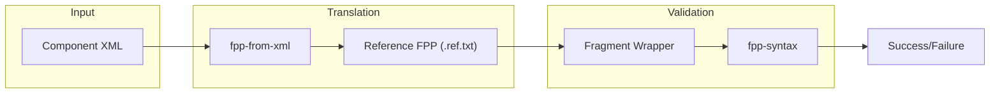

# Page: Other Tool Test Suites

# Other Tool Test Suites

<details>
<summary>Relevant source files</summary>

The following files were used as context for generating this wiki page:

- [compiler/tools/fpp-depend/test/clean](compiler/tools/fpp-depend/test/clean)
- [compiler/tools/fpp-depend/test/def_port.fpp](compiler/tools/fpp-depend/test/def_port.fpp)
- [compiler/tools/fpp-depend/test/def_state_machine.fpp](compiler/tools/fpp-depend/test/def_state_machine.fpp)
- [compiler/tools/fpp-depend/test/def_state_machine.ref.txt](compiler/tools/fpp-depend/test/def_state_machine.ref.txt)
- [compiler/tools/fpp-depend/test/def_struct.fpp](compiler/tools/fpp-depend/test/def_struct.fpp)
- [compiler/tools/fpp-depend/test/filenames_include_ut_output.ref.txt](compiler/tools/fpp-depend/test/filenames_include_ut_output.ref.txt)
- [compiler/tools/fpp-depend/test/filenames_ut_output.ref.txt](compiler/tools/fpp-depend/test/filenames_ut_output.ref.txt)
- [compiler/tools/fpp-depend/test/run](compiler/tools/fpp-depend/test/run)
- [compiler/tools/fpp-depend/test/spec_command.fpp](compiler/tools/fpp-depend/test/spec_command.fpp)
- [compiler/tools/fpp-depend/test/spec_command.ref.txt](compiler/tools/fpp-depend/test/spec_command.ref.txt)
- [compiler/tools/fpp-depend/test/spec_connection_graph_direct.fpp](compiler/tools/fpp-depend/test/spec_connection_graph_direct.fpp)
- [compiler/tools/fpp-depend/test/spec_connection_graph_direct.ref.txt](compiler/tools/fpp-depend/test/spec_connection_graph_direct.ref.txt)
- [compiler/tools/fpp-depend/test/spec_state_machine_instance.fpp](compiler/tools/fpp-depend/test/spec_state_machine_instance.fpp)
- [compiler/tools/fpp-depend/test/spec_state_machine_instance.ref.txt](compiler/tools/fpp-depend/test/spec_state_machine_instance.ref.txt)
- [compiler/tools/fpp-depend/test/tests.sh](compiler/tools/fpp-depend/test/tests.sh)
- [compiler/tools/fpp-depend/test/update-ref](compiler/tools/fpp-depend/test/update-ref)
- [compiler/tools/fpp-from-xml/test/component/check-fpp](compiler/tools/fpp-from-xml/test/component/check-fpp)
- [compiler/tools/fpp-from-xml/test/component/events.ref.txt](compiler/tools/fpp-from-xml/test/component/events.ref.txt)
- [compiler/tools/fpp-from-xml/test/component/events.xml](compiler/tools/fpp-from-xml/test/component/events.xml)
- [compiler/tools/fpp-from-xml/test/component/import_dictionary.ref.txt](compiler/tools/fpp-from-xml/test/component/import_dictionary.ref.txt)
- [compiler/tools/fpp-from-xml/test/component/import_dictionary.xml](compiler/tools/fpp-from-xml/test/component/import_dictionary.xml)
- [compiler/tools/fpp-from-xml/test/component/parameters.ref.txt](compiler/tools/fpp-from-xml/test/component/parameters.ref.txt)
- [compiler/tools/fpp-from-xml/test/component/parameters.xml](compiler/tools/fpp-from-xml/test/component/parameters.xml)
- [compiler/tools/fpp-from-xml/test/component/telemetry.ref.txt](compiler/tools/fpp-from-xml/test/component/telemetry.ref.txt)
- [compiler/tools/fpp-from-xml/test/component/telemetry.xml](compiler/tools/fpp-from-xml/test/component/telemetry.xml)
- [compiler/tools/fpp-from-xml/test/component/telemetry_bad_limit.ref.txt](compiler/tools/fpp-from-xml/test/component/telemetry_bad_limit.ref.txt)
- [compiler/tools/fpp-from-xml/test/component/telemetry_bad_limit.xml](compiler/tools/fpp-from-xml/test/component/telemetry_bad_limit.xml)
- [compiler/tools/fpp-from-xml/test/component/tests.sh](compiler/tools/fpp-from-xml/test/component/tests.sh)
- [compiler/tools/fpp-to-dict/test/top/missingFwFixedLengthStringSizeConstant.ref.txt](compiler/tools/fpp-to-dict/test/top/missingFwFixedLengthStringSizeConstant.ref.txt)
- [compiler/tools/fpp-to-dict/test/top/missingFwOpcodeType.fpp](compiler/tools/fpp-to-dict/test/top/missingFwOpcodeType.fpp)
- [compiler/tools/fpp-to-dict/test/top/missingFwOpcodeType.ref.txt](compiler/tools/fpp-to-dict/test/top/missingFwOpcodeType.ref.txt)
- [compiler/tools/fpp-to-dict/test/top/missingUserDataSizeConstant.fpp](compiler/tools/fpp-to-dict/test/top/missingUserDataSizeConstant.fpp)
- [compiler/tools/fpp-to-dict/test/top/missingUserDataSizeConstant.ref.txt](compiler/tools/fpp-to-dict/test/top/missingUserDataSizeConstant.ref.txt)
- [compiler/tools/fpp-to-json/test/constants.fpp](compiler/tools/fpp-to-json/test/constants.fpp)
- [compiler/tools/fpp-to-json/test/constants.ref.txt](compiler/tools/fpp-to-json/test/constants.ref.txt)
- [compiler/tools/fpp-to-json/test/project/build.properties](compiler/tools/fpp-to-json/test/project/build.properties)
- [compiler/tools/fpp-to-json/test/types.ref.txt](compiler/tools/fpp-to-json/test/types.ref.txt)

</details>


This page covers the integration and verification test suites for the auxiliary FPP tools, including `fpp-to-xml`, `fpp-from-xml`, `fpp-to-json`, `fpp-to-dict`, `fpp-depend`, `fpp-syntax`, `fpp-format`, and the location tools (`fpp-locate-uses`/`defs`). These suites ensure that the translation, dependency analysis, and metadata generation tools maintain consistency with the FPP language specification.

## Dependency Analysis Testing (`fpp-depend`)

The `fpp-depend` test suite verifies that the tool correctly identifies file dependencies for various FPP constructs. This includes identifying files needed for state machines, port definitions, and constant expressions.

### Implementation and Execution
The suite is driven by a `tests.sh` file which defines a list of test cases [compiler/tools/fpp-depend/test/tests.sh:1-66](). The `run` script [compiler/tools/fpp-depend/test/run:1-131]() iterates through these tests, executing `fpp-depend` and comparing the generated output against reference files (`.ref.txt`).

Key verification patterns in `fpp-depend`:
*   **Direct Dependencies**: Using the `-d` flag to output direct dependencies to a file [compiler/tools/fpp-depend/test/run:41-46]().
*   **Generated Filenames**: Using `-g` and `-u` to verify the names of generated C++ files and unit test files [compiler/tools/fpp-depend/test/run:48-54]().
*   **Framework Dependencies**: Using `-f` to identify dependencies on framework-provided FPP files [compiler/tools/fpp-depend/test/run:80-84]().
*   **Missing Locations**: Using `-m` to detect symbols that are used but not located in any provided file [compiler/tools/fpp-depend/test/run:123-128]().

### Data Flow: Dependency Resolution
The following diagram illustrates how `fpp-depend` processes a source file to resolve dependencies on located types and constants.

**Figure 1: fpp-depend File Resolution Flow**
```mermaid
graph TD
    subgraph "Natural Language Space"
        "FPP Source"["FPP Source File (.fpp)"]
        "Locate Spec"["Locate Specifiers"]
        "Dep List"["Dependency List (.ref.txt)"]
    end

    subgraph "Code Entity Space"
        "fpp_depend"["fpp-depend binary"]
        "ComputeDependencies"["ComputeDependencies.scala"]
        "MapUsesToLocs"["MapUsesToLocs.scala"]
        "BuildSpecLocMap"["BuildSpecLocMap.scala"]
    end

    "FPP Source" --> "fpp_depend"
    "fpp_depend" --> "BuildSpecLocMap"
    "BuildSpecLocMap" --> "MapUsesToLocs"
    "MapUsesToLocs" --> "ComputeDependencies"
    "ComputeDependencies" --> "Dep List"
```
Sources: [compiler/tools/fpp-depend/test/run:23-24](), [compiler/tools/fpp-depend/test/def_state_machine.fpp:1-14](), [compiler/tools/fpp-depend/test/def_state_machine.ref.txt:1-4]()

## XML and JSON Translation Testing

The translation tools (`fpp-to-xml`, `fpp-from-xml`, `fpp-to-json`, and `fpp-to-dict`) use a "reference comparison" strategy.

### `fpp-to-json` and `fpp-to-dict`
The `fpp-to-json` tool exports the AST and analysis state into a JSON format. The test suite verifies that every AST node (e.g., `DefConstant`, `DefArray`, `ExprLiteralInt`) is correctly serialized [compiler/tools/fpp-to-json/test/constants.ref.txt:10-27]().

`fpp-to-dict` tests specifically verify the construction of F Prime command/telemetry dictionaries. This includes negative testing for "implied uses"—symbols like `FwOpcodeType` that the tool expects to be defined when generating a dictionary [compiler/tools/fpp-to-dict/test/top/missingFwOpcodeType.ref.txt:1-9]().

### `fpp-from-xml` Verification
The `fpp-from-xml` tool converts legacy F Prime XML definitions into FPP. Because the resulting FPP must be syntactically valid, the suite uses a specialized script `check-fpp` [compiler/tools/fpp-from-xml/test/component/check-fpp:1-29]().

**Figure 2: fpp-from-xml Verification Pipeline**

Sources: [compiler/tools/fpp-from-xml/test/component/check-fpp:10-28](), [compiler/tools/fpp-from-xml/test/component/tests.sh:1-12]()

## Tool Test Suite Reference

| Tool | Test Directory | Primary Verification Method | Key Verification Script |
| :--- | :--- | :--- | :--- |
| `fpp-depend` | `compiler/tools/fpp-depend/test` | Output diff against `.ref.txt` | `run` |
| `fpp-to-json` | `compiler/tools/fpp-to-json/test` | JSON structure comparison | `run` |
| `fpp-to-dict` | `compiler/tools/fpp-to-dict/test` | Dictionary JSON and error message validation | `run` |
| `fpp-from-xml` | `compiler/tools/fpp-from-xml/test` | FPP syntax check of generated code | `check-fpp` |
| `fpp-syntax` | `compiler/tools/fpp-syntax/test` | Parsing success/failure | `run` |
| `fpp-format` | `compiler/tools/fpp-format/test` | Idempotency (formatting a formatted file) | `run` |

### Formatting and Syntax Tests
*   **`fpp-syntax`**: Ensures the parser correctly accepts valid FPP and rejects invalid FPP with helpful error messages.
*   **`fpp-format`**: Verifies the pretty-printer. A key test for `fpp-format` is ensuring that the output of the tool, when passed back into the tool, remains unchanged (idempotency).
*   **`fpp-locate-uses`/`defs`**: These tools are tested by providing a set of FPP files and verifying that the tool correctly identifies the file and line number where a symbol is defined or used.

## Reference File Management
The `update-ref` script is used across all these suites to update the expected output when a tool's behavior is intentionally changed [compiler/tools/fpp-depend/test/update-ref:1-106](). It automates the execution of the tool with specific flags and redirects the output to the corresponding `.ref.txt` file, while stripping machine-specific path prefixes using `remove_path_prefix` [compiler/tools/fpp-depend/test/update-ref:17]().

Sources: [compiler/tools/fpp-depend/test/update-ref:7-18](), [compiler/tools/fpp-depend/test/run:7-25](), [compiler/tools/fpp-from-xml/test/component/check-fpp:1-29]()
