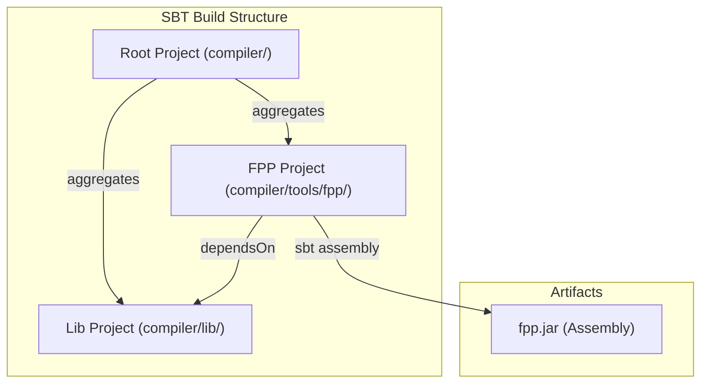
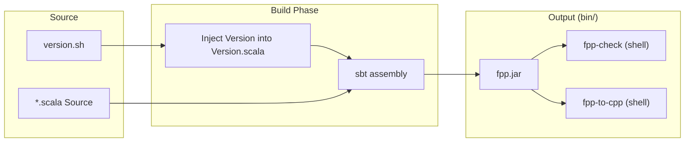
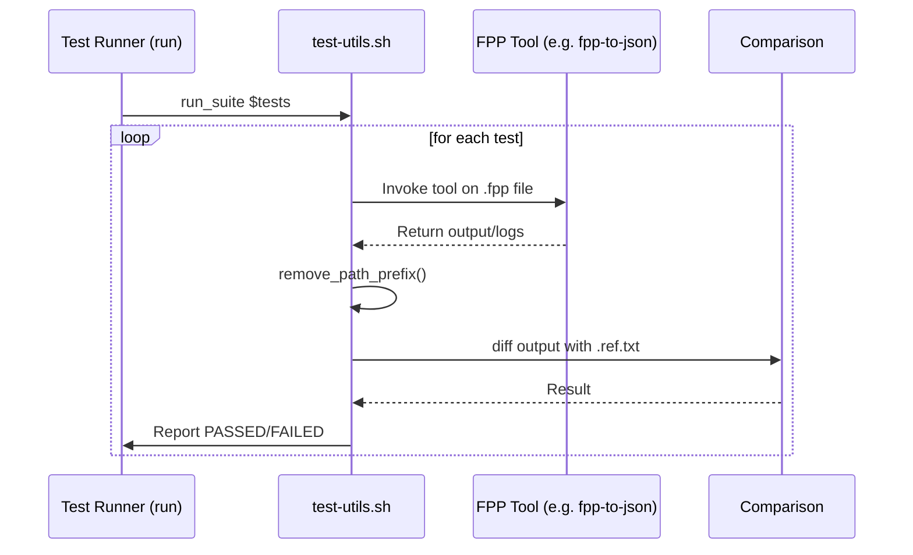

# Page: SBT Project Structure and JVM Build

# SBT Project Structure and JVM Build

Relevant source files

The following files were used as context for generating this wiki page:

- [compiler/.gitignore](compiler/.gitignore)
- [compiler/build.sbt](compiler/build.sbt)
- [compiler/install](compiler/install)
- [compiler/lib/src/main/scala/codegen/CppWriter/ValueCppWriter.scala](compiler/lib/src/main/scala/codegen/CppWriter/ValueCppWriter.scala)
- [compiler/lib/test/codegen/CppWriter/.gitignore](compiler/lib/test/codegen/CppWriter/.gitignore)
- [compiler/lib/test/codegen/CppWriter/Main.scala](compiler/lib/test/codegen/CppWriter/Main.scala)
- [compiler/lib/test/codegen/CppWriter/build](compiler/lib/test/codegen/CppWriter/build)
- [compiler/lib/test/codegen/CppWriter/clean](compiler/lib/test/codegen/CppWriter/clean)
- [compiler/lib/test/codegen/CppWriter/cpp](compiler/lib/test/codegen/CppWriter/cpp)
- [compiler/lib/test/codegen/CppWriter/hpp](compiler/lib/test/codegen/CppWriter/hpp)
- [compiler/lib/test/codegen/CppWriter/otherCpp](compiler/lib/test/codegen/CppWriter/otherCpp)
- [compiler/lib/test/codegen/CppWriter/run](compiler/lib/test/codegen/CppWriter/run)
- [compiler/scripts/fprime-gcc](compiler/scripts/fprime-gcc)
- [compiler/scripts/test-utils.sh](compiler/scripts/test-utils.sh)
- [compiler/scripts/utils.sh](compiler/scripts/utils.sh)
- [compiler/tools/fpp-from-xml/test/top/check-fpp](compiler/tools/fpp-from-xml/test/top/check-fpp)
- [compiler/tools/fpp-from-xml/test/top/clean](compiler/tools/fpp-from-xml/test/top/clean)
- [compiler/tools/fpp-from-xml/test/top/fprime_ref.ref.txt](compiler/tools/fpp-from-xml/test/top/fprime_ref.ref.txt)
- [compiler/tools/fpp-from-xml/test/top/fprime_ref.xml](compiler/tools/fpp-from-xml/test/top/fprime_ref.xml)
- [compiler/tools/fpp-from-xml/test/top/fprime_ref_packets.fpp](compiler/tools/fpp-from-xml/test/top/fprime_ref_packets.fpp)
- [compiler/tools/fpp-from-xml/test/top/fprime_ref_packets.xml](compiler/tools/fpp-from-xml/test/top/fprime_ref_packets.xml)
- [compiler/tools/fpp-from-xml/test/top/run](compiler/tools/fpp-from-xml/test/top/run)
- [compiler/tools/fpp-from-xml/test/top/tests.sh](compiler/tools/fpp-from-xml/test/top/tests.sh)
- [compiler/tools/fpp-from-xml/test/top/update-ref](compiler/tools/fpp-from-xml/test/top/update-ref)
- [compiler/tools/fpp-to-cpp/test/component/base/ActiveExternalStateMachinesComponentAc.ref.cpp](compiler/tools/fpp-to-cpp/test/component/base/ActiveExternalStateMachinesComponentAc.ref.cpp)
- [compiler/tools/fpp-to-cpp/test/port/fpp_type.fpp](compiler/tools/fpp-to-cpp/test/port/fpp_type.fpp)
- [compiler/tools/fpp-to-json/test/clean](compiler/tools/fpp-to-json/test/clean)
- [compiler/tools/fpp-to-json/test/fpp-check/clean](compiler/tools/fpp-to-json/test/fpp-check/clean)
- [compiler/tools/fpp-to-json/test/fpp-check/run](compiler/tools/fpp-to-json/test/fpp-check/run)
- [compiler/tools/fpp-to-json/test/test](compiler/tools/fpp-to-json/test/test)
- [defs.sh](defs.sh)
- [docs/users-guide/Defining-Ports.adoc](docs/users-guide/Defining-Ports.adoc)
- [version.sh](version.sh)

The FPP compiler is implemented in Scala and managed using the SBT (Scala Build Tool) multi-project build system. This infrastructure supports local development, automated testing, and the generation of executable JAR files that serve as the foundation for both the JVM-based toolchain and the GraalVM native image distribution.

## SBT Multi-Project Layout

The build is defined in the root `compiler/build.sbt` file. It organizes the codebase into a hierarchical structure of projects to separate core logic from tool-specific command-line interfaces.

### Project Definitions
The build defines three primary project entities:

1.  **Root Project**: The top-level project located at `compiler/`. It aggregates the `lib` and `fpp` projects, allowing commands like `sbt compile` or `sbt test` to run across the entire tree [compiler/build.sbt:28-33]().
2.  **Lib Project**: Contains the core compiler logic, including the AST, semantic analysis, and C++ code generation backends [compiler/build.sbt:35-36]().
3.  **FPP Project**: Located in `compiler/tools/fpp`, this project depends on `lib` and is responsible for producing the unified `fpp.jar` assembly [compiler/build.sbt:38-42]().

### Dependencies and Settings
The build uses Scala version `3.1.2` [compiler/build.sbt:5](). Key library dependencies include:
*   **scopt**: For command-line argument parsing [compiler/build.sbt:19]().
*   **circe**: A suite of JSON libraries for the `fpp-to-json` and `fpp-to-dict` tools [compiler/build.sbt:20-22]().
*   **scala-parser-combinators**: Used by the frontend for lexing and parsing [compiler/build.sbt:23]().
*   **scala-xml**: Supports XML generation for `fpp-to-xml` and legacy import via `fpp-from-xml` [compiler/build.sbt:24]().

**Project Structure Diagram**

Sources: [compiler/build.sbt:1-42]()

## The Installation Process

The `compiler/install` script automates the transition from source code to an installed toolchain. It handles versioning, compilation, and the creation of shell wrappers for the various FPP tools.

### Versioning Logic
The script first determines the version string. It attempts to use `git describe --tags --always`; if git is unavailable, it falls back to the hardcoded `VERSION` in `version.sh` [compiler/install:62-69](). This version is injected into `fpp.compiler.util.Version.scala` before compilation to ensure the `--version` flag returns accurate metadata [compiler/install:70-73]().

### Build and Wrapper Generation
1.  **Assembly**: The script executes `sbt assembly` to create a "fat JAR" containing all dependencies [compiler/install:76-78]().
2.  **Unified JAR**: The resulting JAR is copied to the destination as `fpp.jar` [compiler/install:87-89]().
3.  **Tool Wrappers**: Instead of creating separate JARs for every tool (e.g., `fpp-check`, `fpp-to-cpp`), the script generates small shell scripts. Each script calls `java -jar fpp.jar` and passes the specific tool name as the first argument [compiler/install:95-100]().

**Installation Data Flow**

Sources: [compiler/install:1-101](), [version.sh:5]()

## Development and Testing Locally

### Environment Variables
The build system respects several environment variables to customize the JVM environment:
*   `FPP_JAVA_HOME`: Sets the specific JDK to use for SBT and execution [compiler/install:44-47]().
*   `FPP_SBT_FLAGS`: Passes additional arguments to the SBT process [compiler/install:11]().
*   `FPP_JAVA_FLAGS`: Configures JVM options (e.g., memory limits) [compiler/install:14]().

### The Test Runner Framework
Integration tests are managed via shell scripts that utilize `compiler/scripts/test-utils.sh`. This framework provides standardized logging and result reporting.

*   **run_suite**: Executes a list of test functions and tracks passes/failures [compiler/scripts/test-utils.sh:50-80]().
*   **Output Sanitization**: Tools like `remove_path_prefix` and `remove_fpp_version` are used to normalize tool output before comparing against reference files (`.ref.txt`), ensuring tests are portable across different developer environments [compiler/scripts/test-utils.sh:19-26](), [compiler/scripts/test-utils.sh:82-85]().

### Local CodeGen Testing
For low-level testing of the C++ writer components, the codebase includes specialized runners that compile Scala-defined `CppDoc` structures and verify they produce valid C++ code using `g++` [compiler/lib/test/codegen/CppWriter/run:5-11]().

**Test Execution Pipeline**

Sources: [compiler/scripts/test-utils.sh:35-80](), [compiler/lib/test/codegen/CppWriter/run:1-34](), [compiler/tools/fpp-to-json/test/fpp-check/run:21-37]()

## Build System Integration Utilities

The build provides scripts to bridge the FPP tools with the broader F Prime C++ build system:
*   **fprime-gcc**: A wrapper around `g++` that sets standard F Prime flags (e.g., `-Wall`, `-Werror`, `-std=c++14`) and includes standard F Prime paths, used to verify that generated code compiles correctly [compiler/scripts/fprime-gcc:27-63]().
*   **defs.sh**: Provides common shell utilities like `doall` (running commands on regex-matched files) and `split` (path manipulation) used across the repository's maintenance scripts [defs.sh:24-41]().

Sources: [compiler/scripts/fprime-gcc:1-63](), [defs.sh:1-48]()
