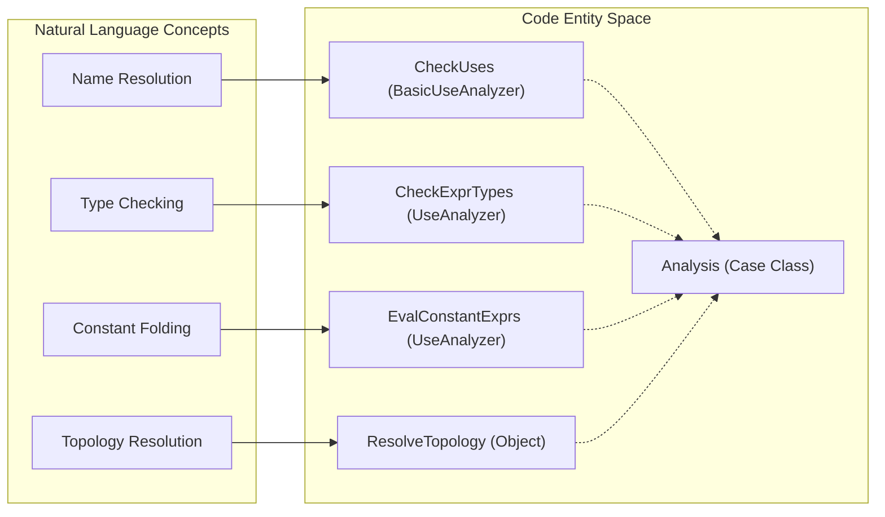

# Page: Semantic Analysis

# Semantic Analysis

<details>
<summary>Relevant source files</summary>

The following files were used as context for generating this wiki page:

- [compiler/lib/src/main/scala/analysis/Analysis.scala](compiler/lib/src/main/scala/analysis/Analysis.scala)
- [compiler/lib/src/main/scala/analysis/Analyzers/BasicUseAnalyzer.scala](compiler/lib/src/main/scala/analysis/Analyzers/BasicUseAnalyzer.scala)
- [compiler/lib/src/main/scala/analysis/Analyzers/TypeExpressionAnalyzer.scala](compiler/lib/src/main/scala/analysis/Analyzers/TypeExpressionAnalyzer.scala)
- [compiler/lib/src/main/scala/analysis/CheckSemantics/CheckExprTypes.scala](compiler/lib/src/main/scala/analysis/CheckSemantics/CheckExprTypes.scala)
- [compiler/lib/src/main/scala/analysis/CheckSemantics/CheckSemantics.scala](compiler/lib/src/main/scala/analysis/CheckSemantics/CheckSemantics.scala)
- [compiler/lib/src/main/scala/analysis/CheckSemantics/CheckTopologyDefs.scala](compiler/lib/src/main/scala/analysis/CheckSemantics/CheckTopologyDefs.scala)
- [compiler/lib/src/main/scala/analysis/CheckSemantics/CheckTypeUses.scala](compiler/lib/src/main/scala/analysis/CheckSemantics/CheckTypeUses.scala)
- [compiler/lib/src/main/scala/analysis/CheckSemantics/CheckUses.scala](compiler/lib/src/main/scala/analysis/CheckSemantics/CheckUses.scala)
- [compiler/lib/src/main/scala/analysis/CheckSemantics/ConstructImpliedUseMap.scala](compiler/lib/src/main/scala/analysis/CheckSemantics/ConstructImpliedUseMap.scala)
- [compiler/lib/src/main/scala/analysis/CheckSemantics/EnterSymbols.scala](compiler/lib/src/main/scala/analysis/CheckSemantics/EnterSymbols.scala)
- [compiler/lib/src/main/scala/analysis/CheckSemantics/EvalConstantExprs.scala](compiler/lib/src/main/scala/analysis/CheckSemantics/EvalConstantExprs.scala)
- [compiler/lib/src/main/scala/analysis/CheckSemantics/FinalizeTypeDefs.scala](compiler/lib/src/main/scala/analysis/CheckSemantics/FinalizeTypeDefs.scala)
- [compiler/lib/src/main/scala/analysis/Semantics/Connection.scala](compiler/lib/src/main/scala/analysis/Semantics/Connection.scala)
- [compiler/lib/src/main/scala/analysis/Semantics/ImpliedUse.scala](compiler/lib/src/main/scala/analysis/Semantics/ImpliedUse.scala)
- [compiler/lib/src/main/scala/analysis/Semantics/InitSpecifier.scala](compiler/lib/src/main/scala/analysis/Semantics/InitSpecifier.scala)
- [compiler/lib/src/main/scala/analysis/Semantics/PortInstance.scala](compiler/lib/src/main/scala/analysis/Semantics/PortInstance.scala)
- [compiler/lib/src/main/scala/analysis/Semantics/PortInstanceIdentifier.scala](compiler/lib/src/main/scala/analysis/Semantics/PortInstanceIdentifier.scala)
- [compiler/lib/src/main/scala/analysis/Semantics/PortInterface.scala](compiler/lib/src/main/scala/analysis/Semantics/PortInterface.scala)
- [compiler/lib/src/main/scala/analysis/Semantics/ResolveTopology/GeneralPortNumbering.scala](compiler/lib/src/main/scala/analysis/Semantics/ResolveTopology/GeneralPortNumbering.scala)
- [compiler/lib/src/main/scala/analysis/Semantics/ResolveTopology/MatchedPortNumbering.scala](compiler/lib/src/main/scala/analysis/Semantics/ResolveTopology/MatchedPortNumbering.scala)
- [compiler/lib/src/main/scala/analysis/Semantics/ResolveTopology/PatternResolver.scala](compiler/lib/src/main/scala/analysis/Semantics/ResolveTopology/PatternResolver.scala)
- [compiler/lib/src/main/scala/analysis/Semantics/ResolveTopology/PortNumberingState.scala](compiler/lib/src/main/scala/analysis/Semantics/ResolveTopology/PortNumberingState.scala)
- [compiler/lib/src/main/scala/analysis/Semantics/ResolveTopology/ResolvePortNumbers.scala](compiler/lib/src/main/scala/analysis/Semantics/ResolveTopology/ResolvePortNumbers.scala)
- [compiler/lib/src/main/scala/analysis/Semantics/ResolveTopology/ResolveTopology.scala](compiler/lib/src/main/scala/analysis/Semantics/ResolveTopology/ResolveTopology.scala)
- [compiler/lib/src/main/scala/analysis/Semantics/Symbol.scala](compiler/lib/src/main/scala/analysis/Semantics/Symbol.scala)
- [compiler/lib/src/main/scala/analysis/Semantics/Topology.scala](compiler/lib/src/main/scala/analysis/Semantics/Topology.scala)
- [compiler/lib/src/main/scala/analysis/Semantics/Type.scala](compiler/lib/src/main/scala/analysis/Semantics/Type.scala)
- [compiler/lib/src/main/scala/analysis/Semantics/TypeVisitor.scala](compiler/lib/src/main/scala/analysis/Semantics/TypeVisitor.scala)
- [compiler/lib/src/main/scala/analysis/Semantics/Value.scala](compiler/lib/src/main/scala/analysis/Semantics/Value.scala)
- [compiler/lib/src/main/scala/analysis/Semantics/ValueVisitor.scala](compiler/lib/src/main/scala/analysis/Semantics/ValueVisitor.scala)
- [compiler/lib/src/main/scala/analysis/UsedSymbols.scala](compiler/lib/src/main/scala/analysis/UsedSymbols.scala)
- [compiler/lib/src/main/scala/codegen/XmlFppWriter/TopologyXmlFppWriter.scala](compiler/lib/src/main/scala/codegen/XmlFppWriter/TopologyXmlFppWriter.scala)
- [compiler/lib/src/main/scala/util/Error.scala](compiler/lib/src/main/scala/util/Error.scala)
- [compiler/lib/src/test/scala/semantics/TypeSpec.scala](compiler/lib/src/test/scala/semantics/TypeSpec.scala)
- [compiler/lib/src/test/scala/semantics/Types.scala](compiler/lib/src/test/scala/semantics/Types.scala)
- [compiler/lib/src/test/scala/semantics/ValueSpec.scala](compiler/lib/src/test/scala/semantics/ValueSpec.scala)
- [compiler/lib/src/test/scala/semantics/Values.scala](compiler/lib/src/test/scala/semantics/Values.scala)
- [compiler/tools/fpp-check/test/expr/sizeof_ok.fpp](compiler/tools/fpp-check/test/expr/sizeof_ok.fpp)
- [compiler/tools/fpp-check/test/expr/sizeof_string_fw_store_type_not_defined.fpp](compiler/tools/fpp-check/test/expr/sizeof_string_fw_store_type_not_defined.fpp)
- [compiler/tools/fpp-check/test/expr/sizeof_string_fw_store_type_not_defined.ref.txt](compiler/tools/fpp-check/test/expr/sizeof_string_fw_store_type_not_defined.ref.txt)
- [compiler/tools/fpp-check/test/expr/tests.sh](compiler/tools/fpp-check/test/expr/tests.sh)
- [compiler/tools/fpp-depend/test/expr_sizeof.fpp](compiler/tools/fpp-depend/test/expr_sizeof.fpp)
- [compiler/tools/fpp-depend/test/expr_sizeof.ref.txt](compiler/tools/fpp-depend/test/expr_sizeof.ref.txt)
- [compiler/tools/fpp-format/test/expressions.fpp](compiler/tools/fpp-format/test/expressions.fpp)
- [compiler/tools/fpp-format/test/expressions.ref.txt](compiler/tools/fpp-format/test/expressions.ref.txt)
- [compiler/tools/fpp-locate-uses/test/defs.fpp](compiler/tools/fpp-locate-uses/test/defs.fpp)
- [compiler/tools/fpp-locate-uses/test/stdin.ref.txt](compiler/tools/fpp-locate-uses/test/stdin.ref.txt)
- [compiler/tools/fpp-locate-uses/test/uses.ref.txt](compiler/tools/fpp-locate-uses/test/uses.ref.txt)
- [compiler/tools/fpp-locate-uses/test/uses/uses.fpp](compiler/tools/fpp-locate-uses/test/uses/uses.fpp)
- [compiler/tools/fpp-locate-uses/test/uses_dir.ref.txt](compiler/tools/fpp-locate-uses/test/uses_dir.ref.txt)
- [docs/spec/Expressions/Array-Subscript-Expressions.adoc](docs/spec/Expressions/Array-Subscript-Expressions.adoc)
- [docs/spec/Expressions/Dot-Expressions.adoc](docs/spec/Expressions/Dot-Expressions.adoc)
- [docs/spec/Expressions/Sizeof-Expressions.adoc](docs/spec/Expressions/Sizeof-Expressions.adoc)
- [docs/spec/Expressions/defs.sh](docs/spec/Expressions/defs.sh)
- [docs/spec/Type-Checking.adoc](docs/spec/Type-Checking.adoc)
- [docs/spec/Type-Names.adoc](docs/spec/Type-Names.adoc)
- [docs/spec/Types.adoc](docs/spec/Types.adoc)
- [docs/spec/Values.adoc](docs/spec/Values.adoc)

</details>


Semantic analysis is the phase of the FPP compiler that validates the Abstract Syntax Tree (AST) against the language rules and constructs a formal model of the system. This process transforms a raw tree of syntactic nodes into a rich `Analysis` state object containing resolved symbols, types, component maps, and topology connections.

The analysis is implemented as a sequence of passes, mostly located in `fpp.compiler.analysis`. Each pass takes an `Analysis` object and a list of translation units, returning a new `Analysis` object or a semantic error [compiler/lib/src/main/scala/analysis/CheckSemantics/CheckSemantics.scala:8-37]().

### The Analysis Pipeline

The pipeline is orchestrated by `CheckSemantics.tuList`. It threads the `Analysis` state through specialized analyzer objects that inherit from `Analyzer` or `UseAnalyzer` [compiler/lib/src/main/scala/analysis/Analyzers/TypeExpressionAnalyzer.scala:7-15]().

#### Semantic Analysis Execution Flow
The following diagram illustrates how the `Analysis` object is transformed by the core passes in `CheckSemantics.scala`.

```mermaid
graph TD
    "Analysis(Initial)"["Analysis (Initial)"] --> EnterSymbols["EnterSymbols.visitList"]
    EnterSymbols --> ConstructImpliedUseMap["ConstructImpliedUseMap.visitList"]
    ConstructImpliedUseMap --> CheckUses["CheckUses.visitList"]
    CheckUses --> CheckExprTypes["CheckExprTypes.visitList"]
    CheckExprTypes --> EvalConstantExprs["EvalConstantExprs.visitList"]
    EvalConstantExprs --> FinalizeTypeDefs["FinalizeTypeDefs.visitList"]
    FinalizeTypeDefs --> CheckComponentDefs["CheckComponentDefs.visitList"]
    CheckComponentDefs --> CheckTopologyDefs["CheckTopologyDefs.visitList"]
    CheckTopologyDefs --> "Analysis(Resolved)"["Analysis (Resolved)"]
```
Sources: [compiler/lib/src/main/scala/analysis/CheckSemantics/CheckSemantics.scala:10-37]()

---

### The Analysis State Object

The `Analysis` case class is the central repository for all semantic information discovered during the pipeline [compiler/lib/src/main/scala/analysis/Analysis.scala:9-93]().

| Field | Description |
|---|---|
| `symbolScopeMap` | Maps symbols (e.g., `Symbol.Component`) to their internal `Scope` [compiler/lib/src/main/scala/analysis/Analysis.scala:42](). |
| `useDefMap` | Maps AST node IDs of uses to the `Symbol` that defines them [compiler/lib/src/main/scala/analysis/Analysis.scala:44](). |
| `typeMap` | Maps AST node IDs (expressions, types) to their resolved `Type` [compiler/lib/src/main/scala/analysis/Analysis.scala:55](). |
| `valueMap` | Maps constant expressions to their computed `Value` [compiler/lib/src/main/scala/analysis/Analysis.scala:57](). |
| `componentMap` | Stores resolved `Component` models, including port and command maps [compiler/lib/src/main/scala/analysis/Analysis.scala:63](). |
| `topologyMap` | Stores resolved `Topology` models with full connection graphs [compiler/lib/src/main/scala/analysis/Analysis.scala:78](). |

Sources: [compiler/lib/src/main/scala/analysis/Analysis.scala:9-93]()

---

### Major Sub-systems

#### Symbol Table and Name Resolution
The first phase of analysis populates the symbol table. `EnterSymbols` traverses the AST to register definitions in a `NestedScope` [compiler/lib/src/main/scala/analysis/CheckSemantics/EnterSymbols.scala](). `CheckUses` then resolves qualified and unqualified names to these symbols, populating the `useDefMap` [compiler/lib/src/main/scala/analysis/CheckSemantics/CheckUses.scala:9-17]().

For details, see [Symbol Table and Name Resolution](#3.1).

#### Type System and Expression Evaluation
FPP supports primitive types (e.g., `U32`, `F64`, `bool`), aggregate types (`Array`, `Struct`), and `AliasType` [compiler/lib/src/main/scala/analysis/Semantics/Type.scala:60-212](). `CheckExprTypes` performs type checking and inference [compiler/lib/src/main/scala/analysis/CheckSemantics/CheckExprTypes.scala:8](), while `EvalConstantExprs` performs constant folding and numeric expression evaluation [compiler/lib/src/main/scala/analysis/CheckSemantics/EvalConstantExprs.scala:7]().

For details, see [Type System and Expression Evaluation](#3.2).

#### Component and Port Models
Components are resolved into a semantic model that aggregates their internal definitions. `CheckComponentDefs` validates that ports, commands, events, and parameters are correctly defined and unique within the component scope [compiler/lib/src/main/scala/analysis/CheckSemantics/CheckSemantics.scala:25](). Port instances are tracked via the `PortInstance` trait hierarchy [compiler/lib/src/main/scala/analysis/Semantics/PortInstance.scala:25]().

For details, see [Component Semantic Model](#3.3).

#### Topology Resolution
Topology resolution is the most complex phase. It involves resolving component instances, computing connection patterns (e.g., `star`, `mesh`), and assigning port numbers. `ResolveTopology` manages this pipeline, ensuring that every connection is type-compatible and directionally correct [compiler/lib/src/main/scala/analysis/Semantics/ResolveTopology/ResolveTopology.scala]().

For details, see [Topology Resolution](#3.4).

#### State Machine Analysis
FPP supports hierarchical state machines. The analysis phase constructs a transition graph, validates initial transitions, and checks the types of signals, guards, and actions [compiler/lib/src/main/scala/analysis/CheckSemantics/CheckSemantics.scala:28]().

For details, see [State Machine Semantic Analysis](#3.5).

#### Dictionary and Dependency Analysis
The final stages of analysis build the `Dictionary` map, which organizes commands, telemetry, and events by their opcodes and IDs [compiler/lib/src/main/scala/analysis/CheckSemantics/ConstructDictionaryMap.scala](). It also computes the transitive dependencies required for build systems via `fpp-depend`.

For details, see [Dictionary and Dependency Analysis](#3.6).

---

### Code Entity Association

The following diagram bridges the natural language concepts of semantic analysis to the specific Scala classes and traits used in the codebase.


Sources: [compiler/lib/src/main/scala/analysis/Analysis.scala:9](), [compiler/lib/src/main/scala/analysis/CheckSemantics/CheckUses.scala:9](), [compiler/lib/src/main/scala/analysis/CheckSemantics/CheckExprTypes.scala:8](), [compiler/lib/src/main/scala/analysis/CheckSemantics/EvalConstantExprs.scala:7]()
