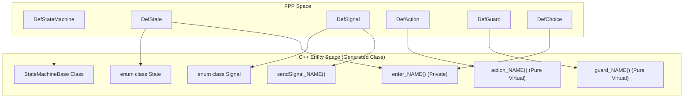
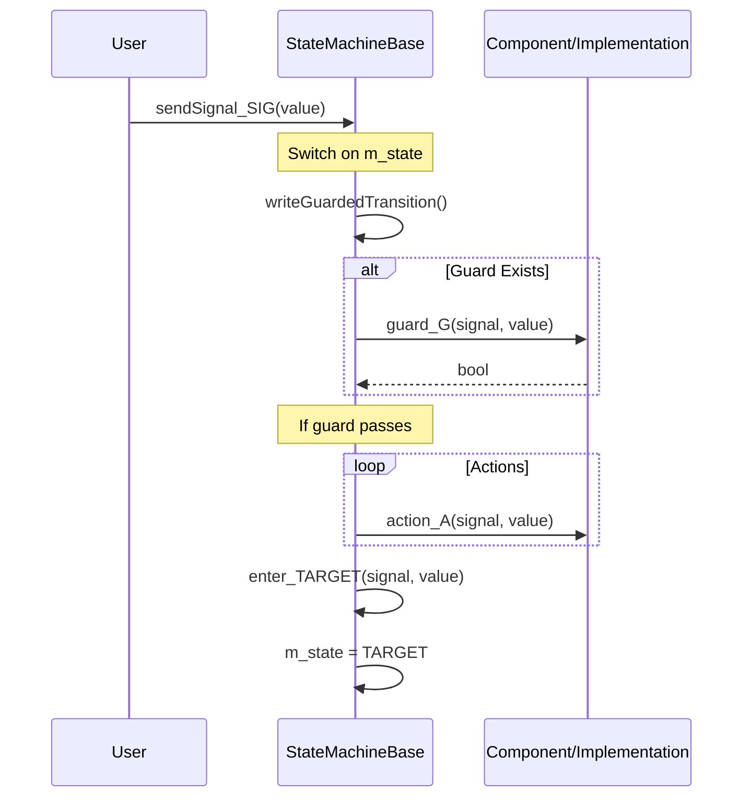

# Page: State Machine C++ Generator

# State Machine C++ Generator

Relevant source files

The following files were used as context for generating this wiki page:

- [compiler/lib/src/main/scala/analysis/Analyzers/StateMachine/SmTypedElementAnalyzer.scala](compiler/lib/src/main/scala/analysis/Analyzers/StateMachine/SmTypedElementAnalyzer.scala)
- [compiler/lib/src/main/scala/analysis/Analyzers/StateMachine/TransitionExprAnalyzer.scala](compiler/lib/src/main/scala/analysis/Analyzers/StateMachine/TransitionExprAnalyzer.scala)
- [compiler/lib/src/main/scala/analysis/CheckSemantics/StateMachine/CheckStateMachineSemantics.scala](compiler/lib/src/main/scala/analysis/CheckSemantics/StateMachine/CheckStateMachineSemantics.scala)
- [compiler/lib/src/main/scala/analysis/CheckSemantics/StateMachine/CheckStateMachineUses.scala](compiler/lib/src/main/scala/analysis/CheckSemantics/StateMachine/CheckStateMachineUses.scala)
- [compiler/lib/src/main/scala/analysis/CheckSemantics/StateMachine/CheckTransitionGraph/CheckChoiceCycles.scala](compiler/lib/src/main/scala/analysis/CheckSemantics/StateMachine/CheckTransitionGraph/CheckChoiceCycles.scala)
- [compiler/lib/src/main/scala/analysis/CheckSemantics/StateMachine/CheckTransitionGraph/CheckTGReachability.scala](compiler/lib/src/main/scala/analysis/CheckSemantics/StateMachine/CheckTransitionGraph/CheckTGReachability.scala)
- [compiler/lib/src/main/scala/analysis/CheckSemantics/StateMachine/CheckTransitionGraph/CheckTransitionGraph.scala](compiler/lib/src/main/scala/analysis/CheckSemantics/StateMachine/CheckTransitionGraph/CheckTransitionGraph.scala)
- [compiler/lib/src/main/scala/analysis/CheckSemantics/StateMachine/CheckTransitionGraph/ConstructTransitionGraph.scala](compiler/lib/src/main/scala/analysis/CheckSemantics/StateMachine/CheckTransitionGraph/ConstructTransitionGraph.scala)
- [compiler/lib/src/main/scala/analysis/CheckSemantics/StateMachine/CheckTypedElements/CheckActionAndGuardTypes.scala](compiler/lib/src/main/scala/analysis/CheckSemantics/StateMachine/CheckTypedElements/CheckActionAndGuardTypes.scala)
- [compiler/lib/src/main/scala/analysis/CheckSemantics/StateMachine/CheckTypedElements/CheckTypedElements.scala](compiler/lib/src/main/scala/analysis/CheckSemantics/StateMachine/CheckTypedElements/CheckTypedElements.scala)
- [compiler/lib/src/main/scala/analysis/CheckSemantics/StateMachine/CheckTypedElements/ComputeTypeOptionMap.scala](compiler/lib/src/main/scala/analysis/CheckSemantics/StateMachine/CheckTypedElements/ComputeTypeOptionMap.scala)
- [compiler/lib/src/main/scala/analysis/CheckSemantics/StateMachine/ComputeFlattenedJunctionTransitionMap.scala](compiler/lib/src/main/scala/analysis/CheckSemantics/StateMachine/ComputeFlattenedJunctionTransitionMap.scala)
- [compiler/lib/src/main/scala/analysis/CheckSemantics/StateMachine/ComputeFlattenedStateTransitionMap.scala](compiler/lib/src/main/scala/analysis/CheckSemantics/StateMachine/ComputeFlattenedStateTransitionMap.scala)
- [compiler/lib/src/main/scala/analysis/CheckSemantics/StateMachine/ConstructFlattenedTransition.scala](compiler/lib/src/main/scala/analysis/CheckSemantics/StateMachine/ConstructFlattenedTransition.scala)
- [compiler/lib/src/main/scala/analysis/Semantics/StateMachine/State.scala](compiler/lib/src/main/scala/analysis/Semantics/StateMachine/State.scala)
- [compiler/lib/src/main/scala/analysis/Semantics/StateMachine/StateMachine.scala](compiler/lib/src/main/scala/analysis/Semantics/StateMachine/StateMachine.scala)
- [compiler/lib/src/main/scala/analysis/Semantics/StateMachine/StateMachineAnalysis.scala](compiler/lib/src/main/scala/analysis/Semantics/StateMachine/StateMachineAnalysis.scala)
- [compiler/lib/src/main/scala/analysis/Semantics/StateMachine/StateMachineTypedElement.scala](compiler/lib/src/main/scala/analysis/Semantics/StateMachine/StateMachineTypedElement.scala)
- [compiler/lib/src/main/scala/analysis/Semantics/StateMachine/StateOrJunction.scala](compiler/lib/src/main/scala/analysis/Semantics/StateMachine/StateOrJunction.scala)
- [compiler/lib/src/main/scala/analysis/Semantics/StateMachine/Transition.scala](compiler/lib/src/main/scala/analysis/Semantics/StateMachine/Transition.scala)
- [compiler/lib/src/main/scala/analysis/Semantics/StateMachine/TransitionGraph.scala](compiler/lib/src/main/scala/analysis/Semantics/StateMachine/TransitionGraph.scala)
- [compiler/lib/src/main/scala/codegen/CppWriter/AutocodeCppWriter.scala](compiler/lib/src/main/scala/codegen/CppWriter/AutocodeCppWriter.scala)
- [compiler/lib/src/main/scala/codegen/CppWriter/ComponentCppWriter/MessageType.scala](compiler/lib/src/main/scala/codegen/CppWriter/ComponentCppWriter/MessageType.scala)
- [compiler/lib/src/main/scala/codegen/CppWriter/StateMachineCppWriter/StateMachineCppVisitor.scala](compiler/lib/src/main/scala/codegen/CppWriter/StateMachineCppWriter/StateMachineCppVisitor.scala)
- [compiler/lib/src/main/scala/codegen/CppWriter/StateMachineCppWriter/StateMachineCppWriter.scala](compiler/lib/src/main/scala/codegen/CppWriter/StateMachineCppWriter/StateMachineCppWriter.scala)
- [compiler/lib/src/main/scala/codegen/CppWriter/StateMachineCppWriter/StateMachineCppWriterUtils.scala](compiler/lib/src/main/scala/codegen/CppWriter/StateMachineCppWriter/StateMachineCppWriterUtils.scala)
- [compiler/lib/src/main/scala/codegen/CppWriter/StateMachineCppWriter/StateMachineEntryFns.scala](compiler/lib/src/main/scala/codegen/CppWriter/StateMachineCppWriter/StateMachineEntryFns.scala)
- [compiler/tools/fpp-to-cpp/test/component/base/SmChoiceActiveComponentAc.ref.cpp](compiler/tools/fpp-to-cpp/test/component/base/SmChoiceActiveComponentAc.ref.cpp)
- [compiler/tools/fpp-to-cpp/test/component/base/SmChoiceActiveComponentAc.ref.hpp](compiler/tools/fpp-to-cpp/test/component/base/SmChoiceActiveComponentAc.ref.hpp)
- [compiler/tools/fpp-to-cpp/test/component/base/SmChoiceQueuedComponentAc.ref.cpp](compiler/tools/fpp-to-cpp/test/component/base/SmChoiceQueuedComponentAc.ref.cpp)
- [compiler/tools/fpp-to-cpp/test/component/base/SmChoiceQueuedComponentAc.ref.hpp](compiler/tools/fpp-to-cpp/test/component/base/SmChoiceQueuedComponentAc.ref.hpp)
- [compiler/tools/fpp-to-cpp/test/component/base/SmInitialActiveComponentAc.ref.cpp](compiler/tools/fpp-to-cpp/test/component/base/SmInitialActiveComponentAc.ref.cpp)
- [compiler/tools/fpp-to-cpp/test/component/base/SmInitialActiveComponentAc.ref.hpp](compiler/tools/fpp-to-cpp/test/component/base/SmInitialActiveComponentAc.ref.hpp)
- [compiler/tools/fpp-to-cpp/test/component/base/SmInitialQueuedComponentAc.ref.cpp](compiler/tools/fpp-to-cpp/test/component/base/SmInitialQueuedComponentAc.ref.cpp)
- [compiler/tools/fpp-to-cpp/test/component/base/SmInitialQueuedComponentAc.ref.hpp](compiler/tools/fpp-to-cpp/test/component/base/SmInitialQueuedComponentAc.ref.hpp)
- [compiler/tools/fpp-to-cpp/test/component/base/SmStateActiveComponentAc.ref.cpp](compiler/tools/fpp-to-cpp/test/component/base/SmStateActiveComponentAc.ref.cpp)
- [compiler/tools/fpp-to-cpp/test/component/base/SmStateActiveComponentAc.ref.hpp](compiler/tools/fpp-to-cpp/test/component/base/SmStateActiveComponentAc.ref.hpp)
- [compiler/tools/fpp-to-cpp/test/component/base/SmStateQueuedComponentAc.ref.cpp](compiler/tools/fpp-to-cpp/test/component/base/SmStateQueuedComponentAc.ref.cpp)
- [compiler/tools/fpp-to-cpp/test/component/base/SmStateQueuedComponentAc.ref.hpp](compiler/tools/fpp-to-cpp/test/component/base/SmStateQueuedComponentAc.ref.hpp)
- [compiler/tools/fpp-to-cpp/test/component/gen_deps_comma](compiler/tools/fpp-to-cpp/test/component/gen_deps_comma)
- [compiler/tools/fpp-to-cpp/test/component/include/sm_state.fppi](compiler/tools/fpp-to-cpp/test/component/include/sm_state.fppi)
- [compiler/tools/fpp-to-cpp/test/component/sm-deps-comma.txt](compiler/tools/fpp-to-cpp/test/component/sm-deps-comma.txt)
- [compiler/tools/fpp-to-cpp/test/component/sm-deps.txt](compiler/tools/fpp-to-cpp/test/component/sm-deps.txt)
- [compiler/tools/fpp-to-cpp/test/component/sm_initial.fpp](compiler/tools/fpp-to-cpp/test/component/sm_initial.fpp)
- [compiler/tools/fpp-to-cpp/test/component/sm_state.fpp](compiler/tools/fpp-to-cpp/test/component/sm_state.fpp)
- [compiler/tools/fpp-to-cpp/test/state-machine/choice/check-cpp](compiler/tools/fpp-to-cpp/test/state-machine/choice/check-cpp)
- [compiler/tools/fpp-to-cpp/test/state-machine/harness/clean](compiler/tools/fpp-to-cpp/test/state-machine/harness/clean)
- [compiler/tools/fpp-to-cpp/test/state-machine/harness/generate-cpp](compiler/tools/fpp-to-cpp/test/state-machine/harness/generate-cpp)
- [compiler/tools/fpp-to-cpp/test/state-machine/harness/harness.fpp](compiler/tools/fpp-to-cpp/test/state-machine/harness/harness.fpp)
- [compiler/tools/fpp-to-cpp/test/state-machine/initial/check-cpp](compiler/tools/fpp-to-cpp/test/state-machine/initial/check-cpp)
- [compiler/tools/fpp-to-cpp/test/state-machine/state/Basic.fpp](compiler/tools/fpp-to-cpp/test/state-machine/state/Basic.fpp)
- [compiler/tools/fpp-to-cpp/test/state-machine/state/BasicGuardStateMachineAc.ref.cpp](compiler/tools/fpp-to-cpp/test/state-machine/state/BasicGuardStateMachineAc.ref.cpp)
- [compiler/tools/fpp-to-cpp/test/state-machine/state/BasicGuardStringStateMachineAc.ref.hpp](compiler/tools/fpp-to-cpp/test/state-machine/state/BasicGuardStringStateMachineAc.ref.hpp)
- [compiler/tools/fpp-to-cpp/test/state-machine/state/BasicSelfStateMachineAc.ref.cpp](compiler/tools/fpp-to-cpp/test/state-machine/state/BasicSelfStateMachineAc.ref.cpp)
- [compiler/tools/fpp-to-cpp/test/state-machine/state/BasicSelfStateMachineAc.ref.hpp](compiler/tools/fpp-to-cpp/test/state-machine/state/BasicSelfStateMachineAc.ref.hpp)
- [compiler/tools/fpp-to-cpp/test/state-machine/state/BasicStateMachineAc.ref.cpp](compiler/tools/fpp-to-cpp/test/state-machine/state/BasicStateMachineAc.ref.cpp)
- [compiler/tools/fpp-to-cpp/test/state-machine/state/BasicStringStateMachineAc.ref.cpp](compiler/tools/fpp-to-cpp/test/state-machine/state/BasicStringStateMachineAc.ref.cpp)
- [compiler/tools/fpp-to-cpp/test/state-machine/state/BasicStringStateMachineAc.ref.hpp](compiler/tools/fpp-to-cpp/test/state-machine/state/BasicStringStateMachineAc.ref.hpp)
- [compiler/tools/fpp-to-cpp/test/state-machine/state/BasicTestAbsTypeStateMachineAc.ref.cpp](compiler/tools/fpp-to-cpp/test/state-machine/state/BasicTestAbsTypeStateMachineAc.ref.cpp)
- [compiler/tools/fpp-to-cpp/test/state-machine/state/BasicTestAbsTypeStateMachineAc.ref.hpp](compiler/tools/fpp-to-cpp/test/state-machine/state/BasicTestAbsTypeStateMachineAc.ref.hpp)
- [compiler/tools/fpp-to-cpp/test/state-machine/state/BasicU32.fpp](compiler/tools/fpp-to-cpp/test/state-machine/state/BasicU32.fpp)
- [compiler/tools/fpp-to-cpp/test/state-machine/state/BasicU32StateMachineAc.ref.cpp](compiler/tools/fpp-to-cpp/test/state-machine/state/BasicU32StateMachineAc.ref.cpp)
- [compiler/tools/fpp-to-cpp/test/state-machine/state/BasicU32StateMachineAc.ref.hpp](compiler/tools/fpp-to-cpp/test/state-machine/state/BasicU32StateMachineAc.ref.hpp)
- [compiler/tools/fpp-to-cpp/test/state-machine/state/Internal.fpp](compiler/tools/fpp-to-cpp/test/state-machine/state/Internal.fpp)
- [compiler/tools/fpp-to-cpp/test/state-machine/state/Polymorphism.fpp](compiler/tools/fpp-to-cpp/test/state-machine/state/Polymorphism.fpp)
- [compiler/tools/fpp-to-cpp/test/state-machine/state/check-cpp](compiler/tools/fpp-to-cpp/test/state-machine/state/check-cpp)
- [compiler/tools/fpp-to-cpp/test/state-machine/state/fpp-flags.sh](compiler/tools/fpp-to-cpp/test/state-machine/state/fpp-flags.sh)
- [compiler/tools/fpp-to-cpp/test/state-machine/state/include/Basic.fppi](compiler/tools/fpp-to-cpp/test/state-machine/state/include/Basic.fppi)
- [compiler/tools/fpp-to-cpp/test/state-machine/state/run.sh](compiler/tools/fpp-to-cpp/test/state-machine/state/run.sh)
- [compiler/tools/fpp-to-cpp/test/state-machine/state/tests.sh](compiler/tools/fpp-to-cpp/test/state-machine/state/tests.sh)
- [compiler/tools/fpp-to-cpp/test/state-machine/state/update-ref.sh](compiler/tools/fpp-to-cpp/test/state-machine/state/update-ref.sh)

The State Machine C++ Generator translates FPP hierarchical state machine definitions into C++ base classes. These generated classes manage state transitions, signal dispatching, and execution of entry/exit actions and transition actions. The generator relies on a flattened semantic model to handle the complexity of hierarchical transitions.

## Overview of the Generation Process

The generation process is driven by `StateMachineCppWriter`, which produces a C++ class named `${Name}StateMachineBase`. This class is designed to be inherited by a component or a specific state machine implementation.

### Key Responsibilities
1.  **State Management**: Maintaining the current leaf state in a private member `m_state`.
2.  **Signal Dispatch**: Providing `sendSignal_${SignalName}` methods that trigger transitions based on the current state.
3.  **Hierarchical Flattening**: Translating hierarchical transitions (which may involve multiple entry/exit actions across different levels) into linear sequences of function calls.
4.  **Action/Guard Dispatch**: Providing pure virtual functions for actions and guards that the user must implement.

Sources: [compiler/lib/src/main/scala/codegen/CppWriter/StateMachineCppWriter/StateMachineCppWriter.scala:7-21](), [compiler/lib/src/main/scala/codegen/CppWriter/StateMachineCppWriter/StateMachineCppWriterUtils.scala:18-21]()

---

## Code Entity Mapping

The following diagram shows how FPP state machine constructs are mapped to C++ class entities.

### FPP to C++ Entity Map

Sources: [compiler/lib/src/main/scala/codegen/CppWriter/StateMachineCppWriter/StateMachineCppWriter.scala:42-54](), [compiler/lib/src/main/scala/codegen/CppWriter/StateMachineCppWriter/StateMachineCppWriterUtils.scala:47-55]()

---

## Core Components

### StateMachineCppWriter
The main entry point for state machine code generation. It organizes the C++ class structure by aggregating members from various helpers. It defines the public interface for sending signals and the protected interface for implementing behavior.

*   **`write`**: Orchestrates the creation of the `CppDoc` containing the header and implementation content [compiler/lib/src/main/scala/codegen/CppWriter/StateMachineCppWriter/StateMachineCppWriter.scala:12-21]().
*   **`getClassMembers`**: Concatenates constructors, initializers, getters, signal senders, and the virtual action/guard interfaces [compiler/lib/src/main/scala/codegen/CppWriter/StateMachineCppWriter/StateMachineCppWriter.scala:42-54]().

### StateMachineCppWriterUtils
Provides shared utility functions for naming and code snippet generation. It handles the mapping between FPP symbols and C++ identifiers.

*   **Naming**: Generates names like `action_${name}`, `guard_${name}`, and `sendSignal_${name}` [compiler/lib/src/main/scala/codegen/CppWriter/StateMachineCppWriter/StateMachineCppWriterUtils.scala:47-54]().
*   **Call Generation**: Provides `writeActionCall`, `writeGuardCall`, and `writeEnterCall` to generate the C++ code for invoking these elements [compiler/lib/src/main/scala/codegen/CppWriter/StateMachineCppWriter/StateMachineCppWriterUtils.scala:123-160]().

### StateMachineEntryFns
This helper generates the private `enter_NAME` functions for states and choices. These functions are critical for hierarchical state machines because they encapsulate the logic for entering a state, which may include executing entry actions and recursively entering initial sub-states.

*   **Choice Entry**: Implements the logic for `DefChoice` by evaluating a guard and branching to the `if` or `else` transition target [compiler/lib/src/main/scala/codegen/CppWriter/StateMachineCppWriter/StateMachineEntryFns.scala:14-40]().
*   **State Entry**: Handles both leaf and inner states. For inner states, it triggers the initial transition after performing entry actions [compiler/lib/src/main/scala/codegen/CppWriter/StateMachineCppWriter/StateMachineEntryFns.scala:42-62]().

Sources: [compiler/lib/src/main/scala/codegen/CppWriter/StateMachineCppWriter/StateMachineCppWriter.scala:87-92](), [compiler/lib/src/main/scala/codegen/CppWriter/StateMachineCppWriter/StateMachineEntryFns.scala:7-10]()

---

## Transition Logic and Flattening

State machines in FPP support hierarchy, but the generated C++ uses a flattened approach for performance and clarity.

### Data Flow: Signal to State Update
The following diagram illustrates the flow of execution when a signal is received by the state machine.

### Flattened Transition Construction
During semantic analysis, the compiler computes a `flattenedStateTransitionMap`. This map pre-calculates the exact sequence of exit and entry actions required to move from a source state to a target state across hierarchical boundaries.

*   **`ConstructFlattenedTransition`**: Calculates the longest common prefix (LCP) of the source and target state hierarchies. It then determines the sequence of:
    1.  Exit actions for states being left (from source up to LCP).
    2.  Transition actions defined on the transition itself.
    3.  Entry actions for states being entered (from LCP down to target).

Sources: [compiler/lib/src/main/scala/analysis/CheckSemantics/StateMachine/ConstructFlattenedTransition.scala:20-32](), [compiler/lib/src/main/scala/analysis/Semantics/StateMachine/StateMachineAnalysis.scala:32-35]()

---

## Generated Class Structure

The generated `StateMachineBase` class follows a consistent access pattern:

| Access | Category | Description |
| :--- | :--- | :--- |
| **Public** | Getters | `getState()` to retrieve the current leaf state. |
| **Public** | Signals | `sendSignal_NAME(...)` methods for each defined signal. |
| **Protected** | Actions | Pure virtual `void action_NAME(...)` functions to be implemented by the user. |
| **Protected** | Guards | Pure virtual `bool guard_NAME(...) const` functions to be implemented by the user. |
| **Protected** | Init | `initBase(id)` to initialize the state machine and trigger the initial transition. |
| **Private** | Entry Fns | `enter_NAME(...)` internal functions for state/choice logic. |
| **Private** | State | `m_state` member of type `State` (enum class). |

Sources: [compiler/lib/src/main/scala/codegen/CppWriter/StateMachineCppWriter/StateMachineCppWriter.scala:42-54](), [compiler/lib/src/main/scala/codegen/CppWriter/StateMachineCppWriter/StateMachineCppWriter.scala:109-124]()
