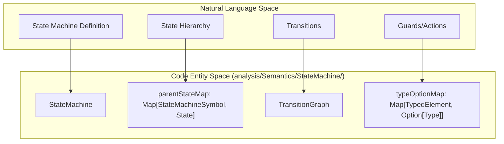
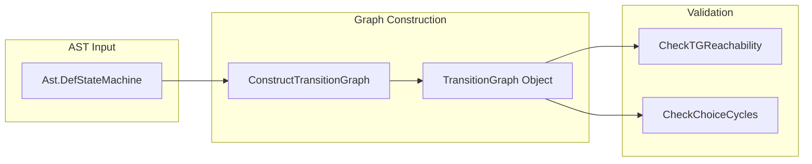
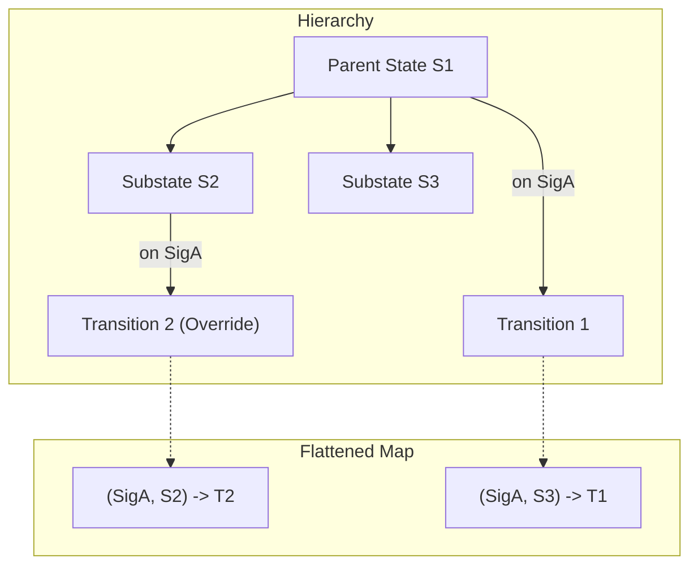

# Page: State Machine Semantic Analysis

# State Machine Semantic Analysis

Relevant source files

The following files were used as context for generating this wiki page:

- [compiler/lib/src/main/scala/analysis/Analyzers/StateMachine/SmTypedElementAnalyzer.scala](compiler/lib/src/main/scala/analysis/Analyzers/StateMachine/SmTypedElementAnalyzer.scala)
- [compiler/lib/src/main/scala/analysis/Analyzers/StateMachine/StateMachineUseAnalyzer.scala](compiler/lib/src/main/scala/analysis/Analyzers/StateMachine/StateMachineUseAnalyzer.scala)
- [compiler/lib/src/main/scala/analysis/Analyzers/StateMachine/TransitionExprAnalyzer.scala](compiler/lib/src/main/scala/analysis/Analyzers/StateMachine/TransitionExprAnalyzer.scala)
- [compiler/lib/src/main/scala/analysis/CheckSemantics/StateMachine/CheckInitialTransitions.scala](compiler/lib/src/main/scala/analysis/CheckSemantics/StateMachine/CheckInitialTransitions.scala)
- [compiler/lib/src/main/scala/analysis/CheckSemantics/StateMachine/CheckStateMachineSemantics.scala](compiler/lib/src/main/scala/analysis/CheckSemantics/StateMachine/CheckStateMachineSemantics.scala)
- [compiler/lib/src/main/scala/analysis/CheckSemantics/StateMachine/CheckStateMachineUses.scala](compiler/lib/src/main/scala/analysis/CheckSemantics/StateMachine/CheckStateMachineUses.scala)
- [compiler/lib/src/main/scala/analysis/CheckSemantics/StateMachine/CheckTransitionGraph/CheckChoiceCycles.scala](compiler/lib/src/main/scala/analysis/CheckSemantics/StateMachine/CheckTransitionGraph/CheckChoiceCycles.scala)
- [compiler/lib/src/main/scala/analysis/CheckSemantics/StateMachine/CheckTransitionGraph/CheckTGReachability.scala](compiler/lib/src/main/scala/analysis/CheckSemantics/StateMachine/CheckTransitionGraph/CheckTGReachability.scala)
- [compiler/lib/src/main/scala/analysis/CheckSemantics/StateMachine/CheckTransitionGraph/CheckTransitionGraph.scala](compiler/lib/src/main/scala/analysis/CheckSemantics/StateMachine/CheckTransitionGraph/CheckTransitionGraph.scala)
- [compiler/lib/src/main/scala/analysis/CheckSemantics/StateMachine/CheckTransitionGraph/ConstructTransitionGraph.scala](compiler/lib/src/main/scala/analysis/CheckSemantics/StateMachine/CheckTransitionGraph/ConstructTransitionGraph.scala)
- [compiler/lib/src/main/scala/analysis/CheckSemantics/StateMachine/CheckTypedElements/CheckActionAndGuardTypes.scala](compiler/lib/src/main/scala/analysis/CheckSemantics/StateMachine/CheckTypedElements/CheckActionAndGuardTypes.scala)
- [compiler/lib/src/main/scala/analysis/CheckSemantics/StateMachine/CheckTypedElements/CheckTypedElements.scala](compiler/lib/src/main/scala/analysis/CheckSemantics/StateMachine/CheckTypedElements/CheckTypedElements.scala)
- [compiler/lib/src/main/scala/analysis/CheckSemantics/StateMachine/CheckTypedElements/ComputeTypeOptionMap.scala](compiler/lib/src/main/scala/analysis/CheckSemantics/StateMachine/CheckTypedElements/ComputeTypeOptionMap.scala)
- [compiler/lib/src/main/scala/analysis/CheckSemantics/StateMachine/ComputeFlattenedJunctionTransitionMap.scala](compiler/lib/src/main/scala/analysis/CheckSemantics/StateMachine/ComputeFlattenedJunctionTransitionMap.scala)
- [compiler/lib/src/main/scala/analysis/CheckSemantics/StateMachine/ComputeFlattenedStateTransitionMap.scala](compiler/lib/src/main/scala/analysis/CheckSemantics/StateMachine/ComputeFlattenedStateTransitionMap.scala)
- [compiler/lib/src/main/scala/analysis/CheckSemantics/StateMachine/ConstructFlattenedTransition.scala](compiler/lib/src/main/scala/analysis/CheckSemantics/StateMachine/ConstructFlattenedTransition.scala)
- [compiler/lib/src/main/scala/analysis/Semantics/StateMachine/State.scala](compiler/lib/src/main/scala/analysis/Semantics/StateMachine/State.scala)
- [compiler/lib/src/main/scala/analysis/Semantics/StateMachine/StateMachine.scala](compiler/lib/src/main/scala/analysis/Semantics/StateMachine/StateMachine.scala)
- [compiler/lib/src/main/scala/analysis/Semantics/StateMachine/StateMachineAnalysis.scala](compiler/lib/src/main/scala/analysis/Semantics/StateMachine/StateMachineAnalysis.scala)
- [compiler/lib/src/main/scala/analysis/Semantics/StateMachine/StateMachineTypedElement.scala](compiler/lib/src/main/scala/analysis/Semantics/StateMachine/StateMachineTypedElement.scala)
- [compiler/lib/src/main/scala/analysis/Semantics/StateMachine/StateOrJunction.scala](compiler/lib/src/main/scala/analysis/Semantics/StateMachine/StateOrJunction.scala)
- [compiler/lib/src/main/scala/analysis/Semantics/StateMachine/Transition.scala](compiler/lib/src/main/scala/analysis/Semantics/StateMachine/Transition.scala)
- [compiler/lib/src/main/scala/analysis/Semantics/StateMachine/TransitionGraph.scala](compiler/lib/src/main/scala/analysis/Semantics/StateMachine/TransitionGraph.scala)
- [compiler/lib/src/main/scala/codegen/CppWriter/AutocodeCppWriter.scala](compiler/lib/src/main/scala/codegen/CppWriter/AutocodeCppWriter.scala)
- [compiler/lib/src/main/scala/codegen/CppWriter/ComponentCppWriter/MessageType.scala](compiler/lib/src/main/scala/codegen/CppWriter/ComponentCppWriter/MessageType.scala)
- [compiler/lib/src/main/scala/codegen/CppWriter/StateMachineCppWriter/StateMachineCppVisitor.scala](compiler/lib/src/main/scala/codegen/CppWriter/StateMachineCppWriter/StateMachineCppVisitor.scala)
- [compiler/lib/src/main/scala/codegen/CppWriter/StateMachineCppWriter/StateMachineCppWriter.scala](compiler/lib/src/main/scala/codegen/CppWriter/StateMachineCppWriter/StateMachineCppWriter.scala)
- [compiler/lib/src/main/scala/codegen/CppWriter/StateMachineCppWriter/StateMachineCppWriterUtils.scala](compiler/lib/src/main/scala/codegen/CppWriter/StateMachineCppWriter/StateMachineCppWriterUtils.scala)
- [compiler/lib/src/main/scala/codegen/CppWriter/StateMachineCppWriter/StateMachineEntryFns.scala](compiler/lib/src/main/scala/codegen/CppWriter/StateMachineCppWriter/StateMachineEntryFns.scala)
- [compiler/tools/fpp-check/test/array/default_error.ref.txt](compiler/tools/fpp-check/test/array/default_error.ref.txt)
- [compiler/tools/fpp-check/test/array/no_default_ok.ref.txt](compiler/tools/fpp-check/test/array/no_default_ok.ref.txt)
- [compiler/tools/fpp-check/test/array/tests.sh](compiler/tools/fpp-check/test/array/tests.sh)
- [compiler/tools/fpp-check/test/state_machine/initial_transitions/sm_mismatched_parents.ref.txt](compiler/tools/fpp-check/test/state_machine/initial_transitions/sm_mismatched_parents.ref.txt)
- [compiler/tools/fpp-check/test/state_machine/initial_transitions/state_mismatched_parents.ref.txt](compiler/tools/fpp-check/test/state_machine/initial_transitions/state_mismatched_parents.ref.txt)
- [compiler/tools/fpp-check/test/state_machine/initial_transitions/tests.sh](compiler/tools/fpp-check/test/state_machine/initial_transitions/tests.sh)
- [compiler/tools/fpp-check/test/state_machine/transition_graph/tests.sh](compiler/tools/fpp-check/test/state_machine/transition_graph/tests.sh)
- [compiler/tools/fpp-check/test/state_machine/typed_elements/state_external_transition_bad_action_type.fpp](compiler/tools/fpp-check/test/state_machine/typed_elements/state_external_transition_bad_action_type.fpp)
- [compiler/tools/fpp-check/test/state_machine/typed_elements/state_external_transition_bad_action_type.ref.txt](compiler/tools/fpp-check/test/state_machine/typed_elements/state_external_transition_bad_action_type.ref.txt)
- [compiler/tools/fpp-check/test/state_machine/typed_elements/state_self_transition_bad_action_type.fpp](compiler/tools/fpp-check/test/state_machine/typed_elements/state_self_transition_bad_action_type.fpp)
- [compiler/tools/fpp-check/test/state_machine/typed_elements/state_self_transition_bad_action_type.ref.txt](compiler/tools/fpp-check/test/state_machine/typed_elements/state_self_transition_bad_action_type.ref.txt)
- [compiler/tools/fpp-check/test/state_machine/typed_elements/tests.sh](compiler/tools/fpp-check/test/state_machine/typed_elements/tests.sh)
- [compiler/tools/fpp-to-cpp/test/struct/AArrayAc.ref.hpp](compiler/tools/fpp-to-cpp/test/struct/AArrayAc.ref.hpp)
- [compiler/tools/fpp-to-cpp/test/struct/array.fpp](compiler/tools/fpp-to-cpp/test/struct/array.fpp)
- [compiler/tools/fpp-to-cpp/test/struct/array.ref.txt](compiler/tools/fpp-to-cpp/test/struct/array.ref.txt)
- [docs/spec/Definitions/State-Machine-Definitions.adoc](docs/spec/Definitions/State-Machine-Definitions.adoc)
- [docs/spec/State-Machine-Behavior-Elements/Action-Definitions.adoc](docs/spec/State-Machine-Behavior-Elements/Action-Definitions.adoc)
- [docs/spec/State-Machine-Behavior-Elements/Do-Expressions.adoc](docs/spec/State-Machine-Behavior-Elements/Do-Expressions.adoc)
- [docs/spec/State-Machine-Behavior-Elements/Guard-Definitions.adoc](docs/spec/State-Machine-Behavior-Elements/Guard-Definitions.adoc)
- [docs/spec/State-Machine-Behavior-Elements/Initial-Transition-Specifiers.adoc](docs/spec/State-Machine-Behavior-Elements/Initial-Transition-Specifiers.adoc)
- [docs/spec/State-Machine-Behavior-Elements/State-Definitions.adoc](docs/spec/State-Machine-Behavior-Elements/State-Definitions.adoc)
- [docs/spec/State-Machine-Behavior-Elements/State-Entry-Specifiers.adoc](docs/spec/State-Machine-Behavior-Elements/State-Entry-Specifiers.adoc)
- [docs/spec/State-Machine-Behavior-Elements/State-Exit-Specifiers.adoc](docs/spec/State-Machine-Behavior-Elements/State-Exit-Specifiers.adoc)
- [docs/spec/State-Machine-Behavior-Elements/State-Transition-Specifiers.adoc](docs/spec/State-Machine-Behavior-Elements/State-Transition-Specifiers.adoc)
- [docs/spec/State-Machine-Behavior-Elements/Transition-Expressions.adoc](docs/spec/State-Machine-Behavior-Elements/Transition-Expressions.adoc)
- [docs/spec/State-Machine-Behavior-Elements/defs.sh](docs/spec/State-Machine-Behavior-Elements/defs.sh)

The State Machine Semantic Analysis sub-system validates the structure, connectivity, and type safety of FPP state machine definitions. It transforms the raw AST into a resolved semantic model, constructing transition graphs and flattening hierarchical behaviors into lookup maps for code generation.

## State Machine Analysis Data Structures

The primary data structures for state machine analysis are `StateMachine` and `StateMachineAnalysis`. These store the results of the analysis passes and provide the necessary metadata for the C++ backend.

*   **`StateMachine`**: A high-level wrapper containing the state machine's AST node and its associated analysis results [compiler/lib/src/main/scala/analysis/Semantics/StateMachine/StateMachine.scala:7-12](). It identifies whether a state machine is **Internal** (behavior specified in FPP) or **External** (implementation provided manually) [compiler/lib/src/main/scala/analysis/Semantics/StateMachine/StateMachine.scala:33-45]().
*   **`StateMachineAnalysis`**: The core state object for the analysis pipeline. It contains:
    *   **Symbol Tables**: Maps for scopes (`symbolScopeMap`) and use-to-definition resolutions (`useDefMap`) [compiler/lib/src/main/scala/analysis/Semantics/StateMachine/StateMachineAnalysis.scala:21-23]().
    *   **Hierarchy Tracking**: A `parentStateMap` that tracks the nesting of states and choices [compiler/lib/src/main/scala/analysis/Semantics/StateMachine/StateMachineAnalysis.scala:19]().
    *   **Transition Graphs**: Directed graphs representing possible state transitions and their reverse for reachability analysis [compiler/lib/src/main/scala/analysis/Semantics/StateMachine/StateMachineAnalysis.scala:25-27]().
    *   **Flattened Maps**: Maps such as `flattenedStateTransitionMap` which resolve hierarchical transitions (behavioral polymorphism) into a direct signal-to-state lookup [compiler/lib/src/main/scala/analysis/Semantics/StateMachine/StateMachineAnalysis.scala:33]().

### Analysis State Entity Mapping

The following diagram bridges the conceptual state machine elements to the internal Scala classes used during analysis.

**Analysis Entity Map**

Sources: [compiler/lib/src/main/scala/analysis/Semantics/StateMachine/StateMachineAnalysis.scala:7-36](), [compiler/lib/src/main/scala/analysis/Semantics/StateMachine/StateMachine.scala:7-30]()

---

## The Analysis Pipeline

The entry point for state machine analysis is `CheckStateMachineSemantics.defStateMachineAnnotatedNode`. It executes a sequence of specialized analysis passes [compiler/lib/src/main/scala/analysis/CheckSemantics/StateMachine/CheckStateMachineSemantics.scala:16-25]().

| Order | Pass | Responsibility |
| :--- | :--- | :--- |
| 1 | `EnterStateMachineSymbols` | Populates the symbol table with states, choices, signals, etc. |
| 2 | `CheckStateMachineUses` | Resolves identifiers (e.g., in transitions) to symbols. |
| 3 | `CheckInitialTransitions` | Validates that every state/machine has exactly one initial target. |
| 4 | `CheckTransitionGraph` | Constructs the graph and checks for reachability and choice cycles. |
| 5 | `CheckTypedElements` | Ensures signals, guards, and actions have compatible types. |
| 6 | `ComputeFlattenedMaps` | Resolves hierarchy into flat maps for the code generator. |

Sources: [compiler/lib/src/main/scala/analysis/CheckSemantics/StateMachine/CheckStateMachineSemantics.scala:9-31]()

---

## Symbol Entry and Initial Transitions

### Symbol Entry
The `EnterStateMachineSymbols` pass traverses the AST to register symbols for all state machine members, including nested states and choices. It establishes the `parentStateMap` which defines the hierarchy [compiler/lib/src/main/scala/analysis/Semantics/StateMachine/StateMachineAnalysis.scala:19]().

### Initial Transition Validation
The `CheckInitialTransitions` analyzer ensures the state machine and every non-leaf state have exactly one `initial` transition [compiler/lib/src/main/scala/analysis/CheckSemantics/StateMachine/CheckInitialTransitions.scala:22-26](). 

Key rules enforced:
1.  **Scope Constraint**: An initial transition must point to a state or choice defined within the same immediate scope [compiler/lib/src/main/scala/analysis/CheckSemantics/StateMachine/CheckInitialTransitions.scala:44-55]().
2.  **Uniqueness**: Multiple `initial` specifiers in one state result in a semantic error [compiler/lib/src/main/scala/analysis/CheckSemantics/StateMachine/CheckInitialTransitions.scala:113-118]().

Sources: [compiler/lib/src/main/scala/analysis/CheckSemantics/StateMachine/CheckInitialTransitions.scala:7-120](), [docs/spec/State-Machine-Behavior-Elements/Initial-Transition-Specifiers.adoc:18-30]()

---

## Transition Graph Construction and Validation

The transition graph represents the control flow of the state machine. It is constructed by `ConstructTransitionGraph` and validated by `CheckTransitionGraph`.

### Graph Construction
The graph nodes consist of `State` and `Choice` symbols [docs/spec/Definitions/State-Machine-Definitions.adoc:80-81](). Arcs are created from:
*   Initial transition specifiers.
*   State transition specifiers (`on Signal enter Target`).
*   Choice definitions (`if Guard enter Target1 else enter Target2`).

### Validation Rules
1.  **Reachability**: Every state and choice must be reachable from the state machine's initial node [docs/spec/Definitions/State-Machine-Definitions.adoc:122-123](). This is verified using the `CheckTGReachability` visitor.
2.  **Choice Cycles**: There must be no cycles consisting solely of choice nodes [docs/spec/Definitions/State-Machine-Definitions.adoc:125-128](). This prevents infinite loops during signal processing where no state change ever occurs. This is checked by `CheckChoiceCycles`.

**Transition Graph Data Flow**

Sources: [docs/spec/Definitions/State-Machine-Definitions.adoc:74-129](), [compiler/lib/src/main/scala/analysis/CheckSemantics/StateMachine/CheckTransitionGraph/CheckTransitionGraph.scala:7-25]()

---

## Typed Element Checking

FPP state machines support typed signals. If a signal carries a value, the associated guards and actions must be compatible with that type.

### Type Option Assignment
The analyzer `CheckTypedElements` (utilizing `ComputeTypeOptionMap`) assigns a "Type Option" to every typed element (transitions, entries, exits, choices) [docs/spec/Definitions/State-Machine-Definitions.adoc:153-156]().

*   **Signals**: The type of a transition is the type of the signal specified after `on` [docs/spec/Definitions/State-Machine-Definitions.adoc:161-163]().
*   **Choices**: A choice node's type is the **common type** of all transitions pointing to it [docs/spec/Definitions/State-Machine-Definitions.adoc:165-168](). If a choice is reached by an `I32` signal and a `U32` signal, the choice type must be compatible with both.
*   **Actions/Guards**: For every action `do A` or guard `if G`, the type of the triggering signal must be convertible to the type expected by `A` or `G` [docs/spec/Definitions/State-Machine-Definitions.adoc:174-180]().

Sources: [compiler/lib/src/main/scala/analysis/CheckSemantics/StateMachine/CheckTypedElements/CheckActionAndGuardTypes.scala:7-20](), [docs/spec/Definitions/State-Machine-Definitions.adoc:130-180]()

---

## Flattened Transition Maps

To simplify code generation and runtime execution, the compiler flattens the hierarchical state machine into direct lookup maps. This process resolves **Behavioral Polymorphism**: a transition defined in a parent state applies to all substates unless overridden by a more specific transition in a substate [docs/spec/State-Machine-Behavior-Elements/State-Transition-Specifiers.adoc:55-61]().

*   **`flattenedStateTransitionMap`**: A map of `(Signal, LeafState) -> GuardedTransition`. This allows the generated C++ code to use a simple `switch(state)` block inside a signal handler to find the correct transition logic [compiler/lib/src/main/scala/analysis/Semantics/StateMachine/StateMachineAnalysis.scala:153-154]().
*   **`flattenedChoiceTransitionMap`**: Resolves choice transitions to ensure that nested choices or junctions are processed as a single logical step [compiler/lib/src/main/scala/analysis/Semantics/StateMachine/StateMachineAnalysis.scala:35]().

**Behavioral Polymorphism Resolution**

Sources: [compiler/lib/src/main/scala/analysis/CheckSemantics/StateMachine/ComputeFlattenedStateTransitionMap.scala:7-20](), [docs/spec/State-Machine-Behavior-Elements/State-Transition-Specifiers.adoc:43-61]()
