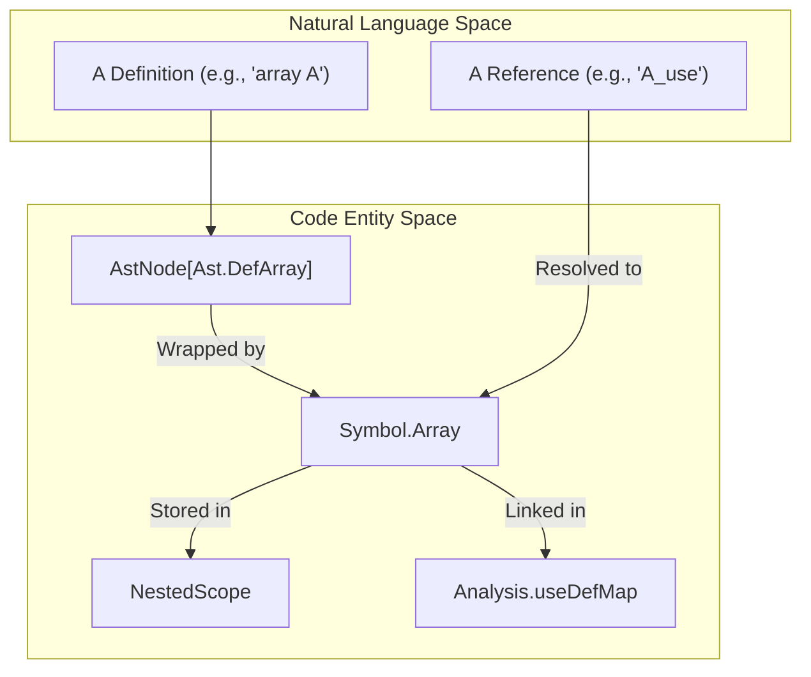
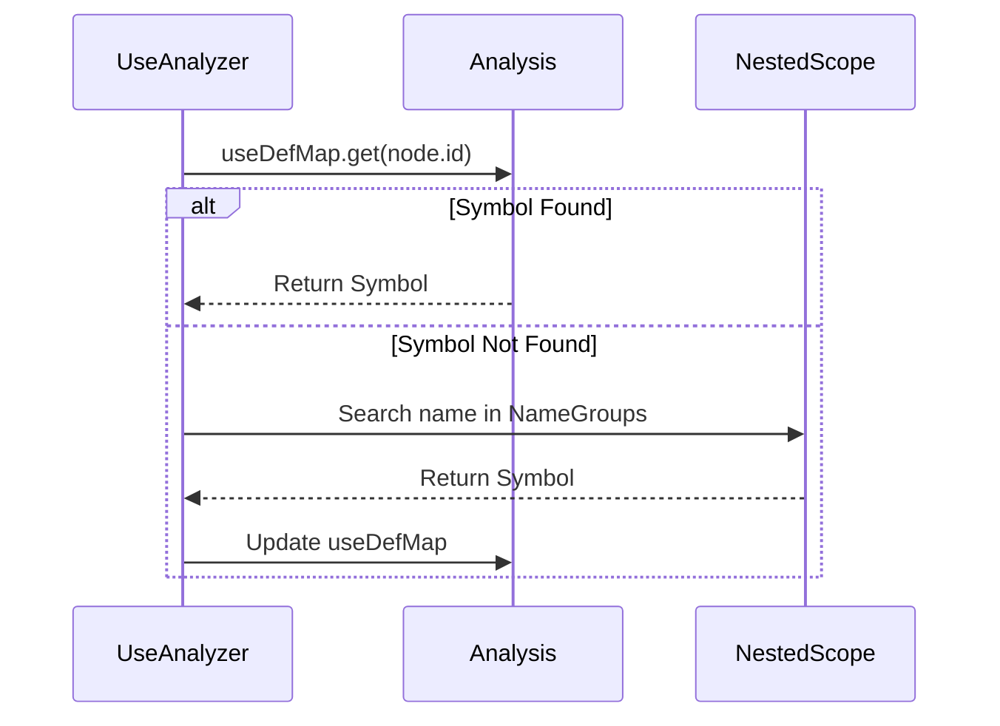

# Page: Symbol Table and Name Resolution

# Symbol Table and Name Resolution

Relevant source files

The following files were used as context for generating this wiki page:

- [compiler/lib/src/main/scala/analysis/Analyzers/Analyzer.scala](compiler/lib/src/main/scala/analysis/Analyzers/Analyzer.scala)
- [compiler/lib/src/main/scala/analysis/Analyzers/ComponentAnalyzer.scala](compiler/lib/src/main/scala/analysis/Analyzers/ComponentAnalyzer.scala)
- [compiler/lib/src/main/scala/analysis/Analyzers/EnumAnalyzer.scala](compiler/lib/src/main/scala/analysis/Analyzers/EnumAnalyzer.scala)
- [compiler/lib/src/main/scala/analysis/Analyzers/ModuleAnalyzer.scala](compiler/lib/src/main/scala/analysis/Analyzers/ModuleAnalyzer.scala)
- [compiler/lib/src/main/scala/analysis/Analyzers/TopologyAnalyzer.scala](compiler/lib/src/main/scala/analysis/Analyzers/TopologyAnalyzer.scala)
- [compiler/lib/src/main/scala/analysis/Analyzers/UseAnalyzer.scala](compiler/lib/src/main/scala/analysis/Analyzers/UseAnalyzer.scala)
- [compiler/lib/src/main/scala/analysis/CheckSemantics/CheckSpecLocs.scala](compiler/lib/src/main/scala/analysis/CheckSemantics/CheckSpecLocs.scala)
- [compiler/lib/src/main/scala/analysis/CheckSemantics/CheckUseDefCycles.scala](compiler/lib/src/main/scala/analysis/CheckSemantics/CheckUseDefCycles.scala)
- [compiler/lib/src/main/scala/analysis/CheckSemantics/EnterSymbols.scala](compiler/lib/src/main/scala/analysis/CheckSemantics/EnterSymbols.scala)
- [compiler/lib/src/main/scala/analysis/ComputeDependencies/BuildSpecLocMap.scala](compiler/lib/src/main/scala/analysis/ComputeDependencies/BuildSpecLocMap.scala)
- [compiler/lib/src/main/scala/analysis/ComputeDependencies/ComputeDependencies.scala](compiler/lib/src/main/scala/analysis/ComputeDependencies/ComputeDependencies.scala)
- [compiler/lib/src/main/scala/analysis/Semantics/Name.scala](compiler/lib/src/main/scala/analysis/Semantics/Name.scala)
- [compiler/lib/src/main/scala/analysis/Semantics/NameGroup.scala](compiler/lib/src/main/scala/analysis/Semantics/NameGroup.scala)
- [compiler/lib/src/main/scala/analysis/Semantics/NameSymbolMap.scala](compiler/lib/src/main/scala/analysis/Semantics/NameSymbolMap.scala)
- [compiler/lib/src/main/scala/analysis/Semantics/NestedScope.scala](compiler/lib/src/main/scala/analysis/Semantics/NestedScope.scala)
- [compiler/lib/src/main/scala/analysis/Semantics/Scope.scala](compiler/lib/src/main/scala/analysis/Semantics/Scope.scala)
- [compiler/lib/src/main/scala/analysis/Semantics/Symbol.scala](compiler/lib/src/main/scala/analysis/Semantics/Symbol.scala)
- [compiler/lib/src/main/scala/analysis/Semantics/SymbolInterface.scala](compiler/lib/src/main/scala/analysis/Semantics/SymbolInterface.scala)
- [compiler/lib/src/main/scala/analysis/UsedSymbols.scala](compiler/lib/src/main/scala/analysis/UsedSymbols.scala)
- [compiler/tools/fpp-check/test/component/array_format_not_numeric.fpp](compiler/tools/fpp-check/test/component/array_format_not_numeric.fpp)
- [compiler/tools/fpp-check/test/component/array_format_not_numeric.ref.txt](compiler/tools/fpp-check/test/component/array_format_not_numeric.ref.txt)
- [compiler/tools/fpp-check/test/component/struct_alias_format_not_numeric.fpp](compiler/tools/fpp-check/test/component/struct_alias_format_not_numeric.fpp)
- [compiler/tools/fpp-check/test/component/struct_alias_format_not_numeric.ref.txt](compiler/tools/fpp-check/test/component/struct_alias_format_not_numeric.ref.txt)
- [compiler/tools/fpp-check/test/component/struct_format_not_numeric.fpp](compiler/tools/fpp-check/test/component/struct_format_not_numeric.fpp)
- [compiler/tools/fpp-check/test/component/struct_format_not_numeric.ref.txt](compiler/tools/fpp-check/test/component/struct_format_not_numeric.ref.txt)
- [compiler/tools/fpp-check/test/connection_direct/undef_instance.ref.txt](compiler/tools/fpp-check/test/connection_direct/undef_instance.ref.txt)
- [compiler/tools/fpp-check/test/connection_pattern/undef_source.fpp](compiler/tools/fpp-check/test/connection_pattern/undef_source.fpp)
- [compiler/tools/fpp-check/test/connection_pattern/undef_source.ref.txt](compiler/tools/fpp-check/test/connection_pattern/undef_source.ref.txt)
- [compiler/tools/fpp-check/test/connection_pattern/undef_target.fpp](compiler/tools/fpp-check/test/connection_pattern/undef_target.fpp)
- [compiler/tools/fpp-check/test/connection_pattern/undef_target.ref.txt](compiler/tools/fpp-check/test/connection_pattern/undef_target.ref.txt)
- [compiler/tools/fpp-check/test/cycle/alias.fpp](compiler/tools/fpp-check/test/cycle/alias.fpp)
- [compiler/tools/fpp-check/test/cycle/alias.ref.txt](compiler/tools/fpp-check/test/cycle/alias.ref.txt)
- [compiler/tools/fpp-check/test/enum/bad_alias_rep_type.fpp](compiler/tools/fpp-check/test/enum/bad_alias_rep_type.fpp)
- [compiler/tools/fpp-check/test/enum/bad_alias_rep_type.ref.txt](compiler/tools/fpp-check/test/enum/bad_alias_rep_type.ref.txt)
- [compiler/tools/fpp-check/test/framework_defs/fw_assert_arg_type_not_integer.fpp](compiler/tools/fpp-check/test/framework_defs/fw_assert_arg_type_not_integer.fpp)
- [compiler/tools/fpp-check/test/framework_defs/fw_assert_arg_type_not_integer.ref.txt](compiler/tools/fpp-check/test/framework_defs/fw_assert_arg_type_not_integer.ref.txt)
- [compiler/tools/fpp-check/test/instance_spec/undef_instance.ref.txt](compiler/tools/fpp-check/test/instance_spec/undef_instance.ref.txt)
- [compiler/tools/fpp-check/test/spec_loc/abs_type_dictionary_error.fpp](compiler/tools/fpp-check/test/spec_loc/abs_type_dictionary_error.fpp)
- [compiler/tools/fpp-check/test/spec_loc/abs_type_dictionary_error.ref.txt](compiler/tools/fpp-check/test/spec_loc/abs_type_dictionary_error.ref.txt)
- [compiler/tools/fpp-check/test/spec_loc/abs_type_path_error.fpp](compiler/tools/fpp-check/test/spec_loc/abs_type_path_error.fpp)
- [compiler/tools/fpp-check/test/spec_loc/abs_type_path_error.ref.txt](compiler/tools/fpp-check/test/spec_loc/abs_type_path_error.ref.txt)
- [compiler/tools/fpp-check/test/spec_loc/alias_type_dictionary_error.ref.txt](compiler/tools/fpp-check/test/spec_loc/alias_type_dictionary_error.ref.txt)
- [compiler/tools/fpp-check/test/spec_loc/alias_type_path_error.fpp](compiler/tools/fpp-check/test/spec_loc/alias_type_path_error.fpp)
- [compiler/tools/fpp-check/test/spec_loc/alias_type_path_error.ref.txt](compiler/tools/fpp-check/test/spec_loc/alias_type_path_error.ref.txt)
- [compiler/tools/fpp-check/test/spec_loc/array_path_error.fpp](compiler/tools/fpp-check/test/spec_loc/array_path_error.fpp)
- [compiler/tools/fpp-check/test/spec_loc/array_path_error.ref.txt](compiler/tools/fpp-check/test/spec_loc/array_path_error.ref.txt)
- [compiler/tools/fpp-check/test/spec_loc/state_machine_ok.fpp](compiler/tools/fpp-check/test/spec_loc/state_machine_ok.fpp)
- [compiler/tools/fpp-check/test/spec_loc/state_machine_ok.ref.txt](compiler/tools/fpp-check/test/spec_loc/state_machine_ok.ref.txt)
- [compiler/tools/fpp-check/test/spec_loc/state_machine_path_error.fpp](compiler/tools/fpp-check/test/spec_loc/state_machine_path_error.fpp)
- [compiler/tools/fpp-check/test/spec_loc/state_machine_path_error.ref.txt](compiler/tools/fpp-check/test/spec_loc/state_machine_path_error.ref.txt)
- [compiler/tools/fpp-check/test/spec_loc/tests.sh](compiler/tools/fpp-check/test/spec_loc/tests.sh)
- [compiler/tools/fpp-check/test/struct/format_not_numeric.ref.txt](compiler/tools/fpp-check/test/struct/format_not_numeric.ref.txt)
- [compiler/tools/fpp-check/test/tlm_packets/instance_not_defined.fpp](compiler/tools/fpp-check/test/tlm_packets/instance_not_defined.fpp)
- [compiler/tools/fpp-check/test/tlm_packets/instance_not_defined.ref.txt](compiler/tools/fpp-check/test/tlm_packets/instance_not_defined.ref.txt)
- [compiler/tools/fpp-check/test/tlm_packets/omit_instance_not_defined.ref.txt](compiler/tools/fpp-check/test/tlm_packets/omit_instance_not_defined.ref.txt)
- [compiler/tools/fpp-check/test/top_import/undef_topology.ref.txt](compiler/tools/fpp-check/test/top_import/undef_topology.ref.txt)
- [compiler/tools/fpp-check/test/type/alias_type_ok.fpp](compiler/tools/fpp-check/test/type/alias_type_ok.fpp)
- [compiler/tools/fpp-depend/test/expr_sizeof.fpp](compiler/tools/fpp-depend/test/expr_sizeof.fpp)
- [compiler/tools/fpp-depend/test/expr_sizeof.ref.txt](compiler/tools/fpp-depend/test/expr_sizeof.ref.txt)
- [compiler/tools/fpp-locate-uses/test/defs.fpp](compiler/tools/fpp-locate-uses/test/defs.fpp)
- [compiler/tools/fpp-locate-uses/test/stdin.ref.txt](compiler/tools/fpp-locate-uses/test/stdin.ref.txt)
- [compiler/tools/fpp-locate-uses/test/uses.ref.txt](compiler/tools/fpp-locate-uses/test/uses.ref.txt)
- [compiler/tools/fpp-locate-uses/test/uses/uses.fpp](compiler/tools/fpp-locate-uses/test/uses/uses.fpp)
- [compiler/tools/fpp-locate-uses/test/uses_dir.ref.txt](compiler/tools/fpp-locate-uses/test/uses_dir.ref.txt)
- [compiler/tools/fpp-to-cpp/test/array/AliasTypeArrayAc.ref.cpp](compiler/tools/fpp-to-cpp/test/array/AliasTypeArrayAc.ref.cpp)

The symbol table and name resolution phase is a core component of the FPP semantic analysis pipeline. It is responsible for mapping identifiers (names) to their corresponding definitions (symbols), managing nested lexical scopes, and ensuring that all qualified and unqualified names used in an FPP model are valid and unambiguous.

## Symbol Hierarchy

In FPP, a **Symbol** represents a definition in the source code. The symbol system is implemented as a sealed trait hierarchy, where each case class wraps an AST node and provides access to its metadata, such as its unqualified name and location.

### Symbol Trait Hierarchy
- `Symbol`: The base trait for all definitions. It includes a property `isDictionaryDef` used to identify symbols marked with the `dictionary` keyword [compiler/lib/src/main/scala/analysis/Semantics/Symbol.scala:7-9]().
- `TypeSymbol`: A sub-trait for symbols that define types (e.g., Arrays, Structs, Enums) [compiler/lib/src/main/scala/analysis/Semantics/Symbol.scala:12]().
- `InterfaceInstanceSymbol`: A sub-trait for symbols that can be instantiated or imported (e.g., Component Instances, Topologies) [compiler/lib/src/main/scala/analysis/Semantics/Symbol.scala:15]().

### Symbol Data Flow
The following diagram illustrates how AST nodes are transformed into Symbols and stored within the Analysis state.

**Diagram: AST to Symbol Mapping**

Sources: [compiler/lib/src/main/scala/analysis/Semantics/Symbol.scala:17-81](), [compiler/lib/src/main/scala/analysis/CheckSemantics/EnterSymbols.scala:43-54]()

---

## Scope Management

FPP uses a hierarchical scoping mechanism to manage name visibility. This is handled by several key classes:

*   **`Scope`**: A single level of mapping from names to symbols. Names are categorized into `NameGroup`s (e.g., `Value`, `Type`, `Component`) to allow different types of entities to share the same name if they belong to different groups [compiler/lib/src/main/scala/analysis/Semantics/Scope.scala:1-10]().
*   **`NestedScope`**: Manages a stack of `Scope` objects. It provides the logic for searching from the innermost scope outward to the global scope [compiler/lib/src/main/scala/analysis/Semantics/NestedScope.scala:1-15]().
*   **`NameGroup`**: Defines the namespaces available in FPP. For example, a module and a type can share a name because they exist in different groups [compiler/lib/src/main/scala/analysis/Semantics/NameGroup.scala:1-10]().

### Entering Symbols
The `EnterSymbols` analyzer traverses the AST and populates the `NestedScope`. When a container definition (like a `module`, `component`, or `enum`) is encountered, a new scope is pushed onto the stack [compiler/lib/src/main/scala/analysis/CheckSemantics/EnterSymbols.scala:56-87]().

**Key Functions in `EnterSymbols`:**
- `defModuleAnnotatedNode`: Handles module re-opening or creation. If a module already exists, it retrieves the existing scope; otherwise, it creates a new `Symbol.Module` and a new `Scope` [compiler/lib/src/main/scala/analysis/CheckSemantics/EnterSymbols.scala:172-212]().
- `defComponentAnnotatedNode`: Enters a component name into multiple groups (`Component`, `StateMachine`, `Type`, `Value`) and pushes a new scope for its members [compiler/lib/src/main/scala/analysis/CheckSemantics/EnterSymbols.scala:56-76]().

Sources: [compiler/lib/src/main/scala/analysis/CheckSemantics/EnterSymbols.scala:1-100](), [compiler/lib/src/main/scala/analysis/Semantics/NestedScope.scala:1-20]()

---

## Name Resolution

Name resolution is the process of linking a name usage (e.g., an identifier in an expression) to its definition (a `Symbol`).

### Use Resolution Logic
1.  **`CheckUses`**: This pass iterates through all name references in the AST and uses the `NestedScope` to find the corresponding `Symbol`. The results are stored in the `Analysis.useDefMap`.
2.  **`UseAnalyzer`**: A base trait for analyzers that need to process name uses. It provides helpers like `getQualifiedName` to resolve dot-separated identifiers (e.g., `M.C.A`) [compiler/lib/src/main/scala/analysis/Analyzers/UseAnalyzer.scala:12-25]().
3.  **`UsedSymbols`**: Computes the set of all symbols used by a definition. It supports **Shallow resolution** (direct dependencies) and **Deep resolution** (recursive dependencies, including resolving enum constants to their parent enum types) [compiler/lib/src/main/scala/analysis/UsedSymbols.scala:9-17]().

### Qualified Name Resolution
Qualified names are resolved by traversing the dot expressions. If a `Symbol.Constant` or `Symbol.EnumConstant` is found via a dot expression, the `UseAnalyzer` treats it as a constant use [compiler/lib/src/main/scala/analysis/Analyzers/UseAnalyzer.scala:27-32]().

**Diagram: Name Resolution Flow**

Sources: [compiler/lib/src/main/scala/analysis/Analyzers/UseAnalyzer.scala:27-40](), [compiler/lib/src/main/scala/analysis/UsedSymbols.scala:90-124]()

---

## Use-Def Cycle Detection

FPP must prevent circular definitions (e.g., constant `A` depends on `B`, and `B` depends on `A`). This is handled by `CheckUseDefCycles`.

### Implementation
The cycle detector uses a depth-first search (DFS) approach:
1.  It maintains a `useDefSymbolSet` containing symbols currently being visited in the current recursion stack [compiler/lib/src/main/scala/analysis/CheckSemantics/CheckUseDefCycles.scala:92-93]().
2.  If it encounters a symbol already in the set, a `SemanticError.UseDefCycle` is raised [compiler/lib/src/main/scala/analysis/CheckSemantics/CheckUseDefCycles.scala:61-68]().
3.  It also maintains a `visitedSymbolSet` to avoid re-analyzing already validated branches [compiler/lib/src/main/scala/analysis/CheckSemantics/CheckUseDefCycles.scala:91-95]().

Sources: [compiler/lib/src/main/scala/analysis/CheckSemantics/CheckUseDefCycles.scala:7-105]()

---

## Location Specifiers

Location specifiers (`locate` statements) allow FPP to verify that a symbol is defined in a specific file. This is crucial for build system integration and dependency tracking.

*   **`BuildSpecLocMap`**: Collects all `locate` statements and stores them in `Analysis.locationSpecifierMap`. It checks for consistency (e.g., ensuring multiple `locate` statements for the same symbol point to the same file) [compiler/lib/src/main/scala/analysis/ComputeDependencies/BuildSpecLocMap.scala:9-29]().
*   **`CheckSpecLocs`**: After symbols are entered, this pass verifies that the actual location of each definition matches the path provided in the `locate` statement [compiler/lib/src/main/scala/analysis/CheckSemantics/CheckSpecLocs.scala:7-35](). It also ensures that the `dictionary` attribute on the specifier matches the definition [compiler/lib/src/main/scala/analysis/CheckSemantics/CheckSpecLocs.scala:111-130]().

Sources: [compiler/lib/src/main/scala/analysis/ComputeDependencies/BuildSpecLocMap.scala:1-72](), [compiler/lib/src/main/scala/analysis/CheckSemantics/CheckSpecLocs.scala:72-109]()
