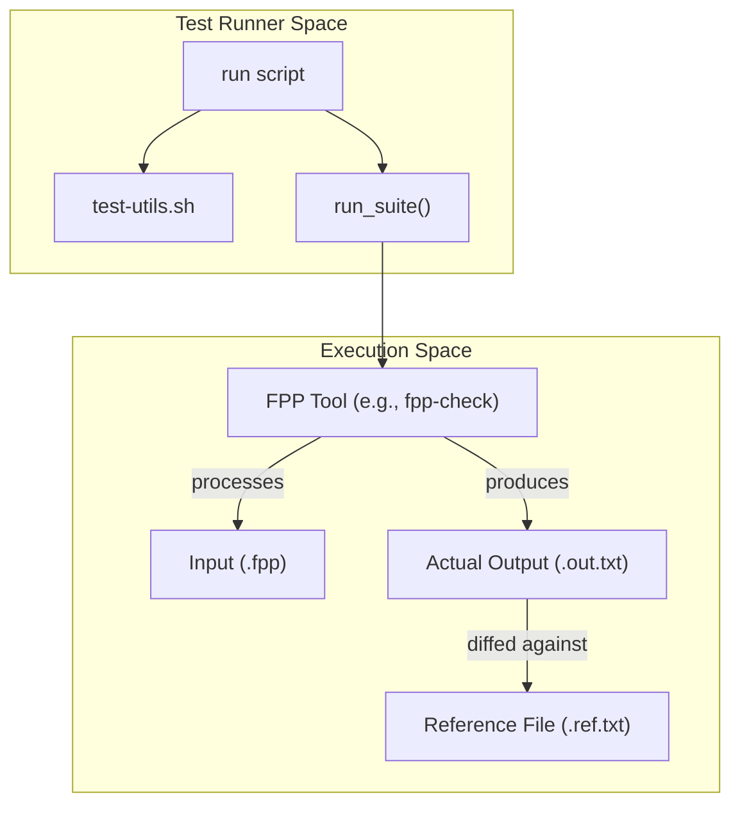
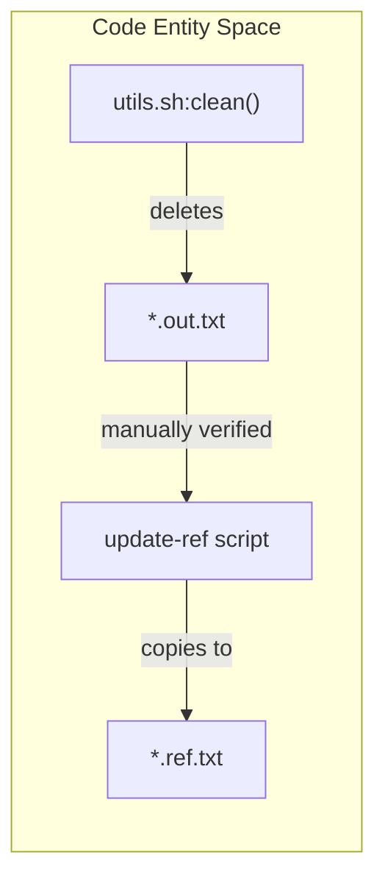

# Page: Testing Infrastructure

# Testing Infrastructure

Relevant source files

The following files were used as context for generating this wiki page:

- [compiler/.gitignore](compiler/.gitignore)
- [compiler/scripts/test-utils.sh](compiler/scripts/test-utils.sh)
- [compiler/scripts/utils.sh](compiler/scripts/utils.sh)
- [compiler/tools/fpp-from-xml/test/top/check-fpp](compiler/tools/fpp-from-xml/test/top/check-fpp)
- [compiler/tools/fpp-from-xml/test/top/clean](compiler/tools/fpp-from-xml/test/top/clean)
- [compiler/tools/fpp-from-xml/test/top/fprime_ref.ref.txt](compiler/tools/fpp-from-xml/test/top/fprime_ref.ref.txt)
- [compiler/tools/fpp-from-xml/test/top/fprime_ref.xml](compiler/tools/fpp-from-xml/test/top/fprime_ref.xml)
- [compiler/tools/fpp-from-xml/test/top/fprime_ref_packets.fpp](compiler/tools/fpp-from-xml/test/top/fprime_ref_packets.fpp)
- [compiler/tools/fpp-from-xml/test/top/fprime_ref_packets.xml](compiler/tools/fpp-from-xml/test/top/fprime_ref_packets.xml)
- [compiler/tools/fpp-from-xml/test/top/run](compiler/tools/fpp-from-xml/test/top/run)
- [compiler/tools/fpp-from-xml/test/top/tests.sh](compiler/tools/fpp-from-xml/test/top/tests.sh)
- [compiler/tools/fpp-from-xml/test/top/update-ref](compiler/tools/fpp-from-xml/test/top/update-ref)
- [compiler/tools/fpp-to-cpp/test/README.adoc](compiler/tools/fpp-to-cpp/test/README.adoc)
- [compiler/tools/fpp-to-cpp/test/check-cpp](compiler/tools/fpp-to-cpp/test/check-cpp)
- [compiler/tools/fpp-to-cpp/test/clean](compiler/tools/fpp-to-cpp/test/clean)
- [compiler/tools/fpp-to-cpp/test/top/check-cpp-dir/clean](compiler/tools/fpp-to-cpp/test/top/check-cpp-dir/clean)
- [compiler/tools/fpp-to-json/test/clean](compiler/tools/fpp-to-json/test/clean)
- [compiler/tools/fpp-to-json/test/fpp-check/clean](compiler/tools/fpp-to-json/test/fpp-check/clean)
- [compiler/tools/fpp-to-json/test/fpp-check/run](compiler/tools/fpp-to-json/test/fpp-check/run)
- [compiler/tools/fpp-to-json/test/test](compiler/tools/fpp-to-json/test/test)

The FPP project employs a two-tier testing strategy to ensure the correctness of the compiler and its generated artifacts. This includes **Scala unit tests** for internal logic and a comprehensive suite of **command-line integration tests** that verify tool behavior against reference outputs.

## Testing Strategy Overview

The testing infrastructure is designed to validate the entire pipeline from parsing to C++ code generation.

1.  **Scala Unit Tests**: These are handled via `sbt` and focus on internal components like AST transformations and semantic analysis logic.
2.  **Integration Tests**: These are shell-based tests located in the `test` directory of each tool. They execute the compiled binaries (or JARs) against `.fpp` input files and compare the output (stdout, stderr, or generated files) against `.ref.txt` or `.ref.cpp` files.

### Test Infrastructure Relationship

The following diagram illustrates how the testing scripts interact with the FPP tools and the reference files.

**Test Execution Flow**

Sources: [compiler/scripts/test-utils.sh:35-80](), [compiler/tools/fpp-to-json/test/fpp-check/run:21-37]()

## The test-utils.sh Framework

The integration tests rely on a shared shell script framework located at `compiler/scripts/test-utils.sh`. This script provides standardized functions for running tests, reporting results, and normalizing output to ensure tests are portable across different development environments.

### Key Functions
| Function | Purpose |
| :--- | :--- |
| `run` | Executes a command and prints a formatted `PASSED` or `FAILED` message based on the exit status. [compiler/scripts/test-utils.sh:35-47]() |
| `run_suite` | Iterates over a list of test names, tracks pass/fail counts, and outputs a summary to `test-output.txt`. [compiler/scripts/test-utils.sh:50-80]() |
| `remove_path_prefix` | Uses `sed` to replace local absolute paths with `[ local path prefix ]` to allow reference comparisons to work on any machine. [compiler/scripts/test-utils.sh:19-26]() |
| `remove_fpp_version` | Strips the specific FPP version string from JSON/text output to prevent test failures after version bumps. [compiler/scripts/test-utils.sh:82-85]() |

Sources: [compiler/scripts/test-utils.sh:1-86]()

## Reference File Workflow

FPP uses "Golden File" testing. For every test case, there is a reference file (usually ending in `.ref.txt`, `.ref.cpp`, or `.ref.xml`).

1.  **Running Tests**: The `run` script executes the tool and compares the output to the reference.
2.  **Updating References**: If a change to the compiler intentionally changes the output, the developer runs an `update-ref` script (found in most test directories). This script overwrites the `.ref` files with the current `.out.txt` contents.
3.  **Cleaning**: The `clean` function in `compiler/scripts/utils.sh` removes temporary files like `*.out.txt`, `*.diff.txt`, and `num_failed.txt`. [compiler/scripts/utils.sh:4-13]()

**Reference Update Logic**

Sources: [compiler/scripts/utils.sh:4-13](), [compiler/tools/fpp-from-xml/test/top/update-ref:1-5]()

## Integration Test Suites

The infrastructure is partitioned by tool, each with specific verification requirements:

### fpp-check Test Suite
Focuses on semantic analysis validation. It tests categories like `port_instance`, `connection_pattern`, and `topology` resolution. It verifies that valid FPP is accepted and invalid FPP produces the correct error messages.
For details, see [fpp-check Test Suite](#6.1).

### fpp-to-cpp Test Suite
Focuses on C++ code generation. This suite includes a specialized `check-cpp` tool that verifies the generated `.ref.cpp` files actually compile against the F Prime framework.
For details, see [fpp-to-cpp Test Suite](#6.2).

### Other Tool Test Suites
Covers auxiliary tools like `fpp-to-json`, `fpp-to-xml`, and `fpp-depend`. These tests often use `fpp-syntax` or specialized validators (like `check-xml` or `check-json-dict`) to ensure the generated output is well-formed.
For details, see [Other Tool Test Suites](#6.3).

Sources: [compiler/tools/fpp-to-cpp/test/README.adoc:12-23](), [compiler/tools/fpp-from-xml/test/top/check-fpp:1-17](), [compiler/tools/fpp-to-json/test/fpp-check/run:39-58]()
