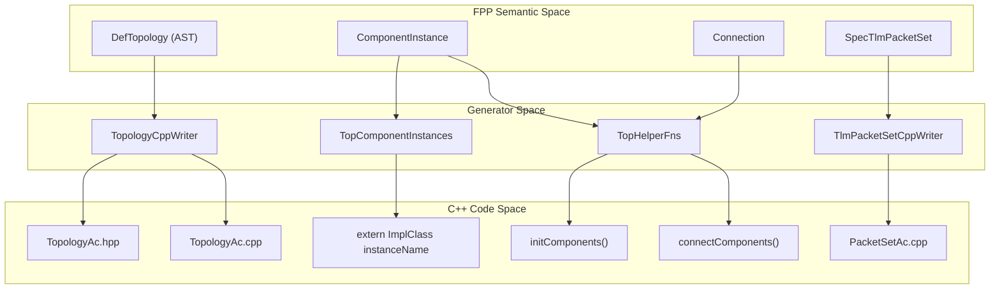
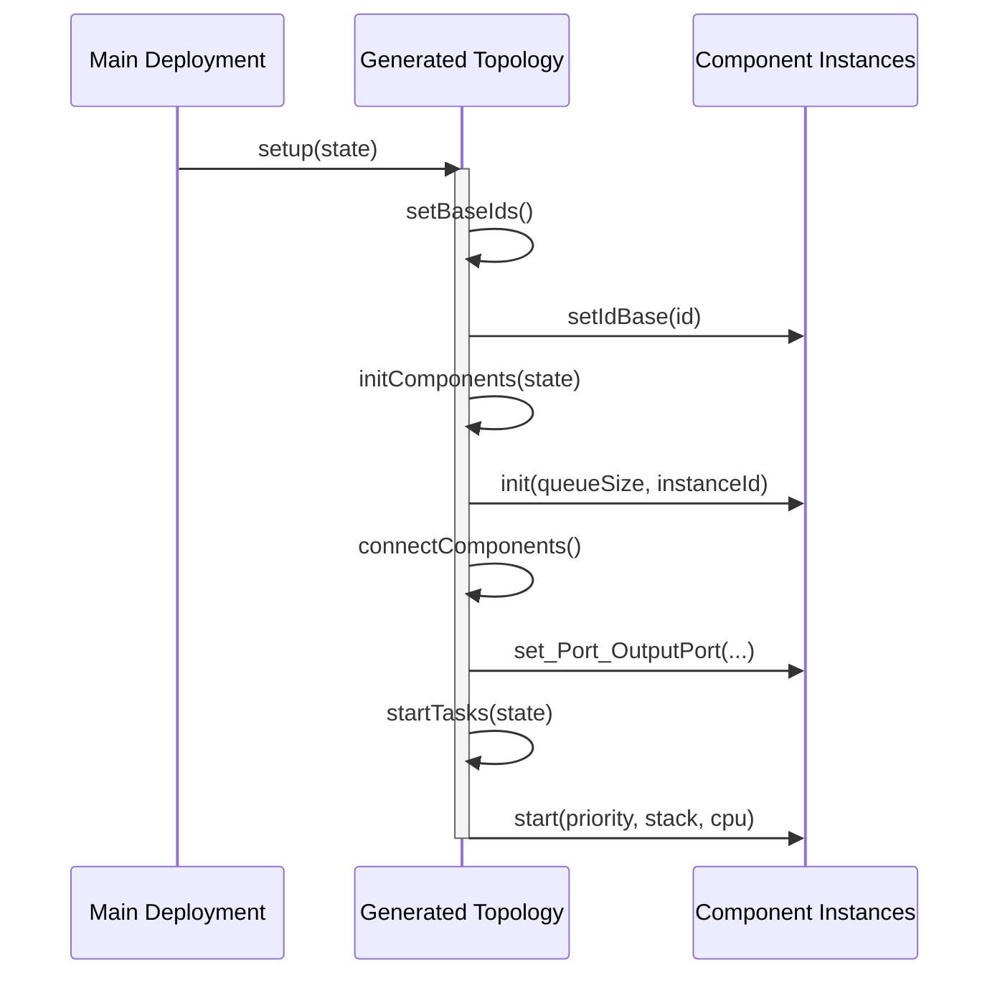

# Page: Topology C++ Generator

# Topology C++ Generator

Relevant source files

The following files were used as context for generating this wiki page:

- [compiler/lib/src/main/scala/codegen/CppWriter/TlmPacketSetCppWriter.scala](compiler/lib/src/main/scala/codegen/CppWriter/TlmPacketSetCppWriter.scala)
- [compiler/lib/src/main/scala/codegen/CppWriter/TopologyCppWriter/TopComponentIncludes.scala](compiler/lib/src/main/scala/codegen/CppWriter/TopologyCppWriter/TopComponentIncludes.scala)
- [compiler/lib/src/main/scala/codegen/CppWriter/TopologyCppWriter/TopComponentInstances.scala](compiler/lib/src/main/scala/codegen/CppWriter/TopologyCppWriter/TopComponentInstances.scala)
- [compiler/lib/src/main/scala/codegen/CppWriter/TopologyCppWriter/TopConfigObjects.scala](compiler/lib/src/main/scala/codegen/CppWriter/TopologyCppWriter/TopConfigObjects.scala)
- [compiler/lib/src/main/scala/codegen/CppWriter/TopologyCppWriter/TopConstants.scala](compiler/lib/src/main/scala/codegen/CppWriter/TopologyCppWriter/TopConstants.scala)
- [compiler/lib/src/main/scala/codegen/CppWriter/TopologyCppWriter/TopHelperFns.scala](compiler/lib/src/main/scala/codegen/CppWriter/TopologyCppWriter/TopHelperFns.scala)
- [compiler/lib/src/main/scala/codegen/CppWriter/TopologyCppWriter/TopTlmPacketIncludes.scala](compiler/lib/src/main/scala/codegen/CppWriter/TopologyCppWriter/TopTlmPacketIncludes.scala)
- [compiler/lib/src/main/scala/codegen/CppWriter/TopologyCppWriter/TopologyCppWriter.scala](compiler/lib/src/main/scala/codegen/CppWriter/TopologyCppWriter/TopologyCppWriter.scala)
- [compiler/lib/src/main/scala/codegen/CppWriter/TopologyCppWriter/TopologyCppWriterUtils.scala](compiler/lib/src/main/scala/codegen/CppWriter/TopologyCppWriter/TopologyCppWriterUtils.scala)
- [compiler/tools/fpp-to-cpp/test/.gitignore](compiler/tools/fpp-to-cpp/test/.gitignore)
- [compiler/tools/fpp-to-cpp/test/constants/FppConstantsAc_constants.ref.cpp](compiler/tools/fpp-to-cpp/test/constants/FppConstantsAc_constants.ref.cpp)
- [compiler/tools/fpp-to-cpp/test/constants/FppConstantsAc_constants.ref.hpp](compiler/tools/fpp-to-cpp/test/constants/FppConstantsAc_constants.ref.hpp)
- [compiler/tools/fpp-to-cpp/test/constants/FppConstantsAc_constants_guard_dir.ref.cpp](compiler/tools/fpp-to-cpp/test/constants/FppConstantsAc_constants_guard_dir.ref.cpp)
- [compiler/tools/fpp-to-cpp/test/constants/FppConstantsAc_constants_guard_dir.ref.hpp](compiler/tools/fpp-to-cpp/test/constants/FppConstantsAc_constants_guard_dir.ref.hpp)
- [compiler/tools/fpp-to-cpp/test/constants/FppConstantsAc_constants_guard_prefix.ref.cpp](compiler/tools/fpp-to-cpp/test/constants/FppConstantsAc_constants_guard_prefix.ref.cpp)
- [compiler/tools/fpp-to-cpp/test/constants/FppConstantsAc_constants_guard_prefix.ref.hpp](compiler/tools/fpp-to-cpp/test/constants/FppConstantsAc_constants_guard_prefix.ref.hpp)
- [compiler/tools/fpp-to-cpp/test/constants/FppConstantsAc_constants_string.ref.cpp](compiler/tools/fpp-to-cpp/test/constants/FppConstantsAc_constants_string.ref.cpp)
- [compiler/tools/fpp-to-cpp/test/constants/FppConstantsAc_constants_string.ref.hpp](compiler/tools/fpp-to-cpp/test/constants/FppConstantsAc_constants_string.ref.hpp)
- [compiler/tools/fpp-to-cpp/test/constants/constants.fpp](compiler/tools/fpp-to-cpp/test/constants/constants.fpp)
- [compiler/tools/fpp-to-cpp/test/constants/constants.ref.txt](compiler/tools/fpp-to-cpp/test/constants/constants.ref.txt)
- [compiler/tools/fpp-to-cpp/test/constants/constants_string.fpp](compiler/tools/fpp-to-cpp/test/constants/constants_string.fpp)
- [compiler/tools/fpp-to-cpp/test/constants/output_dir/FppConstantsAc.ref.cpp](compiler/tools/fpp-to-cpp/test/constants/output_dir/FppConstantsAc.ref.cpp)
- [compiler/tools/fpp-to-cpp/test/constants/output_dir/FppConstantsAc.ref.hpp](compiler/tools/fpp-to-cpp/test/constants/output_dir/FppConstantsAc.ref.hpp)
- [compiler/tools/fpp-to-cpp/test/constants/output_dir/constants.ref.txt](compiler/tools/fpp-to-cpp/test/constants/output_dir/constants.ref.txt)
- [compiler/tools/fpp-to-cpp/test/top/check-cpp](compiler/tools/fpp-to-cpp/test/top/check-cpp)
- [compiler/tools/fpp-to-cpp/test/top/check-cpp-dir/basic/.gitignore](compiler/tools/fpp-to-cpp/test/top/check-cpp-dir/basic/.gitignore)
- [compiler/tools/fpp-to-cpp/test/top/check-cpp-dir/basic/Active.hpp](compiler/tools/fpp-to-cpp/test/top/check-cpp-dir/basic/Active.hpp)
- [compiler/tools/fpp-to-cpp/test/top/check-cpp-dir/basic/BasicTopologyDefs.hpp](compiler/tools/fpp-to-cpp/test/top/check-cpp-dir/basic/BasicTopologyDefs.hpp)
- [compiler/tools/fpp-to-cpp/test/top/check-cpp-dir/basic/Passive.hpp](compiler/tools/fpp-to-cpp/test/top/check-cpp-dir/basic/Passive.hpp)
- [compiler/tools/fpp-to-cpp/test/top/check-cpp-dir/basic/check](compiler/tools/fpp-to-cpp/test/top/check-cpp-dir/basic/check)
- [compiler/tools/fpp-to-cpp/test/top/check-cpp-dir/basic/clean](compiler/tools/fpp-to-cpp/test/top/check-cpp-dir/basic/clean)
- [compiler/tools/fpp-to-cpp/test/top/check-cpp-dir/commands/.gitignore](compiler/tools/fpp-to-cpp/test/top/check-cpp-dir/commands/.gitignore)
- [compiler/tools/fpp-to-cpp/test/top/check-cpp-dir/commands/C.hpp](compiler/tools/fpp-to-cpp/test/top/check-cpp-dir/commands/C.hpp)
- [compiler/tools/fpp-to-cpp/test/top/check-cpp-dir/commands/CmdDispatcher.hpp](compiler/tools/fpp-to-cpp/test/top/check-cpp-dir/commands/CmdDispatcher.hpp)
- [compiler/tools/fpp-to-cpp/test/top/check-cpp-dir/commands/CommandsTopologyDefs.hpp](compiler/tools/fpp-to-cpp/test/top/check-cpp-dir/commands/CommandsTopologyDefs.hpp)
- [compiler/tools/fpp-to-cpp/test/top/check-cpp-dir/commands/NoCommands.hpp](compiler/tools/fpp-to-cpp/test/top/check-cpp-dir/commands/NoCommands.hpp)
- [compiler/tools/fpp-to-cpp/test/top/check-cpp-dir/commands/check](compiler/tools/fpp-to-cpp/test/top/check-cpp-dir/commands/check)
- [compiler/tools/fpp-to-cpp/test/top/ports/components.fpp](compiler/tools/fpp-to-cpp/test/top/ports/components.fpp)
- [compiler/tools/fpp-to-cpp/test/top/ports/names.ref.txt](compiler/tools/fpp-to-cpp/test/top/ports/names.ref.txt)
- [compiler/tools/fpp-to-cpp/test/top/ports/topology.fpp](compiler/tools/fpp-to-cpp/test/top/ports/topology.fpp)
- [compiler/tools/fpp-to-cpp/test/top/ports/topology.ref.txt](compiler/tools/fpp-to-cpp/test/top/ports/topology.ref.txt)
- [compiler/tools/fpp-to-cpp/test/top/run.sh](compiler/tools/fpp-to-cpp/test/top/run.sh)
- [compiler/tools/fpp-to-cpp/test/top/tests.sh](compiler/tools/fpp-to-cpp/test/top/tests.sh)
- [compiler/tools/fpp-to-cpp/test/top/tlm_packets/NoInstances_P1TlmPacketsAc.ref.cpp](compiler/tools/fpp-to-cpp/test/top/tlm_packets/NoInstances_P1TlmPacketsAc.ref.cpp)
- [compiler/tools/fpp-to-cpp/test/top/tlm_packets/NoInstances_P2TlmPacketsAc.ref.cpp](compiler/tools/fpp-to-cpp/test/top/tlm_packets/NoInstances_P2TlmPacketsAc.ref.cpp)
- [compiler/tools/fpp-to-cpp/test/top/tlm_packets/OneInstance_P1TlmPacketsAc.ref.cpp](compiler/tools/fpp-to-cpp/test/top/tlm_packets/OneInstance_P1TlmPacketsAc.ref.cpp)
- [compiler/tools/fpp-to-cpp/test/top/tlm_packets/OneInstance_P2TlmPacketsAc.ref.cpp](compiler/tools/fpp-to-cpp/test/top/tlm_packets/OneInstance_P2TlmPacketsAc.ref.cpp)
- [compiler/tools/fpp-to-cpp/test/top/tlm_packets/OneInstance_P3TlmPacketsAc.ref.cpp](compiler/tools/fpp-to-cpp/test/top/tlm_packets/OneInstance_P3TlmPacketsAc.ref.cpp)
- [compiler/tools/fpp-to-cpp/test/top/tlm_packets/TwoInstances_P1TlmPacketsAc.ref.cpp](compiler/tools/fpp-to-cpp/test/top/tlm_packets/TwoInstances_P1TlmPacketsAc.ref.cpp)
- [compiler/tools/fpp-to-cpp/test/top/update-ref.sh](compiler/tools/fpp-to-cpp/test/top/update-ref.sh)

The Topology C++ Generator is responsible for translating FPP topology definitions into C++ source code. Unlike component generators which produce base classes, the topology generator produces the "glue" code that instantiates components, connects their ports, and manages the system lifecycle (initialization, task startup, and teardown).

## Architecture Overview

The generation process is centered around the `TopologyCppWriter` class, which orchestrates several specialized helper classes to produce different segments of the topology implementation.

### Core Components

| Class | Responsibility |
|-------|----------------|
| `TopologyCppWriter` | Main entry point; manages file creation and high-level `CppDoc` structure. [compiler/lib/src/main/scala/codegen/CppWriter/TopologyCppWriter/TopologyCppWriter.scala:8-11]() |
| `TopologyCppWriterUtils` | Provides shared utilities for instance sorting, phase-based code retrieval, and naming. [compiler/lib/src/main/scala/codegen/CppWriter/TopologyCppWriter/TopologyCppWriterUtils.scala:8-11]() |
| `TopComponentInstances` | Generates the `extern` declarations and definitions for component implementation objects. [compiler/lib/src/main/scala/codegen/CppWriter/TopologyCppWriter/TopComponentInstances.scala:8-11]() |
| `TopHelperFns` | Generates lifecycle functions like `initComponents`, `connectComponents`, and `startTasks`. [compiler/lib/src/main/scala/codegen/CppWriter/TopologyCppWriter/TopHelperFns.scala:8-11]() |
| `TopConstants` | Generates namespaces for `BaseIds`, `InstanceIds`, `Priorities`, `QueueSizes`, and `StackSizes`. [compiler/lib/src/main/scala/codegen/CppWriter/TopologyCppWriter/TopConstants.scala:8-11]() |
| `TlmPacketSetCppWriter` | Generates specialized telemetry packet structures for use with `Svc::TlmPacketizer`. [compiler/lib/src/main/scala/codegen/CppWriter/TlmPacketSetCppWriter.scala:7-10]() |

### Data Flow and Code Entity Mapping

The following diagram illustrates how FPP semantic entities are mapped to C++ code structures through the writer classes.

**Entity Mapping Diagram**

Sources: [compiler/lib/src/main/scala/codegen/CppWriter/TopologyCppWriter/TopologyCppWriter.scala:13-25](), [compiler/lib/src/main/scala/codegen/CppWriter/TlmPacketSetCppWriter.scala:39-47]()

## Topology Definition Contract

The generator assumes the existence of a manual header named `<TopologyName>TopologyDefs.hpp`. This file is expected to define the `TopologyState` struct, which is passed to lifecycle functions to provide runtime configuration.

- **TopologyDefs.hpp Include**: Automatically added to the generated header. [compiler/lib/src/main/scala/codegen/CppWriter/TopologyCppWriter/TopologyCppWriter.scala:43-46]()
- **TopologyState**: Used as a constant reference parameter in functions like `initComponents` and `configComponents`. [compiler/lib/src/main/scala/codegen/CppWriter/TopologyCppWriter/TopHelperFns.scala:45-51]()

## Generated Lifecycle Functions

`TopHelperFns` generates a series of functions that follow the F Prime initialization sequence. Each function iterates over the component instances defined in the topology.

### Initialization Sequence
1. **`setBaseIds()`**: Calls `setIdBase()` on every component instance using values from the `BaseIds` namespace. [compiler/lib/src/main/scala/codegen/CppWriter/TopologyCppWriter/TopHelperFns.scala:91-105]()
2. **`initComponents()`**: Calls `init()` on components. For active components, it passes the queue size and instance ID; for passive components, only the instance ID. [compiler/lib/src/main/scala/codegen/CppWriter/TopologyCppWriter/TopHelperFns.scala:53-74]()
3. **`configComponents()`**: A hook for custom configuration code defined in FPP `init` specifiers. [compiler/lib/src/main/scala/codegen/CppWriter/TopologyCppWriter/TopHelperFns.scala:76-89]()
4. **`connectComponents()`**: Iterates through the `connectionMap` and calls `set_<Port>_OutputPort` on the source component, passing the input port from the destination component. [compiler/lib/src/main/scala/codegen/CppWriter/TopologyCppWriter/TopHelperFns.scala:107-140]()
5. **`regCommands()`**: Calls `regCommands()` for any component instance that defines commands. [compiler/lib/src/main/scala/codegen/CppWriter/TopologyCppWriter/TopHelperFns.scala:142-160]()
6. **`startTasks()`**: For active components, calls `start()` with priority, stack size, CPU affinity, and task ID. [compiler/lib/src/main/scala/codegen/CppWriter/TopologyCppWriter/TopHelperFns.scala:195-225]()

**Lifecycle Execution Logic**

Sources: [compiler/lib/src/main/scala/codegen/CppWriter/TopologyCppWriter/TopHelperFns.scala:15-43](), [compiler/lib/src/main/scala/codegen/CppWriter/TopologyCppWriter/TopSetupTeardownFns.scala]()

## Telemetry Packet Generation

`TlmPacketSetCppWriter` handles the generation of telemetry packet definitions used by the `Svc::TlmPacketizer` component. This is triggered by `topology` definitions containing telemetry packet specifiers.

### Implementation Details
- **Namespace**: Packets are wrapped in a namespace named `<Topology>_<PacketSetName>TlmPackets`. [compiler/lib/src/main/scala/codegen/CppWriter/TlmPacketSetCppWriter.scala:32]()
- **Data Structures**: It generates `static constexpr` arrays for `ChannelIds`, `ChannelSizes`, and `PacketGroups`. [compiler/lib/src/main/scala/codegen/CppWriter/TlmPacketSetCppWriter.scala:85-93]()
- **Omitted Channels**: Automatically identifies channels not assigned to any packet and adds them to an `omittedChannels` list to ensure all telemetry is accounted for. [compiler/lib/src/main/scala/codegen/CppWriter/TlmPacketSetCppWriter.scala:225-233]()

Sources: [compiler/lib/src/main/scala/codegen/CppWriter/TlmPacketSetCppWriter.scala:1-100]()

## Component Instance Handling

`TopComponentInstances` manages the instantiation of components. It supports two modes:
1. **Default**: Instantiates the component using its qualified implementation type and passes the instance name to `FW_OPTIONAL_NAME`. [compiler/lib/src/main/scala/codegen/CppWriter/TopologyCppWriter/TopComponentInstances.scala:41-47]()
2. **Custom Code**: If an FPP `instance` definition contains custom C++ code in phase 0 (`instances`), that code is used instead of the default constructor call. [compiler/lib/src/main/scala/codegen/CppWriter/TopologyCppWriter/TopComponentInstances.scala:41-42]()

### Instance Namespace Wrapping
Instance declarations and definitions are wrapped in the namespaces defined in their FPP qualification to prevent name collisions in multi-module deployments. [compiler/lib/src/main/scala/codegen/CppWriter/TopologyCppWriter/TopComponentInstances.scala:49]()

Sources: [compiler/lib/src/main/scala/codegen/CppWriter/TopologyCppWriter/TopComponentInstances.scala:28-52]()

## Configuration Objects

`TopConfigObjects` handles special component-specific configuration. A notable example is `Svc::Health`, where the generator automatically creates `PingEntry` arrays based on the topology's connection graph.

- **Health Ping Detection**: The generator looks for output ports of type `Svc.Ping`. [compiler/lib/src/main/scala/codegen/CppWriter/TopologyCppWriter/TopConfigObjects.scala:137-138]()
- **Entry Generation**: It maps connection port numbers to `Svc::Health::PingEntry` structures, including warning and fatal thresholds. [compiler/lib/src/main/scala/codegen/CppWriter/TopologyCppWriter/TopConfigObjects.scala:96-121]()

Sources: [compiler/lib/src/main/scala/codegen/CppWriter/TopologyCppWriter/TopConfigObjects.scala:56-87]()
