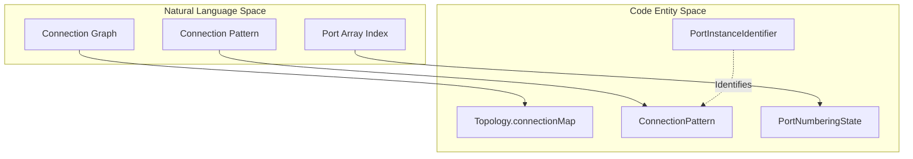
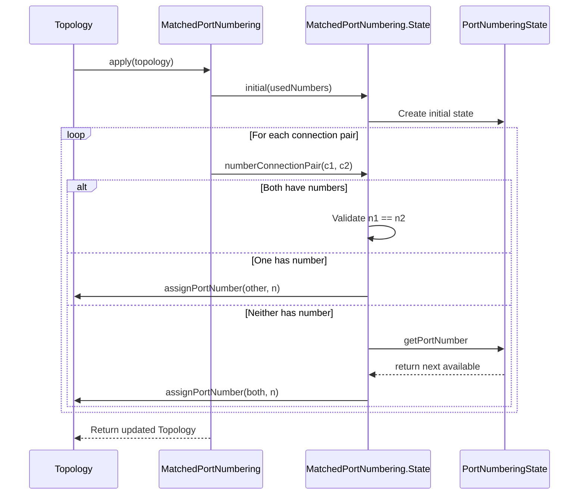

# Page: Topology Resolution

# Topology Resolution

Relevant source files

The following files were used as context for generating this wiki page:

- [.github/actions/build-native-images/action.yml](.github/actions/build-native-images/action.yml)
- [.github/actions/build-native-images/native-images](.github/actions/build-native-images/native-images)
- [.github/actions/native-tools-setup/action.yml](.github/actions/native-tools-setup/action.yml)
- [.github/actions/native-tools-setup/env-setup](.github/actions/native-tools-setup/env-setup)
- [.github/workflows/build-native.yml](.github/workflows/build-native.yml)
- [.github/workflows/build-test.yml](.github/workflows/build-test.yml)
- [.github/workflows/native-build.yml](.github/workflows/native-build.yml)
- [.github/workflows/publish](.github/workflows/publish)
- [README.adoc](README.adoc)
- [compiler/.jvmopts](compiler/.jvmopts)
- [compiler/README.adoc](compiler/README.adoc)
- [compiler/fpp-sbt](compiler/fpp-sbt)
- [compiler/install-trace](compiler/install-trace)
- [compiler/lib/src/main/resources/META-INF/native-image/jni-config.json](compiler/lib/src/main/resources/META-INF/native-image/jni-config.json)
- [compiler/lib/src/main/resources/META-INF/native-image/predefined-classes-config.json](compiler/lib/src/main/resources/META-INF/native-image/predefined-classes-config.json)
- [compiler/lib/src/main/resources/META-INF/native-image/proxy-config.json](compiler/lib/src/main/resources/META-INF/native-image/proxy-config.json)
- [compiler/lib/src/main/resources/META-INF/native-image/reflect-config.json](compiler/lib/src/main/resources/META-INF/native-image/reflect-config.json)
- [compiler/lib/src/main/resources/META-INF/native-image/resource-config.json](compiler/lib/src/main/resources/META-INF/native-image/resource-config.json)
- [compiler/lib/src/main/resources/META-INF/native-image/serialization-config.json](compiler/lib/src/main/resources/META-INF/native-image/serialization-config.json)
- [compiler/lib/src/main/scala/analysis/Analysis.scala](compiler/lib/src/main/scala/analysis/Analysis.scala)
- [compiler/lib/src/main/scala/analysis/Analyzers/BasicUseAnalyzer.scala](compiler/lib/src/main/scala/analysis/Analyzers/BasicUseAnalyzer.scala)
- [compiler/lib/src/main/scala/analysis/CheckSemantics/CheckSemantics.scala](compiler/lib/src/main/scala/analysis/CheckSemantics/CheckSemantics.scala)
- [compiler/lib/src/main/scala/analysis/CheckSemantics/CheckTopologyDefs.scala](compiler/lib/src/main/scala/analysis/CheckSemantics/CheckTopologyDefs.scala)
- [compiler/lib/src/main/scala/analysis/CheckSemantics/CheckUses.scala](compiler/lib/src/main/scala/analysis/CheckSemantics/CheckUses.scala)
- [compiler/lib/src/main/scala/analysis/CheckSemantics/ConstructImpliedUseMap.scala](compiler/lib/src/main/scala/analysis/CheckSemantics/ConstructImpliedUseMap.scala)
- [compiler/lib/src/main/scala/analysis/Semantics/Connection.scala](compiler/lib/src/main/scala/analysis/Semantics/Connection.scala)
- [compiler/lib/src/main/scala/analysis/Semantics/ConnectionPattern.scala](compiler/lib/src/main/scala/analysis/Semantics/ConnectionPattern.scala)
- [compiler/lib/src/main/scala/analysis/Semantics/ImpliedUse.scala](compiler/lib/src/main/scala/analysis/Semantics/ImpliedUse.scala)
- [compiler/lib/src/main/scala/analysis/Semantics/InitSpecifier.scala](compiler/lib/src/main/scala/analysis/Semantics/InitSpecifier.scala)
- [compiler/lib/src/main/scala/analysis/Semantics/PortInstance.scala](compiler/lib/src/main/scala/analysis/Semantics/PortInstance.scala)
- [compiler/lib/src/main/scala/analysis/Semantics/PortInstanceIdentifier.scala](compiler/lib/src/main/scala/analysis/Semantics/PortInstanceIdentifier.scala)
- [compiler/lib/src/main/scala/analysis/Semantics/PortInterface.scala](compiler/lib/src/main/scala/analysis/Semantics/PortInterface.scala)
- [compiler/lib/src/main/scala/analysis/Semantics/ResolveTopology/GeneralPortNumbering.scala](compiler/lib/src/main/scala/analysis/Semantics/ResolveTopology/GeneralPortNumbering.scala)
- [compiler/lib/src/main/scala/analysis/Semantics/ResolveTopology/MatchedPortNumbering.scala](compiler/lib/src/main/scala/analysis/Semantics/ResolveTopology/MatchedPortNumbering.scala)
- [compiler/lib/src/main/scala/analysis/Semantics/ResolveTopology/PatternResolver.scala](compiler/lib/src/main/scala/analysis/Semantics/ResolveTopology/PatternResolver.scala)
- [compiler/lib/src/main/scala/analysis/Semantics/ResolveTopology/PortNumberingState.scala](compiler/lib/src/main/scala/analysis/Semantics/ResolveTopology/PortNumberingState.scala)
- [compiler/lib/src/main/scala/analysis/Semantics/ResolveTopology/ResolvePartiallyNumbered.scala](compiler/lib/src/main/scala/analysis/Semantics/ResolveTopology/ResolvePartiallyNumbered.scala)
- [compiler/lib/src/main/scala/analysis/Semantics/ResolveTopology/ResolvePortNumbers.scala](compiler/lib/src/main/scala/analysis/Semantics/ResolveTopology/ResolvePortNumbers.scala)
- [compiler/lib/src/main/scala/analysis/Semantics/ResolveTopology/ResolveTopology.scala](compiler/lib/src/main/scala/analysis/Semantics/ResolveTopology/ResolveTopology.scala)
- [compiler/lib/src/main/scala/analysis/Semantics/ResolveTopology/ResolveTopologyPortInterface.scala](compiler/lib/src/main/scala/analysis/Semantics/ResolveTopology/ResolveTopologyPortInterface.scala)
- [compiler/lib/src/main/scala/analysis/Semantics/TlmPacketSet.scala](compiler/lib/src/main/scala/analysis/Semantics/TlmPacketSet.scala)
- [compiler/lib/src/main/scala/analysis/Semantics/Topology.scala](compiler/lib/src/main/scala/analysis/Semantics/Topology.scala)
- [compiler/lib/src/main/scala/analysis/Semantics/TopologyPort.scala](compiler/lib/src/main/scala/analysis/Semantics/TopologyPort.scala)
- [compiler/lib/src/main/scala/codegen/XmlFppWriter/TopologyXmlFppWriter.scala](compiler/lib/src/main/scala/codegen/XmlFppWriter/TopologyXmlFppWriter.scala)
- [compiler/lib/src/main/scala/util/Error.scala](compiler/lib/src/main/scala/util/Error.scala)
- [compiler/release](compiler/release)
- [compiler/tools.txt](compiler/tools.txt)
- [compiler/tools/fpp-check/test/connection_direct/ok.fpp](compiler/tools/fpp-check/test/connection_direct/ok.fpp)
- [compiler/tools/fpp-check/test/connection_pattern/clean](compiler/tools/fpp-check/test/connection_pattern/clean)
- [compiler/tools/fpp-check/test/connection_pattern/command_ok.fpp](compiler/tools/fpp-check/test/connection_pattern/command_ok.fpp)
- [compiler/tools/fpp-check/test/connection_pattern/command_ok.ref.txt](compiler/tools/fpp-check/test/connection_pattern/command_ok.ref.txt)
- [compiler/tools/fpp-check/test/connection_pattern/health_ok.fpp](compiler/tools/fpp-check/test/connection_pattern/health_ok.fpp)
- [compiler/tools/fpp-check/test/connection_pattern/health_ok.ref.txt](compiler/tools/fpp-check/test/connection_pattern/health_ok.ref.txt)
- [compiler/tools/fpp-check/test/connection_pattern/param_ok.fpp](compiler/tools/fpp-check/test/connection_pattern/param_ok.fpp)
- [compiler/tools/fpp-check/test/connection_pattern/param_ok.ref.txt](compiler/tools/fpp-check/test/connection_pattern/param_ok.ref.txt)
- [compiler/tools/fpp-check/test/connection_pattern/run](compiler/tools/fpp-check/test/connection_pattern/run)
- [compiler/tools/fpp-check/test/connection_pattern/tests.sh](compiler/tools/fpp-check/test/connection_pattern/tests.sh)
- [compiler/tools/fpp-check/test/connection_pattern/text_event_missing_source_port.fpp](compiler/tools/fpp-check/test/connection_pattern/text_event_missing_source_port.fpp)
- [compiler/tools/fpp-check/test/connection_pattern/text_event_missing_source_port.ref.txt](compiler/tools/fpp-check/test/connection_pattern/text_event_missing_source_port.ref.txt)
- [compiler/tools/fpp-check/test/connection_pattern/text_event_missing_target_port.fpp](compiler/tools/fpp-check/test/connection_pattern/text_event_missing_target_port.fpp)
- [compiler/tools/fpp-check/test/connection_pattern/text_event_missing_target_port.ref.txt](compiler/tools/fpp-check/test/connection_pattern/text_event_missing_target_port.ref.txt)
- [compiler/tools/fpp-check/test/connection_pattern/text_event_ok.fpp](compiler/tools/fpp-check/test/connection_pattern/text_event_ok.fpp)
- [compiler/tools/fpp-check/test/connection_pattern/text_event_ok.ref.txt](compiler/tools/fpp-check/test/connection_pattern/text_event_ok.ref.txt)
- [compiler/tools/fpp-check/test/connection_pattern/text_event_two_source_ports.fpp](compiler/tools/fpp-check/test/connection_pattern/text_event_two_source_ports.fpp)
- [compiler/tools/fpp-check/test/connection_pattern/text_event_two_source_ports.ref.txt](compiler/tools/fpp-check/test/connection_pattern/text_event_two_source_ports.ref.txt)
- [compiler/tools/fpp-check/test/connection_pattern/time_no_time_get_port.fpp](compiler/tools/fpp-check/test/connection_pattern/time_no_time_get_port.fpp)
- [compiler/tools/fpp-check/test/connection_pattern/time_ok.fpp](compiler/tools/fpp-check/test/connection_pattern/time_ok.fpp)
- [compiler/tools/fpp-check/test/connection_pattern/time_ok.ref.txt](compiler/tools/fpp-check/test/connection_pattern/time_ok.ref.txt)
- [compiler/tools/fpp-check/test/connection_pattern/update-ref](compiler/tools/fpp-check/test/connection_pattern/update-ref)
- [compiler/tools/fpp-check/test/port_numbering/duplicate_connection_at_matched_port.fpp](compiler/tools/fpp-check/test/port_numbering/duplicate_connection_at_matched_port.fpp)
- [compiler/tools/fpp-check/test/port_numbering/duplicate_connection_at_matched_port.ref.txt](compiler/tools/fpp-check/test/port_numbering/duplicate_connection_at_matched_port.ref.txt)
- [compiler/tools/fpp-check/test/port_numbering/duplicate_matched_connection.fpp](compiler/tools/fpp-check/test/port_numbering/duplicate_matched_connection.fpp)
- [compiler/tools/fpp-check/test/port_numbering/duplicate_matched_connection.ref.txt](compiler/tools/fpp-check/test/port_numbering/duplicate_matched_connection.ref.txt)
- [compiler/tools/fpp-check/test/port_numbering/implicit_duplicate_connection_at_matched_input_port.fpp](compiler/tools/fpp-check/test/port_numbering/implicit_duplicate_connection_at_matched_input_port.fpp)
- [compiler/tools/fpp-check/test/port_numbering/implicit_duplicate_connection_at_matched_input_port.ref.txt](compiler/tools/fpp-check/test/port_numbering/implicit_duplicate_connection_at_matched_input_port.ref.txt)
- [compiler/tools/fpp-check/test/port_numbering/implicit_duplicate_connection_at_matched_output_port.fpp](compiler/tools/fpp-check/test/port_numbering/implicit_duplicate_connection_at_matched_output_port.fpp)
- [compiler/tools/fpp-check/test/port_numbering/implicit_duplicate_connection_at_matched_output_port.ref.txt](compiler/tools/fpp-check/test/port_numbering/implicit_duplicate_connection_at_matched_output_port.ref.txt)
- [compiler/tools/fpp-check/test/port_numbering/no_port_available_for_matched_numbering.fpp](compiler/tools/fpp-check/test/port_numbering/no_port_available_for_matched_numbering.fpp)
- [compiler/tools/fpp-check/test/port_numbering/no_port_available_for_matched_numbering.ref.txt](compiler/tools/fpp-check/test/port_numbering/no_port_available_for_matched_numbering.ref.txt)
- [compiler/tools/fpp-check/test/port_numbering/tests.sh](compiler/tools/fpp-check/test/port_numbering/tests.sh)
- [compiler/tools/fpp-check/test/top_ports/interface_instance_not_member.fpp](compiler/tools/fpp-check/test/top_ports/interface_instance_not_member.fpp)
- [compiler/tools/fpp-check/test/top_ports/interface_instance_not_member.ref.txt](compiler/tools/fpp-check/test/top_ports/interface_instance_not_member.ref.txt)
- [compiler/tools/fpp-check/test/top_ports/tests.sh](compiler/tools/fpp-check/test/top_ports/tests.sh)
- [compiler/tools/fpp-check/test/update-ref](compiler/tools/fpp-check/test/update-ref)
- [compiler/tools/fpp-to-dict/test/.gitignore](compiler/tools/fpp-to-dict/test/.gitignore)
- [compiler/trace-fprime](compiler/trace-fprime)
- [docs/index/defs.sh](docs/index/defs.sh)
- [docs/index/index.adoc](docs/index/index.adoc)
- [pyproject.toml](pyproject.toml)
- [python/fprime_fpp/__init__.py](python/fprime_fpp/__init__.py)
- [python/fprime_fpp/__main__.py](python/fprime_fpp/__main__.py)

Topology resolution is the final stage of semantic analysis for FPP topologies. It transforms a collection of component instances and connection graph definitions into a fully resolved `Topology` model. This process involves resolving connection patterns (e.g., health, telemetry), validating port compatibility, and assigning specific port numbers to every connection.

The entry point for this pipeline is `CheckTopologyDefs`, which is called during the general semantic check [compiler/lib/src/main/scala/analysis/CheckSemantics/CheckSemantics.scala:30-30]().

## The ResolveTopology Pipeline

The resolution process is structured as a pipeline of functional transformations on the `Analysis` state. The primary logic resides in `ResolveTopology.scala`.

### Pipeline Stages

1.  **Resolve Topology Port Interface**: Collects all ports defined in the topology and ensures they map to valid component instance ports [compiler/lib/src/main/scala/analysis/Semantics/ResolveTopology/ResolveTopologyPortInterface.scala]().
2.  **Pattern Resolution**: Expands high-level patterns (Command, Telemetry, Event, Param, Health) into concrete connections between component instances [compiler/lib/src/main/scala/analysis/Semantics/ResolveTopology/PatternResolver.scala]().
3.  **Connection Validation**: Iterates through all connections (direct and expanded from patterns) to verify:
    *   **Directional Compatibility**: Output ports must connect to input ports [compiler/lib/src/main/scala/analysis/Semantics/PortInstance.scala:107-114]().
    *   **Type Compatibility**: Port types must match, or one must be a `Serial` port [compiler/lib/src/main/scala/analysis/Semantics/PortInstance.scala:83-90]().
4.  **Port Numbering**: Assigns indices to connections for arrayed ports using three distinct strategies (General, Matched, and Partially Numbered).
5.  **Unconnected Port Detection**: Identifies ports that have no connections, which may trigger warnings or errors depending on the port type [compiler/lib/src/main/scala/analysis/Semantics/Topology.scala:41-41]().

**Sources:** [compiler/lib/src/main/scala/analysis/Semantics/ResolveTopology/ResolveTopology.scala](), [compiler/lib/src/main/scala/analysis/Semantics/Topology.scala:7-42]()

## Port Numbering Strategies

FPP supports automatic and manual port numbering. The `PortNumberingState` class tracks which indices are used for a given port instance to prevent collisions [compiler/lib/src/main/scala/analysis/Semantics/ResolveTopology/PortNumberingState.scala]().

### 1. General Port Numbering
Used for standard connections. If a port number is not explicitly provided in the FPP source, the compiler automatically assigns the next available index [compiler/lib/src/main/scala/analysis/Semantics/ResolveTopology/GeneralPortNumbering.scala]().

### 2. Matched Port Numbering
This strategy ensures that if two components are connected via multiple ports (e.g., a "Matched" pair like a request and response), they use the same index on both sides.
*   It uses `InstanceConnectionMap` to track pairs of connections between instances [compiler/lib/src/main/scala/analysis/Semantics/ResolveTopology/MatchedPortNumbering.scala:11-11]().
*   It validates that if one side of a matched pair is connected, the other side must also be connected to the same instance [compiler/lib/src/main/scala/analysis/Semantics/ResolveTopology/MatchedPortNumbering.scala:214-220]().

### 3. Partially Numbered
Handles cases where some indices in a port array are manually specified in the FPP source, while others are left for the compiler to fill [compiler/lib/src/main/scala/analysis/Semantics/ResolveTopology/ResolvePartiallyNumbered.scala]().

**Sources:** [compiler/lib/src/main/scala/analysis/Semantics/ResolveTopology/MatchedPortNumbering.scala:7-60](), [compiler/lib/src/main/scala/analysis/Semantics/ResolveTopology/PortNumberingState.scala]()

## Connection Semantic Model

The `Connection` class represents a resolved link between two port instances.

| Entity | Code Identifier | Description |
| :--- | :--- | :--- |
| **Endpoint** | `Connection.Endpoint` | Represents one side of a connection (Instance + Port + Optional Index). |
| **Direction Check** | `Connection.checkDirections` | Ensures `from` is an Output and `to` is an Input. |
| **Type Check** | `Connection.checkTypes` | Validates that port signatures are compatible. |

### Topology Entity Map
The following diagram bridges the language concepts to the internal compiler classes.

**Sources:** [compiler/lib/src/main/scala/analysis/Semantics/Connection.scala](), [compiler/lib/src/main/scala/analysis/Semantics/Topology.scala:29-35]()

## Implementation Flow: Matched Numbering

The matched numbering logic is one of the most complex parts of topology resolution. It must synchronize indices across different port instances based on component definitions.

**Sources:** [compiler/lib/src/main/scala/analysis/Semantics/ResolveTopology/MatchedPortNumbering.scala:64-157](), [compiler/lib/src/main/scala/analysis/Semantics/ResolveTopology/PortNumberingState.scala]()

## Error Handling in Resolution

The resolver identifies several specific semantic errors during this phase:
*   **DuplicateConnectionAtMatchedPort**: Occurs when multiple connections try to use the same index on a matched port [compiler/lib/src/main/scala/util/Error.scala:60-63]().
*   **MismatchedPortNumbers**: Occurs when a matched pair of connections is assigned different indices [compiler/lib/src/main/scala/util/Error.scala:178-185]().
*   **NoPortAvailableForMatchedNumbering**: Occurs when the number of connections exceeds the defined array size of the port [compiler/lib/src/main/scala/analysis/Semantics/ResolveTopology/MatchedPortNumbering.scala:142-148]().

**Sources:** [compiler/lib/src/main/scala/util/Error.scala:60-185](), [compiler/lib/src/main/scala/analysis/Semantics/ResolveTopology/MatchedPortNumbering.scala:140-150]()
