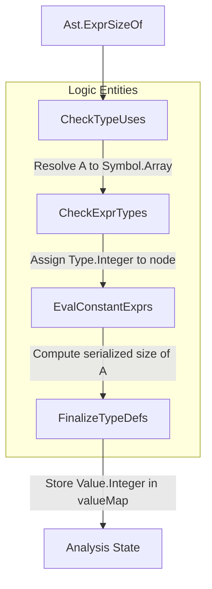
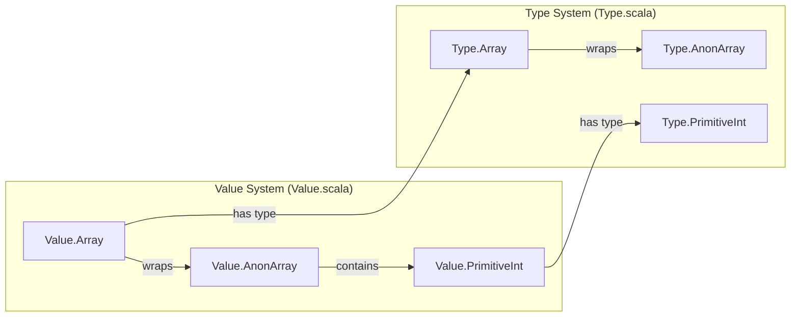

# Page: Type System and Expression Evaluation

# Type System and Expression Evaluation

Relevant source files

The following files were used as context for generating this wiki page:

- [compiler/lib/src/main/scala/analysis/Analyzers/TypeExpressionAnalyzer.scala](compiler/lib/src/main/scala/analysis/Analyzers/TypeExpressionAnalyzer.scala)
- [compiler/lib/src/main/scala/analysis/CheckSemantics/CheckExprTypes.scala](compiler/lib/src/main/scala/analysis/CheckSemantics/CheckExprTypes.scala)
- [compiler/lib/src/main/scala/analysis/CheckSemantics/CheckTypeUses.scala](compiler/lib/src/main/scala/analysis/CheckSemantics/CheckTypeUses.scala)
- [compiler/lib/src/main/scala/analysis/CheckSemantics/EvalConstantExprs.scala](compiler/lib/src/main/scala/analysis/CheckSemantics/EvalConstantExprs.scala)
- [compiler/lib/src/main/scala/analysis/CheckSemantics/FinalizeTypeDefs.scala](compiler/lib/src/main/scala/analysis/CheckSemantics/FinalizeTypeDefs.scala)
- [compiler/lib/src/main/scala/analysis/Semantics/Format.scala](compiler/lib/src/main/scala/analysis/Semantics/Format.scala)
- [compiler/lib/src/main/scala/analysis/Semantics/Type.scala](compiler/lib/src/main/scala/analysis/Semantics/Type.scala)
- [compiler/lib/src/main/scala/analysis/Semantics/TypeVisitor.scala](compiler/lib/src/main/scala/analysis/Semantics/TypeVisitor.scala)
- [compiler/lib/src/main/scala/analysis/Semantics/Value.scala](compiler/lib/src/main/scala/analysis/Semantics/Value.scala)
- [compiler/lib/src/main/scala/analysis/Semantics/ValueVisitor.scala](compiler/lib/src/main/scala/analysis/Semantics/ValueVisitor.scala)
- [compiler/lib/src/main/scala/codegen/TypeUtils.scala](compiler/lib/src/main/scala/codegen/TypeUtils.scala)
- [compiler/lib/src/test/scala/semantics/FormatSpec.scala](compiler/lib/src/test/scala/semantics/FormatSpec.scala)
- [compiler/lib/src/test/scala/semantics/TypeSpec.scala](compiler/lib/src/test/scala/semantics/TypeSpec.scala)
- [compiler/lib/src/test/scala/semantics/Types.scala](compiler/lib/src/test/scala/semantics/Types.scala)
- [compiler/lib/src/test/scala/semantics/ValueSpec.scala](compiler/lib/src/test/scala/semantics/ValueSpec.scala)
- [compiler/lib/src/test/scala/semantics/Values.scala](compiler/lib/src/test/scala/semantics/Values.scala)
- [compiler/tools/fpp-check/test/expr/sizeof_ok.fpp](compiler/tools/fpp-check/test/expr/sizeof_ok.fpp)
- [compiler/tools/fpp-check/test/expr/sizeof_string_fw_store_type_not_defined.fpp](compiler/tools/fpp-check/test/expr/sizeof_string_fw_store_type_not_defined.fpp)
- [compiler/tools/fpp-check/test/expr/sizeof_string_fw_store_type_not_defined.ref.txt](compiler/tools/fpp-check/test/expr/sizeof_string_fw_store_type_not_defined.ref.txt)
- [compiler/tools/fpp-check/test/expr/tests.sh](compiler/tools/fpp-check/test/expr/tests.sh)
- [compiler/tools/fpp-format/test/expressions.fpp](compiler/tools/fpp-format/test/expressions.fpp)
- [compiler/tools/fpp-format/test/expressions.ref.txt](compiler/tools/fpp-format/test/expressions.ref.txt)
- [docs/spec/Expressions/Array-Subscript-Expressions.adoc](docs/spec/Expressions/Array-Subscript-Expressions.adoc)
- [docs/spec/Expressions/Dot-Expressions.adoc](docs/spec/Expressions/Dot-Expressions.adoc)
- [docs/spec/Expressions/Sizeof-Expressions.adoc](docs/spec/Expressions/Sizeof-Expressions.adoc)
- [docs/spec/Expressions/defs.sh](docs/spec/Expressions/defs.sh)
- [docs/spec/Format-Strings.adoc](docs/spec/Format-Strings.adoc)
- [docs/spec/Type-Checking.adoc](docs/spec/Type-Checking.adoc)
- [docs/spec/Type-Names.adoc](docs/spec/Type-Names.adoc)
- [docs/spec/Types.adoc](docs/spec/Types.adoc)
- [docs/spec/Values.adoc](docs/spec/Values.adoc)

This page documents the FPP type system and the mechanisms for expression analysis, including type checking, constant folding, and type finalization.

## FPP Type System

The FPP type system consists of primitive types, user-defined aggregate types, and internal types used by the compiler during analysis.

### Type Hierarchy and Representation
The core of the type system is defined by the `Type` sealed trait in [compiler/lib/src/main/scala/analysis/Semantics/Type.scala:8-58](). Every type in FPP provides methods to get a default value, check if it is numeric, and determine if it is "displayable" (representable in the F Prime ground system) [compiler/lib/src/main/scala/analysis/Semantics/Type.scala:11-53]().

| Category | Type Entities | Description |
| :--- | :--- | :--- |
| **Primitive** | `Boolean`, `PrimitiveInt`, `Float` | Basic scalars: `bool`, `I8`, `U32`, `F64`, etc. [compiler/lib/src/main/scala/analysis/Semantics/Type.scala:67-166]() |
| **String** | `String` | Fixed-size or framework-default length strings [compiler/lib/src/main/scala/analysis/Semantics/Type.scala:169-180]() |
| **Aggregate** | `Array`, `Struct`, `Enum` | User-defined types with multiple members or constants [compiler/lib/src/main/scala/analysis/Semantics/Type.scala:214-311]() |
| **Abstract** | `AbsType` | Types with no internal structure defined in FPP [compiler/lib/src/main/scala/analysis/Semantics/Type.scala:189-197]() |
| **Alias** | `AliasType` | Type definitions that point to another type [compiler/lib/src/main/scala/analysis/Semantics/Type.scala:199-212]() |
| **Internal** | `Integer`, `AnonArray`, `AnonStruct` | Types used during type checking for literals and intermediate expressions [compiler/lib/src/main/scala/analysis/Semantics/Type.scala:183-376]() |

### Internal Types
Internal types do not have syntactic names in FPP source but are assigned by the compiler:
*   **Integer**: An arbitrary-precision integer type used for integer literals (e.g., `42`) [compiler/lib/src/main/scala/analysis/Semantics/Type.scala:183-186]().
*   **AnonArray**: Represents an array literal like `[1, 2, 3]`. It tracks an optional size and an element type [compiler/lib/src/main/scala/analysis/Semantics/Type.scala:334-350]().
*   **AnonStruct**: Represents a struct literal like `{ a = 1, b = 2 }`. It maps member names to their respective types [compiler/lib/src/main/scala/analysis/Semantics/Type.scala:353-376]().

Sources: [compiler/lib/src/main/scala/analysis/Semantics/Type.scala:1-400](), [docs/spec/Types.adoc:1-150]()

---

## Expression Analysis Pipeline

The analysis of expressions and types occurs in three primary passes within the `CheckSemantics` package.

### 1. Type Resolution (`CheckTypeUses`)
This pass resolves type names to their definitions and assigns types to type symbols. It handles primitive type names (e.g., `U32` -> `Type.U32`) and qualified identifiers referring to user-defined types [compiler/lib/src/main/scala/analysis/CheckSemantics/CheckTypeUses.scala:9-144]().

### 2. Type Checking (`CheckExprTypes`)
The `CheckExprTypes` analyzer traverses the AST to assign types to every expression node.
*   **Literals**: Literals are assigned their corresponding types (e.g., `exprLiteralIntNode` assigns `Type.Integer`) [compiler/lib/src/main/scala/analysis/CheckSemantics/CheckExprTypes.scala:172-173]().
*   **Binary Ops**: Computes a "common type" for operands. For example, adding an `Integer` and an `F64` results in an `F64` [compiler/lib/src/main/scala/analysis/CheckSemantics/CheckExprTypes.scala:157-164]().
*   **Array Subscripts**: Verifies the base is an array and the index is convertible to `Integer` [compiler/lib/src/main/scala/analysis/CheckSemantics/CheckExprTypes.scala:137-155]().
*   **Sizeof**: Assigns `Type.Integer` to `sizeof(T)` expressions after verifying `T` is displayable [compiler/lib/src/main/scala/analysis/CheckSemantics/CheckExprTypes.scala:183-193]().

### 3. Constant Folding (`EvalConstantExprs`)
This pass computes the actual values of constant expressions and stores them in the `Analysis` state's `valueMap` [compiler/lib/src/main/scala/analysis/CheckSemantics/EvalConstantExprs.scala:7-21]().
*   **Arithmetic**: Performs compile-time math for addition, subtraction, multiplication, and division [compiler/lib/src/main/scala/analysis/CheckSemantics/EvalConstantExprs.scala:142-151]().
*   **Array Access**: Evaluates subscripts on constant arrays to extract the specific element value [compiler/lib/src/main/scala/analysis/CheckSemantics/EvalConstantExprs.scala:102-140]().

### 4. Type Finalization (`FinalizeTypeDefs`)
The final pass updates type definitions with evaluated sizes and default values. For example, it computes the final `Value.Array` for a `DefArray` once the size expression and element types are fully resolved [compiler/lib/src/main/scala/analysis/CheckSemantics/FinalizeTypeDefs.scala:38-85]().

### Type Analysis Flow
The following diagram shows how an expression like `constant X = sizeof(A)` moves through the analysis system.

**Expression Analysis Logic Flow**

Sources: [compiler/lib/src/main/scala/analysis/CheckSemantics/CheckTypeUses.scala:9-10](), [compiler/lib/src/main/scala/analysis/CheckSemantics/CheckExprTypes.scala:8-10](), [compiler/lib/src/main/scala/analysis/CheckSemantics/EvalConstantExprs.scala:7-9](), [compiler/lib/src/main/scala/analysis/CheckSemantics/FinalizeTypeDefs.scala:8-10]()

---

## Value Representation

The `Value` sealed trait represents evaluated FPP constants [compiler/lib/src/main/scala/analysis/Semantics/Value.scala:8-102]().

| Value Class | Associated Type | Details |
| :--- | :--- | :--- |
| `PrimitiveInt` | `Type.PrimitiveInt` | Stores `BigInt` and the specific `Kind` (e.g., `U32`) [compiler/lib/src/main/scala/analysis/Semantics/Value.scala:107-109]() |
| `Integer` | `Type.Integer` | Arbitrary precision mathematical integer [compiler/lib/src/main/scala/analysis/Semantics/Value.scala:165]() |
| `Float` | `Type.Float` | 64-bit double precision value [compiler/lib/src/main/scala/analysis/Semantics/Value.scala:206]() |
| `AnonArray` | `Type.AnonArray` | List of `Value` objects [compiler/lib/src/main/scala/analysis/Semantics/Value.scala:317]() |
| `EnumConstant` | `Type.Enum` | Pair of (name, integer value) [compiler/lib/src/main/scala/analysis/Semantics/Value.scala:283-286]() |

### Value Conversion and Promotion
Values can be converted between types if they are compatible. The `convertToType` method handles identity conversions and promotions [compiler/lib/src/main/scala/analysis/Semantics/Value.scala:24-28]().
*   **Promotion**: A scalar value (like `1`) can be promoted to an aggregate type (like an array `[1, 1, 1]`) if the aggregate's element type is compatible [compiler/lib/src/main/scala/analysis/Semantics/Value.scala:54-90]().

**Type and Value Entity Mapping**

Sources: [compiler/lib/src/main/scala/analysis/Semantics/Value.scala:1-350](), [compiler/lib/src/main/scala/analysis/Semantics/Type.scala:1-350]()

---

## Key Functions and Classes

### `Analysis` Helpers
The `Analysis` class provides utility methods used by the analyzers:
*   **`convertTypes(loc, t1 -> t2)`**: Checks if type `t1` can be converted to `t2`. Used heavily in `CheckExprTypes` [compiler/lib/src/main/scala/analysis/CheckSemantics/CheckExprTypes.scala:48, 92]().
*   **`commonType(id1, id2, loc)`**: Finds the smallest type that both expressions can be converted to (e.g., `I32` and `F32` -> `F32`) [compiler/lib/src/main/scala/analysis/CheckSemantics/CheckExprTypes.scala:161]().

### `TypeVisitor` and `ValueVisitor`
These traits allow for recursive traversal of complex types and values.
*   **`TypeVisitor`**: Used in `FinalizeTypeDefs` to recursively update the element types of arrays and members of structs [compiler/lib/src/main/scala/analysis/CheckSemantics/FinalizeTypeDefs.scala:190-200]().
*   **`Value.truncate`**: Specifically for `PrimitiveInt`, this method ensures that a value fits within its bit-width (e.g., truncating `257` to `1` for a `U8` type) [compiler/lib/src/main/scala/analysis/Semantics/Value.scala:141-158]().

Sources: [compiler/lib/src/main/scala/analysis/CheckSemantics/CheckExprTypes.scala:1-200](), [compiler/lib/src/main/scala/analysis/Semantics/Value.scala:141-162](), [compiler/lib/src/main/scala/analysis/CheckSemantics/FinalizeTypeDefs.scala:190-200]()
