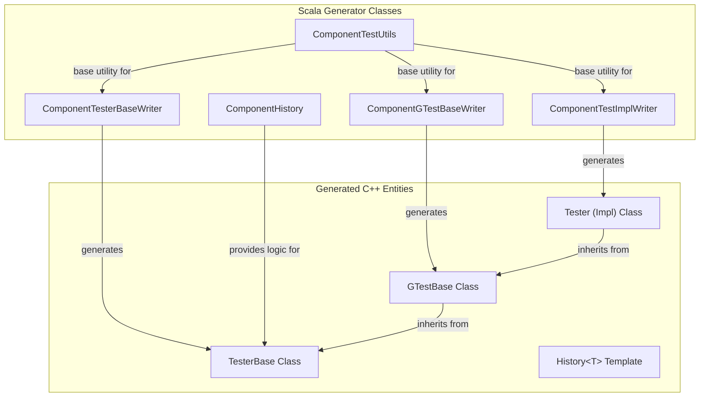
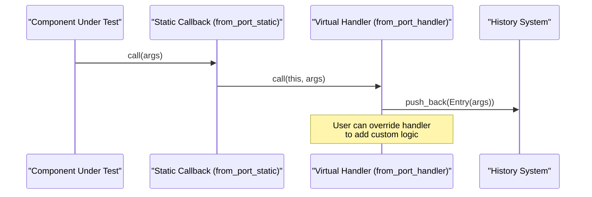

# Page: Unit Test Harness Generator

# Unit Test Harness Generator

Relevant source files

The following files were used as context for generating this wiki page:

- [compiler/lib/src/main/scala/codegen/CppWriter/ComponentCppWriter/TestWriter/ComponentGTestBaseWriter.scala](compiler/lib/src/main/scala/codegen/CppWriter/ComponentCppWriter/TestWriter/ComponentGTestBaseWriter.scala)
- [compiler/lib/src/main/scala/codegen/CppWriter/ComponentCppWriter/TestWriter/ComponentHistory.scala](compiler/lib/src/main/scala/codegen/CppWriter/ComponentCppWriter/TestWriter/ComponentHistory.scala)
- [compiler/lib/src/main/scala/codegen/CppWriter/ComponentCppWriter/TestWriter/ComponentTestImplWriter.scala](compiler/lib/src/main/scala/codegen/CppWriter/ComponentCppWriter/TestWriter/ComponentTestImplWriter.scala)
- [compiler/lib/src/main/scala/codegen/CppWriter/ComponentCppWriter/TestWriter/ComponentTestMainWriter.scala](compiler/lib/src/main/scala/codegen/CppWriter/ComponentCppWriter/TestWriter/ComponentTestMainWriter.scala)
- [compiler/lib/src/main/scala/codegen/CppWriter/ComponentCppWriter/TestWriter/ComponentTestUtils.scala](compiler/lib/src/main/scala/codegen/CppWriter/ComponentCppWriter/TestWriter/ComponentTestUtils.scala)
- [compiler/lib/src/main/scala/codegen/CppWriter/ComponentCppWriter/TestWriter/ComponentTesterBaseWriter.scala](compiler/lib/src/main/scala/codegen/CppWriter/ComponentCppWriter/TestWriter/ComponentTesterBaseWriter.scala)
- [compiler/tools/fpp-to-cpp/test/array/check-cpp](compiler/tools/fpp-to-cpp/test/array/check-cpp)
- [compiler/tools/fpp-to-cpp/test/component/base/check-cpp](compiler/tools/fpp-to-cpp/test/component/base/check-cpp)
- [compiler/tools/fpp-to-cpp/test/component/clean](compiler/tools/fpp-to-cpp/test/component/clean)
- [compiler/tools/fpp-to-cpp/test/component/compile_base_cpp](compiler/tools/fpp-to-cpp/test/component/compile_base_cpp)
- [compiler/tools/fpp-to-cpp/test/component/gen_ref_headers](compiler/tools/fpp-to-cpp/test/component/gen_ref_headers)
- [compiler/tools/fpp-to-cpp/test/component/impl/check-cpp](compiler/tools/fpp-to-cpp/test/component/impl/check-cpp)
- [compiler/tools/fpp-to-cpp/test/component/test-base/.gitignore](compiler/tools/fpp-to-cpp/test/component/test-base/.gitignore)
- [compiler/tools/fpp-to-cpp/test/component/test-base/ActiveEventsGTestBase.ref.cpp](compiler/tools/fpp-to-cpp/test/component/test-base/ActiveEventsGTestBase.ref.cpp)
- [compiler/tools/fpp-to-cpp/test/component/test-base/ActiveEventsTesterBase.ref.cpp](compiler/tools/fpp-to-cpp/test/component/test-base/ActiveEventsTesterBase.ref.cpp)
- [compiler/tools/fpp-to-cpp/test/component/test-base/ActiveGetProductsTesterBase.ref.cpp](compiler/tools/fpp-to-cpp/test/component/test-base/ActiveGetProductsTesterBase.ref.cpp)
- [compiler/tools/fpp-to-cpp/test/component/test-base/ActiveGetProductsTesterBase.ref.hpp](compiler/tools/fpp-to-cpp/test/component/test-base/ActiveGetProductsTesterBase.ref.hpp)
- [compiler/tools/fpp-to-cpp/test/component/test-base/ActiveGuardedProductsTesterBase.ref.cpp](compiler/tools/fpp-to-cpp/test/component/test-base/ActiveGuardedProductsTesterBase.ref.cpp)
- [compiler/tools/fpp-to-cpp/test/component/test-base/ActiveGuardedProductsTesterBase.ref.hpp](compiler/tools/fpp-to-cpp/test/component/test-base/ActiveGuardedProductsTesterBase.ref.hpp)
- [compiler/tools/fpp-to-cpp/test/component/test-base/ActiveParamsTesterBase.ref.cpp](compiler/tools/fpp-to-cpp/test/component/test-base/ActiveParamsTesterBase.ref.cpp)
- [compiler/tools/fpp-to-cpp/test/component/test-base/ActiveParamsTesterBase.ref.hpp](compiler/tools/fpp-to-cpp/test/component/test-base/ActiveParamsTesterBase.ref.hpp)
- [compiler/tools/fpp-to-cpp/test/component/test-base/ActiveSerialGTestBase.ref.cpp](compiler/tools/fpp-to-cpp/test/component/test-base/ActiveSerialGTestBase.ref.cpp)
- [compiler/tools/fpp-to-cpp/test/component/test-base/ActiveSerialTesterBase.ref.cpp](compiler/tools/fpp-to-cpp/test/component/test-base/ActiveSerialTesterBase.ref.cpp)
- [compiler/tools/fpp-to-cpp/test/component/test-base/ActiveSerialTesterBase.ref.hpp](compiler/tools/fpp-to-cpp/test/component/test-base/ActiveSerialTesterBase.ref.hpp)
- [compiler/tools/fpp-to-cpp/test/component/test-base/ActiveSyncProductsTesterBase.ref.cpp](compiler/tools/fpp-to-cpp/test/component/test-base/ActiveSyncProductsTesterBase.ref.cpp)
- [compiler/tools/fpp-to-cpp/test/component/test-base/ActiveSyncProductsTesterBase.ref.hpp](compiler/tools/fpp-to-cpp/test/component/test-base/ActiveSyncProductsTesterBase.ref.hpp)
- [compiler/tools/fpp-to-cpp/test/component/test-base/ActiveTelemetryGTestBase.ref.cpp](compiler/tools/fpp-to-cpp/test/component/test-base/ActiveTelemetryGTestBase.ref.cpp)
- [compiler/tools/fpp-to-cpp/test/component/test-base/ActiveTelemetryTesterBase.ref.cpp](compiler/tools/fpp-to-cpp/test/component/test-base/ActiveTelemetryTesterBase.ref.cpp)
- [compiler/tools/fpp-to-cpp/test/component/test-base/ActiveTestGTestBase.ref.cpp](compiler/tools/fpp-to-cpp/test/component/test-base/ActiveTestGTestBase.ref.cpp)
- [compiler/tools/fpp-to-cpp/test/component/test-base/ActiveTestGTestBase.ref.hpp](compiler/tools/fpp-to-cpp/test/component/test-base/ActiveTestGTestBase.ref.hpp)
- [compiler/tools/fpp-to-cpp/test/component/test-base/ActiveTestTesterBase.ref.cpp](compiler/tools/fpp-to-cpp/test/component/test-base/ActiveTestTesterBase.ref.cpp)
- [compiler/tools/fpp-to-cpp/test/component/test-base/ActiveTestTesterBase.ref.hpp](compiler/tools/fpp-to-cpp/test/component/test-base/ActiveTestTesterBase.ref.hpp)
- [compiler/tools/fpp-to-cpp/test/component/test-base/EmptyTesterHelpers.ref.cpp](compiler/tools/fpp-to-cpp/test/component/test-base/EmptyTesterHelpers.ref.cpp)
- [compiler/tools/fpp-to-cpp/test/component/test-base/PassiveEventsGTestBase.ref.cpp](compiler/tools/fpp-to-cpp/test/component/test-base/PassiveEventsGTestBase.ref.cpp)
- [compiler/tools/fpp-to-cpp/test/component/test-base/PassiveEventsTesterBase.ref.cpp](compiler/tools/fpp-to-cpp/test/component/test-base/PassiveEventsTesterBase.ref.cpp)
- [compiler/tools/fpp-to-cpp/test/component/test-base/PassiveGetProductsTesterBase.ref.cpp](compiler/tools/fpp-to-cpp/test/component/test-base/PassiveGetProductsTesterBase.ref.cpp)
- [compiler/tools/fpp-to-cpp/test/component/test-base/PassiveGetProductsTesterBase.ref.hpp](compiler/tools/fpp-to-cpp/test/component/test-base/PassiveGetProductsTesterBase.ref.hpp)
- [compiler/tools/fpp-to-cpp/test/component/test-base/PassiveGuardedProductsTesterBase.ref.cpp](compiler/tools/fpp-to-cpp/test/component/test-base/PassiveGuardedProductsTesterBase.ref.cpp)
- [compiler/tools/fpp-to-cpp/test/component/test-base/PassiveGuardedProductsTesterBase.ref.hpp](compiler/tools/fpp-to-cpp/test/component/test-base/PassiveGuardedProductsTesterBase.ref.hpp)
- [compiler/tools/fpp-to-cpp/test/component/test-base/PassiveParamsTesterBase.ref.cpp](compiler/tools/fpp-to-cpp/test/component/test-base/PassiveParamsTesterBase.ref.cpp)
- [compiler/tools/fpp-to-cpp/test/component/test-base/PassiveParamsTesterBase.ref.hpp](compiler/tools/fpp-to-cpp/test/component/test-base/PassiveParamsTesterBase.ref.hpp)
- [compiler/tools/fpp-to-cpp/test/component/test-base/PassiveSerialGTestBase.ref.cpp](compiler/tools/fpp-to-cpp/test/component/test-base/PassiveSerialGTestBase.ref.cpp)
- [compiler/tools/fpp-to-cpp/test/component/test-base/PassiveSerialTesterBase.ref.cpp](compiler/tools/fpp-to-cpp/test/component/test-base/PassiveSerialTesterBase.ref.cpp)
- [compiler/tools/fpp-to-cpp/test/component/test-base/PassiveSerialTesterBase.ref.hpp](compiler/tools/fpp-to-cpp/test/component/test-base/PassiveSerialTesterBase.ref.hpp)
- [compiler/tools/fpp-to-cpp/test/component/test-base/PassiveSyncProductsTesterBase.ref.cpp](compiler/tools/fpp-to-cpp/test/component/test-base/PassiveSyncProductsTesterBase.ref.cpp)
- [compiler/tools/fpp-to-cpp/test/component/test-base/PassiveSyncProductsTesterBase.ref.hpp](compiler/tools/fpp-to-cpp/test/component/test-base/PassiveSyncProductsTesterBase.ref.hpp)
- [compiler/tools/fpp-to-cpp/test/component/test-base/PassiveTelemetryGTestBase.ref.cpp](compiler/tools/fpp-to-cpp/test/component/test-base/PassiveTelemetryGTestBase.ref.cpp)
- [compiler/tools/fpp-to-cpp/test/component/test-base/PassiveTelemetryTesterBase.ref.cpp](compiler/tools/fpp-to-cpp/test/component/test-base/PassiveTelemetryTesterBase.ref.cpp)
- [compiler/tools/fpp-to-cpp/test/component/test-base/PassiveTestGTestBase.ref.cpp](compiler/tools/fpp-to-cpp/test/component/test-base/PassiveTestGTestBase.ref.cpp)
- [compiler/tools/fpp-to-cpp/test/component/test-base/PassiveTestGTestBase.ref.hpp](compiler/tools/fpp-to-cpp/test/component/test-base/PassiveTestGTestBase.ref.hpp)
- [compiler/tools/fpp-to-cpp/test/component/test-base/PassiveTestTesterBase.ref.cpp](compiler/tools/fpp-to-cpp/test/component/test-base/PassiveTestTesterBase.ref.cpp)
- [compiler/tools/fpp-to-cpp/test/component/test-base/PassiveTestTesterBase.ref.hpp](compiler/tools/fpp-to-cpp/test/component/test-base/PassiveTestTesterBase.ref.hpp)
- [compiler/tools/fpp-to-cpp/test/component/test-base/QueuedEventsGTestBase.ref.cpp](compiler/tools/fpp-to-cpp/test/component/test-base/QueuedEventsGTestBase.ref.cpp)
- [compiler/tools/fpp-to-cpp/test/component/test-base/QueuedEventsTesterBase.ref.cpp](compiler/tools/fpp-to-cpp/test/component/test-base/QueuedEventsTesterBase.ref.cpp)
- [compiler/tools/fpp-to-cpp/test/component/test-base/QueuedGetProductsTesterBase.ref.cpp](compiler/tools/fpp-to-cpp/test/component/test-base/QueuedGetProductsTesterBase.ref.cpp)
- [compiler/tools/fpp-to-cpp/test/component/test-base/QueuedGetProductsTesterBase.ref.hpp](compiler/tools/fpp-to-cpp/test/component/test-base/QueuedGetProductsTesterBase.ref.hpp)
- [compiler/tools/fpp-to-cpp/test/component/test-base/QueuedGuardedProductsTesterBase.ref.cpp](compiler/tools/fpp-to-cpp/test/component/test-base/QueuedGuardedProductsTesterBase.ref.cpp)
- [compiler/tools/fpp-to-cpp/test/component/test-base/QueuedGuardedProductsTesterBase.ref.hpp](compiler/tools/fpp-to-cpp/test/component/test-base/QueuedGuardedProductsTesterBase.ref.hpp)
- [compiler/tools/fpp-to-cpp/test/component/test-base/QueuedParamsTesterBase.ref.cpp](compiler/tools/fpp-to-cpp/test/component/test-base/QueuedParamsTesterBase.ref.cpp)
- [compiler/tools/fpp-to-cpp/test/component/test-base/QueuedParamsTesterBase.ref.hpp](compiler/tools/fpp-to-cpp/test/component/test-base/QueuedParamsTesterBase.ref.hpp)
- [compiler/tools/fpp-to-cpp/test/component/test-base/QueuedSerialGTestBase.ref.cpp](compiler/tools/fpp-to-cpp/test/component/test-base/QueuedSerialGTestBase.ref.cpp)
- [compiler/tools/fpp-to-cpp/test/component/test-base/QueuedSerialTesterBase.ref.cpp](compiler/tools/fpp-to-cpp/test/component/test-base/QueuedSerialTesterBase.ref.cpp)
- [compiler/tools/fpp-to-cpp/test/component/test-base/QueuedSerialTesterBase.ref.hpp](compiler/tools/fpp-to-cpp/test/component/test-base/QueuedSerialTesterBase.ref.hpp)
- [compiler/tools/fpp-to-cpp/test/component/test-base/QueuedSyncProductsTesterBase.ref.cpp](compiler/tools/fpp-to-cpp/test/component/test-base/QueuedSyncProductsTesterBase.ref.cpp)
- [compiler/tools/fpp-to-cpp/test/component/test-base/QueuedSyncProductsTesterBase.ref.hpp](compiler/tools/fpp-to-cpp/test/component/test-base/QueuedSyncProductsTesterBase.ref.hpp)
- [compiler/tools/fpp-to-cpp/test/component/test-base/QueuedTelemetryGTestBase.ref.cpp](compiler/tools/fpp-to-cpp/test/component/test-base/QueuedTelemetryGTestBase.ref.cpp)
- [compiler/tools/fpp-to-cpp/test/component/test-base/QueuedTelemetryTesterBase.ref.cpp](compiler/tools/fpp-to-cpp/test/component/test-base/QueuedTelemetryTesterBase.ref.cpp)
- [compiler/tools/fpp-to-cpp/test/component/test-base/QueuedTestGTestBase.ref.cpp](compiler/tools/fpp-to-cpp/test/component/test-base/QueuedTestGTestBase.ref.cpp)
- [compiler/tools/fpp-to-cpp/test/component/test-base/QueuedTestGTestBase.ref.hpp](compiler/tools/fpp-to-cpp/test/component/test-base/QueuedTestGTestBase.ref.hpp)
- [compiler/tools/fpp-to-cpp/test/component/test-base/QueuedTestTesterBase.ref.cpp](compiler/tools/fpp-to-cpp/test/component/test-base/QueuedTestTesterBase.ref.cpp)
- [compiler/tools/fpp-to-cpp/test/component/test-base/QueuedTestTesterBase.ref.hpp](compiler/tools/fpp-to-cpp/test/component/test-base/QueuedTestTesterBase.ref.hpp)
- [compiler/tools/fpp-to-cpp/test/component/test-base/check-cpp](compiler/tools/fpp-to-cpp/test/component/test-base/check-cpp)
- [compiler/tools/fpp-to-cpp/test/component/test-base/clean](compiler/tools/fpp-to-cpp/test/component/test-base/clean)
- [compiler/tools/fpp-to-cpp/test/component/test-impl/check-cpp](compiler/tools/fpp-to-cpp/test/component/test-impl/check-cpp)
- [compiler/tools/fpp-to-cpp/test/constants/check-cpp](compiler/tools/fpp-to-cpp/test/constants/check-cpp)
- [compiler/tools/fpp-to-cpp/test/enum/check-cpp](compiler/tools/fpp-to-cpp/test/enum/check-cpp)
- [compiler/tools/fpp-to-cpp/test/port/check-cpp](compiler/tools/fpp-to-cpp/test/port/check-cpp)
- [compiler/tools/fpp-to-cpp/test/struct/check-cpp](compiler/tools/fpp-to-cpp/test/struct/check-cpp)

The Unit Test Harness Generator is a sub-system of the FPP code generator that produces C++ classes for testing components. It automates the creation of a "Tester" environment by generating base classes that handle port connections, command dispatching, and a history system for verifying component outputs (events, telemetry, and ports).

## System Architecture

The test generation system follows a layered approach, where each layer adds specific capabilities (e.g., basic infrastructure, GTest integration, or implementation templates).

### Code Entity Space Mapping

The following diagram maps the logical test harness components to their implementing Scala classes and generated C++ entities.

**Test Harness Class Hierarchy**

Sources: [compiler/lib/src/main/scala/codegen/CppWriter/ComponentCppWriter/TestWriter/ComponentTesterBaseWriter.scala:8-11](), [compiler/lib/src/main/scala/codegen/CppWriter/ComponentCppWriter/TestWriter/ComponentGTestBaseWriter.scala:8-11](), [compiler/lib/src/main/scala/codegen/CppWriter/ComponentCppWriter/TestWriter/ComponentTestImplWriter.scala:8-11](), [compiler/lib/src/main/scala/codegen/CppWriter/ComponentCppWriter/TestWriter/ComponentTestUtils.scala:8-11]()

## ComponentTesterBaseWriter

The `ComponentTesterBaseWriter` generates the primary base class for the test harness. This class inherits from `Fw::PassiveComponentBase` and acts as the "stub" for all components connected to the Component Under Test (CUT).

### Key Features
- **Port Pipeline**: Automatically connects tester output ports to CUT input ports and vice versa [compiler/lib/src/main/scala/codegen/CppWriter/ComponentCppWriter/TestWriter/ComponentTesterBaseWriter.scala:138-164]().
- **History System**: Maintains a record of all data received on input ports, events, and telemetry [compiler/lib/src/main/scala/codegen/CppWriter/ComponentCppWriter/TestWriter/ComponentHistory.scala:115-120]().
- **External Parameter Delegate**: For components using external parameters, it generates a delegate to handle parameter serialization/deserialization during tests [compiler/lib/src/main/scala/codegen/CppWriter/ComponentCppWriter/TestWriter/ComponentTesterBaseWriter.scala:25-25]().

### Data Flow: Port Handler Pipeline
When the CUT sends data through an output port, it flows into the TesterBase via a static callback, which then delegates to a virtual handler.

Sources: [compiler/lib/src/main/scala/codegen/CppWriter/ComponentCppWriter/TestWriter/ComponentTesterBaseWriter.scala:138-148](), [compiler/tools/fpp-to-cpp/test/component/test-base/ActiveTestTesterBase.ref.cpp:126-131]()

## History System (ComponentHistory)

The `ComponentHistory` class generates a nested template class `History<T>` within the `TesterBase` [compiler/lib/src/main/scala/codegen/CppWriter/ComponentCppWriter/TestWriter/ComponentHistory.scala:14-90]().

- **Storage**: Uses a dynamically allocated array of type `T` to store entries [compiler/lib/src/main/scala/codegen/CppWriter/ComponentCppWriter/TestWriter/ComponentHistory.scala:33-33]().
- **Entry Types**: For every typed port, event, or telemetry channel, a corresponding `struct` is generated to hold the arguments [compiler/lib/src/main/scala/codegen/CppWriter/ComponentCppWriter/TestWriter/ComponentHistory.scala:170-204]().
- **Management**: Provides `push_back`, `at`, `size`, and `clear` methods [compiler/lib/src/main/scala/codegen/CppWriter/ComponentCppWriter/TestWriter/ComponentHistory.scala:44-77]().

Sources: [compiler/lib/src/main/scala/codegen/CppWriter/ComponentCppWriter/TestWriter/ComponentHistory.scala:1-133]()

## ComponentGTestBaseWriter

The `ComponentGTestBaseWriter` extends the `TesterBase` with Google Test (GTest) integration. It generates macros and assertion functions to verify the state of the history system.

### Assertion Macros
For every component output, the generator creates GTest macros:
- `ASSERT_EVENTS_SIZE(size)`: Verifies the number of events emitted [compiler/lib/src/main/scala/codegen/CppWriter/ComponentCppWriter/TestWriter/ComponentGTestBaseWriter.scala:203-205]().
- `ASSERT_from_PortName_SIZE(size)`: Verifies the number of port calls [compiler/lib/src/main/scala/codegen/CppWriter/ComponentCppWriter/TestWriter/ComponentGTestBaseWriter.scala:143-145]().
- `ASSERT_from_PortName(index, args...)`: Verifies the specific arguments of a port call at a given history index [compiler/lib/src/main/scala/codegen/CppWriter/ComponentCppWriter/TestWriter/ComponentGTestBaseWriter.scala:149-175]().

Sources: [compiler/lib/src/main/scala/codegen/CppWriter/ComponentCppWriter/TestWriter/ComponentGTestBaseWriter.scala:124-180]()

## ComponentTestImplWriter

The `ComponentTestImplWriter` generates the `Tester.hpp` and `Tester.cpp` files. These are intended to be edited by the user, but the generator provides a complete skeleton.

| Function | Responsibility |
| :--- | :--- |
| `initComponents()` | Initializes the CUT and the TesterBase [compiler/lib/src/main/scala/codegen/CppWriter/ComponentCppWriter/TestWriter/ComponentTestImplWriter.scala:223-231](). |
| `connectPorts()` | Performs the cross-connection between the Tester and the CUT [compiler/lib/src/main/scala/codegen/CppWriter/ComponentCppWriter/TestWriter/ComponentTestImplWriter.scala:206-222](). |
| `toDo()` | A placeholder test case to ensure the harness compiles [compiler/lib/src/main/scala/codegen/CppWriter/ComponentCppWriter/TestWriter/ComponentTestImplWriter.scala:139-153](). |

Sources: [compiler/lib/src/main/scala/codegen/CppWriter/ComponentCppWriter/TestWriter/ComponentTestImplWriter.scala:1-232]()

## Utility and Support Classes

### ComponentTestUtils
An abstract base class providing naming conventions and common CppDoc fragments for all test writers.
- Defines class names: `${name}TesterBase`, `${name}GTestBase`, and `${name}Tester` [compiler/lib/src/main/scala/codegen/CppWriter/ComponentCppWriter/TestWriter/ComponentTestUtils.scala:15-19]().
- Provides helpers for port naming: `fromPortHandlerName`, `toPortInvokerName`, etc [compiler/lib/src/main/scala/codegen/CppWriter/ComponentCppWriter/TestWriter/ComponentTestUtils.scala:191-205]().

### ExternalParameterDelegate
Handles the generation of `ActiveTestComponentBaseParamExternalDelegate` (and similar for other kinds). It implements `serializeParam` and `deserializeParam` using a `switch` statement over parameter IDs to map them to local member variables in the test harness [compiler/tools/fpp-to-cpp/test/component/test-base/ActiveTestTesterBase.ref.cpp:18-107]().

Sources: [compiler/lib/src/main/scala/codegen/CppWriter/ComponentCppWriter/TestWriter/ComponentTestUtils.scala:8-230](), [compiler/lib/src/main/scala/codegen/CppWriter/ComponentCppWriter/TestWriter/ComponentTesterBaseWriter.scala:25-25]()
