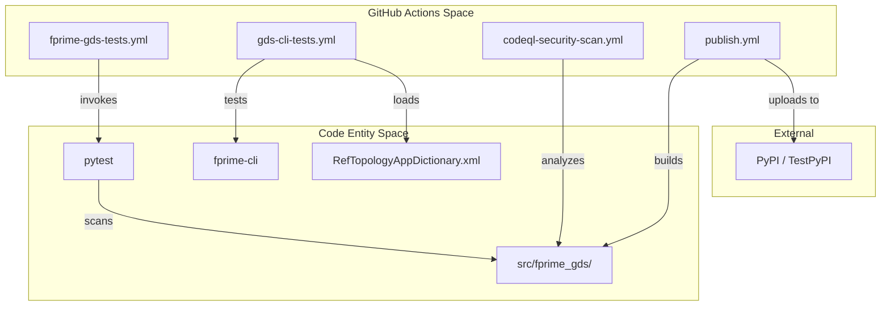
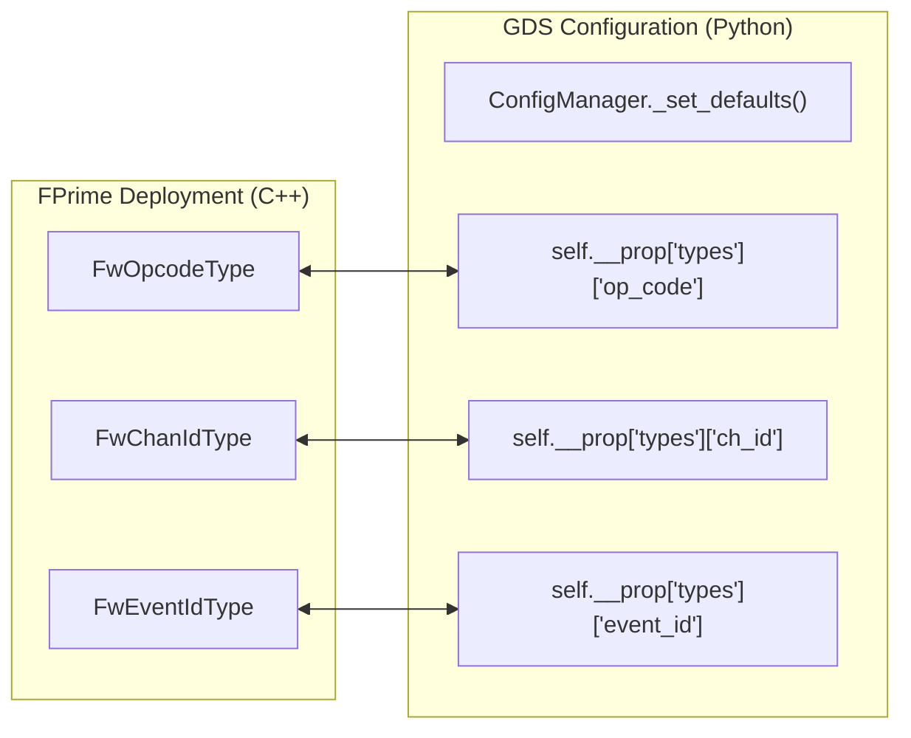

# Page: CI/CD, Testing Infrastructure & Documentation

# CI/CD, Testing Infrastructure & Documentation

Relevant source files

The following files were used as context for generating this wiki page:

- [.github/actions/codeql/security-pack.yml](.github/actions/codeql/security-pack.yml)
- [.github/actions/spelling/excludes.txt](.github/actions/spelling/excludes.txt)
- [.github/actions/spelling/patterns.txt](.github/actions/spelling/patterns.txt)
- [.github/workflows/codeql-security-scan.yml](.github/workflows/codeql-security-scan.yml)
- [.github/workflows/fprime-gds-tests.yml](.github/workflows/fprime-gds-tests.yml)
- [.github/workflows/gds-cli-tests.yml](.github/workflows/gds-cli-tests.yml)
- [.github/workflows/publish.yml](.github/workflows/publish.yml)
- [.github/workflows/spelling.yml](.github/workflows/spelling.yml)
- [Doxyfile](Doxyfile)
- [docs/README.md](docs/README.md)
- [docs/_static/css/rtd_width.css](docs/_static/css/rtd_width.css)
- [docs/conf.py](docs/conf.py)
- [docs/gendoc.bash](docs/gendoc.bash)
- [docs/index.rst](docs/index.rst)
- [src/fprime_gds/common/communication/ccsds/__init__.py](src/fprime_gds/common/communication/ccsds/__init__.py)
- [src/fprime_gds/common/communication/ccsds/chain.py](src/fprime_gds/common/communication/ccsds/chain.py)
- [src/fprime_gds/flask/logs.py](src/fprime_gds/flask/logs.py)

This page provides a high-level overview of the automation, security scanning, and documentation generation processes for the `fprime-gds` repository. The project utilizes GitHub Actions for continuous integration, Sphinx and Doxygen for documentation, and a multi-stage release pipeline to PyPI.

## CI/CD Pipeline Overview

The `fprime-gds` repository employs several GitHub Actions workflows to ensure code quality, functional correctness across Python versions, and security compliance.

### Core Workflows
*   **Unit Testing:** The `fprime-gds tests` workflow runs the `pytest` suite across a matrix of Python versions (3.9 through 3.13) on every push and pull request to the `devel` branch [.github/workflows/fprime-gds-tests.yml:1-35]().
*   **CLI Functional Tests:** The `GDS CLI Tests` workflow validates that the `fprime-cli` can successfully load dictionaries and list events, channels, and commands [.github/workflows/gds-cli-tests.yml:1-43]().
*   **Security Scanning:** Semantic code analysis is performed using **CodeQL** to identify potential vulnerabilities [.github/workflows/codeql-security-scan.yml:1-45]().
*   **Spelling:** Automated spell checking is applied to the codebase with specific exclusions for vendor code and binary file types [.github/workflows/spelling.yml:1-33](), [.github/actions/spelling/excludes.txt:1-49]().

### Release Process
When a new release is published, the `Build and Publish Package` workflow automates the distribution to PyPI. It builds the source and wheel distributions, performs a `twine check`, and uses trusted publishing to push to both TestPyPI and the production PyPI repository [.github/workflows/publish.yml:1-36]().

For details on configuration and the test matrix, see [GitHub Actions & CI Workflows](#11.1).

## Testing Infrastructure

The testing infrastructure is designed to support both unit-level verification and high-level integration testing using the `IntegrationTestAPI`.

### Test Execution & Logs
Tests are primarily executed via `pytest` [.github/workflows/fprime-gds-tests.yml:34](). The GDS provides specialized endpoints for retrieving logs generated during these runs. The `LogList` and `LogFile` resources in the Flask server handle lazy-loading of log data from the filesystem [.src/fprime_gds/flask/logs.py:10-57]().

### CI/CD Workflow Relationships
The following diagram illustrates how the various GitHub Action entities interact with the codebase and external registries.

**CI/CD Entity Mapping**

Sources: [.github/workflows/fprime-gds-tests.yml](), [.github/workflows/gds-cli-tests.yml](), [.github/workflows/publish.yml]().

## Documentation Generation

The project maintains comprehensive documentation through a combination of hand-written guides and auto-generated API references.

### Sphinx & AutoAPI
The primary documentation engine is **Sphinx**, configured in `docs/conf.py`. It uses the `autoapi.extension` to automatically generate documentation from Python docstrings found in the `src/` directory [.docs/conf.py:37-47](), [.docs/conf.py:91-93](). It supports both reStructuredText and Markdown formats [.docs/conf.py:53-56]().

### Doxygen
For lower-level documentation or cross-language support, **Doxygen** is configured to output to `./docs/doxy` [.Doxyfile:61](). This is often used in conjunction with F´ framework-level documentation.

For details on the documentation build process and Sphinx extensions, see [Documentation Generation](#11.2).

## System Configuration for Testing
The GDS requires alignment between the Ground Data System and the Flight Software (FSW) configuration. This is managed via `config_manager.py`, which maps GDS types to F´ compile-time flags such as `FwOpcodeType` and `FwChanIdType` [.docs/README.md:16-27]().

**Configuration Alignment Mapping**

Sources: [docs/README.md](), [src/fprime_gds/common/utils/config_manager.py]().

## Child Pages
- [GitHub Actions & CI Workflows](#11.1) — Detailed breakdown of YAML workflows, test matrices, and the PyPI release process.
- [Documentation Generation](#11.2) — Technical details on Sphinx configuration, Doxygen settings, and API doc generation.
