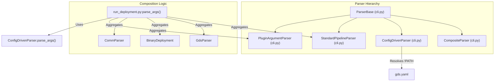
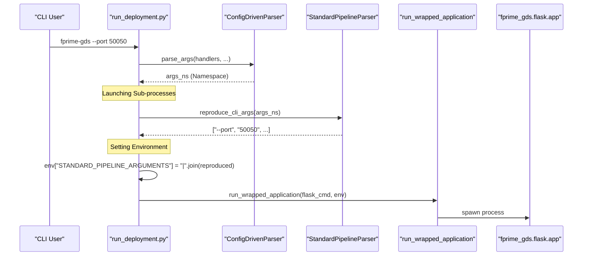

# Page: CLI Argument System

# CLI Argument System

Relevant source files

The following files were used as context for generating this wiki page:

- [src/fprime_gds/common/communication/adapters/base.py](src/fprime_gds/common/communication/adapters/base.py)
- [src/fprime_gds/common/communication/checksum.py](src/fprime_gds/common/communication/checksum.py)
- [src/fprime_gds/common/communication/framing.py](src/fprime_gds/common/communication/framing.py)
- [src/fprime_gds/common/gds_cli/base_commands.py](src/fprime_gds/common/gds_cli/base_commands.py)
- [src/fprime_gds/common/gds_cli/channels.py](src/fprime_gds/common/gds_cli/channels.py)
- [src/fprime_gds/common/gds_cli/command_send.py](src/fprime_gds/common/gds_cli/command_send.py)
- [src/fprime_gds/common/gds_cli/events.py](src/fprime_gds/common/gds_cli/events.py)
- [src/fprime_gds/common/gds_cli/filtering_utils.py](src/fprime_gds/common/gds_cli/filtering_utils.py)
- [src/fprime_gds/common/gds_cli/test_api_utils.py](src/fprime_gds/common/gds_cli/test_api_utils.py)
- [src/fprime_gds/common/handlers.py](src/fprime_gds/common/handlers.py)
- [src/fprime_gds/common/pipeline/histories.py](src/fprime_gds/common/pipeline/histories.py)
- [src/fprime_gds/executables/apps.py](src/fprime_gds/executables/apps.py)
- [src/fprime_gds/executables/cli.py](src/fprime_gds/executables/cli.py)
- [src/fprime_gds/executables/comm.py](src/fprime_gds/executables/comm.py)
- [src/fprime_gds/executables/fprime_cli.py](src/fprime_gds/executables/fprime_cli.py)
- [src/fprime_gds/executables/run_deployment.py](src/fprime_gds/executables/run_deployment.py)
- [src/fprime_gds/executables/utils.py](src/fprime_gds/executables/utils.py)
- [src/fprime_gds/plugin/__init__.py](src/fprime_gds/plugin/__init__.py)
- [src/fprime_gds/plugin/definitions.py](src/fprime_gds/plugin/definitions.py)
- [src/fprime_gds/plugin/system.py](src/fprime_gds/plugin/system.py)
- [test/fprime_gds/common/gds_cli/filtering_utils_test.py](test/fprime_gds/common/gds_cli/filtering_utils_test.py)
- [test/fprime_gds/common/gds_cli/utils_test.py](test/fprime_gds/common/gds_cli/utils_test.py)
- [test/fprime_gds/executables/test_run_deployment.py](test/fprime_gds/executables/test_run_deployment.py)
- [test/fprime_gds/test_plugins.py](test/fprime_gds/test_plugins.py)

The F´ GDS CLI argument system is a modular framework designed to compose complex command-line interfaces from reusable, sub-system-specific parsers. It allows the GDS to aggregate arguments for communication adapters, dictionary loading, process management, and plugin-specific configurations into a unified interface.

## Core Architecture

The system is built around a hierarchy of parser classes that wrap `argparse.ArgumentParser`. These classes handle not only the definition of arguments but also their post-processing and reproduction for child processes.

### ParserBase
The `ParserBase` is an abstract base class defining the interface for all GDS parsers [src/fprime_gds/executables/cli.py:44-50](). It provides utility methods for safe argument addition to prevent collisions when multiple plugins or sub-systems define the same flags [src/fprime_gds/executables/cli.py:88-105]().

Key methods include:
*   `get_arguments()`: Returns a dictionary mapping flag tuples (e.g., `("-p", "--port")`) to `argparse` keyword arguments [src/fprime_gds/executables/cli.py:60-69]().
*   `reproduce_cli_args(args_ns)`: Regenerates a list of string arguments from a parsed namespace, allowing arguments to be passed down to subprocesses [src/fprime_gds/executables/cli.py:134-176]().
*   `handle_arguments(args, ...)`: Performs post-parsing validation and logic [src/fprime_gds/executables/cli.py:190-191]().

### Composite and Config-Driven Parsers
*   **`CompositeParser`**: Combines multiple `ParserBase` implementations into a single interface by aggregating their argument specifications [src/fprime_gds/executables/cli.py:206-210]().
*   **`ConfigDrivenParser`**: Extends the system to support YAML-based configuration files. It uses a custom YAML loader to handle the `!PATH` tag, which resolves paths relative to the configuration file's location [src/fprime_gds/executables/cli.py:255-265](). It allows CLI arguments to be defaulted by values found in a GDS configuration file [src/fprime_gds/executables/cli.py:246-253]().

### Parser Composition Diagram
This diagram shows how various code entities compose the final CLI interface used by `run_deployment.py`.

**Sources:** [src/fprime_gds/executables/cli.py:44-270](), [src/fprime_gds/executables/run_deployment.py:28-53]()

---

## Specialized Parsers

### DetectionParser (Artifact Discovery)
The `DetectionParser` implements automatic discovery of F´ project artifacts when explicit paths are not provided. It leverages `fprime.fbuild.settings` to find the `settings.ini` file and determine the `install_destination` [src/fprime_gds/executables/utils.py:145-164]().

*   **`find_app`**: Searches the `bin` directory of the artifacts root for a single executable [src/fprime_gds/executables/utils.py:167-186]().
*   **`find_dict`**: Searches the `dict` directory for files ending in `Dictionary.xml` or `Dictionary.json` [src/fprime_gds/executables/utils.py:189-206]().

### StandardPipelineParser
This parser defines the core arguments required to initialize a `StandardPipeline`, including dictionary paths, logging directories, and transport selection (TCP vs ZMQ) [src/fprime_gds/executables/cli.py:461-480](). It includes a `pipeline_factory` method to instantiate the pipeline from the parsed arguments [src/fprime_gds/executables/cli.py:596-604]().

### PluginArgumentParser
The `PluginArgumentParser` dynamically queries the `Plugins` system to include arguments defined by loaded plugins [src/fprime_gds/executables/cli.py:734-740](). It allows plugins (e.g., a custom `Framing` or `Communication` plugin) to inject their own CLI options into the global GDS namespace [src/fprime_gds/plugin/system.py:145-155]().

**Sources:** [src/fprime_gds/executables/cli.py:461-740](), [src/fprime_gds/executables/utils.py:133-210]()

---

## Data Flow and Subprocess Propagation

When `run_deployment.py` is executed, it parses a master set of arguments. Because the GDS consists of multiple independent processes (TCP Server, Comm Adapter, Flask App), these arguments must be "reproduced" and passed to the child processes.

### Argument Flow Diagram
This diagram traces how a CLI flag (e.g., `--port`) travels from the initial user command through the system to a subprocess.

**Sources:** [src/fprime_gds/executables/run_deployment.py:107-145](), [src/fprime_gds/executables/cli.py:134-176](), [src/fprime_gds/executables/utils.py:88-126]()

### Argument Reproduction Logic
The `reproduce_cli_args` function is critical for maintaining consistency across the distributed GDS components. It inspects the `argparse.Namespace` and maps internal attribute names back to their original CLI flags by checking the `dest` property or transforming the flag name (e.g., `tts_port` becomes `--tts-port`) [src/fprime_gds/executables/cli.py:137-145](). It specifically handles boolean flags (`store_true`/`store_false`) and list-based arguments [src/fprime_gds/executables/cli.py:159-170]().

---

## GDS CLI (fprime-cli) Integration

The `fprime-cli` tool uses a different composition pattern called `CliSubparserInjectorBase` [src/fprime_gds/executables/fprime_cli.py:101-106](). Instead of a flat argument structure, it uses sub-commands (e.g., `channels`, `events`).

Each sub-command injector (like `ChannelsSubparserInjector`) calls helper functions to mix in standard GDS options:
*   `add_connection_arguments`: Adds `StandardPipeline` options [src/fprime_gds/executables/fprime_cli.py:32-43]().
*   `add_search_arguments`: Adds filtering options like `--ids`, `--components`, and `--search` [src/fprime_gds/executables/fprime_cli.py:63-75]().
*   `add_retrieval_arguments`: Adds options for historical data retrieval (e.g., `--list`, `--follow`) [src/fprime_gds/executables/fprime_cli.py:45-61]().

**Sources:** [src/fprime_gds/executables/fprime_cli.py:32-156](), [src/fprime_gds/common/gds_cli/base_commands.py:138-150]()
