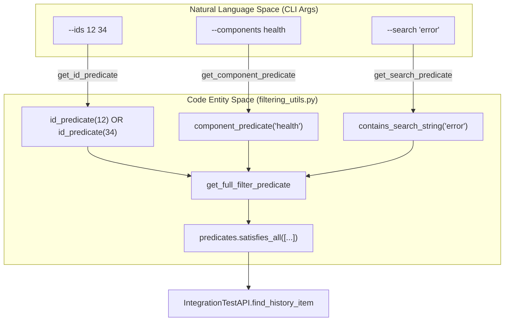
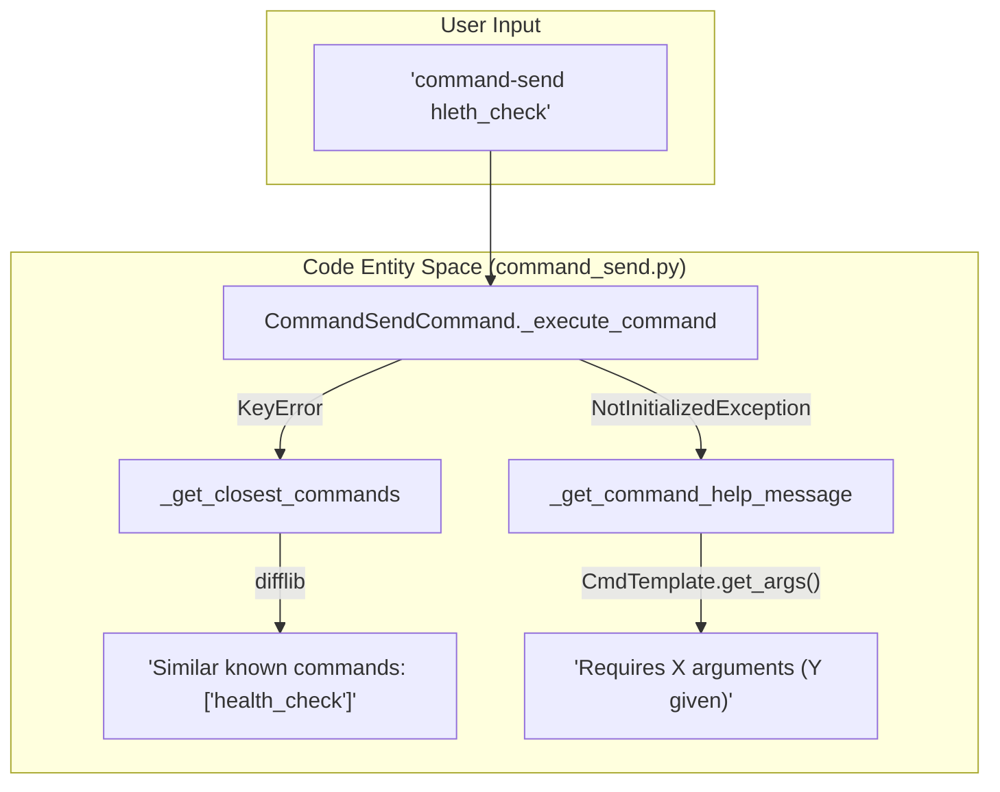

# Page: CLI Filtering & Predicate Utilities

# CLI Filtering & Predicate Utilities

Relevant source files

The following files were used as context for generating this wiki page:

- [src/fprime_gds/common/gds_cli/base_commands.py](src/fprime_gds/common/gds_cli/base_commands.py)
- [src/fprime_gds/common/gds_cli/channels.py](src/fprime_gds/common/gds_cli/channels.py)
- [src/fprime_gds/common/gds_cli/command_send.py](src/fprime_gds/common/gds_cli/command_send.py)
- [src/fprime_gds/common/gds_cli/events.py](src/fprime_gds/common/gds_cli/events.py)
- [src/fprime_gds/common/gds_cli/filtering_utils.py](src/fprime_gds/common/gds_cli/filtering_utils.py)
- [src/fprime_gds/common/gds_cli/test_api_utils.py](src/fprime_gds/common/gds_cli/test_api_utils.py)
- [src/fprime_gds/executables/fprime_cli.py](src/fprime_gds/executables/fprime_cli.py)
- [test/fprime_gds/common/gds_cli/filtering_utils_test.py](test/fprime_gds/common/gds_cli/filtering_utils_test.py)
- [test/fprime_gds/common/gds_cli/utils_test.py](test/fprime_gds/common/gds_cli/utils_test.py)

The GDS CLI relies on a robust filtering and predicate system to allow users to search, filter, and monitor specific telemetry channels, events, and commands. These utilities bridge the gap between the high-level CLI arguments and the low-level `IntegrationTestAPI` search mechanisms.

## Filtering Predicates

The `filtering_utils.py` module defines specialized predicates that inherit from the F´ testing framework's `predicates.predicate` base class. These predicates are used to evaluate `SysData` objects (like `EventData` or `ChData`) against user-defined criteria.

### Key Predicate Classes

| Class | Description | Implementation Detail |
| :--- | :--- | :--- |
| `id_predicate` | Filters items by their numeric ID. | Checks if the item has a `get_id` method and matches the provided `id_num` [src/fprime_gds/common/gds_cli/filtering_utils.py:13-28](). |
| `component_predicate` | Filters items by their component name. | Uses `get_comp_name()` on the item or its template. Returns `True` if no component info is found [src/fprime_gds/common/gds_cli/filtering_utils.py:53-76](). |
| `contains_search_string` | Performs substring matching on the string representation of an item. | Can accept a custom `to_string_func` to control how the item is serialized before searching [src/fprime_gds/common/gds_cli/filtering_utils.py:101-120](). |
| `time_to_data_predicate` | Adapts a time-based predicate to work on data objects. | Wraps a predicate that expects a `TimeType` and applies it to the `.time` field of a `SysData` object [src/fprime_gds/common/gds_cli/filtering_utils.py:200-218](). |
| `cmd_predicate` | Validates if an object is an instance of `CmdData`. | Used primarily for history searches [src/fprime_gds/common/gds_cli/filtering_utils.py:178-192](). |

### Composition and Helper Functions

To simplify CLI logic, several helper functions compose these predicates into logical groups:

*   **`get_full_filter_predicate`**: This is the primary entry point for CLI filtering. It combines ID, component, and search string predicates into a single `satisfies_all` logical block [src/fprime_gds/common/gds_cli/filtering_utils.py:147-175]().
*   **`get_id_predicate` / `get_component_predicate`**: These handle lists of inputs by wrapping individual predicates in a `satisfies_any` block [src/fprime_gds/common/gds_cli/filtering_utils.py:37-50](), [src/fprime_gds/common/gds_cli/filtering_utils.py:85-98]().

### Data Flow: CLI Argument to Predicate
The following diagram shows how raw CLI arguments are transformed into the predicate logic used by the search engine.

**Predicate Composition Flow**

Sources: [src/fprime_gds/common/gds_cli/filtering_utils.py:147-175](), [src/fprime_gds/common/gds_cli/base_commands.py:113-115]()

---

## Test API Utilities

The `test_api_utils.py` module provides high-level wrappers around the `IntegrationTestAPI` specifically tailored for CLI operations like continuous streaming and dictionary-based listing.

### Upcoming Data Retrieval
The functions `get_upcoming_event` and `get_upcoming_channel` facilitate the "streaming" mode of the CLI. They use `predicates.satisfies_all` to combine the user's search filter with a type-specific predicate (e.g., `event_predicate`) and then query the API history starting from the "NOW" timestamp [src/fprime_gds/common/gds_cli/test_api_utils.py:16-44](), [src/fprime_gds/common/gds_cli/test_api_utils.py:47-75]().

### Continuous Execution
The `repeat_until_interrupt` function implements the main loop for commands that stream data until the user presses `Ctrl+C`. It handles `KeyboardInterrupt` gracefully and supports persistent state by allowing the looped function to return updated arguments for the next iteration [src/fprime_gds/common/gds_cli/test_api_utils.py:109-129]().

### Dictionary Listing
`get_item_list` allows the CLI to display all possible items defined in the project dictionary (e.g., `fprime-cli events --list`). It converts `DataTemplate` objects from the dictionary into `SysData` objects so that the standard predicate engine can filter them before they are sorted by ID and returned [src/fprime_gds/common/gds_cli/test_api_utils.py:78-106]().

Sources: [src/fprime_gds/common/gds_cli/test_api_utils.py:1-129]()

---

## Error Handling & Unknown Commands

The GDS CLI implements intelligent error handling to assist users when commands fail or inputs are ambiguous, particularly within the `command-send` sub-command.

### Command Name Validation
When a user attempts to send a command that is not in the dictionary, `CommandSendCommand` performs two actions:
1.  **Fuzzy Matching**: It uses `difflib.get_close_matches` to suggest similar known commands from the project dictionary [src/fprime_gds/common/gds_cli/command_send.py:27-42]().
2.  **Help Messaging**: If a command exists but arguments are missing (raising a `NotInitializedException`), it retrieves the command template and prints a detailed help message showing the required argument types and descriptions [src/fprime_gds/common/gds_cli/command_send.py:168-175]().

### Data Interaction Logic
The following diagram associates the CLI error handling logic with the specific classes and methods responsible for dictionary lookups.

**Command Validation & Error Mapping**

Sources: [src/fprime_gds/common/gds_cli/command_send.py:153-175](), [src/fprime_gds/common/gds_cli/command_send.py:60-76]()

### Resource Cleanup
All CLI commands are executed within a `handle_arguments` lifecycle in `BaseCommand`. This ensures that even if a search or command-send operation fails, the `IntegrationTestAPI` is torn down and the `StandardPipeline` is disconnected via a `finally` block [src/fprime_gds/common/gds_cli/base_commands.py:138-184]().

Sources: [src/fprime_gds/common/gds_cli/base_commands.py:1-184]()
