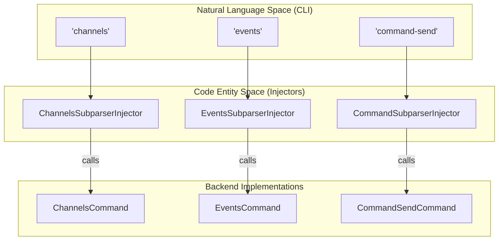
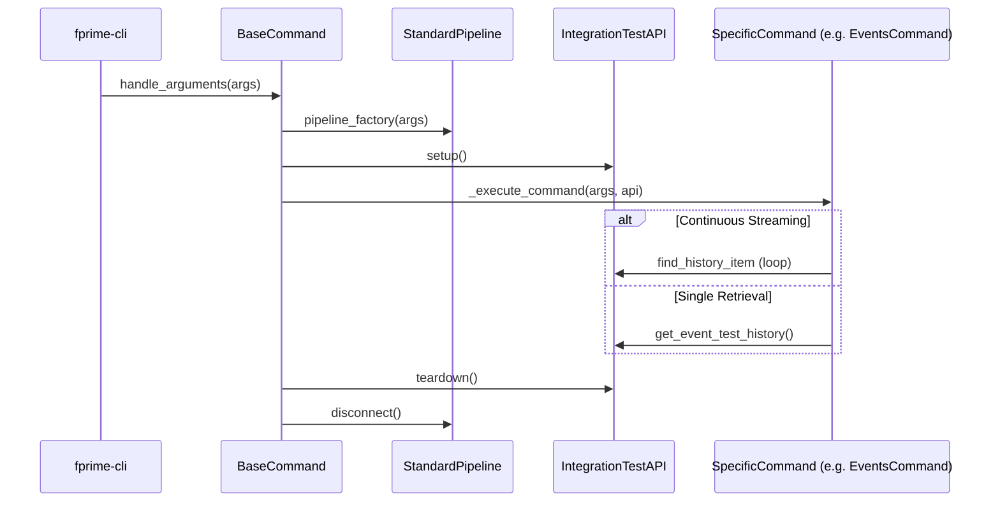
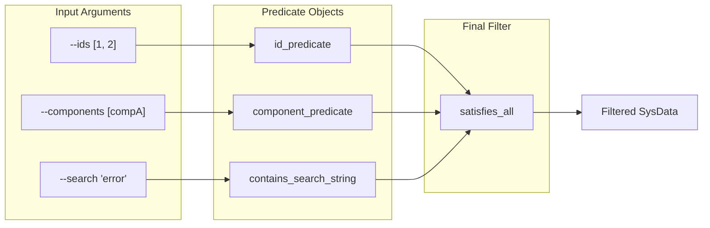

# Page: CLI Sub-commands: channels, events, command-send

# CLI Sub-commands: channels, events, command-send

Relevant source files

The following files were used as context for generating this wiki page:

- [src/fprime_gds/common/gds_cli/base_commands.py](src/fprime_gds/common/gds_cli/base_commands.py)
- [src/fprime_gds/common/gds_cli/channels.py](src/fprime_gds/common/gds_cli/channels.py)
- [src/fprime_gds/common/gds_cli/command_send.py](src/fprime_gds/common/gds_cli/command_send.py)
- [src/fprime_gds/common/gds_cli/events.py](src/fprime_gds/common/gds_cli/events.py)
- [src/fprime_gds/common/gds_cli/filtering_utils.py](src/fprime_gds/common/gds_cli/filtering_utils.py)
- [src/fprime_gds/common/gds_cli/test_api_utils.py](src/fprime_gds/common/gds_cli/test_api_utils.py)
- [src/fprime_gds/executables/fprime_cli.py](src/fprime_gds/executables/fprime_cli.py)
- [test/fprime_gds/common/gds_cli/filtering_utils_test.py](test/fprime_gds/common/gds_cli/filtering_utils_test.py)
- [test/fprime_gds/common/gds_cli/utils_test.py](test/fprime_gds/common/gds_cli/utils_test.py)

The F´ GDS CLI (`fprime-cli`) provides a terminal-based interface for interacting with a running F´ instance. It leverages the `IntegrationTestAPI` and `StandardPipeline` to retrieve telemetry (channels), monitor events, and dispatch commands. This page details the implementation of these sub-commands, their lifecycle, and the filtering mechanisms used to process data.

## Subparser Injection Architecture

The CLI uses a modular injection system where each sub-command is responsible for defining its own arguments and execution logic. This is managed through the `CliSubparserInjectorBase` class [src/fprime_gds/executables/fprime_cli.py:101-105]().

### Injector Classes
- **`ChannelsSubparserInjector`**: Injects the `channels` command for retrieving telemetry [src/fprime_gds/executables/fprime_cli.py:158-162]().
- **`EventsSubparserInjector`**: Injects the `events` command for monitoring system events [src/fprime_gds/executables/fprime_cli.py:202-206]().
- **`CommandSubparserInjector`**: Injects the `command-send` command for dispatching commands and listing available opcodes [src/fprime_gds/executables/fprime_cli.py:195-200]().

### Natural Language to Code Entity Mapping: CLI Entry
The following diagram illustrates how CLI string commands map to specific Python injector classes and their backend command implementations.

**CLI Command Mapping**

Sources: [src/fprime_gds/executables/fprime_cli.py:158-206](), [src/fprime_gds/common/gds_cli/channels.py:15-15](), [src/fprime_gds/common/gds_cli/events.py:15-15](), [src/fprime_gds/common/gds_cli/command_send.py:18-18]()

---

## Command Lifecycle

All CLI commands follow a standardized lifecycle managed by the `BaseCommand.handle_arguments` method [src/fprime_gds/common/gds_cli/base_commands.py:138-143]().

1.  **Pipeline Initialization**: The `StandardPipelineParser` processes connection arguments (e.g., IP, port) and creates a `StandardPipeline` instance [src/fprime_gds/common/gds_cli/base_commands.py:148-164]().
2.  **API Setup**: An `IntegrationTestAPI` is initialized with the pipeline and its `setup()` method is called to start data listeners [src/fprime_gds/common/gds_cli/base_commands.py:165-166]().
3.  **Execute**: The specific command logic (`_execute_command`) is invoked [src/fprime_gds/common/gds_cli/base_commands.py:169-169]().
4.  **Teardown**: The API is torn down and the pipeline is disconnected to release socket resources [src/fprime_gds/common/gds_cli/base_commands.py:172-185]().

### Command Execution Flow

Sources: [src/fprime_gds/common/gds_cli/base_commands.py:138-185](), [src/fprime_gds/common/gds_cli/test_api_utils.py:109-122]()

---

## Channels and Events (QueryHistoryCommand)

The `channels` and `events` commands inherit from `QueryHistoryCommand`, which provides logic for both historical retrieval and real-time streaming [src/fprime_gds/common/gds_cli/channels.py:15-15](), [src/fprime_gds/common/gds_cli/events.py:15-15]().

### Retrieval Modes
| Mode | Argument | Description |
| :--- | :--- | :--- |
| **Single Retrieval** | Default | Fetches current history and exits. |
| **Continuous Streaming** | `-f` / `--follow` | Enters a loop using `repeat_until_interrupt` to print new data as it arrives [src/fprime_gds/common/gds_cli/test_api_utils.py:109-115](). |
| **Dictionary List** | `-l` / `--list` | Ignores live data and prints all possible items defined in the project dictionary [src/fprime_gds/common/gds_cli/base_commands.py:152-161](). |

### Key Functions
- `_get_upcoming_item`: Uses `test_api_utils.get_upcoming_event` or `get_upcoming_channel` to block until new data arrives or a timeout occurs [src/fprime_gds/common/gds_cli/events.py:48-61](), [src/fprime_gds/common/gds_cli/channels.py:49-62]().
- `get_item_list`: Retrieves a sorted list of all available templates from the dictionary and converts them to `SysData` for filtering [src/fprime_gds/common/gds_cli/test_api_utils.py:78-82]().

Sources: [src/fprime_gds/common/gds_cli/base_commands.py:138-161](), [src/fprime_gds/common/gds_cli/test_api_utils.py:16-75]()

---

## Command Sending (CommandSendCommand)

The `command-send` sub-command handles dispatching commands to the flight software via `IntegrationTestAPI.send_command` [src/fprime_gds/common/gds_cli/command_send.py:153-160]().

### Features
- **Fuzzy Matching**: If a command name is not found in the dictionary, the CLI uses `difflib.get_close_matches` to suggest similar known commands [src/fprime_gds/common/gds_cli/command_send.py:27-42]().
- **Argument Validation**: If the wrong number of arguments is provided, it raises a `NotInitializedException`, prints a help message for that specific command, and shows required types [src/fprime_gds/common/gds_cli/command_send.py:168-175]().
- **JSON Output**: Supports printing command templates in JSON format for integration with other tools [src/fprime_gds/common/gds_cli/command_send.py:121-127]().

Sources: [src/fprime_gds/common/gds_cli/command_send.py:18-175]()

---

## Filtering and Predicates

CLI filtering is implemented using the `fprime_gds.common.testing_fw.predicates` engine. The `filtering_utils.py` module provides wrappers to apply these predicates to CLI-specific data.

### Common Predicates
- **`id_predicate`**: Checks if an item matches a specific numeric ID [src/fprime_gds/common/gds_cli/filtering_utils.py:13-28]().
- **`component_predicate`**: Filters items based on the source component name [src/fprime_gds/common/gds_cli/filtering_utils.py:53-76]().
- **`contains_search_string`**: Performs a substring search on the string representation of the data [src/fprime_gds/common/gds_cli/filtering_utils.py:101-120]().
- **`time_to_data_predicate`**: A decorator that allows time-based predicates (like `greater_than`) to be applied to `SysData` objects by extracting their `time` field [src/fprime_gds/common/gds_cli/filtering_utils.py:200-205]().

### Data Flow: Filter Composition
The `get_full_filter_predicate` function composes multiple constraints into a single `satisfies_all` predicate [src/fprime_gds/common/gds_cli/filtering_utils.py:147-175]().

**Predicate Composition Logic**

Sources: [src/fprime_gds/common/gds_cli/filtering_utils.py:147-175](), [src/fprime_gds/common/gds_cli/base_commands.py:88-115]()
