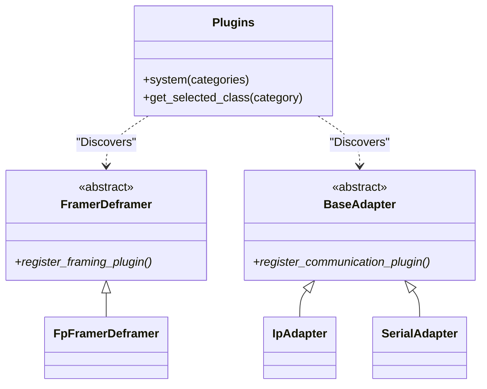

# Page: Communication Adapters & Framing

# Communication Adapters & Framing

<details>
<summary>Relevant source files</summary>

The following files were used as context for generating this wiki page:

- [.github/resources/RefTopologyAppDictionary.xml](.github/resources/RefTopologyAppDictionary.xml)
- [.gitignore](.gitignore)
- [src/fprime_gds/common/communication/adapters/base.py](src/fprime_gds/common/communication/adapters/base.py)
- [src/fprime_gds/common/communication/adapters/ip.py](src/fprime_gds/common/communication/adapters/ip.py)
- [src/fprime_gds/common/communication/adapters/uart.py](src/fprime_gds/common/communication/adapters/uart.py)
- [src/fprime_gds/common/communication/ccsds/space_data_link.py](src/fprime_gds/common/communication/ccsds/space_data_link.py)
- [src/fprime_gds/common/communication/ccsds/space_packet.py](src/fprime_gds/common/communication/ccsds/space_packet.py)
- [src/fprime_gds/common/communication/checksum.py](src/fprime_gds/common/communication/checksum.py)
- [src/fprime_gds/common/communication/framing.py](src/fprime_gds/common/communication/framing.py)
- [src/fprime_gds/common/encoders/encoder.py](src/fprime_gds/common/encoders/encoder.py)
- [src/fprime_gds/common/handlers.py](src/fprime_gds/common/handlers.py)
- [src/fprime_gds/common/pipeline/histories.py](src/fprime_gds/common/pipeline/histories.py)
- [src/fprime_gds/common/transport.py](src/fprime_gds/common/transport.py)
- [src/fprime_gds/common/zmq_transport.py](src/fprime_gds/common/zmq_transport.py)
- [src/fprime_gds/executables/apps.py](src/fprime_gds/executables/apps.py)
- [src/fprime_gds/executables/cli.py](src/fprime_gds/executables/cli.py)
- [src/fprime_gds/executables/comm.py](src/fprime_gds/executables/comm.py)
- [src/fprime_gds/executables/run_deployment.py](src/fprime_gds/executables/run_deployment.py)
- [src/fprime_gds/executables/utils.py](src/fprime_gds/executables/utils.py)
- [src/fprime_gds/flask/sequence.py](src/fprime_gds/flask/sequence.py)
- [src/fprime_gds/flask/static/addons/enabled.js](src/fprime_gds/flask/static/addons/enabled.js)
- [src/fprime_gds/flask/static/addons/packet-selection/addon.js](src/fprime_gds/flask/static/addons/packet-selection/addon.js)
- [src/fprime_gds/flask/static/addons/packet-selection/packet-selection-template.js](src/fprime_gds/flask/static/addons/packet-selection/packet-selection-template.js)
- [src/fprime_gds/flask/static/addons/packet-selection/packet-selection.js](src/fprime_gds/flask/static/addons/packet-selection/packet-selection.js)
- [src/fprime_gds/plugin/__init__.py](src/fprime_gds/plugin/__init__.py)
- [src/fprime_gds/plugin/definitions.py](src/fprime_gds/plugin/definitions.py)
- [src/fprime_gds/plugin/system.py](src/fprime_gds/plugin/system.py)
- [test/fprime_gds/common/communication/ccsds/test_space_data_link.py](test/fprime_gds/common/communication/ccsds/test_space_data_link.py)
- [test/fprime_gds/common/communication/ccsds/test_space_packet.py](test/fprime_gds/common/communication/ccsds/test_space_packet.py)
- [test/fprime_gds/executables/test_run_deployment.py](test/fprime_gds/executables/test_run_deployment.py)
- [test/fprime_gds/test_plugins.py](test/fprime_gds/test_plugins.py)

</details>


The Communication Layer is responsible for transporting binary data between the F´ Ground Data System and the Flight Software (FSW) deployment. This involves adapting to specific hardware or network interfaces (Adapters), wrapping data in protocol-specific envelopes (Framing), and managing the concurrent threads that drive data uplink and downlink.

## System Overview and Data Flow

The `comm.py` executable serves as the entry point for the communications stack. It instantiates an adapter, a framer/deframer, and two primary threads: the `Uplinker` and the `Downlinker`.

### Comm Layer Data Flow
The following diagram illustrates how data moves from the GDS middleware through the framing and adapter layers to the FSW.

**Diagram: Comm Layer Data Flow**
```mermaid
graph LR
    subgraph "GDS Internal"
        [TCPGround/ZmqGround] --> |"Raw Bytes"| [Uplinker]
    end

    subgraph "Comm Process (comm.py)"
        [Uplinker] --> |"frame()"| [FramerDeframer]
        [FramerDeframer] --> |"Framed Bytes"| [BaseAdapter]
        [BaseAdapter] --> |"Physical/Network Wire"| FSW[Flight Software]
        FSW --> |"Physical/Network Wire"| [BaseAdapter]
        [BaseAdapter] --> |"Read Bytes"| [Downlinker]
        [Downlinker] --> |"deframe_all()"| [FramerDeframer]
        [FramerDeframer] --> |"Unframed Packets"| [TCPGround/ZmqGround]
    end
```
**Sources:** [src/fprime_gds/executables/comm.py:7-12](), [src/fprime_gds/common/communication/updown.py:1-30]() (implied by imports).

## Transport Adapters

Adapters provide a standardized interface for reading and writing raw bytes over different physical or logical "wires". All adapters must inherit from `BaseAdapter` [src/fprime_gds/common/communication/adapters/base.py:16-23]().

### Supported Adapters
| Adapter Class | Protocol | Key Arguments | Description |
| :--- | :--- | :--- | :--- |
| `IpAdapter` | TCP/UDP | `--ip-address`, `--ip-port` | Pairs with `SocketIpDriver`. Uses TCP for writes and aggregates both for reads [src/fprime_gds/common/communication/adapters/ip.py:46-55](). |
| `SerialAdapter` | UART | `--uart-device`, `--uart-baud` | Uses `pyserial` to interface with hardware serial ports or USB-to-UART converters [src/fprime_gds/common/communication/adapters/uart.py:23-27](). |
| `NoneAdapter` | N/A | `none` | A null implementation used to disable the comm script [src/fprime_gds/common/communication/adapters/base.py:69-75](). |

### Adapter Implementation Details
*   **IP Adapter:** Implements a `TcpHandler` and `UdpHandler`. It starts a `KeepCommAliveThread` to maintain the TCP connection by sending a "sitting well" heartbeat [src/fprime_gds/common/communication/adapters/ip.py:54-97]().
*   **Serial Adapter:** Implements robust reconnection logic. If a `SerialException` occurs, it throttles warnings and attempts to reopen the device [src/fprime_gds/common/communication/adapters/uart.py:81-122]().

**Sources:** [src/fprime_gds/common/communication/adapters/base.py:16-50](), [src/fprime_gds/common/communication/adapters/ip.py:46-180](), [src/fprime_gds/common/communication/adapters/uart.py:23-181]().

## Framing and Deframing

The `FramerDeframer` interface defines how raw F´ packets (e.g., `Fw::Comm`, `Fw::FilePacket`) are encapsulated for transport.

### FramerDeframer Interface
Classes must implement two core methods:
1.  `frame(data: bytes) -> bytes`: Adds headers, footers, and checksums [src/fprime_gds/common/communication/framing.py:35-44]().
2.  `deframe(data: bytes) -> (packet, leftover, discarded)`: Extracts a single packet from a stream [src/fprime_gds/common/communication/framing.py:46-64]().

### FpFramerDeframer (Standard Format)
This is the default F´ framing format. It uses a synchronization token, a length field, and a CRC32 checksum [src/fprime_gds/common/communication/framing.py:106-117]().

**Packet Structure:**
| Field | Size | Description |
| :--- | :--- | :--- |
| Start Token | 4 Bytes | Default: `0xDEADBEEF` [src/fprime_gds/common/communication/framing.py:146-146](). |
| Data Length | 4 Bytes | Big-endian integer of the payload size [src/fprime_gds/common/communication/framing.py:120-122](). |
| Payload | Variable | The actual F´ packet bytes. |
| Checksum | 4 Bytes | CRC32 of header + payload [src/fprime_gds/common/communication/framing.py:170-171](). |

**Sources:** [src/fprime_gds/common/communication/framing.py:29-171]().

## Uplink and Downlink Threads

The `Uplinker` and `Downlinker` classes manage the asynchronous transfer of data between the ground system and the adapter.

### Downlinker
The `Downlinker` thread loops on the `adapter.read()` method. It passes received bytes to the framer's `deframe_all()` method and forwards successfully extracted packets to the `ground` interface (TCP or ZMQ) [src/fprime_gds/executables/comm.py:103-105](). It also supports logging "unframed" (discarded) data to a file for debugging [src/fprime_gds/executables/comm.py:89-102]().

### Uplinker
The `Uplinker` thread listens for data from the `ground` interface (commands or file uplink packets). It calls `framer.frame()` on the data and writes the resulting bytes to the `adapter.write()` method [src/fprime_gds/executables/comm.py:106-106]().

**Sources:** [src/fprime_gds/executables/comm.py:70-132](), [src/fprime_gds/common/communication/updown.py:1-50]() (implied by usage).

## Plugin Architecture

The communication system is highly extensible via the `Plugins` system. This allows developers to provide custom adapters or framing protocols without modifying the core GDS.

**Diagram: Plugin Registration and Selection**


### Registration Hooks
*   `register_communication_plugin()`: Returns a subclass of `BaseAdapter` [src/fprime_gds/common/communication/adapters/base.py:53-66]().
*   `register_framing_plugin()`: Returns a subclass of `FramerDeframer` [src/fprime_gds/common/communication/framing.py:88-103]().

**Sources:** [src/fprime_gds/plugin/system.py:1-50](), [src/fprime_gds/plugin/definitions.py:20-30](), [src/fprime_gds/executables/comm.py:51-81]().
