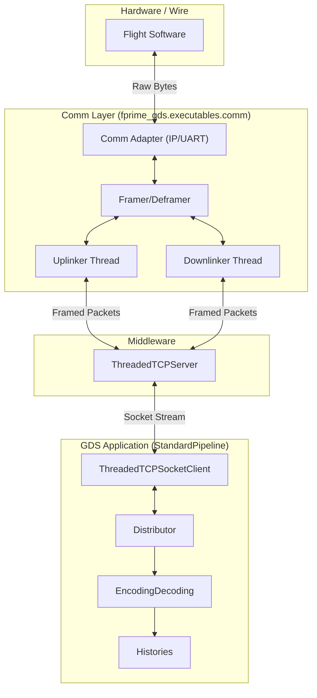
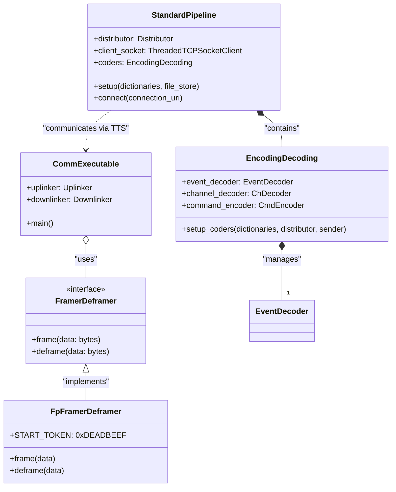

# Page: Core Pipeline & Communication Layer

# Core Pipeline & Communication Layer

Relevant source files

The following files were used as context for generating this wiki page:

- [src/fprime_gds/common/communication/adapters/base.py](src/fprime_gds/common/communication/adapters/base.py)
- [src/fprime_gds/common/communication/checksum.py](src/fprime_gds/common/communication/checksum.py)
- [src/fprime_gds/common/communication/framing.py](src/fprime_gds/common/communication/framing.py)
- [src/fprime_gds/common/handlers.py](src/fprime_gds/common/handlers.py)
- [src/fprime_gds/common/pipeline/encoding.py](src/fprime_gds/common/pipeline/encoding.py)
- [src/fprime_gds/common/pipeline/histories.py](src/fprime_gds/common/pipeline/histories.py)
- [src/fprime_gds/common/pipeline/standard.py](src/fprime_gds/common/pipeline/standard.py)
- [src/fprime_gds/common/testing_fw/__init__.py](src/fprime_gds/common/testing_fw/__init__.py)
- [src/fprime_gds/common/testing_fw/api.py](src/fprime_gds/common/testing_fw/api.py)
- [src/fprime_gds/common/testing_fw/predicates.py](src/fprime_gds/common/testing_fw/predicates.py)
- [src/fprime_gds/common/testing_fw/pytest_integration.py](src/fprime_gds/common/testing_fw/pytest_integration.py)
- [src/fprime_gds/executables/apps.py](src/fprime_gds/executables/apps.py)
- [src/fprime_gds/executables/cli.py](src/fprime_gds/executables/cli.py)
- [src/fprime_gds/executables/comm.py](src/fprime_gds/executables/comm.py)
- [src/fprime_gds/executables/run_deployment.py](src/fprime_gds/executables/run_deployment.py)
- [src/fprime_gds/executables/utils.py](src/fprime_gds/executables/utils.py)
- [src/fprime_gds/plugin/__init__.py](src/fprime_gds/plugin/__init__.py)
- [src/fprime_gds/plugin/definitions.py](src/fprime_gds/plugin/definitions.py)
- [src/fprime_gds/plugin/system.py](src/fprime_gds/plugin/system.py)
- [test/fprime_gds/executables/test_run_deployment.py](test/fprime_gds/executables/test_run_deployment.py)
- [test/fprime_gds/test_plugins.py](test/fprime_gds/test_plugins.py)

The Core Pipeline and Communication Layer forms the backbone of the F´ GDS, responsible for moving data between the Flight Software (FSW) and the ground system. It handles the low-level details of transport (TCP, Serial), framing (packet encapsulation), and the routing of decoded data to various consumers like histories and loggers.

### System Overview Diagram

The following diagram illustrates the relationship between the hardware-facing communication adapters, the framing logic, and the central `StandardPipeline` which orchestrates the data flow.

**Communication & Pipeline Data Flow**

**Sources:** [src/fprime_gds/executables/comm.py:44-135](), [src/fprime_gds/common/pipeline/standard.py:29-109]()

---

## StandardPipeline
The `StandardPipeline` is the primary composition class for the GDS. It encapsulates the `Distributor`, `EncodingDecoding` (coders), `Histories`, and `Filing` (file uplink/downlink) subsystems [src/fprime_gds/common/pipeline/standard.py:41-55](). 

It follows a standard lifecycle:
1. **Setup**: Initializes member objects and creates logging directories [src/fprime_gds/common/pipeline/standard.py:57-109]().
2. **Connect**: Establishes a connection to the middleware (TCP Server or ZMQ) [src/fprime_gds/common/pipeline/standard.py:157-169]().
3. **Register**: Allows external consumers to subscribe to decoded data [src/fprime_gds/common/pipeline/standard.py:34-35]().

For details, see [StandardPipeline](#2.1).

**Sources:** [src/fprime_gds/common/pipeline/standard.py:29-109]()

---

## Distributor, Decoders & Encoders
Data entering the pipeline via the `ThreadedTCPSocketClient` is passed to the `Distributor` [src/fprime_gds/common/pipeline/standard.py:106](). The `Distributor` routes binary packets to specific decoders based on their packet type (e.g., `FW_PACKET_LOG` for events, `FW_PACKET_TELEM` for channels) [src/fprime_gds/common/pipeline/encoding.py:76-80]().

*   **Encoders**: Serialize commands and files for uplink [src/fprime_gds/common/pipeline/encoding.py:57-58]().
*   **Decoders**: Transform binary streams into `EventData`, `ChData`, or `PktData` objects using the deployment's dictionaries [src/fprime_gds/common/pipeline/encoding.py:59-70]().

For details, see [Distributor, Decoders & Encoders](#2.2).

**Sources:** [src/fprime_gds/common/pipeline/encoding.py:45-81](), [src/fprime_gds/common/pipeline/standard.py:79-94]()

---

## Communication Adapters & Framing
The `comm.py` executable manages the bridge between the GDS middleware and the physical transport layer [src/fprime_gds/executables/comm.py:1-12](). 

*   **Adapters**: Handle the "read" and "write" operations against the hardware. Supported types include `IpAdapter` and `SerialAdapter` [src/fprime_gds/executables/comm.py:25-38]().
*   **Framing**: The `FramerDeframer` interface ensures data is correctly encapsulated for the wire. The `FpFramerDeframer` implements the standard F´ format: `[Start Token][Length][Payload][Checksum]` [src/fprime_gds/common/communication/framing.py:106-117]().

For details, see [Communication Adapters & Framing](#2.3).

**Sources:** [src/fprime_gds/executables/comm.py:44-135](), [src/fprime_gds/common/communication/framing.py:29-64]()

---

## TCP Server & Middleware
The `ThreadedTCPServer` (often referred to as the "TTS" or middleware) acts as a central multiplexer [src/fprime_gds/executables/run_deployment.py:85-104](). It allows multiple GDS clients (like the Web UI, CLI tools, or Integration Tests) to connect to a single Flight Software stream.

*   **Routing Tags**: The server uses tags (e.g., `RoutingTag.GUI`, `RoutingTag.FSW`) to determine where to route incoming packets [src/fprime_gds/common/pipeline/standard.py:158]().
*   **Multiplexing**: It handles simultaneous connections from various "Ground" and "Flight" components, ensuring commands are sent to the FSW and telemetry is broadcast to all registered GUIs.

For details, see [TCP Server & Middleware](#2.4).

**Sources:** [src/fprime_gds/executables/run_deployment.py:97-104](), [src/fprime_gds/common/pipeline/standard.py:157-169]()

---

## Code Entity Map

The following diagram maps the high-level communication concepts to the specific Python classes and files that implement them.

**Entity Relationship Diagram**

**Sources:** [src/fprime_gds/common/pipeline/standard.py:29-55](), [src/fprime_gds/common/pipeline/encoding.py:20-42](), [src/fprime_gds/common/communication/framing.py:29-117](), [src/fprime_gds/executables/comm.py:44-115]()
