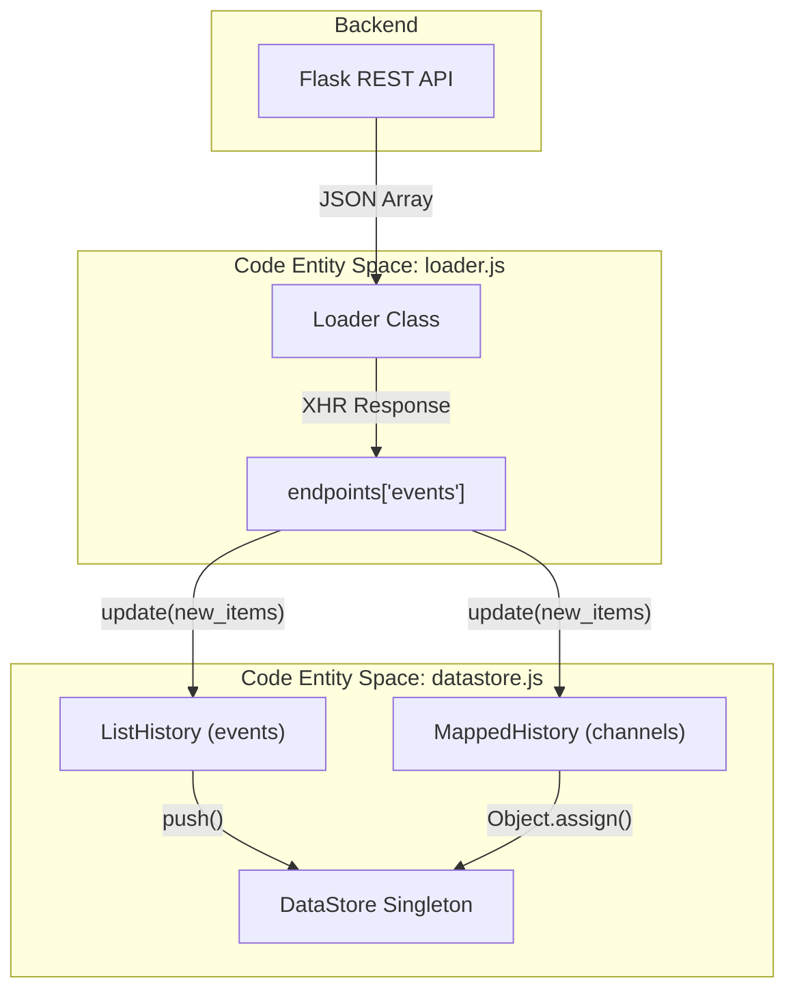
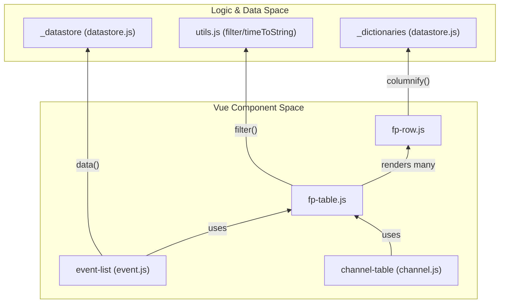

# Page: Core UI Components

# Core UI Components

Relevant source files

The following files were used as context for generating this wiki page:

- [src/fprime_gds/flask/static/index.html](src/fprime_gds/flask/static/index.html)
- [src/fprime_gds/flask/static/js/config.js](src/fprime_gds/flask/static/js/config.js)
- [src/fprime_gds/flask/static/js/datastore.js](src/fprime_gds/flask/static/js/datastore.js)
- [src/fprime_gds/flask/static/js/gds.js](src/fprime_gds/flask/static/js/gds.js)
- [src/fprime_gds/flask/static/js/loader.js](src/fprime_gds/flask/static/js/loader.js)
- [src/fprime_gds/flask/static/js/vue-support/channel.js](src/fprime_gds/flask/static/js/vue-support/channel.js)
- [src/fprime_gds/flask/static/js/vue-support/event.js](src/fprime_gds/flask/static/js/vue-support/event.js)
- [src/fprime_gds/flask/static/js/vue-support/fp-row.js](src/fprime_gds/flask/static/js/vue-support/fp-row.js)
- [src/fprime_gds/flask/static/js/vue-support/fptable.js](src/fprime_gds/flask/static/js/vue-support/fptable.js)
- [src/fprime_gds/flask/static/js/vue-support/tabetc.js](src/fprime_gds/flask/static/js/vue-support/tabetc.js)
- [src/fprime_gds/flask/static/js/vue-support/utils.js](src/fprime_gds/flask/static/js/vue-support/utils.js)

The F´ GDS Web UI is a single-page application (SPA) built using Vue.js. It follows a decoupled architecture where data retrieval (polling), data storage (normalization and history management), and data presentation (Vue components) are handled by distinct layers.

## System Entrypoint: gds.js

The `gds.js` file serves as the initialization script for the entire frontend. It orchestrates the startup sequence by first fetching static metadata (dictionaries) and then initializing the data management and view layers.

The lifecycle follows these steps:
1. **DOM Load**: The script waits for `DOMContentLoaded` [src/fprime_gds/flask/static/js/gds.js:32-35]().
2. **Static Data Fetch**: It calls `_loader.setup()`, which retrieves command, event, and channel dictionaries from the Flask REST API [src/fprime_gds/flask/static/js/loader.js:146-171]().
3. **Datastore Startup**: Once dictionaries are loaded, `_datastore.startup()` is invoked to begin background polling [src/fprime_gds/flask/static/js/gds.js:23-26]().
4. **Vue Mounting**: The root Vue instance is mounted to the `#tabetc` element [src/fprime_gds/flask/static/js/gds.js:34-34]().

**Sources:** [src/fprime_gds/flask/static/js/gds.js:1-36](), [src/fprime_gds/flask/static/js/loader.js:146-171]()

---

## Polling Engine: loader.js

The `Loader` class manages all asynchronous communication with the Flask backend. It handles both one-time "startup" requests (dictionaries) and continuous "polling" for telemetry and events.

### Concurrency Control
The `Loader` maintains an internal `endpoints` registry [src/fprime_gds/flask/static/js/loader.js:65-135](). Each endpoint tracks its own state using `running` and `queued` flags. This prevents overlapping requests for the same data type; if a poll is requested while one is already in flight, it is marked as `queued` and re-triggered upon completion of the current request [src/fprime_gds/flask/static/js/loader.js:70-71]().

### registerPoller
The `DataStore` uses the loader to register periodic updates. The polling interval is determined by `config.dataPollIntervalsMs`, allowing different frequencies for high-bandwidth data like channels vs. lower-bandwidth logs [src/fprime_gds/flask/static/js/config.js:18-21]().

**Sources:** [src/fprime_gds/flask/static/js/loader.js:60-140](), [src/fprime_gds/flask/static/js/config.js:10-25]()

---

## Data Management: datastore.js

The `DataStore` is a singleton that acts as the "source of truth" for the UI. It transforms raw JSON responses from the backend into reactive objects for Vue.

### History Helpers
To handle different data shapes, the GDS uses a hierarchy of `HistoryHelper` classes:

| Class | Purpose | Key Behavior |
| :--- | :--- | :--- |
| `HistoryHelper` | Base class | Normalizes timestamps and dispatches to consumers [src/fprime_gds/flask/static/js/datastore.js:22-81](). |
| `ListHistory` | Events/Commands | Appends new items to an array and enforces a `history_limit` [src/fprime_gds/flask/static/js/datastore.js:87-112](). |
| `FullListHistory` | Logs/Files | Replaces the entire list only if changes are detected [src/fprime_gds/flask/static/js/datastore.js:119-138](). |
| `MappedHistory` | Channels | Updates a Key-Value map where the key is the Object ID, ensuring only the latest value is shown [src/fprime_gds/flask/static/js/datastore.js:144-176](). |

### ScrollHandler
The `ScrollHandler` (found in `utils.js` but utilized by the datastore and tables) manages "sticky" scrolling. If a user is at the bottom of a list (e.g., an event log), the UI will automatically scroll as new items arrive. If the user scrolls up to inspect history, the auto-scroll is paused [src/fprime_gds/flask/static/js/vue-support/utils.js:1-10]().

### Data Flow Diagram
This diagram illustrates how data moves from the REST API through the `Loader` and `HistoryHelper` into the `DataStore`.

**Sources:** [src/fprime_gds/flask/static/js/datastore.js:17-190](), [src/fprime_gds/flask/static/js/loader.js:65-135]()

---

## UI Components: fp-table and fp-row

The `fp-table` is a generic, high-performance component used to render all tabular data in the GDS (Channels, Events, Commands, Logs).

### Key Features
1.  **Filtering**: Supports complex filtering via the `filter` utility. It allows for case-insensitive matching and Boolean "-or-" operations [src/fprime_gds/flask/static/js/vue-support/utils.js:29-93]().
2.  **Views**: Users can define "Views" which are subset selections of IDs to show. This is managed via the `supportViews` and `itemsShown` props [src/fprime_gds/flask/static/js/vue-support/fptable.js:157-168]().
3.  **Infinite Scroll/Performance**: To prevent Vue reactivity from slowing down with thousands of rows, `fp-table` can use `itemsKey`. This allows it to pull data directly from the `DataStore` and filter it before it becomes reactive in the component scope [src/fprime_gds/flask/static/js/vue-support/fptable.js:112-121]().
4.  **Columnification**: Each implementation (e.g., `event-list`) provides a `columnify` function that maps a data object to an array of strings/HTML for the table cells [src/fprime_gds/flask/static/js/vue-support/event.js:72-85]().

### Component Architecture Diagram
This diagram bridges the visual UI components to the underlying logic classes.

### Row Styling
The `rowStyle` property allows for dynamic CSS classes based on data values. For example, `channel-table` calculates styles by comparing channel values against `low_red`, `high_orange`, etc., defined in the dictionary [src/fprime_gds/flask/static/js/vue-support/channel.js:88-122]().

**Sources:** [src/fprime_gds/flask/static/js/vue-support/fptable.js:68-185](), [src/fprime_gds/flask/static/js/vue-support/fp-row.js:35-127](), [src/fprime_gds/flask/static/js/vue-support/channel.js:88-122](), [src/fprime_gds/flask/static/js/vue-support/event.js:21-133]()
