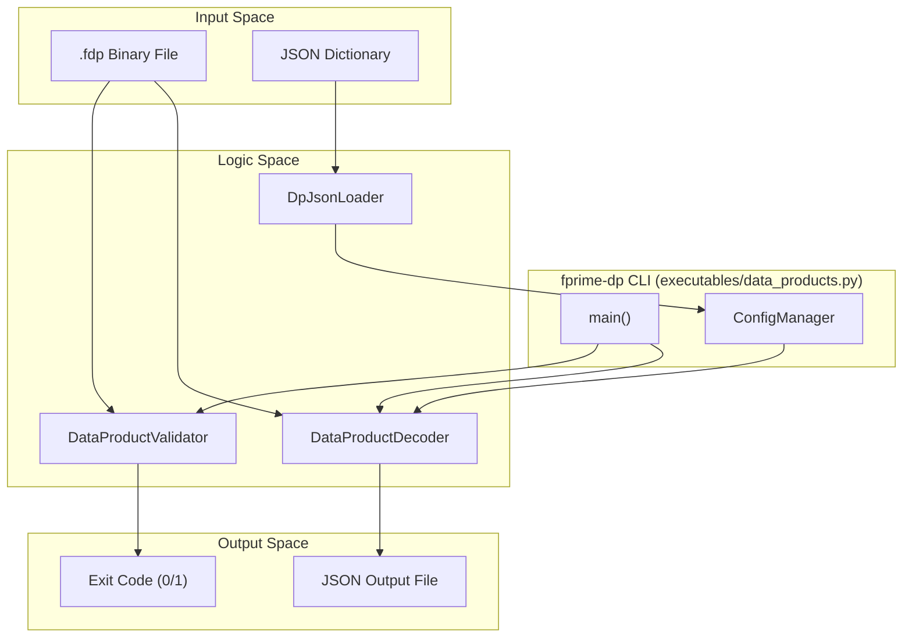
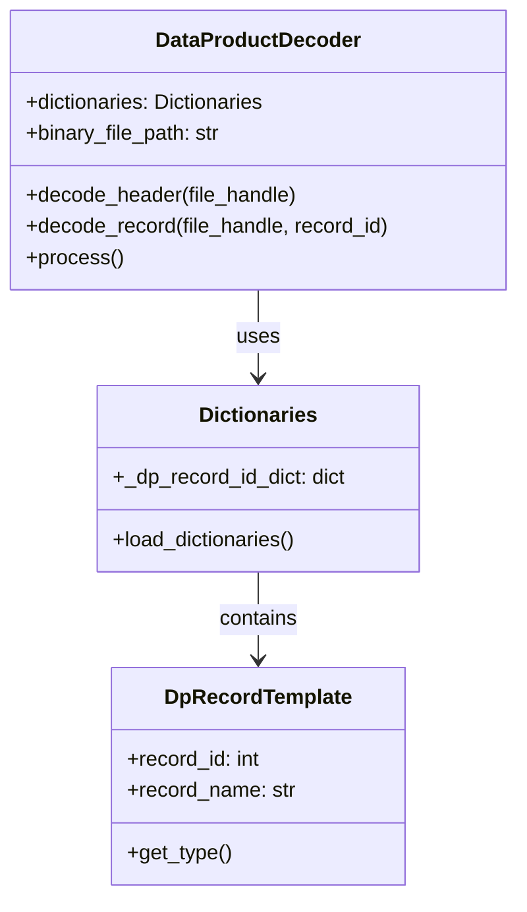

# Page: Data Products (fprime-dp)

# Data Products (fprime-dp)

<details>
<summary>Relevant source files</summary>

The following files were used as context for generating this wiki page:

- [src/fprime_gds/common/dp/__init__.py](src/fprime_gds/common/dp/__init__.py)
- [src/fprime_gds/common/dp/common.py](src/fprime_gds/common/dp/common.py)
- [src/fprime_gds/common/dp/decoder.py](src/fprime_gds/common/dp/decoder.py)
- [src/fprime_gds/common/dp/validator.py](src/fprime_gds/common/dp/validator.py)
- [src/fprime_gds/common/loaders/dp_json_loader.py](src/fprime_gds/common/loaders/dp_json_loader.py)
- [src/fprime_gds/common/models/dictionaries.py](src/fprime_gds/common/models/dictionaries.py)
- [src/fprime_gds/common/models/serialize/numerical_types.py](src/fprime_gds/common/models/serialize/numerical_types.py)
- [src/fprime_gds/common/models/serialize/type_base.py](src/fprime_gds/common/models/serialize/type_base.py)
- [src/fprime_gds/executables/data_products.py](src/fprime_gds/executables/data_products.py)
- [test/fprime_gds/executables/.gitignore](test/fprime_gds/executables/.gitignore)

</details>


The `fprime-dp` module provides tools and libraries for handling F´ Data Products. Data Products are a specialized telemetry format designed for large or structured data sets that are stored as binary files (typically with the `.fdp` extension) on the spacecraft and later downlinked to the ground. This page covers the decoding and validation of these binary files using the F´ GDS.

## Overview and Data Flow

Data products consist of a header, a series of data records, and a final data hash. The GDS processes these files by loading a JSON dictionary to understand the types and IDs of the records contained within the binary.

### Data Product Structure
1.  **Header**: Contains metadata such as Container ID, Priority, Time Tag, and the size of the following data.
2.  **Data Records**: Repeated entries consisting of a Record ID followed by the serialized record data.
3.  **Data Hash**: A CRC32 checksum of all record data combined.

### System Data Flow
The following diagram illustrates how a binary `.fdp` file is transformed into a human-readable JSON format.

**Data Product Decoding Flow**

Sources: [src/fprime_gds/executables/data_products.py:8-44](), [src/fprime_gds/common/dp/decoder.py:71-85]()

---

## DataProductDecoder

The `DataProductDecoder` class is responsible for reading `.fdp` files and converting them to JSON. It relies on the `ConfigManager` and `Dictionaries` objects to resolve F´ types and record templates.

### Key Implementation Details
- **Header Decoding**: Uses `get_dp_header_type()` to construct a `SerializableType` representing the F´ Data Product header [src/fprime_gds/common/dp/common.py:70-90]().
- **Record Resolution**: For each record in the binary, it queries the `DpRecordTemplate` from the dictionary using the Record ID [src/fprime_gds/common/dp/decoder.py:149-150]().
- **Variable Length Handling**: It handles variable-length types by reading the `getMaxSize()` and then seeking the file pointer to the `getSize()` after deserialization [src/fprime_gds/common/dp/decoder.py:160-176]().

### Class Relationship Diagram

Sources: [src/fprime_gds/common/dp/decoder.py:64-103](), [src/fprime_gds/common/models/dictionaries.py:29-60]()

---

## DataProductValidator

The `DataProductValidator` ensures the integrity of a data product file by verifying its internal checksums. It supports three modes for determining the header size, which is required to separate the header from the payload [src/fprime_gds/common/dp/validator.py:36-44]().

| Validation Mode | Description |
| :--- | :--- |
| **Dictionary** | Calculates header size by looking up types in the provided F´ dictionary [src/fprime_gds/common/dp/validator.py:124-146](). |
| **Explicit Size** | Uses a user-provided `--header-size` integer [src/fprime_gds/common/dp/validator.py:112-122](). |
| **Guess** | Iterates through a range of "reasonable" header sizes (21 to 301 bytes) until a valid CRC is found [src/fprime_gds/common/dp/validator.py:151-173](). |

Sources: [src/fprime_gds/common/dp/validator.py:46-58](), [src/fprime_gds/common/dp/common.py:34-47]()

---

## Dictionary Loading (DpJsonLoader)

Data product definitions are loaded from the JSON dictionary via the `DpJsonLoader`. This loader populates the `Dictionaries` object with two primary templates:
1.  **DpRecordTemplate**: Defines individual data entries (ID, name, type, and whether it is an array) [src/fprime_gds/common/loaders/dp_json_loader.py:87-127]().
2.  **DpContainerTemplate**: Defines the containers that group records (ID, name, and default priority) [src/fprime_gds/common/loaders/dp_json_loader.py:129-164]().

### Metadata Fields
The loader expects specific fields in the JSON dictionary:
- `records`: List of record objects [src/fprime_gds/common/loaders/dp_json_loader.py:25]().
- `containers`: List of container objects [src/fprime_gds/common/loaders/dp_json_loader.py:26]().

Sources: [src/fprime_gds/common/loaders/dp_json_loader.py:22-40](), [src/fprime_gds/common/models/dictionaries.py:97-99]()

---

## CLI Usage (fprime-dp)

The `fprime-dp` utility provides two sub-commands: `decode` and `validate`.

### Decode
Decodes a binary `.fdp` file into a JSON file.
```bash
fprime-dp decode -b <input.fdp> -d <dictionary.json> [-o <output.json>]
```
- Calls `DataProductDecoder(...).process()` [src/fprime_gds/executables/data_products.py:32]().

### Validate
Validates the CRC32 checksums of the header and data.
```bash
fprime-dp validate -b <input.fdp> [-d <dictionary.json> | -s <size> | -g]
```
- Calls `DataProductValidator(...).process()` [src/fprime_gds/executables/data_products.py:35-40]().

Sources: [src/fprime_gds/executables/data_products.py:12-22]()
