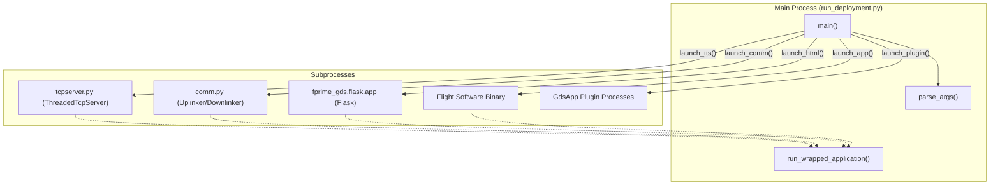
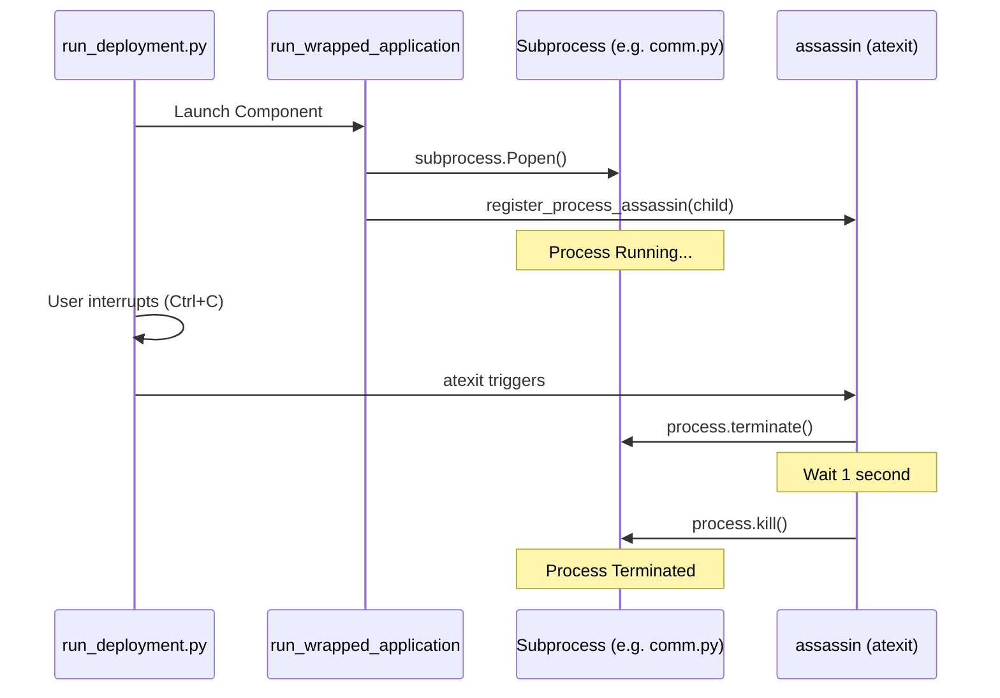

# Page: Deployment Runner & Process Management

# Deployment Runner & Process Management

Relevant source files

The following files were used as context for generating this wiki page:

- [src/fprime_gds/common/communication/adapters/base.py](src/fprime_gds/common/communication/adapters/base.py)
- [src/fprime_gds/common/communication/checksum.py](src/fprime_gds/common/communication/checksum.py)
- [src/fprime_gds/common/communication/framing.py](src/fprime_gds/common/communication/framing.py)
- [src/fprime_gds/common/handlers.py](src/fprime_gds/common/handlers.py)
- [src/fprime_gds/common/pipeline/histories.py](src/fprime_gds/common/pipeline/histories.py)
- [src/fprime_gds/executables/apps.py](src/fprime_gds/executables/apps.py)
- [src/fprime_gds/executables/cli.py](src/fprime_gds/executables/cli.py)
- [src/fprime_gds/executables/comm.py](src/fprime_gds/executables/comm.py)
- [src/fprime_gds/executables/run_deployment.py](src/fprime_gds/executables/run_deployment.py)
- [src/fprime_gds/executables/utils.py](src/fprime_gds/executables/utils.py)
- [src/fprime_gds/plugin/__init__.py](src/fprime_gds/plugin/__init__.py)
- [src/fprime_gds/plugin/definitions.py](src/fprime_gds/plugin/definitions.py)
- [src/fprime_gds/plugin/system.py](src/fprime_gds/plugin/system.py)
- [test/fprime_gds/executables/test_run_deployment.py](test/fprime_gds/executables/test_run_deployment.py)
- [test/fprime_gds/test_plugins.py](test/fprime_gds/test_plugins.py)

The F´ GDS uses an orchestration layer to manage the lifecycle of various subprocesses required for a full ground system stack. This management is primarily handled by `run_deployment.py`, which coordinates the execution of the middleware, communication adapters, the web server, and any external plugins.

## run_deployment.py Orchestration

The `run_deployment.py` script serves as the primary entry point for launching the GDS. It parses command-line arguments to determine which components of the stack should be active and then spawns them as independent subprocesses.

### Execution Flow
The `main` function in `run_deployment.py` follows a specific sequence to bring up the GDS:
1.  **Argument Parsing**: It invokes `parse_args()` to process CLI inputs using a suite of parsers including `StandardPipelineParser`, `GdsParser`, and `PluginArgumentParser` [src/fprime_gds/executables/run_deployment.py:36-53]().
2.  **Middleware Initialization**: If ZMQ is not enabled, it launches the `ThreadedTcpServer` (TTS) via `launch_tts` [src/fprime_gds/executables/run_deployment.py:220-221]().
3.  **Communication Adapter**: If a communication selection is made (e.g., `ip` or `uart`), it starts the `comm.py` process via `launch_comm` [src/fprime_gds/executables/run_deployment.py:224-225]().
4.  **Flight Software (FSW) App**: If configured to launch the binary, it executes the FSW application via `launch_app` [src/fprime_gds/executables/run_deployment.py:228-229]().
5.  **Flask Web Server**: Launches the HTML GUI via `launch_html`, which sets up the Flask environment and opens the system's default web browser [src/fprime_gds/executables/run_deployment.py:107-145]().
6.  **Plugin Applications**: Discovers and launches any registered `GdsApp` plugins [src/fprime_gds/executables/run_deployment.py:237-238]().

### Component Interaction Diagram
The following diagram illustrates how `run_deployment.py` orchestrates the different code entities.

**GDS Process Orchestration**

Sources: [src/fprime_gds/executables/run_deployment.py:85-211](), [src/fprime_gds/executables/run_deployment.py:212-243]()

---

## Process Management & Stability

To ensure the GDS stack is robust, the runner does not simply "fire and forget" subprocesses. It uses a wrapping mechanism to monitor their initial stability.

### run_wrapped_application
The `run_wrapped_application` function in `utils.py` is responsible for spawning processes using `subprocess.Popen` [src/fprime_gds/executables/utils.py:88-130](). Key features include:
*   **Log Redirection**: It opens a log file and redirects both `stdout` and `stderr` of the child process to it [src/fprime_gds/executables/utils.py:114-116]().
*   **Stability Check**: If a `launch_time` is provided, the function sleeps for that duration and then calls `child.poll()`. If the process has exited with a non-zero code during this window, it raises a `ProcessNotStableException` [src/fprime_gds/executables/utils.py:119-125]().

### ProcessNotStableException
This exception is raised when a component (like the TCP server or a comm adapter) crashes immediately upon startup [src/fprime_gds/executables/utils.py:29-37](). When `run_deployment.py` catches this via `launch_process`, it attempts to dump the last few lines of the component's log file to the console to assist in debugging [src/fprime_gds/executables/run_deployment.py:72-82]().

Sources: [src/fprime_gds/executables/utils.py:29-37](), [src/fprime_gds/executables/utils.py:88-130](), [src/fprime_gds/executables/run_deployment.py:56-83]()

---

## Argument Propagation

A critical task for the deployment runner is ensuring that configuration (like port numbers, dictionary paths, and log locations) is consistent across all subprocesses. This is achieved through `reproduce_cli_args`.

### reproduce_cli_args
Defined in `ParserBase`, this method takes the `argparse.Namespace` (the result of parsing the main command line) and converts it back into a list of strings that can be passed to a new command line [src/fprime_gds/executables/cli.py:134-176]().

*   **Logic**: It iterates through the arguments defined in the parser's specification, looks up their values in the namespace, and formats them as `--flag value` or `--flag` (for booleans) [src/fprime_gds/executables/cli.py:148-171]().
*   **Usage in Flask**: `launch_html` uses `StandardPipelineParser().reproduce_cli_args(parsed_args)` to serialize pipeline configurations into the `STANDARD_PIPELINE_ARGUMENTS` environment variable, which the Flask app later parses to initialize its internal `StandardPipeline` [src/fprime_gds/executables/run_deployment.py:116-126]().
*   **Usage in Comm**: `launch_comm` uses `CommParser().reproduce_cli_args(parsed_args)` to ensure the `comm.py` process uses the same hardware adapter and framing settings selected by the user [src/fprime_gds/executables/run_deployment.py:178-184]().

Sources: [src/fprime_gds/executables/cli.py:134-176](), [src/fprime_gds/executables/run_deployment.py:115-126](), [src/fprime_gds/executables/run_deployment.py:178-184]()

---

## Cleanup and Teardown

To prevent "zombie" processes when the main GDS runner is terminated (e.g., via Ctrl+C), the system employs an automated cleanup mechanism.

### atexit Cleanup
The `register_process_assassin` function in `utils.py` registers a cleanup handler using Python's `atexit` module [src/fprime_gds/executables/utils.py:45-85]().

**Cleanup Strategy**:
1.  **Graceful Termination**: The "assassin" first calls `process.terminate()` (sending `SIGTERM` or `SIGINT`) to allow the child process to shut down cleanly [src/fprime_gds/executables/utils.py:61-66]().
2.  **Forced Kill**: After a 1-second wait, if the process is still alive, it calls `process.kill()` (sending `SIGKILL`) to ensure removal [src/fprime_gds/executables/utils.py:69-75]().
3.  **Resource Release**: It closes any open log file handles associated with the process [src/fprime_gds/executables/utils.py:79-83]().

**Process Lifecycle Diagram**

Sources: [src/fprime_gds/executables/utils.py:45-85](), [src/fprime_gds/executables/utils.py:117-117]()

---

## Plugin Process Management

The GDS supports two types of application plugins that are managed by the runner:
1.  **GdsFunction**: Runs within the main GDS process. The developer is responsible for any threading or isolation [src/fprime_gds/executables/apps.py:55-71]().
2.  **GdsApp**: Designed for process isolation. The plugin must implement `get_process_invocation`, which returns the command line for the subprocess [src/fprime_gds/executables/apps.py:91-103]().

`run_deployment.py` iterates through all loaded `GdsApp` plugins and calls `launch_plugin`, which creates a dedicated log subdirectory for the plugin and uses `launch_process` to start it [src/fprime_gds/executables/run_deployment.py:192-209]().

Sources: [src/fprime_gds/executables/apps.py:91-152](), [src/fprime_gds/executables/run_deployment.py:192-209]()
