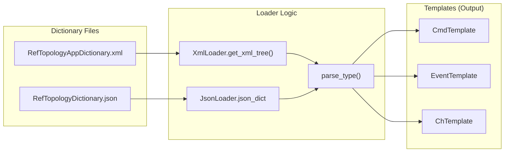
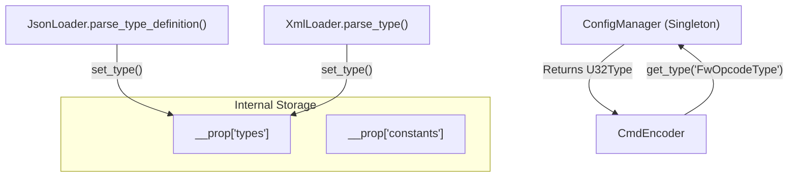

# Page: Dictionary Loaders (XML & JSON)

# Dictionary Loaders (XML & JSON)

<details>
<summary>Relevant source files</summary>

The following files were used as context for generating this wiki page:

- [src/fprime_gds/common/data_types/cmd_data.py](src/fprime_gds/common/data_types/cmd_data.py)
- [src/fprime_gds/common/loaders/ch_json_loader.py](src/fprime_gds/common/loaders/ch_json_loader.py)
- [src/fprime_gds/common/loaders/ch_xml_loader.py](src/fprime_gds/common/loaders/ch_xml_loader.py)
- [src/fprime_gds/common/loaders/cmd_json_loader.py](src/fprime_gds/common/loaders/cmd_json_loader.py)
- [src/fprime_gds/common/loaders/cmd_xml_loader.py](src/fprime_gds/common/loaders/cmd_xml_loader.py)
- [src/fprime_gds/common/loaders/dict_loader.py](src/fprime_gds/common/loaders/dict_loader.py)
- [src/fprime_gds/common/loaders/event_json_loader.py](src/fprime_gds/common/loaders/event_json_loader.py)
- [src/fprime_gds/common/loaders/event_xml_loader.py](src/fprime_gds/common/loaders/event_xml_loader.py)
- [src/fprime_gds/common/loaders/json_loader.py](src/fprime_gds/common/loaders/json_loader.py)
- [src/fprime_gds/common/loaders/pkt_json_loader.py](src/fprime_gds/common/loaders/pkt_json_loader.py)
- [src/fprime_gds/common/loaders/pkt_xml_loader.py](src/fprime_gds/common/loaders/pkt_xml_loader.py)
- [src/fprime_gds/common/loaders/xml_loader.py](src/fprime_gds/common/loaders/xml_loader.py)
- [src/fprime_gds/common/models/common/command.py](src/fprime_gds/common/models/common/command.py)
- [src/fprime_gds/common/models/serialize/array_type.py](src/fprime_gds/common/models/serialize/array_type.py)
- [src/fprime_gds/common/models/serialize/enum_type.py](src/fprime_gds/common/models/serialize/enum_type.py)
- [src/fprime_gds/common/models/serialize/serializable_type.py](src/fprime_gds/common/models/serialize/serializable_type.py)
- [src/fprime_gds/common/utils/config_manager.py](src/fprime_gds/common/utils/config_manager.py)
- [src/fprime_gds/flask/static/addons/commanding/argument-templates.js](src/fprime_gds/flask/static/addons/commanding/argument-templates.js)
- [src/fprime_gds/flask/static/addons/commanding/arguments.js](src/fprime_gds/flask/static/addons/commanding/arguments.js)
- [test/fprime_gds/common/loaders/resources/RefTopologyDictionary.json](test/fprime_gds/common/loaders/resources/RefTopologyDictionary.json)
- [test/fprime_gds/common/loaders/test_json_loader.py](test/fprime_gds/common/loaders/test_json_loader.py)
- [test/fprime_gds/common/tools/expected/simple_expected.bin](test/fprime_gds/common/tools/expected/simple_expected.bin)
- [test/fprime_gds/common/tools/input/simple_bad_sequence.seq](test/fprime_gds/common/tools/input/simple_bad_sequence.seq)
- [test/fprime_gds/common/tools/input/simple_sequence.seq](test/fprime_gds/common/tools/input/simple_sequence.seq)
- [test/fprime_gds/common/tools/resources/simple_dictionary.xml](test/fprime_gds/common/tools/resources/simple_dictionary.xml)
- [test/fprime_gds/common/tools/seqgen_unit_test.py](test/fprime_gds/common/tools/seqgen_unit_test.py)

</details>


Dictionary loaders are responsible for parsing the metadata produced during the F´ build process. They convert static dictionary files (XML or JSON) into Python objects, specifically `Template` objects, which the GDS uses to encode commands and decode telemetry.

## Loader Hierarchy and Base Classes

The loader system is built on a hierarchical structure. The base `DictLoader` defines the interface for retrieving dictionaries by ID or name, while `XmlLoader` and `JsonLoader` provide format-specific parsing logic.

### DictLoader (The Interface)
`DictLoader` serves as the abstract base class. It implements a caching mechanism in `get_id_dict` and `get_name_dict` to ensure that expensive file parsing only occurs once per path [src/fprime_gds/common/loaders/dict_loader.py:46-93]().

### XmlLoader
`XmlLoader` handles legacy XML dictionaries. It uses `lxml` to traverse the XML tree [src/fprime_gds/common/loaders/xml_loader.py:117-140]() and includes logic for parsing complex types like Enums, Serializables, and Arrays from XML sections [src/fprime_gds/common/loaders/xml_loader.py:196-330]().

### JsonLoader
`JsonLoader` handles the modern JSON dictionary format. It includes a class-level cache `parsed_types` to share parsed `DictionaryType` objects across different loader instances (e.g., sharing a struct definition between the Command and Event loaders) [src/fprime_gds/common/loaders/json_loader.py:45-45]().

### Dictionary Loader Class Diagram
This diagram shows the relationship between the base loaders and the specialized entity loaders.

```mermaid
classDiagram
    class "DictLoader" {
        +get_id_dict(path)
        +get_name_dict(path)
        +construct_dicts(path)*
    }
    class "XmlLoader" {
        +get_xml_tree(path)
        +parse_type(type_name, ...)
        +get_args_list(...)
    }
    class "JsonLoader" {
        +parse_type(type_dict)
        +parse_type_definition(type_def)
        +construct_enum_type(...)
    }

    "DictLoader" <|-- "XmlLoader"
    "DictLoader" <|-- "JsonLoader"

    "XmlLoader" <|-- "CmdXmlLoader"
    "XmlLoader" <|-- "ChXmlLoader"
    "XmlLoader" <|-- "EventXmlLoader"
    
    "JsonLoader" <|-- "CmdJsonLoader"
    "JsonLoader" <|-- "ChJsonLoader"
    "JsonLoader" <|-- "EventJsonLoader"
    "JsonLoader" <|-- "PktJsonLoader"
```
**Sources:** [src/fprime_gds/common/loaders/dict_loader.py:22-116](), [src/fprime_gds/common/loaders/xml_loader.py:64-114](), [src/fprime_gds/common/loaders/json_loader.py:41-58]().

---

## Specialized Loaders

Specialized loaders inherit from either `XmlLoader` or `JsonLoader` to populate entity-specific templates.

| Loader Class | Entity Handled | Template Produced | Key Function |
| :--- | :--- | :--- | :--- |
| `CmdXmlLoader` / `CmdJsonLoader` | Commands | `CmdTemplate` | `construct_dicts` [src/fprime_gds/common/loaders/cmd_xml_loader.py:28-76]() |
| `ChXmlLoader` / `ChJsonLoader` | Telemetry Channels | `ChTemplate` | `construct_dicts` [src/fprime_gds/common/loaders/ch_xml_loader.py:36-127]() |
| `EventXmlLoader` / `EventJsonLoader` | Events | `EventTemplate` | `construct_dicts` [src/fprime_gds/common/loaders/event_xml_loader.py:30-92]() |
| `PktXmlLoader` / `PktJsonLoader` | Packets | `PktTemplate` | `construct_dicts` [src/fprime_gds/common/loaders/pkt_xml_loader.py:26-80]() |

### Data Flow: From File to Template
This diagram bridges the "Natural Language" concept of a dictionary file to the "Code Entities" that perform the loading.


**Sources:** [src/fprime_gds/common/loaders/xml_loader.py:117-140](), [src/fprime_gds/common/loaders/json_loader.py:87-123](), [src/fprime_gds/common/loaders/cmd_xml_loader.py:69-71]().

---

## Type Parsing and Mapping

Loaders must map F´ types (defined in XML/JSON) to the GDS Python serialization type system.

### Primitive Mapping
Both loaders utilize a `PRIMITIVE_TYPE_MAP` to associate F´ type strings with Python classes:
*   **Integers:** I8, I16, I32, I64, U8, U16, U32, U64
*   **Floats:** F32, F64
*   **Booleans:** bool
[src/fprime_gds/common/loaders/xml_loader.py:50-62](), [src/fprime_gds/common/loaders/json_loader.py:26-38]().

### Complex Type Construction
For complex types, the loaders dynamically construct new classes:
1.  **Enums:** `construct_enum_type` creates an `EnumType` subclass with a populated `ENUM_DICT` [src/fprime_gds/common/loaders/json_loader.py:173-195]().
2.  **Arrays:** `construct_array_type` creates an `ArrayType` subclass defining `LENGTH` and `MEMBER_TYPE` [src/fprime_gds/common/loaders/json_loader.py:197-219]().
3.  **Serializables (Structs):** `construct_serializable_type` creates a `SerializableType` subclass with a `MEMBER_LIST` of (name, type, format) tuples [src/fprime_gds/common/loaders/json_loader.py:221-251]().

---

## The ConfigManager Integration

The `ConfigManager` is a singleton used by loaders to store and retrieve global configuration, specifically framework-level type overrides (e.g., the width of `FwOpcodeType` or `FwChanIdType`).

*   **Defaults:** `ConfigManager` sets default widths for IDs (typically U32) and Opcodes (typically U32) [src/fprime_gds/common/utils/config_manager.py:173-204]().
*   **Dynamic Overrides:** Loaders can update these types if the dictionary specifies a non-standard width for framework types [src/fprime_gds/common/utils/config_manager.py:103-112]().

### System Configuration Diagram
This diagram shows how `ConfigManager` acts as a central repository for types used during the loading process.


**Sources:** [src/fprime_gds/common/utils/config_manager.py:58-74](), [src/fprime_gds/common/utils/config_manager.py:87-112](), [src/fprime_gds/common/models/common/command.py:88-89]().

---

## Error Handling

Loaders raise specific exceptions when encountering malformed dictionaries:
*   `GseControllerUndefinedFileException`: Raised if the dictionary file path is invalid [src/fprime_gds/common/loaders/xml_loader.py:130-130]().
*   `GdsDictionaryParsingException`: Raised by `JsonLoader` for missing fields or unknown type kinds [src/fprime_gds/common/loaders/json_loader.py:97-100]().
*   `GseControllerParsingException`: Raised by XML loaders if required sections (like `<commands>`) are missing [src/fprime_gds/common/loaders/cmd_xml_loader.py:48-52]().

**Sources:** [src/fprime_gds/common/data_types/exceptions.py](), [src/fprime_gds/common/loaders/xml_loader.py:128-131](), [src/fprime_gds/common/loaders/json_loader.py:96-100]().
