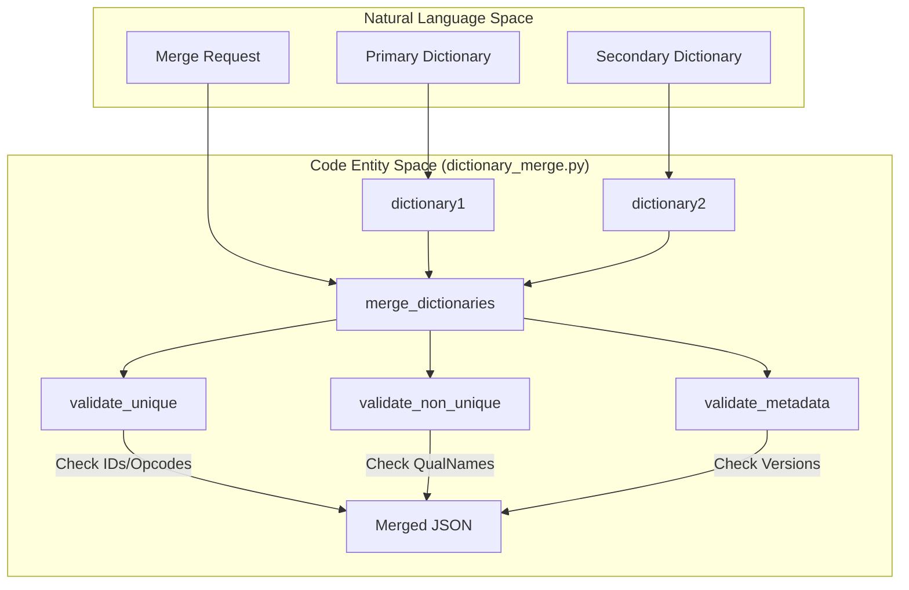
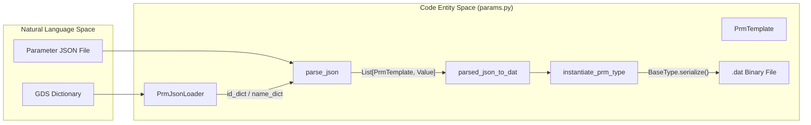

# Page: Dictionary Merge & Management Tools

# Dictionary Merge & Management Tools

Relevant source files

The following files were used as context for generating this wiki page:

- [src/fprime_gds/common/loaders/prm_json_loader.py](src/fprime_gds/common/loaders/prm_json_loader.py)
- [src/fprime_gds/common/templates/prm_template.py](src/fprime_gds/common/templates/prm_template.py)
- [src/fprime_gds/common/tools/README.md](src/fprime_gds/common/tools/README.md)
- [src/fprime_gds/common/tools/params.py](src/fprime_gds/common/tools/params.py)
- [src/fprime_gds/executables/dictionary_merge.py](src/fprime_gds/executables/dictionary_merge.py)
- [test/fprime_gds/common/tools/expected/simple_paramdb.dat](test/fprime_gds/common/tools/expected/simple_paramdb.dat)
- [test/fprime_gds/common/tools/input/simple_bad_paramdb.json](test/fprime_gds/common/tools/input/simple_bad_paramdb.json)
- [test/fprime_gds/common/tools/input/simple_paramdb.json](test/fprime_gds/common/tools/input/simple_paramdb.json)
- [test/fprime_gds/common/tools/resources/simple_dictionary.json](test/fprime_gds/common/tools/resources/simple_dictionary.json)
- [test/fprime_gds/common/tools/test_paramdb_gen.py](test/fprime_gds/common/tools/test_paramdb_gen.py)
- [test/fprime_gds/common/tools/test_prm_decode.py](test/fprime_gds/common/tools/test_prm_decode.py)

The F´ GDS provides a suite of command-line utilities for manipulating Ground Data System (GDS) dictionaries and flight software parameter databases. These tools facilitate the combination of multiple component dictionaries into a single deployment-wide dictionary and provide mechanisms for encoding/decoding parameter files used by the `Svc.PrmDb` component.

## Dictionary Merging (fprime-merge-dictionary)

The `fprime-merge-dictionary` tool allows developers to combine two JSON-formatted dictionaries into a single output file. This is particularly useful in multi-deployment or partitioned systems where metadata must be unified while ensuring no resource conflicts exist.

### Validation Logic
The tool enforces strict validation rules during the merge process to maintain the integrity of the flight system's command and telemetry space:

1.  **Metadata Consistency**: By default, it verifies that `projectVersion`, `frameworkVersion`, and `dictionarySpecVersion` match between both inputs [src/fprime_gds/executables/dictionary_merge.py:11-25](). This can be bypassed using the `--permissive` flag [src/fprime_gds/executables/dictionary_merge.py:69-70]().
2.  **Unique Identifier Checks**: For commands, events, channels, and parameters, the tool ensures that no two entries share the same `name`, `id`, or `opcode` [src/fprime_gds/executables/dictionary_merge.py:36-49]().
3.  **Non-Unique Consistency**: For shared definitions like `typeDefinitions` and `constants`, the tool ensures that if a `qualifiedName` exists in both, the definitions are identical [src/fprime_gds/executables/dictionary_merge.py:27-34]().

### Merge Data Flow
The `merge_dictionaries` function orchestrates the combination of top-level JSON sections [src/fprime_gds/executables/dictionary_merge.py:123-164]().

**Dictionary Merge Process**

**Sources:** [src/fprime_gds/executables/dictionary_merge.py:123-164](), [src/fprime_gds/executables/dictionary_merge.py:36-49]()

---

## Parameter Management (fprime-prm-write & fprime-prm-decode)

F´ uses a parameter database (`PrmDb`) to store non-volatile configuration. The GDS provides tools to convert between human-readable JSON representations and the binary format expected by flight software.

### Parameter Binary Format
The binary `.dat` file format follows a specific serialization pattern:
1.  **Delimiter**: A single byte `0xA5` [src/fprime_gds/common/tools/params.py:80]().
2.  **Record Size**: A 4-byte big-endian integer representing the size of the ID + Value [src/fprime_gds/common/tools/params.py:82-85]().
3.  **Parameter ID**: A 4-byte big-endian integer [src/fprime_gds/common/tools/params.py:87]().
4.  **Value**: The serialized parameter value based on its F´ type [src/fprime_gds/common/tools/params.py:89]().

### Tool Functionality
| Tool | Function | Description |
| :--- | :--- | :--- |
| `fprime-prm-write dat` | JSON → `.dat` | Encodes a JSON map of `{Component: {Param: Value}}` into a binary PrmDb file [src/fprime_gds/common/tools/params.py:167-180](). |
| `fprime-prm-write seq` | JSON → `.seq` | Generates a command sequence of `_PRM_SET` and `_PRM_SAVE` commands to update parameters live [src/fprime_gds/common/tools/params.py:93-106](). |
| `fprime-prm-decode` | `.dat` → JSON/CSV/Text | Decodes binary parameter files using a GDS dictionary to resolve IDs and types [test/fprime_gds/common/tools/test_prm_decode.py:5-11](). |

### Implementation Details
The `instantiate_prm_type` function is responsible for converting JSON values into the internal `BaseType` hierarchy (e.g., `U32Type`, `StringType`, `EnumType`) before serialization [src/fprime_gds/common/tools/params.py:34-64]().

**Parameter Encoding Flow**

**Sources:** [src/fprime_gds/common/tools/params.py:34-90](), [src/fprime_gds/common/loaders/prm_json_loader.py:14-57](), [src/fprime_gds/common/templates/prm_template.py:19-60]()

### Key Classes
*   **`PrmTemplate`**: Stores the static metadata for a parameter, including its ID, name, component owner, and `BaseType` class [src/fprime_gds/common/templates/prm_template.py:19-60]().
*   **`PrmJsonLoader`**: Inherits from `JsonLoader` to parse the `parameters` field of a GDS dictionary and produce dictionaries keyed by ID and fully qualified name [src/fprime_gds/common/loaders/prm_json_loader.py:14-57]().

**Sources:** [src/fprime_gds/common/templates/prm_template.py:19-82](), [src/fprime_gds/common/loaders/prm_json_loader.py:14-85](), [src/fprime_gds/common/tools/params.py:1-154]()
