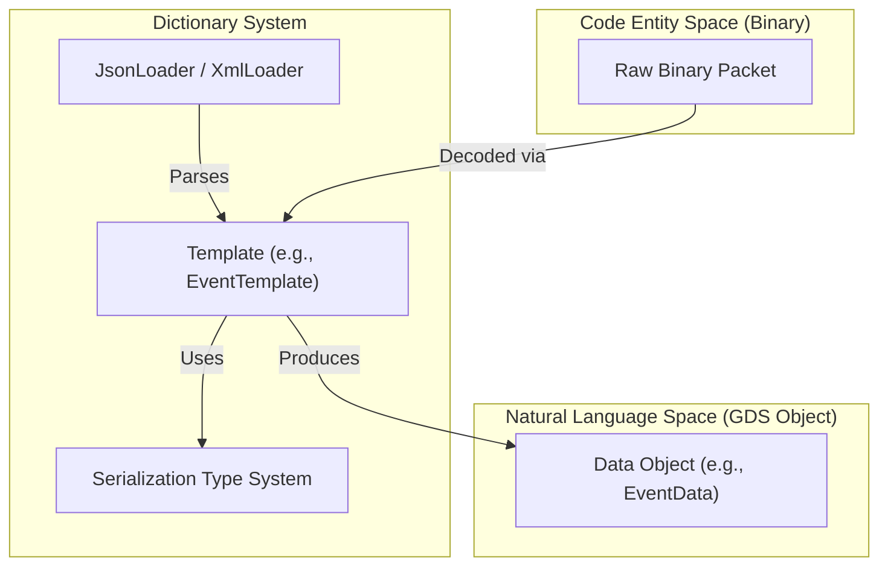
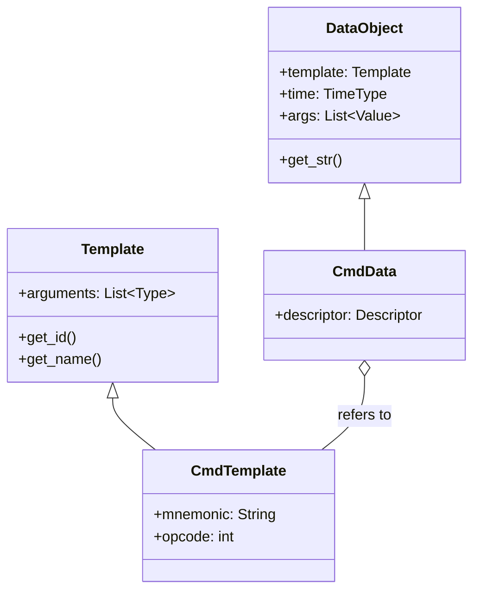

# Page: Dictionary System & Data Types

# Dictionary System & Data Types

Relevant source files

The following files were used as context for generating this wiki page:

- [src/fprime_gds/common/data_types/cmd_data.py](src/fprime_gds/common/data_types/cmd_data.py)
- [src/fprime_gds/common/dp/__init__.py](src/fprime_gds/common/dp/__init__.py)
- [src/fprime_gds/common/dp/common.py](src/fprime_gds/common/dp/common.py)
- [src/fprime_gds/common/dp/decoder.py](src/fprime_gds/common/dp/decoder.py)
- [src/fprime_gds/common/dp/validator.py](src/fprime_gds/common/dp/validator.py)
- [src/fprime_gds/common/loaders/dp_json_loader.py](src/fprime_gds/common/loaders/dp_json_loader.py)
- [src/fprime_gds/common/loaders/json_loader.py](src/fprime_gds/common/loaders/json_loader.py)
- [src/fprime_gds/common/loaders/pkt_json_loader.py](src/fprime_gds/common/loaders/pkt_json_loader.py)
- [src/fprime_gds/common/loaders/xml_loader.py](src/fprime_gds/common/loaders/xml_loader.py)
- [src/fprime_gds/common/models/common/command.py](src/fprime_gds/common/models/common/command.py)
- [src/fprime_gds/common/models/dictionaries.py](src/fprime_gds/common/models/dictionaries.py)
- [src/fprime_gds/common/models/serialize/array_type.py](src/fprime_gds/common/models/serialize/array_type.py)
- [src/fprime_gds/common/models/serialize/enum_type.py](src/fprime_gds/common/models/serialize/enum_type.py)
- [src/fprime_gds/common/models/serialize/numerical_types.py](src/fprime_gds/common/models/serialize/numerical_types.py)
- [src/fprime_gds/common/models/serialize/serializable_type.py](src/fprime_gds/common/models/serialize/serializable_type.py)
- [src/fprime_gds/common/models/serialize/type_base.py](src/fprime_gds/common/models/serialize/type_base.py)
- [src/fprime_gds/common/utils/config_manager.py](src/fprime_gds/common/utils/config_manager.py)
- [src/fprime_gds/flask/static/addons/commanding/argument-templates.js](src/fprime_gds/flask/static/addons/commanding/argument-templates.js)
- [src/fprime_gds/flask/static/addons/commanding/arguments.js](src/fprime_gds/flask/static/addons/commanding/arguments.js)
- [test/fprime_gds/common/loaders/resources/RefTopologyDictionary.json](test/fprime_gds/common/loaders/resources/RefTopologyDictionary.json)
- [test/fprime_gds/common/loaders/test_json_loader.py](test/fprime_gds/common/loaders/test_json_loader.py)

The F´ GDS Dictionary System is responsible for translating binary data streams from flight software (FSW) into human-readable objects and vice-versa. It defines the static metadata (Templates) for every command, telemetry channel, event, parameter, and data product available in a specific FSW deployment.

This system bridges the gap between the raw binary "Code Entity Space" and the descriptive "Natural Language Space" used by ground operators.

## System Overview

The dictionary system is composed of four primary layers:
1.  **Loaders**: Parsers that read XML or JSON artifacts generated by the F´ build system.
2.  **Type System**: A serialization-aware class hierarchy representing F´ primitive and complex data types.
3.  **Templates**: Static metadata holders (e.g., opcode, argument types, component name).
4.  **Data Objects**: Runtime instances containing actual values and timestamps.

### Data Translation Flow

The following diagram shows how a raw binary packet is transformed into a structured GDS object using the dictionary metadata.

**Binary to Object Translation**

Sources: [src/fprime_gds/common/loaders/json_loader.py:87-124](), [src/fprime_gds/common/data_types/cmd_data.py:37-68]()

---

## Dictionary Loaders (XML & JSON)
Loaders are responsible for ingesting the dictionary files. The GDS supports both legacy XML dictionaries and modern JSON dictionaries (exported via FPP). The `Dictionaries` class acts as a high-level aggregator that selects the appropriate loader based on the file extension.

*   **Base Loaders**: `XmlLoader` and `JsonLoader` provide core parsing logic for types like Enums, Arrays, and Structs.
*   **Specialized Loaders**: Classes like `CmdJsonLoader`, `ChJsonLoader`, and `EventJsonLoader` extract specific command, channel, and event definitions.
*   **Packet Loaders**: `PktJsonLoader` handles telemetry packet sets, which group multiple channels into a single downlink packet.

For details, see [Dictionary Loaders (XML & JSON)](#3.1).

Sources: [src/fprime_gds/common/models/dictionaries.py:29-115](), [src/fprime_gds/common/loaders/xml_loader.py:64-100](), [src/fprime_gds/common/loaders/json_loader.py:41-58]()

---

## Serialization Type System
The GDS uses a custom type hierarchy to ensure that data is serialized and deserialized exactly as the flight software expects. Every type inherits from a base class that defines `serialize()` and `deserialize()` methods.

| Category | Classes | Description |
| :--- | :--- | :--- |
| **Numerical** | `U8Type` to `U64Type`, `I8Type` to `I64Type`, `F32Type`, `F64Type` | Fixed-width integers and floats. |
| **Booleans** | `BoolType` | 1-byte boolean representation. |
| **Strings** | `StringType` | Fixed-length or variable-length strings. |
| **Complex** | `EnumType`, `ArrayType`, `SerializableType` | User-defined enums, arrays, and structs (Serializables). |

The `ConfigManager` singleton manages deployment-specific type widths (e.g., `FwOpcodeType` might be `U32` or `U16` depending on the project).

For details, see [Serialization Type System](#3.2).

Sources: [src/fprime_gds/common/models/serialize/numerical_types.py:1-50](), [src/fprime_gds/common/models/serialize/enum_type.py:22-69](), [src/fprime_gds/common/utils/config_manager.py:43-74]()

---

## Templates & Data Objects
F´ distinguishes between the **definition** of a data point and an **instance** of that data point.

*   **Templates**: (e.g., `CmdTemplate`, `EventTemplate`) These are loaded once from the dictionary. they contain the `id` (opcode/ID), `name`, `description`, and the list of argument types.
*   **Data Objects**: (e.g., `CmdData`, `EventData`, `ChData`) These are created at runtime. A `ChData` object, for example, links to its `ChTemplate`, but also contains the specific `value` received from the hardware and the `time` it was sampled.

**Class Relationship Diagram**

Sources: [src/fprime_gds/common/data_types/cmd_data.py:37-68](), [src/fprime_gds/common/models/common/command.py:23-82]()

For details, see [Templates & Data Objects](#3.3).

---

## Dictionary Merge & Management Tools
In multi-deployment environments, dictionaries may need to be merged or validated. The GDS provides utilities to combine multiple component-level dictionaries into a single global dictionary for the ground system.

*   **Validation**: Ensures that opcodes and IDs are unique across the entire system.
*   **Parameters**: Utilities like `fprime-prm-write` use the dictionary to encode parameter values into binary files that can be uploaded to the spacecraft.
*   **Data Products**: The `DpJsonLoader` and `DpRecordTemplate` manage the definitions of Data Products, allowing the GDS to decode complex file-based telemetry.

For details, see [Dictionary Merge & Management Tools](#3.4).

Sources: [src/fprime_gds/common/loaders/dp_json_loader.py:1-30](), [src/fprime_gds/common/models/dictionaries.py:97-100]()
