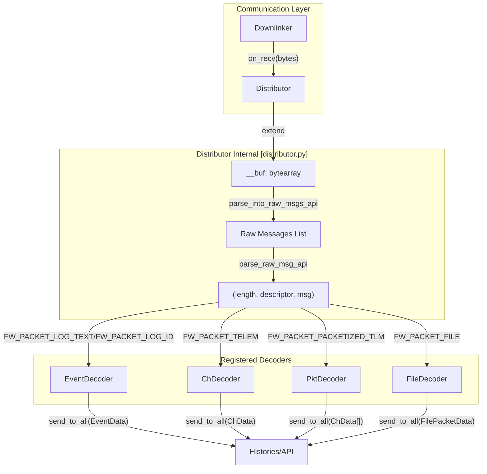
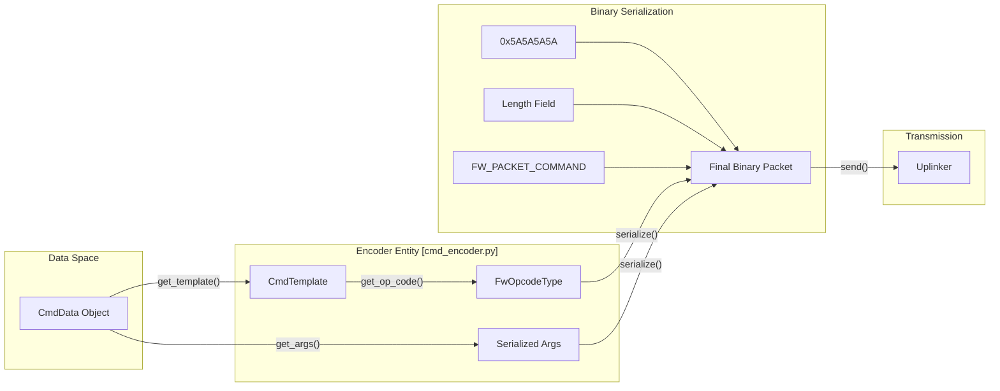

# Page: Distributor, Decoders & Encoders

# Distributor, Decoders & Encoders

Relevant source files

The following files were used as context for generating this wiki page:

- [src/fprime_gds/common/communication/ground.py](src/fprime_gds/common/communication/ground.py)
- [src/fprime_gds/common/communication/updown.py](src/fprime_gds/common/communication/updown.py)
- [src/fprime_gds/common/data_types/file_data.py](src/fprime_gds/common/data_types/file_data.py)
- [src/fprime_gds/common/decoders/ch_decoder.py](src/fprime_gds/common/decoders/ch_decoder.py)
- [src/fprime_gds/common/decoders/decoder.py](src/fprime_gds/common/decoders/decoder.py)
- [src/fprime_gds/common/decoders/event_decoder.py](src/fprime_gds/common/decoders/event_decoder.py)
- [src/fprime_gds/common/decoders/file_decoder.py](src/fprime_gds/common/decoders/file_decoder.py)
- [src/fprime_gds/common/decoders/pkt_decoder.py](src/fprime_gds/common/decoders/pkt_decoder.py)
- [src/fprime_gds/common/distributor/distributor.py](src/fprime_gds/common/distributor/distributor.py)
- [src/fprime_gds/common/encoders/ch_encoder.py](src/fprime_gds/common/encoders/ch_encoder.py)
- [src/fprime_gds/common/encoders/cmd_encoder.py](src/fprime_gds/common/encoders/cmd_encoder.py)
- [src/fprime_gds/common/encoders/event_encoder.py](src/fprime_gds/common/encoders/event_encoder.py)
- [src/fprime_gds/common/encoders/file_encoder.py](src/fprime_gds/common/encoders/file_encoder.py)
- [src/fprime_gds/common/encoders/pkt_encoder.py](src/fprime_gds/common/encoders/pkt_encoder.py)
- [src/fprime_gds/common/logger/__init__.py](src/fprime_gds/common/logger/__init__.py)
- [src/fprime_gds/common/templates/ch_template.py](src/fprime_gds/common/templates/ch_template.py)
- [src/fprime_gds/common/templates/cmd_template.py](src/fprime_gds/common/templates/cmd_template.py)
- [src/fprime_gds/common/templates/event_template.py](src/fprime_gds/common/templates/event_template.py)
- [src/fprime_gds/common/templates/pkt_template.py](src/fprime_gds/common/templates/pkt_template.py)
- [test/fprime_gds/common/distributor/test_distributor.py](test/fprime_gds/common/distributor/test_distributor.py)
- [test/fprime_gds/common/encoders/test_ch_encoder.py](test/fprime_gds/common/encoders/test_ch_encoder.py)
- [test/fprime_gds/common/encoders/test_event_encoder.py](test/fprime_gds/common/encoders/test_event_encoder.py)
- [test/fprime_gds/common/encoders/test_pkt_encoder.py](test/fprime_gds/common/encoders/test_pkt_encoder.py)

The F´ GDS data pipeline relies on a central **Distributor** to route incoming binary telemetry to specialized **Decoders**, and a set of **Encoders** to transform high-level data objects into binary packets for uplink. This layer bridges the gap between the raw byte streams of the communication layer and the structured data objects used by the histories and UI.

## Distributor

The `Distributor` class is a `DataHandler` responsible for parsing a stream of bytes into discrete F´ packets and routing them to registered decoders based on their descriptor [src/fprime_gds/common/distributor/distributor.py:28-35]().

### Packet Parsing Logic
The distributor maintains an internal buffer `__buf` to handle fragmented data received from the transport layer [src/fprime_gds/common/distributor/distributor.py:47](). It uses `parse_into_raw_msgs_api` to identify packet boundaries using a length-prefixed format [src/fprime_gds/common/distributor/distributor.py:69-84]().

1.  **Key Framing (Optional):** If configured, it searches for a specific "key-frame" byte sequence to align with the start of a packet [src/fprime_gds/common/distributor/distributor.py:91-104]().
2.  **Length Extraction:** It deserializes the length field (defined by `msg_len` in `ConfigManager`) to determine the total packet size [src/fprime_gds/common/distributor/distributor.py:107-110]().
3.  **Descriptor Routing:** Each packet contains a `FwPacketDescriptorType` (e.g., Event, Channel, File). The distributor extracts this descriptor and passes the remaining message data to all decoders registered for that specific type [src/fprime_gds/common/distributor/distributor.py:150-158]().

### Distributor Data Flow
The following diagram illustrates how the `Distributor` routes raw bytes from the `Downlinker` to specific `Decoder` instances.

**Distributor Routing Architecture**

**Sources:** [src/fprime_gds/common/distributor/distributor.py:42-67](), [src/fprime_gds/common/distributor/distributor.py:167-205](), [src/fprime_gds/common/communication/updown.py:103-118]()

---

## Decoders

Decoders implement the `Decoder` base class and provide a `decode_api` method to transform binary message data into `SysData` objects [src/fprime_gds/common/decoders/decoder.py:35-43]().

### EventDecoder
Parses event logs. It extracts the `FwEventIdType`, followed by a `TimeType` tag, and then uses the `EventTemplate` from the dictionary to deserialize the specific arguments for that event [src/fprime_gds/common/decoders/event_decoder.py:69-96]().

### ChDecoder
Parses standard telemetry channels. It deserializes the `FwChanIdType` and `TimeType`, then looks up the channel's type in the `ChTemplate` to decode the actual value (e.g., `U32`, `F32`, `Serializable`) [src/fprime_gds/common/decoders/ch_decoder.py:65-90]().

### PktDecoder
A specialized version of `ChDecoder` that handles packetized telemetry. It extracts a Packet ID, a single time tag for the entire packet, and then iterates through a list of channels defined in the `PktTemplate`, deserializing each sequentially from the buffer [src/fprime_gds/common/decoders/pkt_decoder.py:27-46](), [src/fprime_gds/common/decoders/pkt_decoder.py:62-97]().

### FileDecoder
Handles file uplink/downlink packets. Unlike other decoders, it uses `struct.unpack_from` to parse different packet types (`START`, `DATA`, `END`, `CANCEL`) as defined in the F´ File Protocol [src/fprime_gds/common/decoders/file_decoder.py:24-72]().

| Decoder | Input Descriptor | Output Object | Key Metadata |
| :--- | :--- | :--- | :--- |
| `EventDecoder` | `FW_PACKET_LOG_ID` | `EventData` | ID, Time, Args [src/fprime_gds/common/decoders/event_decoder.py:93]() |
| `ChDecoder` | `FW_PACKET_TELEM` | `ChData` | ID, Time, Value [src/fprime_gds/common/decoders/ch_decoder.py:88]() |
| `PktDecoder` | `FW_PACKET_PACKETIZED_TLM` | `List[ChData]` | PktID, Time, ChList [src/fprime_gds/common/decoders/pkt_decoder.py:97]() |
| `FileDecoder` | `FW_PACKET_FILE` | `FilePacketData` | SeqID, Type, Payload [src/fprime_gds/common/decoders/file_decoder.py:52-70]() |

**Sources:** [src/fprime_gds/common/decoders/decoder.py:45-77](), [src/fprime_gds/common/decoders/event_decoder.py:31-50](), [src/fprime_gds/common/decoders/ch_decoder.py:27-44](), [src/fprime_gds/common/decoders/pkt_decoder.py:27-46](), [src/fprime_gds/common/decoders/file_decoder.py:24-27]()

---

## Encoders

Encoders perform the inverse operation of decoders: they take high-level data objects (like `CmdData`) and serialize them into binary packets for transmission to flight software.

### CmdEncoder
Translates `CmdData` into a binary format consisting of:
1.  **A5A5 Header:** A 4-byte synchronization token (`0x5A5A5A5A`) [src/fprime_gds/common/encoders/cmd_encoder.py:82]().
2.  **Length:** Total size of the descriptor, opcode, and arguments [src/fprime_gds/common/encoders/cmd_encoder.py:95-97]().
3.  **Descriptor:** Usually `FW_PACKET_COMMAND` [src/fprime_gds/common/encoders/cmd_encoder.py:84-86]().
4.  **Opcode:** The command's unique identifier from the dictionary [src/fprime_gds/common/encoders/cmd_encoder.py:88-89]().
5.  **Arguments:** The serialized values of all command parameters [src/fprime_gds/common/encoders/cmd_encoder.py:91-93]().

### FileEncoder
Serializes file packets for uplink. It constructs the packet type (START, DATA, etc.) and sequence ID, then appends the type-specific payload (e.g., file paths for START packets, or raw bytes for DATA packets) [src/fprime_gds/common/encoders/file_encoder.py:55-89](). It also wraps the result in the standard F´ packet header [src/fprime_gds/common/encoders/file_encoder.py:93-98]().

### Encoder Data Flow
The following diagram shows the transformation of a high-level command into a binary stream.

**Command Encoding Process**

**Sources:** [src/fprime_gds/common/encoders/cmd_encoder.py:52-101](), [src/fprime_gds/common/encoders/file_encoder.py:55-98](), [src/fprime_gds/common/communication/updown.py:180-192]()

---

## Key Classes and Functions

### Distributor Functions
*   `register(typeof, obj)`: Adds a decoder `obj` to the list of handlers for descriptor `typeof` [src/fprime_gds/common/distributor/distributor.py:59-67]().
*   `parse_into_raw_msgs_api(data)`: Scans a bytearray for valid packets based on length and optional keys [src/fprime_gds/common/distributor/distributor.py:69-84]().
*   `on_recv(data)`: Entry point for raw bytes; buffers data and triggers parsing/distribution [src/fprime_gds/common/distributor/distributor.py:167-186]().

### Decoder/Encoder Interfaces
*   `Decoder.data_callback(data)`: The standard interface used by the Distributor. It calls `decode_api` and then broadcasts the resulting object to all registered handlers (like Histories) [src/fprime_gds/common/decoders/decoder.py:45-65]().
*   `Encoder.encode_api(data)`: Abstract method that must be implemented to convert a data object into `bytes` [src/fprime_gds/common/encoders/cmd_encoder.py:69-78]().

**Sources:** [src/fprime_gds/common/distributor/distributor.py:28-67](), [src/fprime_gds/common/decoders/decoder.py:35-77](), [src/fprime_gds/common/encoders/cmd_encoder.py:52-101]()
