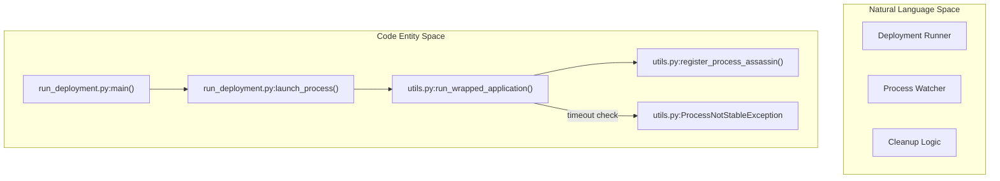
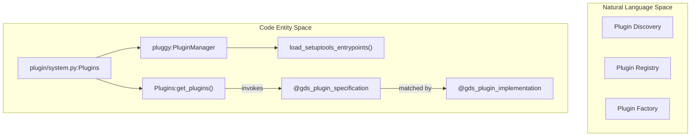

# Page: Execution & Plugin System

# Execution & Plugin System

Relevant source files

The following files were used as context for generating this wiki page:

- [src/fprime_gds/common/communication/adapters/base.py](src/fprime_gds/common/communication/adapters/base.py)
- [src/fprime_gds/common/communication/checksum.py](src/fprime_gds/common/communication/checksum.py)
- [src/fprime_gds/common/communication/framing.py](src/fprime_gds/common/communication/framing.py)
- [src/fprime_gds/common/handlers.py](src/fprime_gds/common/handlers.py)
- [src/fprime_gds/common/pipeline/histories.py](src/fprime_gds/common/pipeline/histories.py)
- [src/fprime_gds/executables/apps.py](src/fprime_gds/executables/apps.py)
- [src/fprime_gds/executables/cli.py](src/fprime_gds/executables/cli.py)
- [src/fprime_gds/executables/comm.py](src/fprime_gds/executables/comm.py)
- [src/fprime_gds/executables/run_deployment.py](src/fprime_gds/executables/run_deployment.py)
- [src/fprime_gds/executables/utils.py](src/fprime_gds/executables/utils.py)
- [src/fprime_gds/plugin/__init__.py](src/fprime_gds/plugin/__init__.py)
- [src/fprime_gds/plugin/definitions.py](src/fprime_gds/plugin/definitions.py)
- [src/fprime_gds/plugin/system.py](src/fprime_gds/plugin/system.py)
- [test/fprime_gds/executables/test_run_deployment.py](test/fprime_gds/executables/test_run_deployment.py)
- [test/fprime_gds/test_plugins.py](test/fprime_gds/test_plugins.py)

The F´ GDS is designed as a distributed system of processes orchestrated by a central deployment runner. It utilizes a robust plugin architecture based on `pluggy` to allow developers to extend communication protocols, framing formats, and UI-integrated applications without modifying the core codebase.

## System Orchestration & Process Management

The GDS is launched via `run_deployment.py`, which acts as the master controller for the GDS stack. It manages the lifecycle of several independent subprocesses, ensuring they remain stable during the initialization phase and cleaning them up upon exit.

### Process Lifecycle
Processes are launched using `run_wrapped_application`, which uses `subprocess.Popen` to execute commands [src/fprime_gds/executables/utils.py:88-126](). To ensure system stability, the runner monitors each process for a configurable `launch_time` (defaulting to several seconds). If a process exits prematurely during this window, a `ProcessNotStableException` is raised [src/fprime_gds/executables/utils.py:29-37]().

### The "Assassin" Pattern
To prevent "zombie" processes, the GDS registers a "process assassin" for every child application. This `atexit` handler ensures that when the main GDS process terminates, all children receive `SIGINT`/`SIGTERM` followed by a `SIGKILL` if they fail to exit [src/fprime_gds/executables/utils.py:45-85]().

For details, see [Deployment Runner & Process Management](#6.1).

**Sources:** [src/fprime_gds/executables/run_deployment.py:56-83](), [src/fprime_gds/executables/utils.py:88-130]()

---

## Plugin Architecture

The GDS uses a singleton `Plugins` class to manage extensibility [src/fprime_gds/plugin/system.py:39-44](). Plugins are discovered via `setuptools` entrypoints or the `FPRIME_GDS_EXTRA_PLUGINS` environment variable [src/fprime_gds/plugin/system.py:68-80]().

### Plugin Categories
Plugins are divided into two primary types:
1.  **Selection Plugins:** Only one implementation can be active at a time (e.g., you can only use one `communication` adapter like UART or TCP).
2.  **Feature Plugins:** Multiple implementations can run simultaneously (e.g., multiple `gds_app` plugins providing different background services).

### Core Extension Hooks
| Hook Name | Purpose | Interface |
| :--- | :--- | :--- |
| `register_communication_plugin` | Provides transport (IP, Serial, etc.) | `BaseAdapter` |
| `register_framing_plugin` | Defines packet byte-stream wrapping | `FramerDeframer` |
| `register_gds_app_plugin` | Launches a separate process with the GDS | `GdsApp` |
| `register_data_handler_plugin` | Processes decoded data in the UI process | `DataHandlerPlugin` |

For details, see [Plugin Architecture](#6.3).

**Sources:** [src/fprime_gds/plugin/system.py:96-117](), [src/fprime_gds/common/communication/adapters/base.py:51-67](), [src/fprime_gds/executables/apps.py:153-168]()

---

## CLI Argument System

The GDS provides a unified CLI that dynamically composes its arguments based on the active plugins and sub-systems. This is handled by a hierarchy of parsers inheriting from `ParserBase` [src/fprime_gds/executables/cli.py:44-58]().

### Argument Composition
The system uses a `CompositeParser` to merge arguments from different domains (e.g., Pipeline, Middleware, and Plugins) into a single interface [src/fprime_gds/executables/cli.py:230-240](). A key feature is `reproduce_cli_args`, which allows the deployment runner to take parsed namespace objects and convert them back into a list of strings to pass to child subprocesses [src/fprime_gds/executables/cli.py:134-176]().

For details, see [CLI Argument System](#6.2).

**Sources:** [src/fprime_gds/executables/cli.py:71-87](), [src/fprime_gds/executables/run_deployment.py:28-53]()

---

## Entity Relationship Diagrams

### Execution Flow & Process Ownership
This diagram shows how the `run_deployment.py` logic maps to the OS-level process management code in `utils.py`.

**Sources:** [src/fprime_gds/executables/run_deployment.py:212-230](), [src/fprime_gds/executables/utils.py:88-126]()

### Plugin Discovery & Instantiation
This diagram bridges the high-level concept of "Loading Plugins" to the specific `pluggy` and `Plugins` singleton implementation.

**Sources:** [src/fprime_gds/plugin/system.py:50-95](), [src/fprime_gds/plugin/definitions.py:23-26]()
