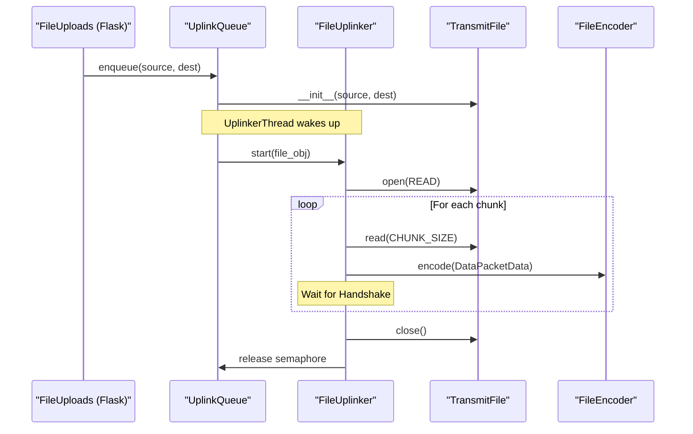
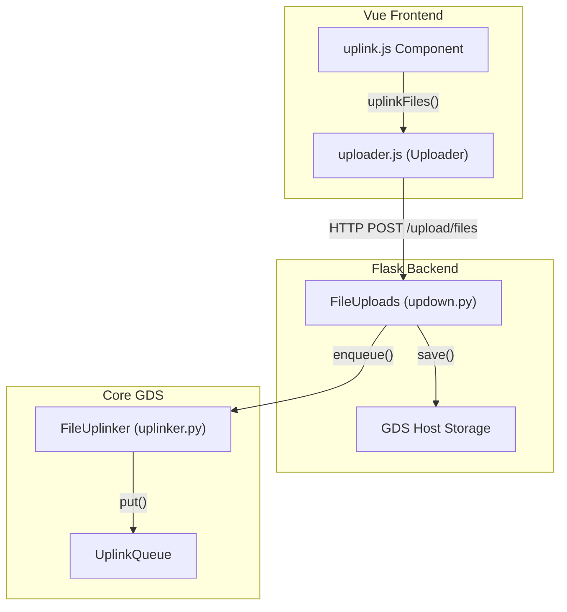

# Page: File Uplink & Downlink

# File Uplink & Downlink

Relevant source files

The following files were used as context for generating this wiki page:

- [src/fprime_gds/common/data_types/sys_data.py](src/fprime_gds/common/data_types/sys_data.py)
- [src/fprime_gds/common/files/File Decoder Documentation.txt](src/fprime_gds/common/files/File Decoder Documentation.txt)
- [src/fprime_gds/common/files/__init__.py](src/fprime_gds/common/files/__init__.py)
- [src/fprime_gds/common/files/downlinker.py](src/fprime_gds/common/files/downlinker.py)
- [src/fprime_gds/common/files/helpers.py](src/fprime_gds/common/files/helpers.py)
- [src/fprime_gds/common/files/uplinker.py](src/fprime_gds/common/files/uplinker.py)
- [src/fprime_gds/common/pipeline/files.py](src/fprime_gds/common/pipeline/files.py)
- [src/fprime_gds/executables/tcpserver.py](src/fprime_gds/executables/tcpserver.py)
- [src/fprime_gds/flask/static/js/uploader.js](src/fprime_gds/flask/static/js/uploader.js)
- [src/fprime_gds/flask/static/js/vue-support/downlink.js](src/fprime_gds/flask/static/js/vue-support/downlink.js)
- [src/fprime_gds/flask/static/js/vue-support/uplink.js](src/fprime_gds/flask/static/js/vue-support/uplink.js)
- [src/fprime_gds/flask/updown.py](src/fprime_gds/flask/updown.py)

The F´ GDS File Uplink and Downlink system provides a robust mechanism for transferring binary files between the ground station and a flight deployment. It implements a stop-and-wait protocol to ensure data integrity over potentially unreliable or throttled communication links.

## File Uplink System

The file uplink process reads files from the host operating system, partitions them into chunks, and transmits them to the flight software (FSW). The system uses a handshaking mechanism to throttle transmission, requiring a confirmation packet from the FSW before sending the next chunk `[src/fprime_gds/common/files/uplinker.py:4-6]()`.

### Uplink Protocol & State Machine
The `FileUplinker` class manages the lifecycle of a single file transfer using a state machine defined by `FileStates` `[src/fprime_gds/common/files/uplinker.py:156-166]()`.

1.  **START**: Sends a `StartPacketData` containing the file size and destination path `[src/fprime_gds/common/files/uplinker.py:16-21]()`.
2.  **DATA**: Sends multiple `DataPacketData` chunks. The default chunk size is 256 bytes `[src/fprime_gds/common/files/uplinker.py:150-150]()`.
3.  **WAIT**: After each packet, the uplinker enters a wait state, expecting a `FW_PACKET_HAND` handshake from the distributor `[src/fprime_gds/common/pipeline/files.py:47-47]()`.
4.  **END**: Sends an `EndPacketData` including a CFDP checksum to verify file integrity `[src/fprime_gds/common/files/uplinker.py:19-19]()`.

### UplinkQueue
The `UplinkQueue` manages multiple files queued for transmission. It runs in its own thread (`UplinkerThread`) to prevent blocking the main GDS pipeline `[src/fprime_gds/common/files/uplinker.py:31-53]()`.

*   **`enqueue(filepath, destination, packets)`**: Adds a new `TransmitFile` object to the internal queue `[src/fprime_gds/common/files/uplinker.py:55-64]()`.
*   **`pause()` / `unpause()`**: Uses a `threading.Semaphore` named `busy` to halt the background thread without losing the current queue state `[src/fprime_gds/common/files/uplinker.py:66-76]()`.
*   **`run()`**: The main loop that retrieves files and calls `uplinker.start()` sequentially `[src/fprime_gds/common/files/uplinker.py:101-121]()`.

### File Uplink Component Interaction
The following diagram shows how the Uplink entities interact to move a file from the Flask API to the Comm layer.

**Uplink Data Flow & Entities**

Sources: `[src/fprime_gds/common/files/uplinker.py:55-64]()`, `[src/fprime_gds/common/files/uplinker.py:101-121]()`, `[src/fprime_gds/common/files/helpers.py:136-151]()`, `[src/fprime_gds/flask/updown.py:103-132]()`.

---

## File Downlink System

The `FileDownlinker` reconstructs files sent from the FSW. It acts as a `DataHandler` registered to a `FileDecoder` `[src/fprime_gds/common/pipeline/files.py:46-46]()`.

### Packet Reconstruction
Incoming data is processed in `data_callback(data)`, which routes packets based on their `packetType` `[src/fprime_gds/common/files/downlinker.py:56-75]()`:

| Packet Type | Function | Description |
| :--- | :--- | :--- |
| `START` | `handle_start` | Initializes `TransmitFile` in `WRITE` mode and creates a log file `[src/fprime_gds/common/files/downlinker.py:77-116]()`. |
| `DATA` | `handle_data` | Writes bytes to the file at the specified `offset`. Tracks `seqID` for gaps `[src/fprime_gds/common/files/downlinker.py:117-154]()`. |
| `END` | `handle_end` | Finalizes the file, closes the handle, and records the end time `[src/fprime_gds/common/files/downlinker.py:169-189]()`. |
| `CANCEL` | `handle_cancel` | Aborts the current transfer and closes the file handle `[src/fprime_gds/common/files/downlinker.py:156-167]()`. |

### Error Handling & Timeouts
The downlinker utilizes a `Timeout` helper to detect stalled transfers. If no packets are received within the timeout period (default 20s), the `timeout()` function is triggered to clean up the active transfer `[src/fprime_gds/common/files/downlinker.py:34-54]()`, `[src/fprime_gds/common/files/downlinker.py:192-193]()`.

---

## Shared File Helpers

Both uplink and downlink rely on a common set of utilities in `helpers.py`.

### TransmitFile
This class wraps the OS file handle and tracks metadata during a transfer `[src/fprime_gds/common/files/helpers.py:114-119]()`.
*   **State Tracking**: Tracks if a file is `QUEUED`, `TRANSMITTING`, `FINISHED`, `CANCELED`, or `TIMEOUT` `[src/fprime_gds/common/files/helpers.py:128-128]()`.
*   **Logging**: Automatically creates a `.log` file in the log directory for every file transfer to record packet offsets and errors `[src/fprime_gds/common/files/helpers.py:153-157]()`.
*   **Checksum**: Uses the `CFDPChecksum` class to calculate a 32-bit word-based checksum as defined by the CCSDS File Delivery Protocol `[src/fprime_gds/common/files/helpers.py:83-108]()`.

### CFDP Checksum Implementation
The checksum is updated by treating the data as a series of big-endian 32-bit integers, handled by `struct.unpack_from(">I", ...)` `[src/fprime_gds/common/files/helpers.py:90-103]()`.

Sources: `[src/fprime_gds/common/files/helpers.py:23-108]()`, `[src/fprime_gds/common/files/helpers.py:114-206]()`.

---

## REST API & Web Management

The GDS exposes file management through Flask RESTful resources in `flask/updown.py`.

### Endpoints

| Route | Method | Class | Description |
| :--- | :--- | :--- | :--- |
| `/upload/destination` | `GET`/`PUT` | `Destination` | Manages the target directory on the FSW `[src/fprime_gds/flask/updown.py:23-53]()`. |
| `/upload/files` | `GET` | `FileUploads` | Returns a list of current and queued uplink files `[src/fprime_gds/flask/updown.py:75-84]()`. |
| `/upload/files` | `POST` | `FileUploads` | Uploads a file from the browser to the GDS host and enqueues it for uplink `[src/fprime_gds/flask/updown.py:103-132]()`. |
| `/upload/files` | `PUT` | `FileUploads` | Controls the uplinker (pause, unpause, cancel-all) `[src/fprime_gds/flask/updown.py:86-101]()`. |
| `/download/files` | `GET` | `FileDownload` | Lists or streams downlinked files from the host to the browser `[src/fprime_gds/flask/updown.py:185-203]()`. |

### Web UI Integration
The Vue.js frontend uses `uplink.js` and `downlink.js` to interact with these endpoints. The `Uploader` class in `uploader.js` wraps the REST calls, handling `FormData` for multi-file uploads and JSON serialization for packet specifications `[src/fprime_gds/flask/static/js/uploader.js:13-42]()`.

**Web-to-Backend Mapping**

Sources: `[src/fprime_gds/flask/updown.py:56-132]()`, `[src/fprime_gds/flask/static/js/uploader.js:1-74]()`, `[src/fprime_gds/flask/static/js/vue-support/uplink.js:20-49]()`.
