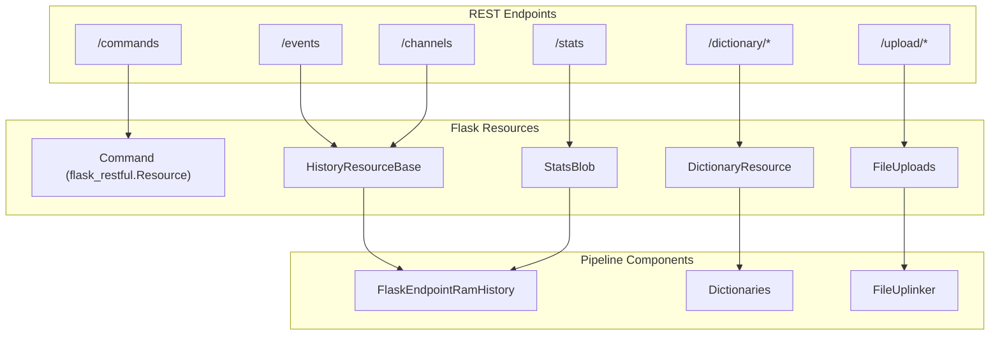
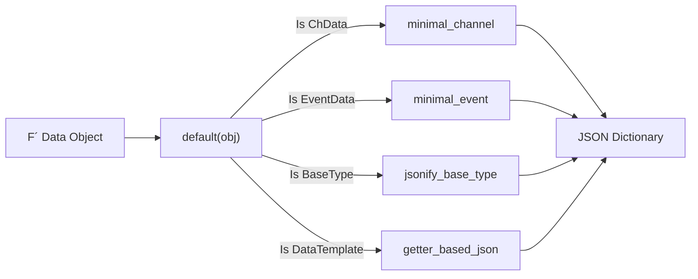

# Page: Flask Application & REST Endpoints

# Flask Application & REST Endpoints

<details>
<summary>Relevant source files</summary>

The following files were used as context for generating this wiki page:

- [setup.py](setup.py)
- [src/fastentrypoints.py](src/fastentrypoints.py)
- [src/fprime_gds/common/history/ram.py](src/fprime_gds/common/history/ram.py)
- [src/fprime_gds/flask/app.py](src/fprime_gds/flask/app.py)
- [src/fprime_gds/flask/channels.py](src/fprime_gds/flask/channels.py)
- [src/fprime_gds/flask/commands.py](src/fprime_gds/flask/commands.py)
- [src/fprime_gds/flask/components.py](src/fprime_gds/flask/components.py)
- [src/fprime_gds/flask/default_settings.py](src/fprime_gds/flask/default_settings.py)
- [src/fprime_gds/flask/errors.py](src/fprime_gds/flask/errors.py)
- [src/fprime_gds/flask/events.py](src/fprime_gds/flask/events.py)
- [src/fprime_gds/flask/json.py](src/fprime_gds/flask/json.py)
- [src/fprime_gds/flask/stats.py](src/fprime_gds/flask/stats.py)

</details>


The F´ GDS Flask application serves as the bridge between the backend data pipeline and the web-based User Interface. It provides a RESTful API for commanding, telemetry retrieval, dictionary access, and file management. The application is built using a factory pattern and utilizes `flask-restful` for structured endpoint management.

## Application Factory: `construct_app()`

The Flask application is initialized via the `construct_app()` factory function. This function orchestrates the configuration of the web server, the setup of the F´ data pipeline, and the registration of all REST resources.

### Initialization Lifecycle
1.  **App Creation**: Initializes the `flask.Flask` object and optionally enables `flask_compress` for performance [src/fprime_gds/flask/app.py:55-59]().
2.  **Configuration**: Loads default settings from `fprime_gds.flask.default_settings` and overrides them using the file pointed to by the `FP_FLASK_SETTINGS` environment variable [src/fprime_gds/flask/app.py:61-66]().
3.  **JSON Serialization**: Configures the Flask JSON provider to use a custom encoder capable of handling F´ types like `TimeType`, `ChData`, and `EventData` [src/fprime_gds/flask/app.py:68-69]().
4.  **Pipeline Integration**: Parses CLI arguments and initializes the `StandardPipeline` via `setup_pipelined_components`. This connects the web server to the live data stream [src/fprime_gds/flask/app.py:71-79]().
5.  **Route Registration**: Maps `flask-restful` resources to specific URL paths, injecting necessary pipeline components (histories, encoders, etc.) into the resource constructors [src/fprime_gds/flask/app.py:86-185]().

### Configuration & `FP_FLASK_SETTINGS`
The application relies on several key configuration variables:
*   `STANDARD_PIPELINE_ARGUMENTS`: Arguments passed to the `StandardPipeline` for connection setup [src/fprime_gds/flask/default_settings.py:13]().
*   `SERVE_LOGS`: Boolean flag to enable/disable the `/logdata` endpoints [src/fprime_gds/flask/default_settings.py:15]().
*   `MAX_CONTENT_LENGTH`: Limits request size to 32MiB for file uploads [src/fprime_gds/flask/default_settings.py:17]().

**Sources:** [src/fprime_gds/flask/app.py:43-186](), [src/fprime_gds/flask/default_settings.py:1-20]()

---

## REST Endpoints Mapping

The GDS exposes a variety of endpoints categorized by their functional area. Most endpoints leverage the `pipeline` object to interact with the underlying flight system data.

### Data Flow: REST to Code Entity
The following diagram illustrates how REST routes map to specific implementation classes and the underlying data sources.

**REST Route Mapping**

**Sources:** [src/fprime_gds/flask/app.py:86-172](), [src/fprime_gds/flask/commands.py:63-105](), [src/fprime_gds/flask/components.py:18-28]()

### Detailed Route Table

| Endpoint | Method | Class | Description |
| :--- | :--- | :--- | :--- |
| `/commands` | GET | `CommandHistory` | Retrieves command history for a session [src/fprime_gds/flask/app.py:97](). |
| `/commands/<command>` | PUT | `Command` | Dispatches a command. Requires key `0xFEEDCAFE` [src/fprime_gds/flask/commands.py:81-105](). |
| `/events` | GET | `EventHistory` | Polls for new events using a session token [src/fprime_gds/flask/app.py:117](). |
| `/channels` | GET | `ChannelHistory` | Polls for new telemetry samples [src/fprime_gds/flask/app.py:132](). |
| `/dictionary/commands` | GET | `CommandDictionary` | Returns the command metadata from the dictionary [src/fprime_gds/flask/app.py:86](). |
| `/upload/files` | POST | `FileUploads` | Uploads a file to the GDS `up_store` [src/fprime_gds/flask/app.py:142](). |
| `/stats` | GET | `StatsBlob` | Returns active client counts and history sizes [src/fprime_gds/flask/stats.py:20-32](). |
| `/logdata` | GET | `LogList` | Lists available GDS log files [src/fprime_gds/flask/app.py:177](). |

**Sources:** [src/fprime_gds/flask/app.py:86-185](), [src/fprime_gds/flask/commands.py:7-17](), [src/fprime_gds/flask/stats.py:13-35]()

---

## Commanding & Security

Commands are issued via a `PUT` request to `/commands/<command>`. To prevent accidental commanding, the API requires a specific protection key.

*   **Protection Key**: The request body must include `"key": "0xfeedcafe"` [src/fprime_gds/flask/commands.py:90-94]().
*   **Validation**: The `Command` resource validates the provided arguments against the command's dictionary definition. If arguments are missing or invalid, it raises `MissingArgumentException` or `CommandArgumentsInvalidException` [src/fprime_gds/flask/commands.py:98-104]().
*   **Execution**: Validated commands are passed to `pipeline.send_command(command, arg_list)` [src/fprime_gds/flask/commands.py:98]().

**Sources:** [src/fprime_gds/flask/commands.py:63-105]()

---

## Session Management & Polling

The GDS uses a cursor-based polling mechanism to allow multiple web clients to independently track data history.

### `FlaskEndpointRamHistory`
This class extends `SelfCleaningRamHistory` to provide session-specific tracking [src/fprime_gds/flask/components.py:18-28]().
*   **Session Tokens**: When a client polls an endpoint (e.g., `/events?session=xyz`), the history uses the token to determine which items have already been seen [src/fprime_gds/common/history/ram.py:54-58]().
*   **Seen Counts**: It tracks `count_values` per session to provide validation of data delivery consistency [src/fprime_gds/flask/components.py:62-66]().
*   **Self-Cleaning**: To prevent memory leaks, sessions that remain inactive for a configurable period are automatically purged [src/fprime_gds/common/history/ram.py:154-166]().

**Sources:** [src/fprime_gds/common/history/ram.py:18-113](), [src/fprime_gds/flask/components.py:18-72]()

---

## Error Handling

Standardized error responses are ensured through a combination of custom API classes and Flask error handlers.

1.  **`ErrorHandlingApi`**: A subclass of `flask_restful.Api` that overrides `handle_error` to return errors in a uniform JSON format [src/fprime_gds/flask/errors.py:44-49]().
2.  **Standard Error Format**: All errors are returned as a JSON object containing an `errors` list:
    ```json
    {
      "errors": [
        {
          "type": "InvalidCommandException",
          "message": "cmd_name is not a valid command",
          "args": []
        }
      ]
    }
    ```
    [src/fprime_gds/flask/errors.py:13-19](), [src/fprime_gds/flask/errors.py:22-41]().
3.  **Global Exception Catching**: The `construct_app` factory registers a global handler for `Exception` to catch unexpected server-side failures [src/fprime_gds/flask/app.py:196-200]().

**Sources:** [src/fprime_gds/flask/errors.py:1-66](), [src/fprime_gds/flask/app.py:196-200]()

---

## JSON Serialization of F´ Types

Because standard JSON encoders cannot handle complex F´ objects (like `TimeType` or `SerializableType`), the GDS implements a custom encoder in `fprime_gds.flask.json`.

**JSON Encoding Logic**


*   **Minimal Serialization**: To reduce bandwidth, classes like `ChData` and `EventData` are reduced to their essential fields (time, id, value, display text) before being sent to the UI [src/fprime_gds/flask/json.py:85-118]().
*   **Getter-Based Encoding**: Templates use reflection to call all methods starting with `get_` and aggregate the results into a dictionary [src/fprime_gds/flask/json.py:48-82]().
*   **Time Encoding**: `TimeType` is converted into a structured object containing `base`, `context`, `seconds`, and `microseconds` [src/fprime_gds/flask/json.py:136-154]().

**Sources:** [src/fprime_gds/flask/json.py:1-192]()
