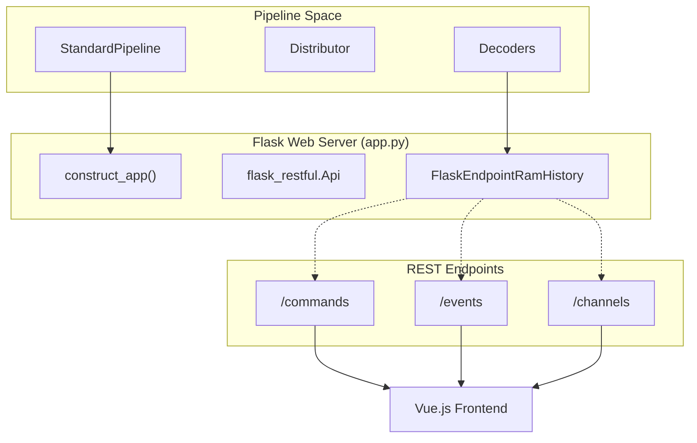

# Page: Flask Web Server & REST API

# Flask Web Server & REST API

Relevant source files

The following files were used as context for generating this wiki page:

- [setup.py](setup.py)
- [src/fastentrypoints.py](src/fastentrypoints.py)
- [src/fprime_gds/common/history/ram.py](src/fprime_gds/common/history/ram.py)
- [src/fprime_gds/flask/app.py](src/fprime_gds/flask/app.py)
- [src/fprime_gds/flask/channels.py](src/fprime_gds/flask/channels.py)
- [src/fprime_gds/flask/commands.py](src/fprime_gds/flask/commands.py)
- [src/fprime_gds/flask/components.py](src/fprime_gds/flask/components.py)
- [src/fprime_gds/flask/default_settings.py](src/fprime_gds/flask/default_settings.py)
- [src/fprime_gds/flask/events.py](src/fprime_gds/flask/events.py)
- [src/fprime_gds/flask/json.py](src/fprime_gds/flask/json.py)

The F´ GDS Web Server is a Flask-based application that serves as the primary interface between the underlying data pipeline and the web-based User Interface. It provides a RESTful API for retrieving telemetry, events, and command history, as well as endpoints for issuing commands and managing file uplinks/downlinks.

The server is built using an application factory pattern, integrating the `StandardPipeline` to bridge F´ data structures with JSON-capable web endpoints.

### System Architecture Overview

The Flask application acts as a consumer of the `StandardPipeline`. It registers itself as a data handler for decoded events, channels, and commands, storing them in a specialized RAM history designed for HTTP polling.

#### Flask Server Data Flow
The following diagram illustrates how the Flask application connects to the F´ pipeline and exposes data to the Web UI.

**Diagram: Flask Web Server Integration**

Sources: [src/fprime_gds/flask/app.py:43-186](), [src/fprime_gds/flask/components.py:74-96]()

---

### Flask Application & REST Endpoints
The application is initialized via the `construct_app()` factory [src/fprime_gds/flask/app.py:43-54](). This function configures the Flask environment, sets up custom JSON encoders for F´ types, and initializes the `StandardPipeline` [src/fprime_gds/flask/app.py:70-79]().

Key responsibilities of the Flask layer include:
*   **Route Registration:** Mapping REST resources (e.g., `CommandHistory`, `EventHistory`) to specific URL paths [src/fprime_gds/flask/app.py:86-172]().
*   **Command Issuance:** The `/commands/<command>` endpoint accepts `PUT` requests to inject commands into the pipeline [src/fprime_gds/flask/commands.py:81-105]().
*   **Static Asset Serving:** Serving the Vue.js frontend and configuration files [src/fprime_gds/flask/app.py:203-227]().

For details on the factory pattern and a full list of endpoints, see [Flask Application & REST Endpoints](#4.1).

Sources: [src/fprime_gds/flask/app.py:43-186](), [src/fprime_gds/flask/commands.py:63-105]()

---

### History & JSON Serialization
Because F´ uses specific binary and object representations for data (e.g., `TimeType`, `ChData`), the GDS uses a custom JSON serialization pipeline to ensure these objects can be consumed by the JavaScript frontend.

#### History Management
The server uses `FlaskEndpointRamHistory`, a specialized version of `RamHistory` [src/fprime_gds/flask/components.py:18-28](). It supports:
*   **Session-based Polling:** Clients provide a session token to receive only data they haven't seen yet [src/fprime_gds/common/history/ram.py:41-59]().
*   **Self-Cleaning:** To prevent memory exhaustion, the history can clear itself after periods of inactivity [src/fprime_gds/common/history/ram.py:115-122]().

#### Serialization Pipeline
The `fprime_gds.flask.json` module defines encoders for F´ types [src/fprime_gds/flask/json.py:164-171](). For example, `ChData` is reduced to a "minimal" JSON object containing only the ID, value, time, and display text to optimize bandwidth [src/fprime_gds/flask/json.py:100-118]().

For details on cursor-based polling and type conversion, see [History & JSON Serialization](#4.2).

Sources: [src/fprime_gds/common/history/ram.py:18-60](), [src/fprime_gds/flask/json.py:164-191](), [src/fprime_gds/flask/components.py:18-66]()

---

### File Uplink & Downlink
The Flask server provides the interface for the F´ file transfer protocol. This includes endpoints for uploading files to the GDS server and initiating the uplink to the spacecraft, as well as downloading files received from the spacecraft.

*   **Uplink:** Handled via the `/upload/files` endpoint, which interacts with the `FileUplinker` component [src/fprime_gds/flask/app.py:141-145]().
*   **Downlink:** Handled via the `/download/files` endpoint, which interacts with the `FileDownlinker` [src/fprime_gds/flask/app.py:147-151]().

For details on the stop-and-wait protocol and file management REST resources, see [File Uplink & Downlink](#4.3).

Sources: [src/fprime_gds/flask/app.py:137-151](), [src/fprime_gds/flask/updown.py:1-31]() (implied by imports)

---

### Configuration
The Flask application is configured using a combination of default settings and environment variables.
*   **`default_settings.py`**: Defines standard parameters like `MAX_CONTENT_LENGTH` and `SERVE_LOGS` [src/fprime_gds/flask/default_settings.py:13-19]().
*   **`FP_FLASK_SETTINGS`**: An environment variable that points to a Python file used to override default configurations [src/fprime_gds/flask/app.py:64-65]().

Sources: [src/fprime_gds/flask/app.py:61-69](), [src/fprime_gds/flask/default_settings.py:1-19]()
