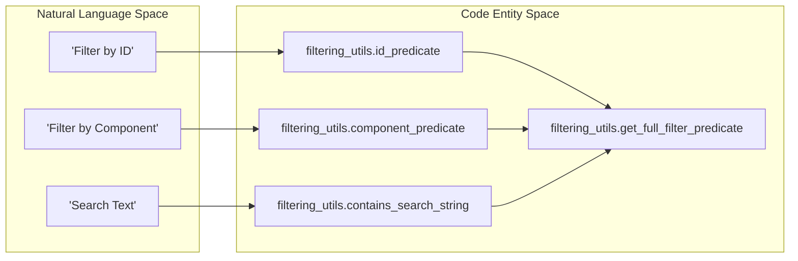

# Page: GDS CLI (fprime-cli)

# GDS CLI (fprime-cli)

<details>
<summary>Relevant source files</summary>

The following files were used as context for generating this wiki page:

- [src/fprime_gds/common/gds_cli/base_commands.py](src/fprime_gds/common/gds_cli/base_commands.py)
- [src/fprime_gds/common/gds_cli/channels.py](src/fprime_gds/common/gds_cli/channels.py)
- [src/fprime_gds/common/gds_cli/command_send.py](src/fprime_gds/common/gds_cli/command_send.py)
- [src/fprime_gds/common/gds_cli/events.py](src/fprime_gds/common/gds_cli/events.py)
- [src/fprime_gds/common/gds_cli/filtering_utils.py](src/fprime_gds/common/gds_cli/filtering_utils.py)
- [src/fprime_gds/common/gds_cli/test_api_utils.py](src/fprime_gds/common/gds_cli/test_api_utils.py)
- [src/fprime_gds/executables/fprime_cli.py](src/fprime_gds/executables/fprime_cli.py)
- [test/fprime_gds/common/gds_cli/filtering_utils_test.py](test/fprime_gds/common/gds_cli/filtering_utils_test.py)
- [test/fprime_gds/common/gds_cli/utils_test.py](test/fprime_gds/common/gds_cli/utils_test.py)

</details>


The `fprime-cli` tool provides a terminal-based interface for interacting with a running F´ Ground Data System (GDS). It allows operators and developers to monitor telemetry (channels), view event logs, and dispatch commands without requiring a web browser. The tool leverages the `IntegrationTestAPI` to communicate with the GDS backend, ensuring consistency between automated tests and manual CLI operations.

### Core Architecture

The CLI is built on a sub-command architecture where each major functional area (channels, events, commands) is injected into a main parser. It utilizes a common lifecycle for command execution: initializing a communication pipeline, setting up the API, executing the specific command logic, and tearing down resources.

#### CLI Command Lifecycle
"GDS CLI Lifecycle"
```mermaid
graph TD
    subgraph "Execution Flow"
        START["fprime-cli Entry"] --> PARSE["argparse: Parse Arguments"]
        PARSE --> VALIDATE["CliSubparserInjector: validate_args"]
        VALIDATE --> HANDLER["BaseCommand: handle_arguments"]
        
        subgraph "BaseCommand Lifecycle"
            HANDLER --> PIPE_INIT["StandardPipelineParser: pipeline_factory"]
            PIPE_INIT --> API_INIT["IntegrationTestAPI: setup"]
            API_INIT --> EXECUTE["_execute_command (Abstract)"]
            EXECUTE --> TEARDOWN["API/Pipeline: teardown/disconnect"]
        end
    end

    subgraph "Code Entities"
        [fprime_cli.py]
        [base_commands.py]
        [api.py]
    end
```
Sources: [src/fprime_gds/executables/fprime_cli.py:101-156](), [src/fprime_gds/common/gds_cli/base_commands.py:138-185]()

---

### CLI Sub-commands: channels, events, command-send

The CLI is divided into specialized sub-commands, each managed by an injector class that handles argument definition and routing to the backend implementation.

*   **`channels`**: Retrieves and filters telemetry data. It supports both a "list" mode to see available channels and a "stream" mode to monitor live updates.
*   **`events`**: Displays event logs from the FSW. Like channels, it supports historical queries and real-time streaming.
*   **`command-send`**: Dispatches commands to the spacecraft. It includes features for argument validation and "closest match" suggestions if a command name is misspelled.

For detailed implementation of these commands and their retrieval modes, see **[CLI Sub-commands: channels, events, command-send](#7.1)**.

Sources: [src/fprime_gds/executables/fprime_cli.py:158-208](), [src/fprime_gds/common/gds_cli/channels.py:15-63](), [src/fprime_gds/common/gds_cli/events.py:15-62](), [src/fprime_gds/common/gds_cli/command_send.py:18-175]()

---

### CLI Filtering & Predicate Utilities

A robust filtering system allows users to narrow down data based on IDs, component names, or string content. These filters are implemented as `predicates`, which are functional objects used by the `IntegrationTestAPI` to evaluate data objects.

#### Predicate Mapping
"Predicate Mapping"

Sources: [src/fprime_gds/common/gds_cli/filtering_utils.py:13-175]()

Key utilities include:
*   **`filtering_utils.py`**: Contains the logic for combining multiple search criteria into a single composite predicate.
*   **`test_api_utils.py`**: Provides helper functions like `repeat_until_interrupt` for continuous data streaming and `get_upcoming_event` for awaiting specific data.

For details on predicate composition and search logic, see **[CLI Filtering & Predicate Utilities](#7.2)**.

Sources: [src/fprime_gds/common/gds_cli/filtering_utils.py:147-175](), [src/fprime_gds/common/gds_cli/test_api_utils.py:109-129]()

---

### Argument Management

The CLI uses a tiered argument system to ensure consistency across different commands.

| Argument Group | Purpose | Implementation |
| :--- | :--- | :--- |
| **GDS Options** | Connection settings (IP, Port, Dictionary path) | `StandardPipelineParser` |
| **Search Options** | Filtering by ID, Component, or Search string | `SearchArgumentsParser` |
| **Retrieval Options** | Controls for streaming vs. single-shot retrieval | `RetrievalArgumentsParser` |

Sources: [src/fprime_gds/executables/fprime_cli.py:32-75](), [src/fprime_gds/executables/cli.py:25-29]()
