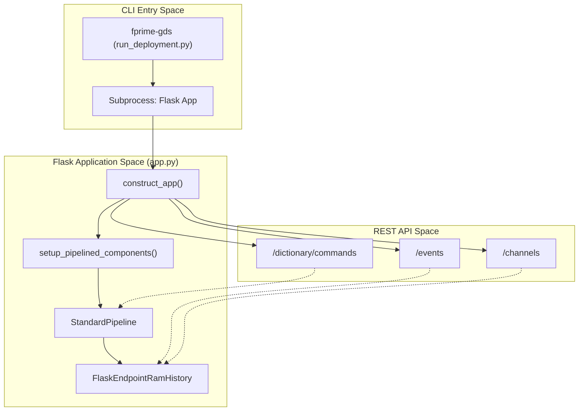
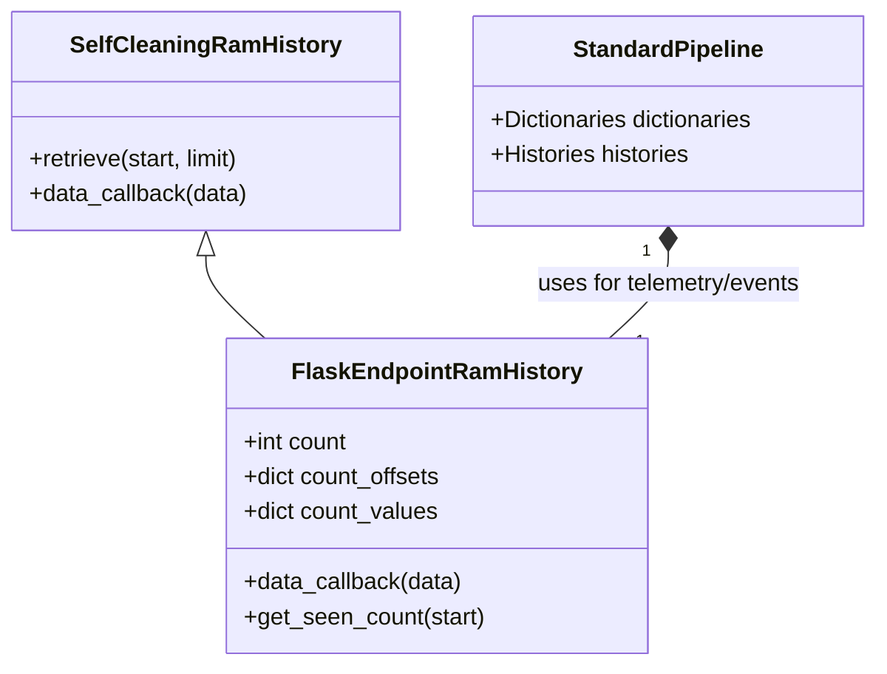

# Page: Getting Started & Installation

# Getting Started & Installation

Relevant source files

The following files were used as context for generating this wiki page:

- [.github/actions/spelling/expect.txt](.github/actions/spelling/expect.txt)
- [pyproject.toml](pyproject.toml)
- [setup.py](setup.py)
- [src/fastentrypoints.py](src/fastentrypoints.py)
- [src/fprime_gds/flask/app.py](src/fprime_gds/flask/app.py)
- [src/fprime_gds/flask/components.py](src/fprime_gds/flask/components.py)
- [src/fprime_gds/flask/default_settings.py](src/fprime_gds/flask/default_settings.py)

The F´ Ground Data System (GDS) is a Python-based suite of tools designed to facilitate communication with F´ flight software. It provides a web-based user interface, command-line tools, and an integration testing framework. This page details the installation process, dependency requirements, and the primary entry points for launching the system.

## Installation & Dependencies

The `fprime-gds` package is a standard Python project managed via `setuptools` [setup.py:1-6](). It requires Python 3.9 or higher [pyproject.toml:10]().

### Core Dependencies
The system relies on several key libraries to manage its various layers:
*   **Web Layer:** `flask`, `flask_restful`, and `flask_compress` for the REST API and UI hosting [pyproject.toml:34-39]().
*   **Communication:** `pyzmq` for ZeroMQ transport and `pyserial` for UART/Serial connections [pyproject.toml:36-44]().
*   **Data Handling:** `spacepackets` for CCSDS/SpacePacket framing and `crc` for data validation [pyproject.toml:47-48]().
*   **Configuration:** `PyYAML` and `pydantic` for configuration management and data validation [pyproject.toml:45-46]().
*   **CLI & Utilities:** `argcomplete` for shell completion and `fprime-tools` for core F´ integration [pyproject.toml:40-41]().

Sources: [pyproject.toml:10-49](), [setup.py:1-6]()

---

## CLI Entry Points

Upon installation, the GDS registers several executable scripts. These are defined in the `[project.scripts]` section of the configuration [pyproject.toml:62-69]().

| Command | Module Path | Purpose |
| :--- | :--- | :--- |
| `fprime-gds` | `fprime_gds.executables.run_deployment:main` | Primary launcher for the GDS stack (UI, Server, Pipeline). |
| `fprime-cli` | `fprime_gds.executables.fprime_cli:main` | Terminal-based interface for events, channels, and commands. |
| `fprime-seqgen` | `fprime_gds.common.tools.seqgen:main` | Converts text-based `.seq` files to F´ binary sequences. |
| `fprime-dp` | `fprime_gds.executables.data_products:main` | Decodes and validates F´ Data Products (`.fdp`). |
| `fprime-prm-write` | `fprime_gds.common.tools.params:main_encode` | Tool to generate binary parameter files. |
| `fprime-merge-dictionary` | `fprime_gds.executables.dictionary_merge:main` | Combines multiple component dictionaries into one. |

Sources: [pyproject.toml:62-69]()

---

## Launching the GDS Stack

The `fprime-gds` command orchestrates the launch of multiple subprocesses. This typically includes a TCP server for flight software connection, the `StandardPipeline` for data processing, and the Flask web server.

### Flask Application Initialization
The Flask application is constructed using the `construct_app()` factory [src/fprime_gds/flask/app.py:43](). This function performs the following critical setup:
1.  **Pipeline Creation:** It initializes the `StandardPipeline` using arguments passed via the `STANDARD_PIPELINE_ARGUMENTS` environment variable [src/fprime_gds/flask/app.py:71-79]().
2.  **History Setup:** It configures a `FlaskEndpointRamHistory` as the history implementation to track data for web sessions [src/fprime_gds/flask/components.py:92]().
3.  **API Registration:** It registers REST resources for commands, events, channels, and file uplinks/downlinks [src/fprime_gds/flask/app.py:86-172]().

### Data Flow Mapping: CLI to Flask
The following diagram illustrates how the `fprime-gds` entry point triggers the initialization of the web-based GDS stack.

**GDS Startup and Pipeline Association**

Sources: [src/fprime_gds/flask/app.py:43-172](), [src/fprime_gds/flask/components.py:74-96](), [pyproject.toml:66-66]()

---

## Session and History Management

The GDS uses a specialized history class, `FlaskEndpointRamHistory`, to manage data retrieval for multiple concurrent web users [src/fprime_gds/flask/components.py:18-28]().

*   **Session Tracking:** It uses `retrieved_cursors` and `count_offsets` to track which data points a specific session has already seen [src/fprime_gds/flask/components.py:62-65]().
*   **Data Callbacks:** When the pipeline receives new data, `data_callback` increments a global counter and stores the object in RAM [src/fprime_gds/flask/components.py:37-47]().
*   **Retrieval:** The `retrieve()` function allows the Flask API to poll for new data using a session token (`start`) and a `limit` [src/fprime_gds/flask/components.py:49-67]().

**History Data Entity Relationship**

Sources: [src/fprime_gds/flask/components.py:18-72](), [src/fprime_gds/flask/app.py:97-135]()

---

## Environment Configuration

The GDS can be customized using environment variables:
*   **`FP_FLASK_SETTINGS`**: Path to a Python file containing Flask configuration overrides [src/fprime_gds/flask/app.py:64-65]().
*   **`STANDARD_PIPELINE_ARGUMENTS`**: A pipe-delimited string of CLI arguments used to configure the internal `StandardPipeline` [src/fprime_gds/flask/default_settings.py:13]().
*   **`SERVE_LOGS`**: Boolean ("YES"/"NO") to enable or disable the `/logdata` REST endpoints [src/fprime_gds/flask/default_settings.py:15]().

Sources: [src/fprime_gds/flask/app.py:64-74](), [src/fprime_gds/flask/default_settings.py:1-19]()
