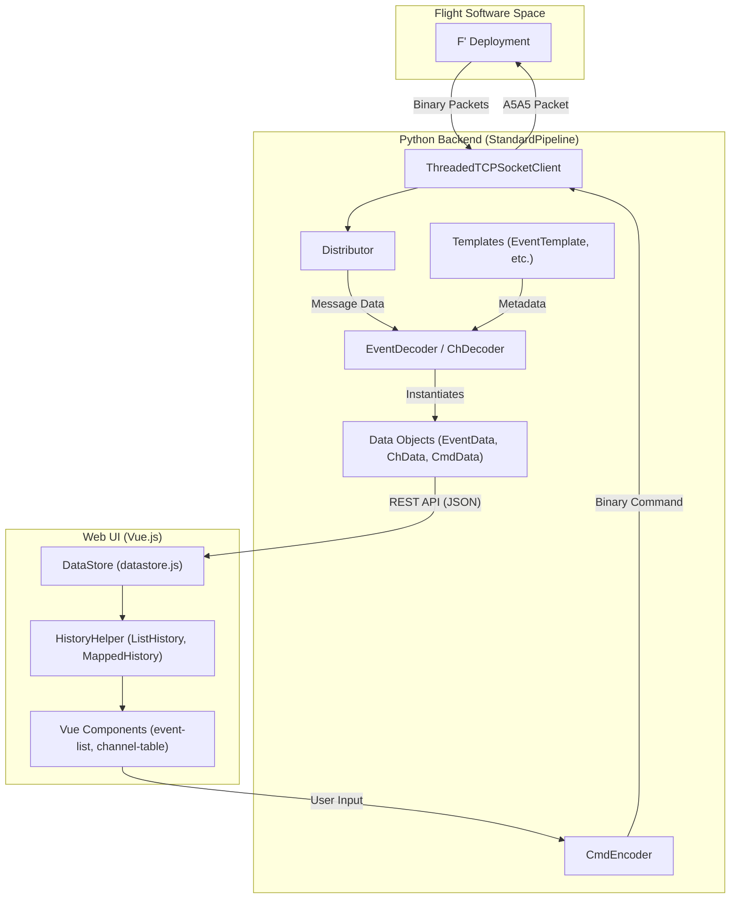
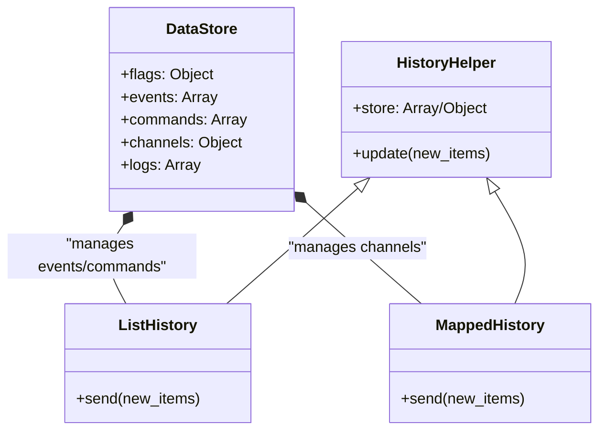

# Page: Glossary

# Glossary

Relevant source files

The following files were used as context for generating this wiki page:

- [.github/ISSUE_TEMPLATE/config.yml](.github/ISSUE_TEMPLATE/config.yml)
- [.github/actions/spelling/expect.txt](.github/actions/spelling/expect.txt)
- [.github/pull_request_template.md](.github/pull_request_template.md)
- [README.md](README.md)
- [pyproject.toml](pyproject.toml)
- [src/fprime_gds/common/communication/adapters/base.py](src/fprime_gds/common/communication/adapters/base.py)
- [src/fprime_gds/common/communication/checksum.py](src/fprime_gds/common/communication/checksum.py)
- [src/fprime_gds/common/communication/framing.py](src/fprime_gds/common/communication/framing.py)
- [src/fprime_gds/common/data_types/ch_data.py](src/fprime_gds/common/data_types/ch_data.py)
- [src/fprime_gds/common/data_types/cmd_data.py](src/fprime_gds/common/data_types/cmd_data.py)
- [src/fprime_gds/common/data_types/event_data.py](src/fprime_gds/common/data_types/event_data.py)
- [src/fprime_gds/common/data_types/exceptions.py](src/fprime_gds/common/data_types/exceptions.py)
- [src/fprime_gds/common/data_types/sys_data.py](src/fprime_gds/common/data_types/sys_data.py)
- [src/fprime_gds/common/decoders/ch_decoder.py](src/fprime_gds/common/decoders/ch_decoder.py)
- [src/fprime_gds/common/decoders/event_decoder.py](src/fprime_gds/common/decoders/event_decoder.py)
- [src/fprime_gds/common/decoders/pkt_decoder.py](src/fprime_gds/common/decoders/pkt_decoder.py)
- [src/fprime_gds/common/distributor/distributor.py](src/fprime_gds/common/distributor/distributor.py)
- [src/fprime_gds/common/encoders/ch_encoder.py](src/fprime_gds/common/encoders/ch_encoder.py)
- [src/fprime_gds/common/encoders/cmd_encoder.py](src/fprime_gds/common/encoders/cmd_encoder.py)
- [src/fprime_gds/common/encoders/event_encoder.py](src/fprime_gds/common/encoders/event_encoder.py)
- [src/fprime_gds/common/encoders/pkt_encoder.py](src/fprime_gds/common/encoders/pkt_encoder.py)
- [src/fprime_gds/common/files/downlinker.py](src/fprime_gds/common/files/downlinker.py)
- [src/fprime_gds/common/files/helpers.py](src/fprime_gds/common/files/helpers.py)
- [src/fprime_gds/common/files/uplinker.py](src/fprime_gds/common/files/uplinker.py)
- [src/fprime_gds/common/handlers.py](src/fprime_gds/common/handlers.py)
- [src/fprime_gds/common/loaders/xml_loader.py](src/fprime_gds/common/loaders/xml_loader.py)
- [src/fprime_gds/common/models/common/command.py](src/fprime_gds/common/models/common/command.py)
- [src/fprime_gds/common/pipeline/encoding.py](src/fprime_gds/common/pipeline/encoding.py)
- [src/fprime_gds/common/pipeline/files.py](src/fprime_gds/common/pipeline/files.py)
- [src/fprime_gds/common/pipeline/histories.py](src/fprime_gds/common/pipeline/histories.py)
- [src/fprime_gds/common/pipeline/standard.py](src/fprime_gds/common/pipeline/standard.py)
- [src/fprime_gds/common/testing_fw/__init__.py](src/fprime_gds/common/testing_fw/__init__.py)
- [src/fprime_gds/common/testing_fw/api.py](src/fprime_gds/common/testing_fw/api.py)
- [src/fprime_gds/common/testing_fw/predicates.py](src/fprime_gds/common/testing_fw/predicates.py)
- [src/fprime_gds/common/testing_fw/pytest_integration.py](src/fprime_gds/common/testing_fw/pytest_integration.py)
- [src/fprime_gds/common/utils/config_manager.py](src/fprime_gds/common/utils/config_manager.py)
- [src/fprime_gds/common/utils/string_util.py](src/fprime_gds/common/utils/string_util.py)
- [src/fprime_gds/executables/apps.py](src/fprime_gds/executables/apps.py)
- [src/fprime_gds/executables/cli.py](src/fprime_gds/executables/cli.py)
- [src/fprime_gds/executables/comm.py](src/fprime_gds/executables/comm.py)
- [src/fprime_gds/executables/run_deployment.py](src/fprime_gds/executables/run_deployment.py)
- [src/fprime_gds/executables/tcpserver.py](src/fprime_gds/executables/tcpserver.py)
- [src/fprime_gds/executables/utils.py](src/fprime_gds/executables/utils.py)
- [src/fprime_gds/flask/static/index.html](src/fprime_gds/flask/static/index.html)
- [src/fprime_gds/flask/static/js/config.js](src/fprime_gds/flask/static/js/config.js)
- [src/fprime_gds/flask/static/js/datastore.js](src/fprime_gds/flask/static/js/datastore.js)
- [src/fprime_gds/flask/static/js/gds.js](src/fprime_gds/flask/static/js/gds.js)
- [src/fprime_gds/flask/static/js/loader.js](src/fprime_gds/flask/static/js/loader.js)
- [src/fprime_gds/flask/static/js/uploader.js](src/fprime_gds/flask/static/js/uploader.js)
- [src/fprime_gds/flask/static/js/vue-support/channel.js](src/fprime_gds/flask/static/js/vue-support/channel.js)
- [src/fprime_gds/flask/static/js/vue-support/downlink.js](src/fprime_gds/flask/static/js/vue-support/downlink.js)
- [src/fprime_gds/flask/static/js/vue-support/event.js](src/fprime_gds/flask/static/js/vue-support/event.js)
- [src/fprime_gds/flask/static/js/vue-support/fptable.js](src/fprime_gds/flask/static/js/vue-support/fptable.js)
- [src/fprime_gds/flask/static/js/vue-support/tabetc.js](src/fprime_gds/flask/static/js/vue-support/tabetc.js)
- [src/fprime_gds/flask/static/js/vue-support/uplink.js](src/fprime_gds/flask/static/js/vue-support/uplink.js)
- [src/fprime_gds/flask/static/js/vue-support/utils.js](src/fprime_gds/flask/static/js/vue-support/utils.js)
- [src/fprime_gds/flask/updown.py](src/fprime_gds/flask/updown.py)
- [src/fprime_gds/plugin/__init__.py](src/fprime_gds/plugin/__init__.py)
- [src/fprime_gds/plugin/definitions.py](src/fprime_gds/plugin/definitions.py)
- [src/fprime_gds/plugin/system.py](src/fprime_gds/plugin/system.py)
- [test/fprime_gds/common/utils/test_string_util.py](test/fprime_gds/common/utils/test_string_util.py)
- [test/fprime_gds/executables/test_run_deployment.py](test/fprime_gds/executables/test_run_deployment.py)
- [test/fprime_gds/test_plugins.py](test/fprime_gds/test_plugins.py)

This page provides definitions for codebase-specific terms, abbreviations, and domain concepts used throughout the F´ GDS. It serves as a technical reference for onboarding engineers to understand the mapping between high-level aerospace concepts and their specific implementations in the `fprime-gds` repository.

## Core System Concepts

### Standard Pipeline
The `StandardPipeline` is the primary architectural backbone of the GDS. It encapsulates the lifecycle of data movement from the middleware layer through the GDS decoding layers [src/fprime_gds/common/pipeline/standard.py:29-39](). It is responsible for composing the `Distributor`, `Coders`, `Histories`, and `Filing` subsystems into a unified interface [src/fprime_gds/common/pipeline/standard.py:51-54]().

### Distributor
The `Distributor` is the central routing hub for incoming binary data. It parses a 4-byte length and a 4-byte type descriptor (Routing Tag) from the packet header and routes the remaining message data to all `Decoders` registered for that specific descriptor [README.md:66-84]().
*   **Code Entity:** `fprime_gds.common.distributor.distributor.Distributor` [src/fprime_gds/common/pipeline/standard.py:79]().

### Dictionaries
Dictionaries are metadata collections (usually loaded from XML or JSON) that define the structure of commands, channels, events, and parameters for a specific F´ deployment [src/fprime_gds/common/models/dictionaries.py:31](). They allow the GDS to transform opaque binary blobs into human-readable data objects [README.md:106-114]().

### History
A `History` is a storage component that maintains a record of received data objects. In the GDS backend, these are used to provide the "current state" to the Web UI via REST polling [src/fprime_gds/common/pipeline/standard.py:95]().
*   **RamHistory:** A volatile in-memory storage for telemetry and events.
*   **ChronologicalHistory:** A specialized history used in testing that maintains items in order of Flight Software (FSW) time [src/fprime_gds/common/testing_fw/api.py:57-59]().

### Predicate
In the context of the `IntegrationTestAPI`, a `predicate` is a callable object used to evaluate whether a data object (like an `EventData` or `ChData`) matches specific criteria (e.g., `equal_to`, `less_than`, `within_range`) [src/fprime_gds/common/testing_fw/predicates.py:18-25]().

**Sources:**
[src/fprime_gds/common/pipeline/standard.py:29-110](), [README.md:61-134](), [src/fprime_gds/common/testing_fw/predicates.py:1-25](), [src/fprime_gds/common/testing_fw/api.py:55-63]()

---

## Data Flow & Entities

The following diagram bridges the natural language concepts of "Telemetry" and "Commanding" to the specific classes and data structures found in the Python and JavaScript layers.

### System Mapping: Data Objects to Code Entities

**Sources:**
[src/fprime_gds/common/pipeline/standard.py:79-106](), [README.md:17-29](), [src/fprime_gds/flask/static/js/datastore.js:190-195](), [src/fprime_gds/flask/static/js/vue-support/event.js:21-65]()

---

## Technical Abbreviations & Terms

| Term | Full Name | Definition | Code Reference |
| :--- | :--- | :--- | :--- |
| **EVR** | Event Report | A notification from flight software indicating an occurrence (Info, Warning, Fatal). | `EventData` [src/fprime_gds/common/testing_fw/predicates.py:12]() |
| **Ch / Tlm** | Channel / Telemetry | Periodic or on-change data points (integers, floats, enums) representing system state. | `ChData` [src/fprime_gds/common/testing_fw/predicates.py:11]() |
| **TTS** | Threaded TCP Server | The middleware proxy that multiplexes connections between the FSW and multiple GDS clients. | `launch_tts` [src/fprime_gds/executables/run_deployment.py:85-104]() |
| **Opcode** | Operation Code | A unique integer identifier for a command defined in the dictionary. | `OPREG` regex [src/fprime_gds/flask/static/js/vue-support/event.js:13]() |
| **Mnemonic** | Command Name | The human-readable string name for a command (e.g., `CMD_NO_OP`). | `self.template.mnemonic` [src/fprime_gds/common/data_types/cmd_data.py:200]() |
| **Descriptor** | Routing Tag | A 4-byte token used by the `tcpserver` and `Distributor` to identify packet types. | `RoutingTag` [src/fprime_gds/common/pipeline/standard.py:22]() |
| **SeqGen** | Sequence Generator | Tool for converting human-readable `.seq` files into binary command sequences. | `fprime_gds.common.tools.seqgen` [src/fprime_gds/common/testing_fw/api.py:25]() |

**Sources:**
[src/fprime_gds/flask/static/js/vue-support/event.js:13-84](), [src/fprime_gds/common/data_types/cmd_data.py:196-202](), [src/fprime_gds/executables/run_deployment.py:85-104](), [src/fprime_gds/common/pipeline/standard.py:22]()

---

## Implementation Details: Data Management

The GDS uses a specific hierarchy for handling data in the frontend to ensure UI performance and consistency.

### Frontend Data Storage Hierarchy

*   **ListHistory:** Handles data that grows linearly (Events, Commands). It implements a `history_limit` to prevent browser memory exhaustion [src/fprime_gds/flask/static/js/datastore.js:87-112]().
*   **MappedHistory:** Handles data where only the latest value per ID is relevant (Channels). It merges new items into a key-value store where the key is the Channel ID [src/fprime_gds/flask/static/js/datastore.js:144-176]().
*   **FullListHistory:** Used for data where the entire list is replaced on update (Uplink/Downlink file queues) [src/fprime_gds/flask/static/js/datastore.js:119-138]().

**Sources:**
[src/fprime_gds/flask/static/js/datastore.js:22-176](), [src/fprime_gds/flask/static/js/datastore.js:190-200]()