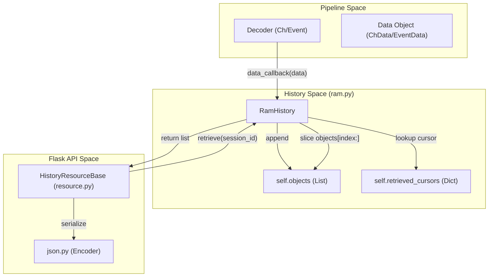
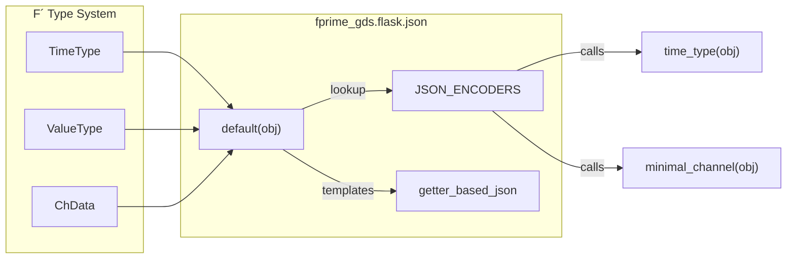

# Page: History & JSON Serialization

# History & JSON Serialization

Relevant source files

The following files were used as context for generating this wiki page:

- [src/fprime_gds/common/history/chrono.py](src/fprime_gds/common/history/chrono.py)
- [src/fprime_gds/common/history/history.py](src/fprime_gds/common/history/history.py)
- [src/fprime_gds/common/history/ram.py](src/fprime_gds/common/history/ram.py)
- [src/fprime_gds/common/history/test.py](src/fprime_gds/common/history/test.py)
- [src/fprime_gds/common/logger/test_logger.py](src/fprime_gds/common/logger/test_logger.py)
- [src/fprime_gds/flask/channels.py](src/fprime_gds/flask/channels.py)
- [src/fprime_gds/flask/commands.py](src/fprime_gds/flask/commands.py)
- [src/fprime_gds/flask/events.py](src/fprime_gds/flask/events.py)
- [src/fprime_gds/flask/json.py](src/fprime_gds/flask/json.py)

The F´ GDS employs a cursor-based history system to manage telemetry, events, and command logs for multiple concurrent web clients. Because the GDS serves a single-page application (SPA) via a REST API, it must handle asynchronous polling where each client tracks its own progress through the data stream. This is coupled with a specialized JSON serialization pipeline that converts complex F´ types—such as bit-packed telemetry and high-precision timestamps—into web-friendly formats.

## History System Architecture

The history system is built on the `History` abstract base class, which extends `DataHandler` to receive decoded data from the pipeline [src/fprime_gds/common/history/history.py:13-20](). The primary implementation used by the Flask server is `RamHistory`, which provides session-based tracking.

### RamHistory and Session Tracking
`RamHistory` treats "start times" as session tokens (UUIDs or strings) to remember the last-fetched index for a specific client [src/fprime_gds/common/history/ram.py:8-10](). This allows multiple browser tabs to poll the same GDS instance without interfering with each other's data streams.

*   **`retrieve(start, limit)`**: Uses the `start` token to look up a cursor in `retrieved_cursors`. If the token is new, it defaults to the current history size (effectively subscribing only to new data) [src/fprime_gds/common/history/ram.py:41-59]().
*   **`clear(start)`**: Deletes a specific session or clears objects up to the earliest active session cursor to reclaim memory [src/fprime_gds/common/history/ram.py:75-95]().
*   **`SelfCleaningRamHistory`**: An extension that tracks the `last_request` time for each session. It automatically purges sessions that have been inactive for a configurable `clear_time` [src/fprime_gds/common/history/ram.py:115-166]().

### Specialized Histories
Outside of the Flask web server, other history types support testing and CLI operations:
*   **`TestHistory`**: A receive-ordered history used by the Integration Test Framework that supports `Predicate` filtering [src/fprime_gds/common/history/test.py:13-41]().
*   **`ChronologicalHistory`**: Automatically re-orders incoming data based on the FSW `TimeType` rather than receipt order, using a reverse-traversal insertion algorithm [src/fprime_gds/common/history/chrono.py:16-57]().

### History Implementation Logic
The following diagram illustrates how data flows from a Decoder into the History and is subsequently retrieved by the Flask API.

**Data Flow: Pipeline to Flask History**

**Sources:** [src/fprime_gds/common/history/ram.py:32-59](), [src/fprime_gds/flask/resource.py:1-20]().

---

## JSON Serialization Pipeline

F´ data types (BaseType, TimeType, etc.) are not natively JSON-serializable by standard Python encoders. The `fprime_gds.flask.json` module provides a custom encoding pipeline that overrides the default Flask JSON provider.

### Encoder Mapping
The system uses a `JSON_ENCODERS` dictionary to map F´ classes to specific serialization functions [src/fprime_gds/flask/json.py:164-171]().

| F´ Class | Serialization Function | Output Description |
| :--- | :--- | :--- |
| `ChData` | `minimal_channel` | Returns `time`, `id`, `val`, `display_text`, and ISO-formatted `ert` [src/fprime_gds/flask/json.py:100-118](). |
| `EventData` | `minimal_event` | Returns `time`, `id`, and `display_text` [src/fprime_gds/flask/json.py:85-97](). |
| `CmdData` | `minimal_command` | Returns `time`, `id`, and argument values [src/fprime_gds/flask/json.py:121-134](). |
| `TimeType` | `time_type` | Returns `base`, `context`, `seconds`, and `microseconds` [src/fprime_gds/flask/json.py:136-154](). |
| `BaseType` | `jsonify_base_type` | Extracts class properties and the class name [src/fprime_gds/flask/json.py:22-45](). |
| `DataTemplate` | `getter_based_json` | Dynamically calls all `get_*` methods on the template [src/fprime_gds/flask/json.py:48-82](). |

### Custom `default` Encoder
The `default(obj)` function serves as the entry point for the Flask JSON provider. It checks the type of the object and applies the appropriate F´ transformation before falling back to the standard `DefaultJSONProvider` [src/fprime_gds/flask/json.py:174-191]().

**Entity Association: JSON Serialization**

**Sources:** [src/fprime_gds/flask/json.py:164-191](), [src/fprime_gds/common/models/serialize/type_base.py:1-20]().

---

## Logging with TestLogger

The `TestLogger` class provides a thread-safe wrapper around the `openpyxl` library to generate Excel-based test logs [src/fprime_gds/common/logger/test_logger.py:34-108](). It is optimized for memory efficiency using "write-only" mode, allowing the GDS to log thousands of telemetry points during long-duration tests without exhausting RAM [src/fprime_gds/common/logger/test_logger.py:11-13]().

### Key Features
*   **Thread Safety**: Uses `threading.Lock` to synchronize log writes from multiple pipeline threads [src/fprime_gds/common/logger/test_logger.py:108, 135-145]().
*   **Visual Formatting**: Supports hex color codes (e.g., `RED`, `GREEN`, `PURPLE`) and styles (`BOLD`, `ITALICS`) for differentiating log levels in the spreadsheet [src/fprime_gds/common/logger/test_logger.py:40-55]().
*   **Case Tracking**: Maintains a `case_id` that persists across log messages until updated, facilitating the grouping of messages by test case [src/fprime_gds/common/logger/test_logger.py:113-132]().

**Sources:** [src/fprime_gds/common/logger/test_logger.py:34-186]()
