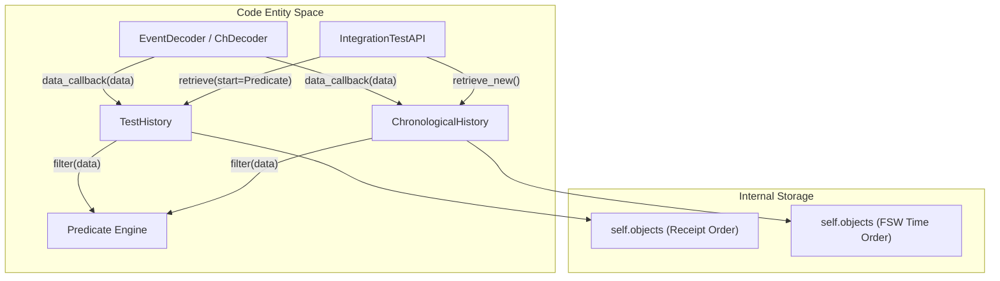
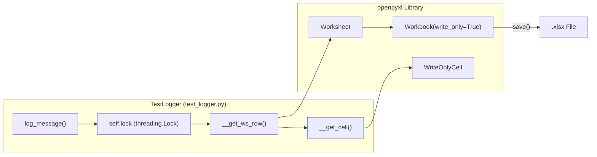

# Page: History Sub-system & Test Logger

# History Sub-system & Test Logger

Relevant source files

The following files were used as context for generating this wiki page:

- [src/fprime_gds/common/history/chrono.py](src/fprime_gds/common/history/chrono.py)
- [src/fprime_gds/common/history/history.py](src/fprime_gds/common/history/history.py)
- [src/fprime_gds/common/history/test.py](src/fprime_gds/common/history/test.py)
- [src/fprime_gds/common/logger/data_logger.py](src/fprime_gds/common/logger/data_logger.py)
- [src/fprime_gds/common/logger/test_logger.py](src/fprime_gds/common/logger/test_logger.py)

The History sub-system provides a standardized interface for storing and retrieving telemetry, events, and command data within the F´ GDS. While standard histories focus on simple persistence, the integration test histories (TestHistory and ChronologicalHistory) extend this functionality to support complex searching, filtering via predicates, and time-based re-ordering. Accompanying these is the `TestLogger`, a thread-safe utility for generating formatted Excel reports of test execution.

## History Interface and Base Class

All history implementations inherit from the `History` base class, which is a specialized `DataHandler`. This ensures that any history can be registered with a decoder to receive data objects via the `data_callback` method.

### Key Interface Methods
The `History` class defines four abstract methods that all sub-classes must implement:

| Method | Description |
| --- | --- |
| `retrieve(start)` | Returns a list of objects starting from a specific index or marker. |
| `retrieve_new()` | Returns objects added since the last call to `retrieve` or `retrieve_new`. |
| `clear(start)` | Removes objects from the history, optionally keeping those after a certain point. |
| `size()` | Returns the current count of objects stored. |

**Sources:**
- [src/fprime_gds/common/history/history.py:13-20]() (Class definition and purpose)
- [src/fprime_gds/common/history/history.py:22-69]() (Abstract method definitions)

---

## TestHistory: Receipt-Order Storage

`TestHistory` is the primary history used by the `IntegrationTestAPI`. It maintains objects in the exact order they were received by the GDS (receipt-order). It enhances the base history by allowing the `start` argument to be either an integer index or a **predicate**.

### Implementation Details
- **Filtering:** It can be initialized with a `filter_pred`. If provided, only objects satisfying this predicate are stored in the internal `self.objects` list [src/fprime_gds/common/history/test.py:32-41]().
- **Cursor Tracking:** It maintains a `retrieved_cursor` to track the "high-water mark" for `retrieve_new` calls [src/fprime_gds/common/history/test.py:41-41]().
- **Index Resolution:** The private `__get_index` method handles the logic of converting a predicate into a list index by searching the history for the first match [src/fprime_gds/common/history/test.py:132-146]().

**Sources:**
- [src/fprime_gds/common/history/test.py:13-17]() (Class definition)
- [src/fprime_gds/common/history/test.py:43-52]() (`data_callback` logic)
- [src/fprime_gds/common/history/test.py:70-80]() (`retrieve_new` implementation)

---

## ChronologicalHistory: FSW-Time Order

`ChronologicalHistory` is designed for scenarios where data may arrive out of order (e.g., high-latency links or buffered telemetry). It re-orders incoming objects based on the Flight Software (FSW) timestamp provided by the object's `get_time()` method.

### Insertion Logic
When `data_callback` is invoked, the history performs a reverse-traversal insertion. It starts from the end of the list (the most recent data) and moves backward until it finds an object with a timestamp less than or equal to the new data [src/fprime_gds/common/history/chrono.py:152-171]().

### Sub-histories and `new_objects`
To support `retrieve_new` while maintaining a sorted main list, `ChronologicalHistory` manages two internal lists:
1. `self.objects`: The full, chronologically sorted history [src/fprime_gds/common/history/chrono.py:33-33]().
2. `self.new_objects`: A secondary list specifically for tracking items added since the last retrieval [src/fprime_gds/common/history/chrono.py:34-34]().

**Sources:**
- [src/fprime_gds/common/history/chrono.py:16-20]() (Class definition)
- [src/fprime_gds/common/history/chrono.py:54-57]() (`data_callback` with insertion logic)
- [src/fprime_gds/common/history/chrono.py:163-171]() (`__insert_chrono` reverse traversal)

---

## History Data Flow

The following diagram illustrates how data moves from a Decoder into the History sub-system and is subsequently accessed by the Test API.

### Data Insertion and Retrieval Flow

**Sources:**
- [src/fprime_gds/common/history/test.py:43-52]()
- [src/fprime_gds/common/history/chrono.py:54-57]()
- [src/fprime_gds/common/history/history.py:13-20]()

---

## TestLogger: Excel Report Generation

The `TestLogger` class provides a thread-safe wrapper around the `openpyxl` library. It is used to generate `.xlsx` log files containing test results, timestamps, and metadata.

### Optimized Write Mode
The logger uses `openpyxl` in **write-only mode** (`Workbook(write_only=True)`). This optimization allows the GDS to generate extremely large log files without consuming significant memory, as rows are streamed directly to disk rather than being held in an in-memory tree [src/fprime_gds/common/logger/test_logger.py:11-13, 83-83]().

### Thread Safety and Formatting
- **Locking:** All calls to `log_message` are wrapped in a `threading.Lock` to prevent race conditions when multiple test threads attempt to log simultaneously [src/fprime_gds/common/logger/test_logger.py:108-108, 135-145]().
- **Styling:** The logger supports hex color codes (e.g., `RED = "FF9999"`) and styles (BOLD, ITALICS, UNDERLINED) via `WriteOnlyCell` [src/fprime_gds/common/logger/test_logger.py:40-55, 157-183]().
- **Persistent Case ID:** The `case_id` argument persists across log calls once set, until it is explicitly updated [src/fprime_gds/common/logger/test_logger.py:113-114, 129-132]().

### Logger Structure

**Sources:**
- [src/fprime_gds/common/logger/test_logger.py:34-48]() (Class and color constants)
- [src/fprime_gds/common/logger/test_logger.py:110-122]() (`log_message` signature)
- [src/fprime_gds/common/logger/test_logger.py:147-155]() (`close_log` and saving)

---

## DataLogger: Binary and Text Logging

Separate from the `TestLogger`, the `DataLogger` handles the recording of raw traffic and formatted telemetry/events to standard text and binary files.

| File Type | Default Filename | Data Source |
| --- | --- | --- |
| Raw Receive | `recv.bin` | Binary data from `on_recv` [src/fprime_gds/common/logger/data_logger.py:19, 69-77]() |
| Raw Send | `sent.bin` | Binary data from `send` [src/fprime_gds/common/logger/data_logger.py:20, 57-66]() |
| Telemetry | `channel.log` | `ChData` and `PktData` objects [src/fprime_gds/common/logger/data_logger.py:21, 40-43]() |
| Events | `event.log` | `EventData` objects [src/fprime_gds/common/logger/data_logger.py:22, 44-47]() |
| Commands | `command.log` | `CmdData` objects [src/fprime_gds/common/logger/data_logger.py:23, 48-52]() |

The `DataLogger` automatically flushes files after every write to ensure data integrity in the event of a crash [src/fprime_gds/common/logger/data_logger.py:42, 47, 52, 66, 77]().

**Sources:**
- [src/fprime_gds/common/logger/data_logger.py:14-15]() (Class definition)
- [src/fprime_gds/common/logger/data_logger.py:39-55]() (`data_callback` routing)
