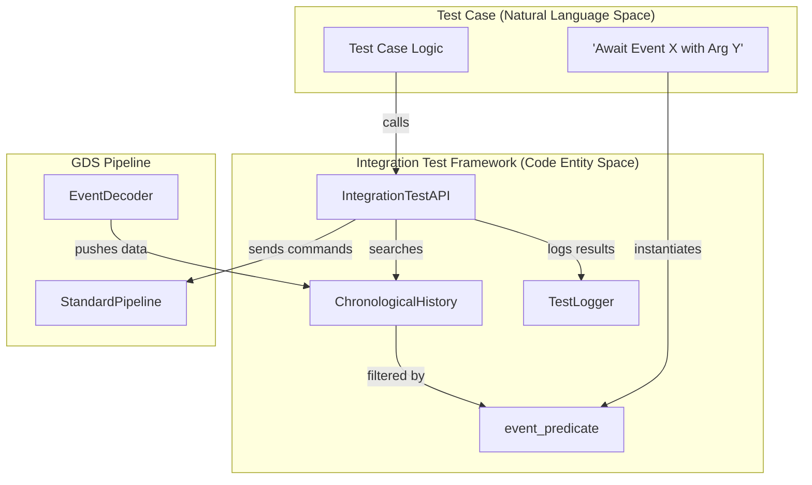
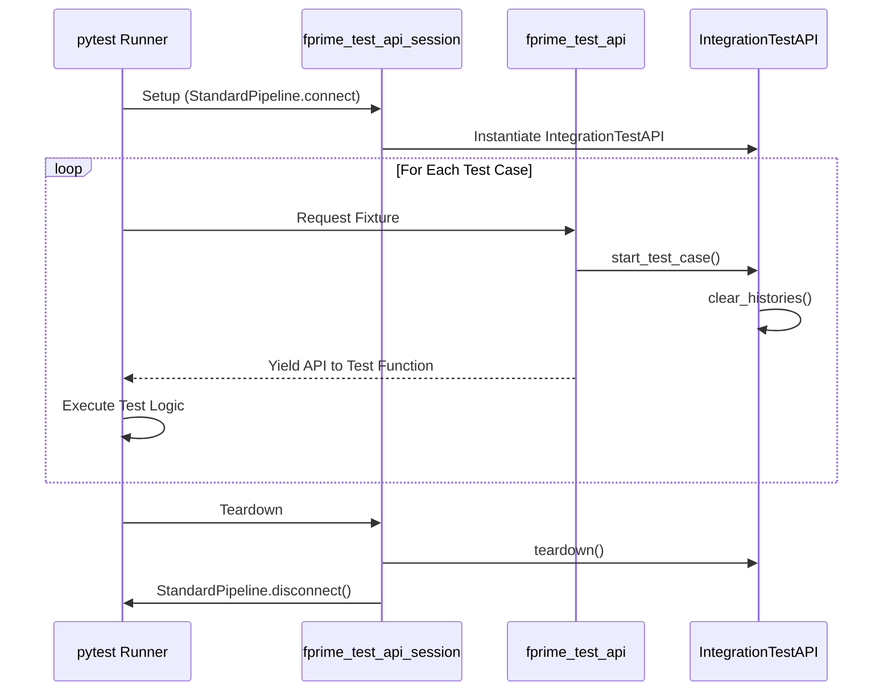

# Page: Integration Test Framework

# Integration Test Framework

Relevant source files

The following files were used as context for generating this wiki page:

- [src/fprime_gds/common/pipeline/encoding.py](src/fprime_gds/common/pipeline/encoding.py)
- [src/fprime_gds/common/pipeline/standard.py](src/fprime_gds/common/pipeline/standard.py)
- [src/fprime_gds/common/testing_fw/__init__.py](src/fprime_gds/common/testing_fw/__init__.py)
- [src/fprime_gds/common/testing_fw/api.py](src/fprime_gds/common/testing_fw/api.py)
- [src/fprime_gds/common/testing_fw/predicates.py](src/fprime_gds/common/testing_fw/predicates.py)
- [src/fprime_gds/common/testing_fw/pytest_integration.py](src/fprime_gds/common/testing_fw/pytest_integration.py)

The F´ GDS Integration Test Framework provides a high-level Python API for writing automated functional and integration tests against a running F´ deployment. It leverages the GDS pipeline to send commands and verify system state through event and telemetry histories. The framework is designed to be used both as a standalone library and as a `pytest` plugin for CI/CD environments.

### System Architecture Overview

The framework sits on top of the `StandardPipeline` and interacts with the F´ GDS through a set of specialized test histories and a search API.

| Component | Role | Code Entity |
| --- | --- | --- |
| **Test API** | Primary interface for test cases to interact with FSW. | `IntegrationTestAPI` |
| **Predicates** | Objects used to filter and search for specific data in histories. | `predicate` |
| **Histories** | Storage for received events, telemetry, and sent commands. | `TestHistory`, `ChronologicalHistory` |
| **Test Logger** | Generates human-readable Excel and text reports of test execution. | `TestLogger` |

#### Data Flow and Entity Relationship
The following diagram illustrates how the `IntegrationTestAPI` bridges the "Natural Language" requirements of a test case to the underlying GDS "Code Entities".

**Integration Test Data Flow**

Sources: [src/fprime_gds/common/testing_fw/api.py:29-67](), [src/fprime_gds/common/pipeline/standard.py:29-56]()

---

### IntegrationTestAPI
The `IntegrationTestAPI` is the central coordinator for the testing framework. It encapsulates a `StandardPipeline` and maintains its own set of `TestHistory` or `ChronologicalHistory` objects to ensure test isolation. It provides methods for commanding (`send_command`), awaiting telemetry (`await_telemetry`), and asserting event reception (`assert_event`).

For details on the full command and search lifecycle, see **[IntegrationTestAPI](#8.1)**.

Sources: [src/fprime_gds/common/testing_fw/api.py:29-112]()

---

### Predicate Engine
Predicates are the "search terms" of the integration framework. They are callable objects that return a boolean when evaluated against a data item (like `EventData` or `ChData`). The engine supports:
* **Comparison**: `equal_to`, `less_than`, `within_range`.
* **Logic**: `satisfies_all` (AND), `satisfies_any` (OR), `invert` (NOT).
* **F´ Specific**: `event_predicate` (filters by ID, severity, or arguments) and `telemetry_predicate` (filters by channel ID or value).

For details on constructing complex search filters, see **[Predicate Engine](#8.2)**.

Sources: [src/fprime_gds/common/testing_fw/predicates.py:18-54](), [src/fprime_gds/common/testing_fw/predicates.py:71-237]()

---

### History Sub-system & Test Logger
The history sub-system provides the storage backend for the API. Unlike the standard GDS histories, these are optimized for searching and can be configured to maintain strict flight software time order using `ChronologicalHistory`. The `TestLogger` provides thread-safe logging of every API action, command, and received telemetry point into formatted Excel files for post-test analysis.

For details on history traversal and logging, see **[History Sub-system & Test Logger](#8.3)**.

Sources: [src/fprime_gds/common/testing_fw/api.py:55-63](), [src/fprime_gds/common/logger/test_logger.py:1-20]()

---

### pytest Integration
The framework includes a `pytest` plugin that automates the lifecycle of the `IntegrationTestAPI`. It provides two primary fixtures:
* `fprime_test_api_session`: Manages the `StandardPipeline` connection for the duration of the test suite.
* `fprime_test_api`: Provides a clean, function-scoped API instance for each individual test case, handling automatic history clearing and test case logging.

For details on CI/CD configuration and fixture usage, see **[pytest Integration](#8.4)**.

**pytest Fixture Lifecycle**

Sources: [src/fprime_gds/common/testing_fw/pytest_integration.py:73-150]()
